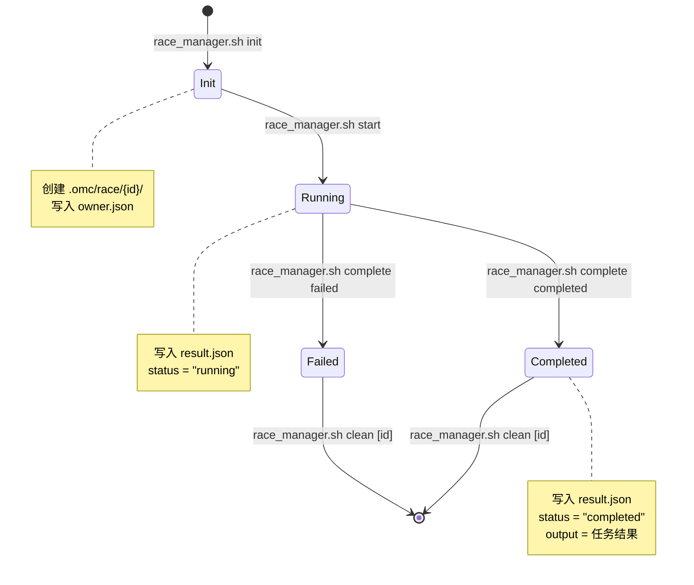

# Race 调度编排 — 状态机与架构文档

> RPE-016 | 负责文件: `.claude/scripts/race_manager.sh`
> 更新: 2026-05-04

---

## 概述

Carror OS 的 "Race" 模式是一个**任务编排模式 (orchestration pattern)**，用于管理可任意顺序执行的独立任务的生命周期。

**关键定义：** Race 不是真并发引擎。Claude Code 是单线程执行环境，"race" 在此上下文中意味着：

- 任务之间**无顺序依赖**，可以任意顺序 dispatch 和 complete
- 通过**目录隔离**避免状态冲突（非共享锁）
- 通过 **result.json 轮询**收集结果（非进程间通信）
- 对外表述为 **"Orchestration Pattern"**，而非 "Parallel Execution Engine"

---

## 4 层架构

```
+-------------------------------------------------------------+
|                     Race Orchestration Layer                  |
|                                                              |
|  1. Isolation     .omc/race/{id}/ 目录隔离                   |
|     └─ owner.json  — 任务元数据（owner, task, status）       |
|     └─ result.json — 任务结果（status, output, timestamps）  |
|                                                              |
|  2. Dispatch      run_in_background 驱动                     |
|     └─ init → start → [background execution]                 |
|                                                              |
|  3. Coordination  目录隔离 + result.json/owner.json          |
|     └─ 无共享文件系统锁（与 OMA Lock 正交）                  |
|     └─ 各 Race 目录完全独立，无并发写冲突                    |
|                                                              |
|  4. Collection    result.json polling                         |
|     └─ status 命令轮询 result.json 状态                      |
|     └─ 支持 --json 输出供自动化脚本消费                       |
+-------------------------------------------------------------+
```

---

## 状态机



### 状态说明

| 状态 | 含义 | owner.json 状态 | result.json 状态 |
|------|------|-----------------|------------------|
| **Init** | 工作区已创建，任务已定义 | `init` | 不存在 |
| **Running** | 任务已 dispatch，执行中 | `running` | `running` |
| **Completed** | 任务成功完成 | `completed` | `completed` + output |
| **Failed** | 任务执行失败 | `failed` | `failed` + output |

---

## 文件结构

```
.omc/race/
  └── {race_id}/
      ├── owner.json      # 任务元数据
      │   ├── race_id      # 任务标识符
      │   ├── owner        # 任务所有者
      │   ├── created_at   # 创建时间 (ISO 8601)
      │   ├── status       # 当前状态
      │   └── task         # 任务描述
      │
      └── result.json      # 任务结果（由 start/complete 写入）
          ├── race_id      # 任务标识符
          ├── status       # running / completed / failed
          ├── started_at   # start 时间戳
          ├── completed_at # complete 时间戳
          └── output       # 任务输出内容

  # 初始状态下 race/ 目录可能不存在，首次 init 时按需创建
```

---

## 与 OMA Lock 的关系

| 维度 | Race | OMA Lock |
|------|------|----------|
| **机制** | 目录隔离 | 原子文件锁 (O_EXCL) |
| **用途** | 任务编排 | 并发写入保护 |
| **依赖** | 无 (正交) | 无 (正交) |
| **冲突域** | 独立目录，无冲突 | 共享文件，可能冲突 |

Race 与 OMA Lock 是**正交功能**：
- Race 使用目录隔离而非锁机制，因此不存在锁竞争
- 多个 Race 任务可以同时处于 running 状态而不会互相阻塞
- 如果需要保护共享资源（如写入同一文件），应组合使用 OMA Lock

---

## 使用示例

```bash
# 1. 初始化一个 Race 任务
bash .claude/scripts/race_manager.sh init task-build "Build frontend assets"

# 2. 标记为运行中
bash .claude/scripts/race_manager.sh start task-build

# 3. 轮询状态（检查是否完成）
bash .claude/scripts/race_manager.sh status task-build
# 输出:
# RACE:task-build
#   status:    running
#   workspace: /path/to/.omc/race/task-build
#   task:      Build frontend assets

# 4. 标记为完成
bash .claude/scripts/race_manager.sh complete task-build completed "Build succeeded"

# 5. 列出所有 Race
bash .claude/scripts/race_manager.sh list

# 6. 清理已完成的任务
bash .claude/scripts/race_manager.sh clean
```

---

## 设计决策

### 为什么使用目录隔离而非文件锁？

1. **零冲突** — 每个 Race 任务拥有独立的文件系统命名空间
2. **可观测性** — 目录结构本身就是完整的任务状态视图
3. **恢复友好** — 无需锁清理，删除目录即完成回滚
4. **正交性** — 与 OMA Lock 不冲突，可混合使用

### 为什么是 polling 而非 event-driven？

1. Claude Code 单线程环境不支持事件监听
2. `run_in_background` 是异步 Bash 执行，结果收集天然需要 polling
3. polling 模式在 CI/CD 和自动化脚本中也是标准做法

### 4 层抽象的价值

```
Layer 1 (isolation)  → 状态隔离，无副作用
Layer 2 (dispatch)   → 任务触发不阻塞
Layer 3 (coordination) → 无锁协调，纯文件协议
Layer 4 (collection) → 统一结果收集接口
```

每一层可独立演进。例如，dispatch 层将来可从 `run_in_background` 迁移到真正的进程管理器，只要保持 Layer 1/3/4 的目录和文件协议不变。

---

## 回滚方案

- **范围：** 删除 `.omc/race/` 目录
- **命令：** `rm -rf .omc/race/`
- **副作用：** 所有进行中的 Race 任务丢失（需重新 init）
- **恢复：** 重新运行 `race_manager.sh init` 重新创建
