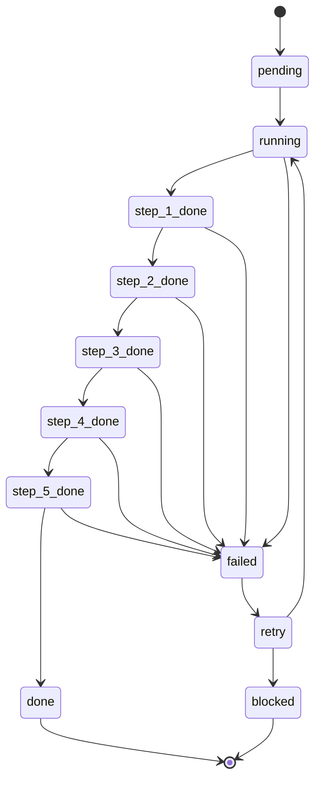
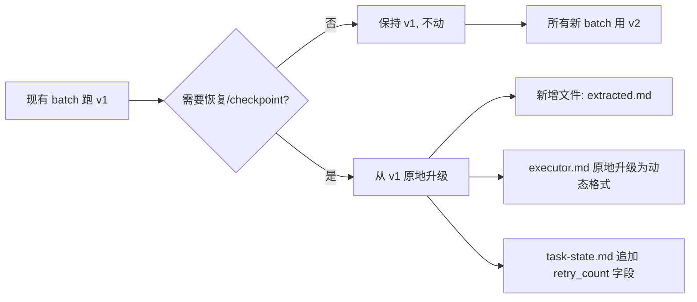

# RaceSwarm 三项修复 — 技术方案

> 版本: v2.0-draft | 哲学: #7(文档优先)、#4(验收)、#2(最小改动)
> 目标文件: `packages/carroros-gov/src/scripts/race-tool.py` (638 行)
> 关联: `.claude/reference/race-subagent-protocol.md`、`.claude/skills/lx-race/`

---

## 目录

1. [设计原则](#1-设计原则)
2. [修复一：大文件预处理 (extract)](#2-修复一大文件预处理-extract)
3. [修复二：过程文档化 (checkpoint)](#3-修复二过程文档化-checkpoint)
4. [修复三：超时恢复 (retry-recover)](#4-修复三超时恢复-retry-recover)
5. [状态机扩展](#5-状态机扩展)
6. [文件结构变更汇总](#6-文件结构变更汇总)
7. [race-tool.py 命令变更](#7-race-toolpy-命令变更)
8. [Subagent 契约 v2.0](#8-subagent-契约-v20)
9. [Main agent 超时检测逻辑](#9-main-agent-超时检测逻辑)
10. [回滚方案与 Error Path](#10-回滚方案与-error-path)
11. [与现有 lx-race skill 兼容性](#11-与现有-lx-race-skill-兼容性)
12. [部署步骤](#12-部署步骤)

---

## 1. 设计原则

| # | 原则 | 含义 |
|---|------|------|
| 1 | **文件驱动** | 所有状态、中间产物均在文件系统中可见，不依赖内存/进程状态 |
| 2 | **向前兼容** | 现有 batch 不修改，旧 subagent 契约依然可工作 |
| 3 | **幂等恢复** | 恢复时读 checkpoint 回退，不重复已完成的 step |
| 4 | **最小侵入** | 不重构已有成功路径，只增加新命令和可选字段 |
| 5 | **三域无关** | race/stepwise/RPE 三条路径互不影响 |

---

## 2. 修复一：大文件预处理 (extract)

### 2.1 问题

`dispatch` 时 task.md 的 `context` 字段可能引用大文件（如 2000 行 markdown）。subagent 不继承 main agent 上下文，每次读 task.md 自己找文件，浪费 token 且容易丢失焦点。

### 2.2 方案

新增 `race-tool.py extract` 命令，**在 dispatch 之前** main agent 调用，将大文件 chunk 摘要写入 `{task_dir}/extracted.md`。subagent 在 task.md 的 context 末尾看到 `@see extracted.md`，优先读压缩后的摘要。

> **时序修正 v2.1**: 原方案写「dispatch 后 main agent 调用」，存在时序竞争。改为 dispatch 前先 extract，确保 subagent 启动时 extracted.md 已准备好。

### 2.2a 时序

```
main agent:
  1. race-tool.py init         → 创建 batch
  2. 构建 tasks JSON
  3. 扫描每个 task 的 context，检测大文件引用（>200行）
  4. race-tool.py extract <task_dir> -s <large_file>   ← 先提取
  5. race-tool.py dispatch <batch_id> --tasks '[...]'   ← 再派发
  6. delegate_task(context="...")                        ← 最后启动 subagent
```

### 2.3 文件结构新增

```
{task_dir}/
  task.md           — (不变) goal + context + criteria
  executor.md       — (不变) 执行步骤模板
  result.md         — (不变) 产出物
  task-state.md     — (不变) 状态机
  extracted.md      — [新增] 大文件 chunk 摘要
```

### 2.4 `extracted.md` 格式

```markdown
# Extracted Context — {task_id}

> 来源: path/to/large-file.md (2000 行, 85 KB)
> 提取: {timestamp}
> 总块数: 7

## chunk-1 (行 1-300) — 标题: 架构总览

{块摘要，由 AI summary 生成，~200字}

## chunk-2 (行 301-600) — 标题: 关键模块

{块摘要}

...
```

### 2.5 命令接口

```bash
race-tool.py extract <task_dir> [--chunk-size 300] [--source <path>]
```

- `task_dir`: 子任务目录（`batch_id/task_id`）
- `--chunk-size`: 每块行数，默认 300
- `--source`: 指定要提取的文件（默认从 task.md 的 context 中自动检测 `ref:` 或 `@see:` 路径）

### 2.6 main agent 调用流程

```
dispatch → for each task:
  1. 读 task.md，扫描 context 中文件引用
  2. 对每个引用文件：
     a. 计算行数
     b. 若 > 200 行 → 调用 race-tool.py extract
     c. 在 task.md context 末尾追加一行: "@see extracted.md"
```

### 2.7 实现细节 (race-tool.py)

```python
def cmd_extract(args: list) -> None:
    """
    race-tool.py extract <task_dir> [--chunk-size N] [--source <path>]
    大文件预处理：读取源文件，分块摘要，写入 extracted.md
    """
    # 1. 解析参数
    # 2. 定位源文件（自动检测或 --source）
    # 3. 按 chunk-size 分块
    # 4. 对每个 chunk 写出 chunk header
    #    (内容保持原样或调用 AI 摘要取决于 --mode)
    # 5. 写入 extracted.md
    # 6. 更新 task.md 追加 "@see extracted.md"
```

两种模式：
- `--mode raw` (默认)：原样截取 chunk 头部，保留原始文本不做 AI 摘要（哲学 #2 最小改动）
- `--mode summary`（require `--summary-provider`）：调用外部摘要服务生成每块摘要

**raw 模式的局限性 v2.5**: 2000 行文件截前 300 行，关键信息可能在后半部分。改善方案：
- 用**均匀采样**替代只取头部：对 2000 行文件做 7 个 chunk（~285 行/块），取每块的前 30 行 anchor line
- 或者：对重点章节做智能分割（通过 markdown 标题分割，不是等行数分割）

---

## 3. 修复二：过程文档化 (checkpoint)

### 3.1 问题

当前 subagent 执行全程在「脑子里」，不写中间文件。一旦中断（超时、OOM、网络断开），没有恢复点，只能从头重跑。

### 3.2 方案

- executor.md 由静态模板 → **动态记录**。subagent 每完成一个 step 就写入该 step 的 checkbox、产出摘要、和 checkpoint ID。
- task-state.md 状态扩展: `running` → `step_1_done` → `step_2_done` → … → `done`

### 3.3 executor.md 新格式

```markdown
# Executor — {task_id}

> batch: {batch_id}
> created: {timestamp}
> state: step_2_done
> checkpoint: ckpt-2

## Steps

- [x] Step 1: 分析任务
  - checkpoint: ckpt-1
  - completed: 2026-06-10 14:22:00
  - summary: 识别了3个关键文件，确定修改范围
  - output: analysis-v1.md

- [x] Step 2: 执行主逻辑
  - checkpoint: ckpt-2
  - completed: 2026-06-10 14:35:00
  - summary: 完成 src/core.py 中 3 处修改

- [ ] Step 3: 验证
  - description: 运行测试套件确认修改正确

- [ ] Step 4: 写入 result.md

- [ ] Step 5: 更新 task-state.md -> done
```

### 3.4 subagent 写入协议

每完成一个 step，subagent 必须：

1. **写 executor.md**: 标记该 step 为 `[x]`，添加 checkpoint 记录
2. **更新 task-state.md**: `step_N_done`
3. **（可选）写过程文件**: 如 `analysis-v1.md`、`patch-notes.md`

### 3.6 checkpoint 命令的参数设计

> **v2.2 修正**: 原方案 `race-tool.py checkpoint <dir> <N> "<message>"` 中 message 含空格/引号时 shell 传参必崩。改为用文件传参或 base64 编码。

**推荐接口（避免 shell 转义）：**

```bash
# 方式 A（推荐）：从文件读取 checkpoint 信息
race-tool.py checkpoint <task_dir> <step_num>
    # 从 stdin 读取 JSON: {"message": "...", "output_files": ["..."], "summary": "..."}

# 方式 B（简单场景）：仅标记完成
race-tool.py checkpoint <task_dir> <step_num> --done
```

---

## 4. 修复三：超时恢复 (retry-recover)

### 4.1 问题

当前流程：main agent dispatch 后不做超时检测。subagent 若超时不写 result.md，任务永远在 `running` 状态。

### 4.2 main agent 超时检测

main agent 在 `delegate_task` 调用后的轮询中加入超时计数器：

```
PSEUDOCODE:

timeout = 600  # 10 分钟默认超时
start = now()

while state in (pending, running, step_1_done, ..., step_N_done):
    sleep(POLL_INTERVAL)
    state = read task-state.md
    elapsed = now() - start

    if elapsed > timeout:
        # 超时处理
        retry_count = read retry from task-state.md
        if retry_count < MAX_RETRY:
            race-tool.py update <task_dir> failed "timeout after {elapsed}s"
            race-tool.py update <task_dir> retry "auto-retry #{retry_count+1}"
            race-tool.py update <task_dir> running "restart from checkpoint"
            start = now()  # 重置计时器
        else:
            race-tool.py update <task_dir> blocked "exceeded max retries ({MAX_RETRY})"
            break
```

### 4.3 task-state.md 扩展

新增字段支持超时/重试追踪：

```markdown
# Task State

task_id: t1
state: step_2_done
updated: 2026-06-10 14:35:00
retry_count: 1
last_error: timeout after 600s
last_checkpoint: ckpt-2

## State Machine

pending → running → step_1_done → step_2_done → ... → done
                   → failed → retry(≤3) → running
                                  → blocked(>3)
```

### 4.4 Subagent 重启恢复流程

subagent 收到恢复任务时：

1. **读 task-state.md**: 查看 `last_checkpoint` 和 `state`
2. **读 executor.md**: 找到最后一个 `[x]` 的 step
3. **跳过已完成 step**: 从最后一个未完成的 step 开始继续
4. **重新验证**: 对已完成 step 的输出做快速验证，确认不被中断破坏

### 4.5 race-tool.py 新增 `recover` 命令

```bash
race-tool.py recover <task_dir>
```

输出恢复建议 JSON：

```json
{
  "task_id": "t1",
  "state": "step_2_done",
  "last_checkpoint": "ckpt-2",
  "completed_steps": ["Step 1: 分析任务", "Step 2: 执行主逻辑"],
  "next_step": "Step 3: 验证",
  "retry_count": 1
}
```

---

## 5. 状态机扩展

### 5.1 完整状态图



### 5.2 状态转换表

| 当前状态 | 允许的目标状态 | 触发者 |
|---------|--------------|--------|
| pending | running | dispatch / subagent 启动 |
| running | done, failed, step_1_done | subagent |
| step_1_done | done, failed, step_2_done | subagent |
| step_2_done | done, failed, step_3_done | subagent |
| step_3_done | done, failed, step_4_done | subagent |
| step_4_done | done, failed, step_5_done | subagent |
| step_N_done | done, failed | subagent |
| failed | retry, blocked | main agent |
| retry | running, blocked | main agent |
| done | — (终态) | — |
| blocked | — (终态) | — |

### 5.3 代码变更 (`_validate_state_transition`)

```python
def _validate_state_transition(current: str, target: str) -> tuple:
    transitions = {
        "pending":  ["running"],
        "running":  ["done", "failed", "step_1_done"],
        "step_1_done": ["done", "failed", "step_2_done"],
        "step_2_done": ["done", "failed", "step_3_done"],
        "step_3_done": ["done", "failed", "step_4_done"],
        "step_4_done": ["done", "failed", "step_5_done"],
        # 支持任意 step_N_done → step_{N+1}_done 模式
        # 也允许从任意 step 直接到 failed
        "failed":   ["retry", "blocked"],
        "retry":    ["running", "blocked"],
        "done":     [],
        "blocked":  [],
    }
    # 通配: step_N_done 可以到 step_{N+1}_done
    # 正则匹配: step_1_done → step_2_done 等
    current_step_match = re.match(r"^step_(\d+)_done$", current)
    target_step_match = re.match(r"^step_(\d+)_done$", target)
    if current_step_match and target_step_match:
        cur_n = int(current_step_match.group(1))
        tgt_n = int(target_step_match.group(1))
        if tgt_n == cur_n + 1:
            return (True, "")
        # 也允许跳过 step（如 step_1_done → done）
        if target == "done":
            return (True, "")
        if target == "failed":
            return (True, "")
    allowed = transitions.get(current, [])
    ...
```

---

## 6. 文件结构变更汇总

### 6.1 子任务目录

| 文件 | 变更类型 | 说明 |
|------|---------|------|
| `task.md` | 不变（内容末尾可追加 `@see extracted.md`） | goal + context + criteria |
| `executor.md` | **格式化变更** | 静态模板 → 动态 checkpoint 记录 |
| `result.md` | 不变 | 最终产出物 |
| `task-state.md` | **字段扩展** | 新增 `retry_count`、`last_error`、`last_checkpoint` |
| `extracted.md` | **新增** | 大文件 chunk 摘要 |

### 6.2 `.claude/reference/`

| 文件 | 变更类型 | 说明 |
|------|---------|------|
| `race-subagent-protocol.md` | **更新到 v2.0** | 反映新状态机 + checkpoint 契约 |

### 6.3 `.claude/skills/lx-race/`

| 文件 | 变更类型 | 说明 |
|------|---------|------|
| `SKILL.md` | 不变 | 元信息不变 |
| `references/body.md` | **更新** | 新增 extract/checkpoint/recover 命令说明 |
| `references/worker-protocol.md` | **更新到 v2.0** | 新 subagent 契约 |

---

## 7. race-tool.py 命令变更

### 7.1 新增命令

| 命令 | 签名 | 说明 |
|------|------|------|
| `extract` | `<task_dir> [--chunk-size N] [--source <path>] [--mode raw\|summary]` | 大文件预处理 |
| `checkpoint` | `<task_dir> <step_num> <message>` 或 `<task_dir> --rollback <step_num>` | step checkpoint 写入/回滚 |
| `recover` | `<task_dir>` | 输出恢复建议信息 |
| `timeout-check` | `<batch_id> --timeout <seconds>` | 扫描 batch 中超时任务并自动 retry |

### 7.2 修改命令

| 命令 | 变更说明 |
|------|---------|
| `dispatch` | 可选参数 `--steps <N>` 自定义 executor.md 步骤数 |
| `update` | 支持 `step_N_done` 状态，参数 `--retry-count N` 和 `--last-error` |
| `status` | 输出新增 `retry_count`、`last_checkpoint`、`elapsed` 字段 |
| `help` | 更新帮助文本包含新命令 |

### 7.3 dispatch 扩展：可选 `--steps`

```bash
race-tool.py dispatch <batch_id> --tasks '<json>' --steps 8
```

生成 executor.md 时步骤数可配置。默认 5，最大 20。

---

## 8. Subagent 契约 v2.0

### 8.1 契约文件更新

文件: `.claude/reference/race-subagent-protocol.md`

### 8.3 Subagent 契约 v2.0 — 完整模板

```markdown
# Race Subagent Protocol — v2.0

## 状态机

pending → running → step_1_done → step_2_done → ... → step_N_done → done
                   → failed → retry(≤3) → running
                                  → blocked(>3)

## Subagent 执行契约

1. **读入**: 读 `task.md` 获取 goal + context + criteria
   - 若 `extracted.md` 存在，优先读它代替原始大文件
   - 若 `task-state.md` 包含 `last_checkpoint` → 走恢复流程
2. **检查恢复**: 读 `task-state.md` 检查 `retry_count > 0`
   - 是 → 读 `executor.md` 最后一个 `[x]` step
   - 从下一个 `[ ]` step 开始执行
   - 对已完成的 step 做快速验证（产出文件是否存在）
3. **逐步骤执行**:
   - 对 executor.md 中每个 `[ ]` step:
     a. 执行 step 内容
     b. （可选）写入中间产出文件
     c. 调用: `race-tool.py checkpoint <task_dir> <N> --done`
        或 stdin 传 JSON（带产出摘要）
     d. 调用: `race-tool.py update <task_dir> step_N_done`
4. **最终产出**: 写入 `result.md`
5. **完成**: `race-tool.py update <task_dir> done "任务完成"`
6. **失败**: 写 `result.md`（原因）→ `race-tool.py update <task_dir> failed "<原因>"`

## Checkpoint 格式（executor.md）

- [x] Step N: <步骤名>
  - checkpoint: ckpt-N
  - completed: <时间戳>
  - summary: <做了什么，关键发现>
  - output: <产出文件名，可选>

## 支持动态步骤数

> v3.0 修正: 原方案 hard-code 5 步，dispatch 支持 `--steps N`。executor.md 模板变成了 `--steps` 参数。subagent 读 executor.md 时数 `[ ]` 的个数就知道总步骤数。

dispatch 时：
```bash
race-tool.py dispatch <batch_id> --tasks '<json>' --steps 3
# 生成 executor.md 只有 Step 1/2/3
```

executor.md 的步骤数 = `--steps`，checkpoint 命令的 N 不能超过这个数。状态机自动适配：Step 3 的 checkpoint → `step_3_done`。

## 向前兼容

- 旧 subagent（不写 checkpoint）依然正常工作
  - 状态转换: `running → done` 直接跳变
  - executor.md 保持初始模板不变
- 新 subagent 可选使用 checkpoint，不强求
- 旧 task-state.md 无 `retry_count`/`last_checkpoint` 字段 → 恢复时当 `retry_count=0`

---

## 9. Main agent 超时检测逻辑

### 9.1 race-tool.py timeout-check 实现

```python
# race-tool.py 新增
DEFAULT_TIMEOUT = 600
POLL_INTERVAL = 10
MAX_RETRY = 3
# 超时时，subagent 状态继续推进的窗宽
CHECKPOINT_GRACE = 30  # 最后 checkpoint 更新后 30 秒内不判超时

def _elapsed_since_update(task_dir: Path) -> float:
    """计算 task-state.md 上次更新到现在的秒数"""
    state_path = _state_path(task_dir)
    if not state_path.exists():
        return float('inf')
    mtime = state_path.stat().st_mtime
    return time.time() - mtime

def cmd_timeout_check(args: list) -> None:
    """
    race-tool.py timeout-check <batch_id> [--timeout 600] [--watch] [--poll-interval 10]
    扫描 batch 中超时任务，自动做 failed → retry → running。
    """
    batch_id = args[0]
    timeout = DEFAULT_TIMEOUT
    watch_mode = False
    poll_interval = POLL_INTERVAL

    # 解析 --timeout, --watch, --poll-interval
    parser in args[1:]:
        if a == '--timeout' and i+1 < len(args): timeout = int(args[i+1])
        elif a == '--watch': watch_mode = True
        elif a == '--poll-interval' and i+1 < len(args): poll_interval = int(args[i+1])

    batch_dir = _find_batch(batch_id)
    if not batch_dir: return

    while True:  # --once: 只循环一次; --watch: 持续轮询
        tasks = _scan_batch_tasks(batch_dir)
        timed_out = []
        for td, state in tasks:
            if state not in ("running",) and not state.startswith("step_"):
                continue
            elapsed = _elapsed_since_update(td)
            if elapsed < timeout:
                continue  # 还没超时
            # 有 checkpoint 且最近更新在 grace 期内 → 可能还在跑
            if state.startswith("step_") and elapsed < timeout + CHECKPOINT_GRACE:
                continue
            timed_out.append((td, state))

        for td, state in timed_out:
            retry_count = _read_retry_count(td) + 1
            error_msg = f"timeout after {int(elapsed)}s"
            if retry_count <= MAX_RETRY:
                subprocess.run(["race-tool.py", "update", str(td), "failed", error_msg],
                             capture_output=True)
                subprocess.run(["race-tool.py", "update", str(td), "retry",
                              f"auto-retry #{retry_count}"], capture_output=True)
                subprocess.run(["race-tool.py", "update", str(td), "running",
                              "restart from checkpoint"], capture_output=True)
                print(f"  ⚠ retry #{retry_count} for {td.name} ({state} → running)")
            else:
                subprocess.run(["race-tool.py", "update", str(td), "blocked",
                              f"exceeded max retries: {error_msg}"])
                print(f"  ❌ blocked: {td.name} (exceeded {MAX_RETRY} retries)")

        if not watch_mode:
            break
        time.sleep(poll_interval)
```

### 9.2 伪代码（适配调用者视角）

main agent 使用 timeout-check 的正确姿势：

```python
# main agent 在 dispatch 后的流程
# 1. 派发完所有 subagent
tasks = delegate_task(tasks=[...])

# 2. 启动超时检测守护
subprocess.Popen([
    "race-tool.py", "timeout-check", batch_id,
    "--timeout", "600", "--watch", "--poll-interval", "10"
])

# 3. 等待 delegate_task 返回
results = await tasks

# 4. 结果汇总
race-tool.py report <batch_id>
```

### 9.2 超时检测的归属

> **v2.3 修正**: 原方案的伪代码让 main agent 写一个 `while True` 循环轮询。但 main agent 在 delegate_task 之后没有运行时入口——delegate_task 是 Hermes 平台工具，返回时才给控制权。正确做法：

**方式 A（推荐）：race-tool.py 集成轮询**

`timeout-check` 命令替代 main agent 的 while 循环：

```bash
race-tool.py timeout-check <batch_id> --timeout 600 --poll-interval 10
```

行为：
1. 启动后台线程（或单次扫描），扫描 batch 中所有 task
2. 对状态为 `running|step_N_done` 的任务，检查 elapsed > timeout
3. 超时则执行 failed → retry → running
4. 模式：
   - `--once`（默认）: 单次扫描，一次性找出所有超时任务
   - `--watch`（守护模式）: 持续轮询直到所有任务 done/blocked

**方式 B（不推荐）：subagent 自检**

subagent 每次调用 checkpoint 时携带 timestamp，race-tool.py 在更新时检查 timestamp 是否超出阈值。这种方式侵入性强，不推荐。
### 9.3 新增 `timeout-check` 命令

```bash
race-tool.py timeout-check <batch_id> [--timeout 600]
```

扫描 batch 中的所有子任务：
1. 读取每个 task-state.md
2. 计算 `updated` 到现在的 elapsed
3. 对超过 timeout 且状态为 `running` 或 `step_N_done` 的任务
4. 执行超时处理：failed → retry → running

---

## 10. 回滚方案与 Error Path

### 10.1 回滚机制

| 场景 | 回滚操作 | 命令 |
|------|---------|------|
| checkpoint 写错 step | 回滚到上一步 | `race-tool.py checkpoint <dir> --rollback <N>` |
| 超时 retry 后错误 | 手动 blocked | `race-tool.py update <dir> blocked "manual"` |
| extracted.md 生成错 | 删除重新生成 | `rm extracted.md && race-tool.py extract <dir>` |
| 整个 batch 废止 | 更新 manifest | `race-tool.py update <manifest> blocked` |

### 10.2 Error Path 矩阵

| 阶段 | 错误 | 检测方式 | 处理 |
|------|------|---------|------|
| extract | 源文件不存在 | file not found | 跳过该 reference，输出 warning |
| extract | chunk 过大 >10MB | 行数检测 | 只取前 3000 行，标记 trunc |
| checkpoint | step_num 超出范围 | 步数校验 | 报错退出，不写文件 |
| checkpoint | executor.md 格式异常 | 正则解析失败 | 报错，保留原文件 |
| recover | executor.md 无 checkpoint | 空/无 `[x]` | 从头开始 |
| recover | task-state.md 损坏 | 格式异常 | 重置为 running |
| timeout-check | task-state.md 无 `updated` 字段 | 字段缺失 | 用文件 mtime 兜底 |
| update | 状态转换非法 | `_validate_state_transition` | 拒绝，报错退出 |

### 10.3 关键保护：文件写入原子性

```python
def _safe_write_checkpoint(task_dir: Path, content: str) -> None:
    """
    安全写入 executor.md checkpoint。
    先写临时文件，再 rename，防止部分写入。
    """
    tmp = task_dir / "executor.md.tmp"
    tmp.write_text(content, encoding="utf-8")
    tmp.rename(task_dir / "executor.md")  # 原子操作（同文件系统）
```

### 10.4 并发冲突解决

> **v2.4 修正**: 原方案未讨论并发竞争问题。

**场景 1：同一 task 被 retry 两次，两个 subagent 同时写 executor.md**
- 目录隔离保证一个 task 只有一个 active subagent
- retry 前 main agent 先更新 task-state.md → `failed`，之前的 subagent 即使还在写也会被忽略
- 新 subagent 启动时读 task-state.md → 看到 `failed`（而不是 `running`），知道自己是 retry

**场景 2：timeout-check 和 subagent 同时写 task-state.md**
- task-state.md 写入是幂等的（只更新 state 行，其他行不变）
- 如果 subagent 刚写完 `step_2_done`，timeout-check 同时写 `failed`，最终状态取决于最后写入的
- **解决方案**: subagent 每次写前先读 state，确认还是 `running` 再写；timeout-check 只对 state=`running` 的任务做处理

**场景 3：多个 batch 同时跑**
- 目录独立（`batch_id/{taskid}/`），无竞态条件

---

## 11. 与现有 lx-race skill 兼容性

### 11.1 兼容性矩阵

| 组件 | v1.0 (当前) | v2.0 (修复后) | 兼容性 |
|------|------------|--------------|--------|
| race-tool.py 命令 | 7 个命令 | 11 个命令 | ✅ 旧命令不变 |
| task-state.md 状态 | 5 状态 | 5 + N(step) 状态 | ✅ 新增状态不影响旧读取逻辑 |
| executor.md | 静态模板 | 动态记录 | ✅ 旧格式可继续使用 |
| task.md | 固定结构 | 可追加 `@see extracted.md` | ✅ 旧 task.md 无此行，subagent 忽略 |
| lx-race/SKILL.md | v1 | 不变 | ✅ 无需修改 |
| lx-race/references/body.md | 描述 v1 命令 | 更新描述 | ⚠ 需要更新文档（不影响功能） |
| lx-goal/lx-ghost | 路由到 race | 不变 | ✅ |
| 现有 batch 文件 | — | — | ✅ 保持原状 |

### 11.2 旧 subagent 行为不变

旧的 subagent 契约（v1.0）仍然有效。subagent 选择不写 checkpoint：
- `running → done` 直接跳变（不经过 step_N_done）
- executor.md 保持初始模板
- 不生成 extracted.md

新功能是**可选增强**，不破坏现有流程。

### 11.3 lx-race 参考文档更新

需要更新的文件：

**`lx-race/references/body.md`**: 在命令表中添加：

```markdown
| 5. extract | `race-tool.py extract <task_dir> [--source <path>]` | 大文件预处理 |
| 6. checkpoint | `race-tool.py checkpoint <task_dir> <N> <msg>` | 步骤完成标记 |
| 7. recover | `race-tool.py recover <task_dir>` | 恢复信息 |
| 8. timeout-check | `race-tool.py timeout-check <batch_id>` | 超时扫描+自动retry |
```

**`lx-race/references/worker-protocol.md`**: 更新完成契约为 v2.0 格式，保留旧格式说明。

### 11.4 迁移路径



---

## 12. 部署步骤

### Step 1: 代码修改

```bash
# 1. 备份
cp packages/carroros-gov/src/scripts/race-tool.py \
   packages/carroros-gov/src/scripts/race-tool.py.v1

# 2. 修改 race-tool.py
#    - 扩展 _validate_state_transition 支持 step_N_done
#    - 新增 cmd_extract
#    - 新增 cmd_checkpoint
#    - 新增 cmd_recover
#    - 新增 cmd_timeout_check
#    - 修改 cmd_dispatch 支持 --steps
#    - 修改 cmd_update 支持 retry_count / last_error
#    - 修改 cmd_status 输出新增字段

# 3. 更新软链
ln -sf packages/carroros-gov/src/scripts/race-tool.py .claude/scripts/race-tool.py
```

### Step 2: 文档更新

```bash
# 4. 更新 subagent 契约
#    .claude/reference/race-subagent-protocol.md → v2.0

# 5. 更新 lx-race 参考文档
#    .claude/skills/lx-race/references/body.md
#    .claude/skills/lx-race/references/worker-protocol.md
```

### Step 3: 测试

**T1: extract 命令**

| # | 测试 | 方法 | 预期 | 优先级 |
|---|------|------|------|--------|
| T1.1 | 源文件 < 200 行 | extract 200行文件 | extracted.md 不生成，task.md 不追加 @see | P0 |
| T1.2 | 标准大文件 2000 行 | extract 2000行 markdown | 均匀采样 7 chunk，每块 300 行 anchor | P0 |
| T1.3 | 源文件不存在 | extract --source nonexistent.md | 跳过该 reference，输出 warning | P1 |
| T1.4 | 超巨大文件 >10MB | extract 20MB 文件 | 只取前 3000 行，标记 `# TRUNCATED` | P1 |
| T1.5 | 文件引用来自 task.md context | 自动检测 `ref:` 和 `@see:` 路径 | 自动定位源文件 | P0 |
| T1.6 | dispatch 前 extract | 按 2.2a 时序执行 | subagent 启动时 extracted.md 已存在 | P0 |
| T1.7 | 同一文件被多个 task 引用 | 两个 task 都引用同一个大文件 | 各 task 独立生成自己的 extracted.md | P1 |

**T2: checkpoint 命令**

| # | 测试 | 方法 | 预期 | 优先级 |
|---|------|------|------|--------|
| T2.1 | 标记 step 完成 | checkpoint <dir> 3 --done | executor.md Step 3 变 `[x]`，task-state.md 变 step_3_done | P0 |
| T2.2 | 带产出摘要 | echo '{"summary":"done A","output_files":["a.md"]}' \| checkpoint <dir> 2 | executor.md 含 summary 和 output 行 | P0 |
| T2.3 | step_num 超出范围 | checkpoint <dir> 99 --done | 报错退出，不写文件 | P0 |
| T2.4 | executor.md 格式异常 | 手动破坏 executor.md 后调 checkpoint | 报错，保留原文件 | P1 |
| T2.5 | 动态步骤数（--steps 3） | dispatch --steps 3, checkpoint 1→2→3 | 状态机正确转换 step_1_done → step_2_done → step_3_done | P0 |
| T2.6 | 原子写入保护 | 中途 kill checkpoint 进程 | 文件不出现半写状态（.tmp 清理） | P1 |

**T3: 状态机扩展**

| # | 测试 | 方法 | 预期 | 优先级 |
|---|------|------|------|--------|
| T3.1 | pending → running | update <dir> running | 合法 | P0 |
| T3.2 | running → step_1_done | update <dir> step_1_done | 合法 | P0 |
| T3.3 | step_1_done → step_2_done | update <dir> step_2_done | 合法 | P0 |
| T3.4 | step_2_done → done | update <dir> done | 合法（任意 step_N_done → done） | P0 |
| T3.5 | step_1_done → failed | update <dir> failed | 合法 | P0 |
| T3.6 | done → running | update <dir> running | 非法，报错 | P0 |
| T3.7 | running → step_2_done（跳过 step_1） | update <dir> step_2_done | 非法，报错（必须顺序） | P1 |
| T3.8 | 旧格式兼容（无 retry_count） | 读 v1 task-state.md | retry_count=0，正常读取 | P0 |

**T4: 超时检测**

| # | 测试 | 方法 | 预期 | 优先级 |
|---|------|------|------|--------|
| T4.1 | 超时单任务 | timeout-check --timeout 3, 制造一个 running 状态的任务 | failed → retry → running | P0 |
| T4.2 | 未超时任务不变 | timeout-check 检查 30s timeout, 5s 前更新的任务 | 不动 | P0 |
| T4.3 | 超时 3 次后 blocked | 连续超时 4 次 | 第 4 次 blocked | P0 |
| T4.4 | --watch 持续轮询 | --watch --poll-interval 2, 第 3 秒制造超时 | 第 5 秒检测到并 retry | P1 |
| T4.5 | checkpoint grace 保护 | step_2_done 更新在超时阈值+20s 内 | 不判超时 | P1 |
| T4.6 | task-state.md 无 updated 字段 | 旧格式文件 | 用文件 mtime 兜底 | P1 |

**T5: 恢复（recover）**

| # | 测试 | 方法 | 预期 | 优先级 |
|---|------|------|------|--------|
| T5.1 | 有 checkpoint 的恢复 | retry_count>0, executor.md step_2_done | recover 输出 step_3 作为 next_step | P0 |
| T5.2 | 无 checkpoint 从头开始 | executor.md 全是 [ ] | recover 输出 step_1 | P0 |
| T5.3 | 快速验证已完成 step | executor.md step_1 产出文件存在 | recover 确认 step_1 有效 | P1 |
| T5.4 | 快速验证失败 | executor.md step_1 产出文件被删除 | recover 标记 step_1 需重做 | P1 |

**T6: 集成验收（端到端）**

| # | 测试 | 方法 | 预期 | 优先级 |
|---|------|------|------|--------|
| T6.1 | 完整 race 流程（无超时） | init → extract → dispatch → subagent 正常完成 → report | 所有 task done，executor.md 含 checkpoint | P0 |
| T6.2 | 完整 race 流程（含超时恢复） | 同上 + 模拟 subagent 超时 | retry 后恢复运行，最终 done | P0 |
| T6.3 | 旧 v1 batch 兼容 | 用旧 batch 跑 status/report | 正常读取，忽略 step_N_done 字段 | P0 |
| T6.4 | 并发 5 个 subagent | race-tool.py init --parallel 5 | 5 个独立子任务目录，无竞争 | P1 |
| T6.5 | timeout-check 和 subagent 同时写 | 手动模拟竞争 | timeout-check 只对 state=running 任务处理 | P1 |

### Step 4: 回滚

若出现问题，恢复备份：

```bash
cp packages/carroros-gov/src/scripts/race-tool.py.v1 \
   packages/carroros-gov/src/scripts/race-tool.py
```

新格式的 task-state.md（带 retry_count、last_checkpoint 字段）仍能被旧工具读取（`_read_state` 只取 `state:` 行，忽略其他字段）。

---

## 附录 A: 核心代码变更预览

### A.1 新增常量

```python
# race-tool.py 新增常量
DEFAULT_TIMEOUT = 600  # 10 分钟
DEFAULT_CHUNK_SIZE = 300
MAX_STEPS = 20
```

### A.2 状态扩展

```python
# _write_state 新增参数
def _write_state(task_dir: Path, state: str, task_id: str,
                 message: str = "",
                 retry_count: int = 0,
                 last_error: str = "",
                 last_checkpoint: str = "") -> None:
```

### A.3 通配步进函数

```python
def _next_step_state(current: str) -> str:
    """从当前 step_N_done 返回 step_{N+1}_done"""
    m = re.match(r"^step_(\d+)_done$", current)
    if m:
        n = int(m.group(1))
        return f"step_{n+1}_done"
    return None
```

---

## 附录 B: 三域边界影响

| 域 | extract | checkpoint | timeout-recover | 影响 |
|:---|:--------|:-----------|:----------------|:-----|
| race | ✅ 使用 | ✅ 使用 | ✅ 使用 | 主要受益者 |
| stepwise | ⚠ 可选（大 context 可用） | ✅ 使用 | ✅ 使用 | checkpoint 可直接复用 |
| RPE | ❌ 不适用（正式评审不 chunk） | ❌ 不适用（RPE 有自己模板） | ⚠ 可参考 timeout | 各走各的路径 |

stepwise 域可以使用 checkpoint 机制（同文件格式），但三步差异化在决策矩阵中已处理，不做强制统一。

---

*文档结束*
