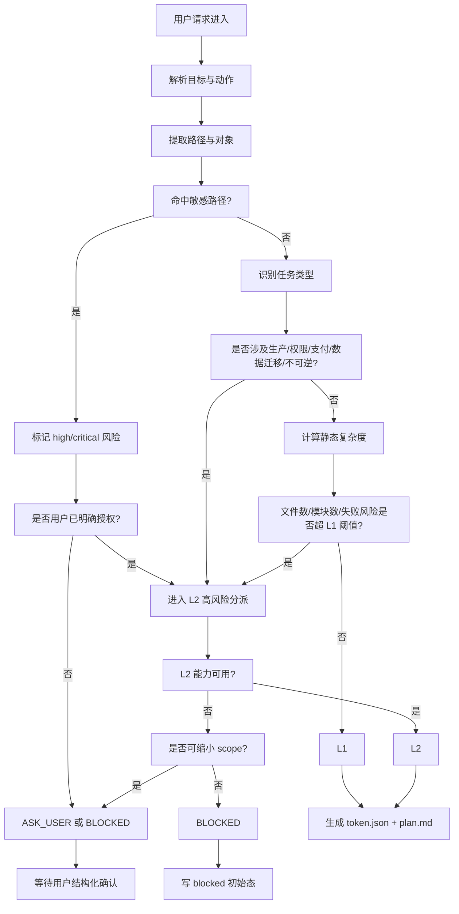

# CarrorOS 第三轮迭代：第 1/10 次

## 迭代主题：任务入口与 L1/L2 分级裁决收敛

本轮只处理一个问题：

```text
一个任务进入 CarrorOS 后，如何被稳定、可审计、可降级地分派到 L1 或 L2？
```

第二轮已经冻结了总体结构：

```text
Plan → Execute → Verify → Archive
PreActionGate 前置安全门
VerifyGate 后置完成门
token.json 唯一运行状态源
plan.md 唯一计划源
executor.md 唯一证据源
session-handoff.md 唯一恢复摘要源
```

第三轮不再扩大概念，而是把每个关键机制压到最终实现级别。

本轮裁决：

```text
任务入口必须先经过 IntakeGate。
IntakeGate 不新增 Hook，不改变第二轮结构。
IntakeGate 是 Clarify/Classify 阶段的具体实现机制。
IntakeGate 判定任务治理等级，不判定模型能力。
```

术语收敛：

```text
L1 = 简单任务治理级别
L2 = 复杂任务 / 危险任务治理级别
```

禁止再把分级定义为：

```text
BASE = 中低阶模型
ENHANCE = 高阶模型
```

正确关系是：

```text
L1 / L2 是任务治理等级。
模型选择是执行层资源策略。
任务风险决定治理等级，模型能力不决定任务风险。
```

---

# 1. 本轮裁决书

**裁决等级：核准。**

第二轮的问题不是主结构不稳，而是任务入口仍然偏抽象：

```text
Clarify → Classify
```

这个表达正确，但还不够工程化。  
第三轮第 1 次将其落地为：

```text
IntakeGate
```

IntakeGate 只做 5 件事：

```text
1. 解析用户目标
2. 识别风险标签
3. 识别 scope 初始边界
4. 判定 L1 / L2 / ASK_USER / BLOCKED
5. 生成 token.json + plan.md 的最小初始态
```

IntakeGate 不做：

```text
✗ 不执行代码修改
✗ 不运行危险命令
✗ 不读取敏感文件内容
✗ 不调用 Oracle
✗ 不写 executor.md 完成证据
✗ 不进入 VerifyGate
✗ 不根据模型档位决定任务等级
```

最终裁决：

```text
IntakeGate 是任务进入治理系统的唯一入口。
所有任务必须先分类，再计划，再执行。
CarrorOS 分级按任务风险，不按模型档位。
```

---

# 2. 为什么本轮先做 IntakeGate

## 2.1 第二轮留下的真实缺口

第二轮已经解决了：

```text
能不能做：PreActionGate
做没做好：VerifyGate
状态放哪：token.json
证据放哪：executor.md
怎么恢复：session-handoff.md
怎么降级：Fallback Protocol
```

但仍有一个前置缺口：

```text
任务刚进来时，谁判断它属于 L1、L2，还是直接 BLOCKED？
```

如果这个入口不收敛，会产生 4 个风险：

```text
1. 高风险任务被误入 L1
2. 普通任务被 L2 过度治理
3. scope 一开始不清，后续 PreActionGate 频繁 ASK_USER
4. token.json 初始态不一致，导致 resume / compact 失败
```

所以第三轮第一刀必须落在任务入口。

---

# 3. 分级定义

## 3.1 L1 定义

```text
L1 = 简单任务治理级别
```

适用对象：

```text
低风险
范围清晰
文件少
影响面小
可静态验证或单一测试验证
无需额外架构判断
无需高可靠审计
```

L1 的目标：

```text
快速闭环，但不放弃证据门禁。
```

L1 仍必须遵守：

```text
Plan → Execute → Verify → Archive
PreActionGate
VerifyGate
token.json
plan.md
executor.md
session-handoff.md
```

L1 不是弱治理。  
L1 是少而精的治理。

---

## 3.2 L2 定义

```text
L2 = 复杂任务 / 危险任务治理级别
```

适用对象：

```text
高风险
跨模块
不可逆
安全权限相关
生产发布相关
数据迁移相关
长期无人执行
用户要求高可靠审计
需要 research.md / Oracle / Multi-Judge
```

L2 的目标：

```text
先稳，再快。
```

L2 允许启用增强机制：

```text
research.md
acceptance.md
低频 Oracle
Multi-Judge
学习飞轮建议
三段式上下文水位
更细 step
更强审计
```

但 L2 不是“高阶模型”的同义词。  
L2 是任务等级。

---

## 3.3 BLOCKED 定义

```text
BLOCKED = 当前请求不可执行，或必须等待外部条件/人类确认。
```

典型场景：

```text
读取密钥
打印 .env
生产操作无确认
高风险任务但 L2 不可用
目标自相矛盾
scope 与授权冲突
```

BLOCKED 不等于失败。  
BLOCKED 是治理系统正确刹车。

---

## 3.4 ASK_USER 定义

```text
ASK_USER = 信息不足，但用户补充后可继续。
```

典型场景：

```text
目标不明确
scope 不明确
风险等级依赖用户选择
多个实现方向都合理
是否允许生产操作不明确
```

ASK_USER 的输出必须结构化，不得模糊追问。

---

# 4. IntakeGate 机制定义

## 4.1 输入

IntakeGate 输入只允许以下内容：

```text
1. user_request
2. existing_repo_signals
3. config policy
4. optional latest user constraints
```

其中：

```text
user_request:
  用户原始请求

existing_repo_signals:
  可选仓库信号，例如文件数、目录结构、语言、测试命令是否存在

config policy:
  dangerous_commands
  sensitive_paths
  risk_keywords
  l1_limits
  l2_triggers

latest user constraints:
  用户明确说的范围、禁止项、优先级
```

禁止输入：

```text
✗ 模型主观信心
✗ 没来源的复杂度评分
✗ 历史幻觉记忆
✗ 未验证的“项目惯例”
✗ 模型档位偏好
```

---

## 4.2 输出

IntakeGate 输出固定为：

```json
{
  "decision": "L1 | L2 | BLOCKED | ASK_USER",
  "task_type": "code | doc | config | infra | data | security | unknown",
  "risk_level": "low | medium | high | critical",
  "scope": [],
  "required_confirmations": [],
  "reasons": [],
  "next_action": "create_plan | ask_user | block",
  "evidence": []
}
```

禁止输出：

```text
✗ probably_l1
✗ likely_safe
✗ maybe_l2
✗ 应该没问题
✗ 先做做看
✗ 低阶模型可做
✗ 高阶模型再说
```

---

# 5. IntakeGate 流程图



---

# 6. 设计理由

## 6.1 为什么不把 IntakeGate 做成新 Hook

第二轮已经明确：

```text
Base Hooks:
  SessionStart
  StepBoundary
  PreActionGate
  VerifyGate

Enhance Hooks:
  Base 4 +
  ComplexityGate
  ContextGate
  LearningGate
```

第三轮不新增 Hook。  
否则会破坏冻结结构。

所以本轮裁决：

```text
IntakeGate 是 Clarify/Classify 的实现，不是新 Hook。
```

收益：

```text
1. 不增加 Hook 数量
2. 不破坏第二轮冻结态
3. 入口逻辑仍然可代码化
4. L1 / L2 都能复用
5. 分级可审计
```

代价：

```text
1. Clarify/Classify 的实现变重
2. 需要更严格的 schema
3. 初始配置必须完整，否则 ASK_USER 会增多
```

裁决：

```text
接受该代价。
入口重一点，执行阶段就会稳很多。
```

---

## 6.2 为什么先分级，再生成 plan.md

禁止顺序：

```text
用户请求 → plan.md → 分级
```

因为这样会导致：

```text
1. 高风险任务已经被拆成可执行 step
2. 模型可能开始执行不该执行的计划
3. scope 在风险判断前被扩大
```

正确顺序：

```text
用户请求 → IntakeGate → 分级 → token.json / plan.md
```

理由：

```text
分级决定治理强度。
治理强度决定计划粒度。
计划粒度决定执行边界。
```

---

# 7. L1 / L2 分派规则

## 7.1 L1 允许场景

L1 只允许处理：

```text
1. 单模块普通代码修改
2. 文档修改
3. 小型配置调整
4. 可通过静态验证或单一测试覆盖的任务
5. 无敏感路径
6. 无生产操作
7. 无权限 / 认证 / 支付 / 数据迁移
8. 预计 step 数 ≤ 5
9. 预计改动文件数 ≤ 8
10. 无连续失败历史
```

示例：

```text
- 修复一个按钮样式
- 补一个单元测试
- 更新 README
- 修改非生产配置
- 重命名单个内部函数
- 调整一个局部文案
- 修复一个明确报错的小 bug
```

L1 默认执行，但必须满足：

```text
scope 清晰
风险低
验证方式明确
```

---

## 7.2 L2 必须接管场景

以下任一命中，必须 L2：

```text
1. 跨模块重构
2. 权限 / 认证 / 鉴权 / 支付
3. 数据迁移
4. 生产环境操作
5. scope 不确定但影响面大
6. 连续验证失败 >= 3
7. 用户要求高可靠审计
8. 涉及多语言 / 多服务协同
9. 需要 Oracle / Multi-Judge
10. 需要 research.md 支撑架构决策
11. 不可逆操作：删除 / 发布 / 部署 / 覆盖历史
12. 长期无人执行任务
13. 涉及 secret / token / credential / 密钥路径
14. 涉及 infra / Kubernetes / Terraform / CI/CD 发布链路
```

示例：

```text
- 重构登录鉴权链路
- 修改支付回调
- 迁移数据库字段
- 调整 Kubernetes 生产配置
- 拆分 monolith 模块
- 发布 npm / pip 包
- 删除生产配置
- 修改权限模型
```

硬规则：

```text
模型可以把 L1 升级成 L2。
模型不能把命中 L2 硬条件的任务降级成 L1。
```

---

## 7.3 BLOCKED 场景

以下情况直接 BLOCKED：

```text
1. 高风险任务但 L2 不可用，且禁止降级
2. 用户请求读取或打印密钥原文
3. 删除敏感文件但没有 exact path + exact reason
4. 生产操作没有结构化确认
5. scope 与用户授权冲突
6. 任务目标自相矛盾
7. 需要外部权限但凭据不可用
8. 用户要求绕过 VerifyGate / PreActionGate
9. 用户要求隐藏审计记录
```

示例：

```text
- “把 .env 打印出来看看”
- “直接删掉所有 prod 配置”
- “上线数据库迁移，不用确认”
- “重构整个系统，但不要改任何文件”
- “不要记录这次操作”
```

裁决：

```text
BLOCKED 是正确停止，不是执行失败。
```

---

## 7.4 ASK_USER 场景

ASK_USER 用于信息不足但可补齐的任务：

```text
1. 目标不明确
2. scope 不明确
3. 风险等级依赖用户选择
4. 多个实现方向都合理
5. 用户没有明确是否允许生产操作
6. 中风险任务 L2 不可用，但可通过缩小 scope 进入 L1
```

标准提问格式：

```text
需要裁决：

1. 目标：{当前理解}
2. 风险：{命中的风险标签}
3. 缺口：{需要用户确认的信息}
4. 可选项：
   A. {选项 A}
   B. {选项 B}
5. 默认安全选择：{默认不执行/只读分析/生成计划}
```

---

# 8. 优缺点

## 8.1 优点

```text
1. 高风险任务不会误入 L1
2. 普通任务不会被 L2 过度拖慢
3. token.json 初始态一致
4. plan.md 从一开始就带 scope
5. Fallback 有前置依据
6. 审计链从任务入口开始
7. 用户确认点更少但更精确
8. 分级不再绑定模型档位
9. 模型可替换，治理等级不漂移
```

---

## 8.2 缺点

```text
1. 首次响应更重
2. 简单任务也必须过一次分类
3. 配置不完整时 ASK_USER 增多
4. 过严规则可能把部分中风险任务推给 L2
5. 需要维护 risk_keywords / sensitive_paths / dangerous_commands
```

---

## 8.3 取舍裁决

```text
CarrorOS 优先级是治理稳定性，不是最快动手。
入口多花 10 秒，换取后续少 10 次状态冲突。
该取舍核准。
```

---

# 9. IntakeGate 与现有四文档关系

## 9.1 token.json

IntakeGate 创建最小 token。

L1 示例：

```json
{
  "session": {
    "id": "sess_20260705_0001",
    "level": "L1",
    "model": "qwen3.7-plus"
  },
  "task": {
    "id": "task_0001",
    "status": "planning",
    "phase": "plan",
    "current_step": "S1",
    "scope": ["README.md"],
    "blocked": null,
    "failed_verifications": 0,
    "risk_level": "low",
    "task_type": "doc"
  },
  "stats": {
    "done": 0,
    "total": 1,
    "turns": 0,
    "tool_calls": 0
  },
  "context": {
    "token_used": null,
    "token_limit": null,
    "watermark_source": "unknown"
  }
}
```

L2 示例：

```json
{
  "session": {
    "id": "sess_20260705_0002",
    "level": "L2",
    "model": "claude-opus-4.5"
  },
  "task": {
    "id": "task_0002",
    "status": "planning",
    "phase": "research",
    "current_step": "R1",
    "scope": ["src/auth.ts", "middleware/auth.ts"],
    "blocked": null,
    "failed_verifications": 0,
    "risk_level": "high",
    "task_type": "security"
  },
  "stats": {
    "done": 0,
    "total": null,
    "turns": 0,
    "tool_calls": 0
  },
  "context": {
    "token_used": null,
    "token_limit": null,
    "watermark_source": "unknown"
  }
}
```

裁决：

```text
level 只允许 L1 / L2。
不要写 L1_BASE / L2_ENHANCE。
```

---

## 9.2 plan.md

L1 最小计划：

```markdown
# Plan

## Goal
更新 README 中的安装说明。

## Classification
level: L1
risk: low
task_type: doc

## Scope
- README.md

## Steps
- [ ] S1: 更新安装说明
  - verify: file:README.md contains updated install section
```

L2 最小计划：

```markdown
# Plan

## Goal
重构 auth token 鉴权链路。

## Classification
level: L2
risk: high
task_type: security
reasons:
- auth
- token
- cross_module
- l2_trigger_matched

## Scope
- src/auth.ts
- middleware/auth.ts

## Required Confirmations
- 修改鉴权行为前需要用户确认兼容性策略

## Steps
- [ ] R1: 阅读现有鉴权链路并写 research.md
  - verify: research.md contains current auth flow and risk notes
- [ ] P1: 生成分步修改计划
  - verify: plan.md has frozen scope and acceptance criteria
- [ ] E1: 修改 auth token 校验逻辑
  - verify: related tests pass
- [ ] A1: 生成 acceptance.md
  - verify: acceptance.md contains evidence and residual risks
```

---

## 9.3 executor.md

IntakeGate 不写完成证据。  
但可以写入口记录：

```markdown
# Executor

## Intake
- decision: L1
- risk: low
- scope: README.md
- result: planning
```

L2 示例：

```markdown
# Executor

## Intake
- decision: L2
- risk: high
- task_type: security
- scope:
  - src/auth.ts
  - middleware/auth.ts
- reasons:
  - high_risk_keyword
  - l2_trigger_matched
- result: planning
```

注意：

```text
这不是完成证据。
不能被 VerifyGate 当作 VERIFIED。
```

---

## 9.4 audit JSONL

IntakeGate 必须写入入口审计。

L1 示例：

```json
{
  "event_type": "intake_decision",
  "timestamp": "2026-07-05T15:00:00Z",
  "task_id": "task_0001",
  "decision": "L1",
  "risk_level": "low",
  "task_type": "doc",
  "scope": ["README.md"],
  "reasons": ["l1_limits_satisfied"],
  "next_action": "create_plan"
}
```

L2 示例：

```json
{
  "event_type": "intake_decision",
  "timestamp": "2026-07-05T15:00:00Z",
  "task_id": "task_0002",
  "decision": "L2",
  "risk_level": "high",
  "task_type": "security",
  "scope": ["src/auth.ts", "middleware/auth.ts"],
  "reasons": ["high_risk_keyword", "l2_trigger_matched"],
  "next_action": "create_plan"
}
```

---

# 10. 核心配置模板

```json
{
  "intake": {
    "l1_limits": {
      "max_files": 8,
      "max_steps": 5,
      "max_diff_lines": 300,
      "max_failed_verifications": 2
    },
    "l2_triggers": [
      "auth",
      "permission",
      "payment",
      "production",
      "migration",
      "cross_module",
      "multi_service",
      "irreversible",
      "release",
      "deploy",
      "long_running",
      "high_reliability",
      "oracle_required"
    ],
    "blocked_triggers": [
      "print_secret",
      "delete_sensitive_without_exact_scope",
      "production_without_confirmation",
      "conflicting_goal",
      "high_risk_without_l2"
    ],
    "task_types": [
      "code",
      "doc",
      "config",
      "infra",
      "data",
      "security",
      "unknown"
    ]
  },
  "safety": {
    "sensitive_paths": [
      ".env",
      ".env.*",
      "*.pem",
      "*.key",
      "id_rsa",
      "id_ed25519",
      "*secret*",
      "*token*",
      "*credential*",
      "*password*",
      "production.*",
      "prod.*",
      "kubeconfig",
      ".aws/credentials",
      ".gcp/",
      ".azure/"
    ],
    "dangerous_commands": [
      "rm -rf",
      "sudo",
      "chmod -R",
      "chown -R",
      "git reset --hard",
      "git clean -fd",
      "git push --force",
      "docker compose down -v",
      "kubectl delete",
      "terraform apply",
      "terraform destroy",
      "migration:run",
      "db:migrate",
      "DROP TABLE",
      "TRUNCATE TABLE",
      "ALTER TABLE",
      "npm publish",
      "pnpm publish",
      "pip upload",
      "twine upload"
    ]
  }
}
```

---

# 11. 核心代码：intake_gate.py

以下代码只依赖 Python 3.10+ 标准库，兼容 Mac / Windows / WSL2。

```python
#!/usr/bin/env python3
"""
CarrorOS IntakeGate
Purpose:
  Classify incoming tasks into L1 / L2 / ASK_USER / BLOCKED.

Constraints:
  - Python 3.10+ standard library only
  - No third-party dependencies
  - No execution of user task
  - No secret content reading
  - Classifies task governance level, not model capability
"""

from __future__ import annotations

import fnmatch
import json
import re
import sys
from dataclasses import dataclass, asdict
from datetime import datetime, timezone
from pathlib import Path
from typing import Any


DEFAULT_CONFIG = {
    "intake": {
        "l1_limits": {
            "max_files": 8,
            "max_steps": 5,
            "max_diff_lines": 300,
            "max_failed_verifications": 2,
        },
        "l2_triggers": [
            "auth",
            "permission",
            "payment",
            "production",
            "migration",
            "cross_module",
            "multi_service",
            "irreversible",
            "release",
            "deploy",
            "long_running",
            "high_reliability",
            "oracle_required",
        ],
        "blocked_triggers": [
            "print_secret",
            "delete_sensitive_without_exact_scope",
            "production_without_confirmation",
            "conflicting_goal",
            "high_risk_without_l2",
        ],
    },
    "safety": {
        "sensitive_paths": [
            ".env",
            ".env.*",
            "*.pem",
            "*.key",
            "id_rsa",
            "id_ed25519",
            "*secret*",
            "*token*",
            "*credential*",
            "*password*",
            "production.*",
            "prod.*",
            "kubeconfig",
            ".aws/credentials",
            ".gcp/",
            ".azure/",
        ],
        "dangerous_commands": [
            "rm -rf",
            "sudo",
            "chmod -R",
            "chown -R",
            "git reset --hard",
            "git clean -fd",
            "git push --force",
            "docker compose down -v",
            "kubectl delete",
            "terraform apply",
            "terraform destroy",
            "migration:run",
            "db:migrate",
            "DROP TABLE",
            "TRUNCATE TABLE",
            "ALTER TABLE",
            "npm publish",
            "pnpm publish",
            "pip upload",
            "twine upload",
        ],
    },
}


@dataclass
class IntakeDecision:
    decision: str
    task_type: str
    risk_level: str
    scope: list[str]
    required_confirmations: list[str]
    reasons: list[str]
    next_action: str
    evidence: list[dict[str, Any]]


def now_iso() -> str:
    return datetime.now(timezone.utc).replace(microsecond=0).isoformat()


def load_json(path: Path, default: dict[str, Any]) -> dict[str, Any]:
    if not path.exists():
        return default
    with path.open("r", encoding="utf-8") as f:
        data = json.load(f)
    return merge_dict(default, data)


def merge_dict(base: dict[str, Any], override: dict[str, Any]) -> dict[str, Any]:
    result = dict(base)
    for key, value in override.items():
        if isinstance(value, dict) and isinstance(result.get(key), dict):
            result[key] = merge_dict(result[key], value)
        else:
            result[key] = value
    return result


def normalize_text(text: str) -> str:
    return text.lower().strip()


def extract_paths(text: str) -> list[str]:
    """Conservative path extraction. It avoids reading file content."""
    candidates = re.findall(r"[\w./\\-]+\.\w+|[\w./\\-]+/[\w./\\-]+", text)
    cleaned: list[str] = []
    for item in candidates:
        value = item.strip("`'\".,;:()[]{}")
        if value and value not in cleaned:
            cleaned.append(value)
    return cleaned


def matches_any_path(path: str, patterns: list[str]) -> bool:
    name = Path(path).name
    normalized = path.replace("\\", "/")
    for pattern in patterns:
        if fnmatch.fnmatch(name, pattern) or fnmatch.fnmatch(normalized, pattern):
            return True
    return False


def contains_any(text: str, needles: list[str]) -> bool:
    lowered = normalize_text(text)
    return any(needle.lower() in lowered for needle in needles)


def detect_task_type(text: str) -> str:
    lowered = normalize_text(text)

    if contains_any(lowered, ["readme", "文档", "docs", "markdown", ".md"]):
        return "doc"
    if contains_any(lowered, ["kubernetes", "docker", "terraform", "部署", "infra", "生产", "ci/cd"]):
        return "infra"
    if contains_any(lowered, ["数据库", "migration", "migrate", "schema", "sql"]):
        return "data"
    if contains_any(lowered, ["权限", "认证", "鉴权", "auth", "security", "安全"]):
        return "security"
    if contains_any(lowered, ["配置", "config", "yaml", "json", "toml", "env"]):
        return "config"
    if contains_any(lowered, ["代码", "修复", "重构", "函数", "class", "test", "bug"]):
        return "code"

    return "unknown"


def detect_risk(text: str, scope: list[str], config: dict[str, Any]) -> tuple[str, list[str]]:
    reasons: list[str] = []
    lowered = normalize_text(text)

    sensitive_patterns = config["safety"]["sensitive_paths"]
    dangerous_commands = config["safety"]["dangerous_commands"]

    if any(matches_any_path(path, sensitive_patterns) for path in scope):
        reasons.append("sensitive_path")

    if contains_any(lowered, dangerous_commands):
        reasons.append("dangerous_command")

    high_keywords = [
        "production",
        "prod",
        "生产",
        "权限",
        "认证",
        "鉴权",
        "payment",
        "支付",
        "migration",
        "数据库迁移",
        "delete",
        "删除",
        "secret",
        "密钥",
        "credential",
        "凭据",
        "发布",
        "部署",
        "不可逆",
    ]
    if contains_any(lowered, high_keywords):
        reasons.append("high_risk_keyword")

    if contains_any(lowered, ["打印 .env", "cat .env", "show secret", "显示密钥", "打印密钥"]):
        reasons.append("print_secret")

    if contains_any(lowered, ["整个系统", "全项目", "全仓库", "所有模块", "monorepo"]):
        reasons.append("large_scope")

    if contains_any(lowered, ["不要验证", "跳过验证", "不用审计", "不要记录"]):
        reasons.append("governance_bypass_requested")

    if "print_secret" in reasons or "governance_bypass_requested" in reasons:
        return "critical", reasons

    if "sensitive_path" in reasons or "dangerous_command" in reasons:
        return "high", reasons

    if "high_risk_keyword" in reasons or "large_scope" in reasons:
        return "medium", reasons

    return "low", reasons


def decide_intake(
    user_request: str,
    config: dict[str, Any],
    l2_available: bool,
    explicit_scope: list[str] | None = None,
) -> IntakeDecision:
    scope = explicit_scope or extract_paths(user_request)
    task_type = detect_task_type(user_request)
    risk_level, risk_reasons = detect_risk(user_request, scope, config)

    reasons = list(risk_reasons)
    required_confirmations: list[str] = []

    if not user_request.strip():
        return IntakeDecision(
            decision="ASK_USER",
            task_type="unknown",
            risk_level="medium",
            scope=[],
            required_confirmations=["clarify_goal"],
            reasons=["empty_request"],
            next_action="ask_user",
            evidence=[],
        )

    if "print_secret" in reasons:
        return IntakeDecision(
            decision="BLOCKED",
            task_type=task_type,
            risk_level="critical",
            scope=scope,
            required_confirmations=[],
            reasons=reasons + ["secret_disclosure_forbidden"],
            next_action="block",
            evidence=[],
        )

    if "governance_bypass_requested" in reasons:
        return IntakeDecision(
            decision="BLOCKED",
            task_type=task_type,
            risk_level="critical",
            scope=scope,
            required_confirmations=[],
            reasons=reasons + ["governance_bypass_forbidden"],
            next_action="block",
            evidence=[],
        )

    l2_trigger_words = [
        "production",
        "prod",
        "生产",
        "权限",
        "认证",
        "鉴权",
        "payment",
        "支付",
        "migration",
        "数据库迁移",
        "跨模块",
        "多服务",
        "发布",
        "部署",
        "delete",
        "删除",
        "不可逆",
        "高可靠",
        "oracle",
        "multi-judge",
        "terraform",
        "kubernetes",
        "kubectl",
        "重构登录",
        "重构鉴权",
    ]

    high_risk = risk_level in ("high", "critical")
    needs_l2 = high_risk or contains_any(user_request, l2_trigger_words)

    if needs_l2:
        if l2_available:
            return IntakeDecision(
                decision="L2",
                task_type=task_type,
                risk_level=risk_level,
                scope=scope,
                required_confirmations=required_confirmations,
                reasons=reasons + ["l2_trigger_matched"],
                next_action="create_plan",
                evidence=[],
            )

        return IntakeDecision(
            decision="BLOCKED",
            task_type=task_type,
            risk_level=risk_level,
            scope=scope,
            required_confirmations=["l2_required"],
            reasons=reasons + ["high_risk_without_l2"],
            next_action="block",
            evidence=[],
        )

    if task_type == "unknown" and not scope:
        return IntakeDecision(
            decision="ASK_USER",
            task_type=task_type,
            risk_level="medium",
            scope=scope,
            required_confirmations=["clarify_scope", "clarify_goal"],
            reasons=reasons + ["unknown_task_without_scope"],
            next_action="ask_user",
            evidence=[],
        )

    l1_limits = config["intake"]["l1_limits"]
    if len(scope) > l1_limits["max_files"]:
        if l2_available:
            return IntakeDecision(
                decision="L2",
                task_type=task_type,
                risk_level="medium",
                scope=scope,
                required_confirmations=[],
                reasons=reasons + ["scope_file_count_exceeds_l1"],
                next_action="create_plan",
                evidence=[],
            )

        return IntakeDecision(
            decision="ASK_USER",
            task_type=task_type,
            risk_level="medium",
            scope=scope,
            required_confirmations=["reduce_scope_or_enable_l2"],
            reasons=reasons + ["scope_file_count_exceeds_l1"],
            next_action="ask_user",
            evidence=[],
        )

    return IntakeDecision(
        decision="L1",
        task_type=task_type,
        risk_level=risk_level,
        scope=scope,
        required_confirmations=[],
        reasons=reasons + ["l1_limits_satisfied"],
        next_action="create_plan",
        evidence=[],
    )


def write_audit(decision: IntakeDecision, audit_dir: Path, task_id: str) -> Path:
    audit_dir.mkdir(parents=True, exist_ok=True)
    path = audit_dir / f"{datetime.now(timezone.utc).strftime('%Y%m%d')}.jsonl"
    event = {
        "event_type": "intake_decision",
        "timestamp": now_iso(),
        "task_id": task_id,
        **asdict(decision),
    }
    with path.open("a", encoding="utf-8") as f:
        f.write(json.dumps(event, ensure_ascii=False, sort_keys=True) + "\n")
    return path


def main() -> int:
    if len(sys.argv) < 2:
        print("usage: intake_gate.py '<user request>' [config.json] [--l2-available]", file=sys.stderr)
        return 2

    user_request = sys.argv[1]
    config_path = (
        Path(sys.argv[2])
        if len(sys.argv) >= 3 and not sys.argv[2].startswith("--")
        else Path(".omc/config/base.json")
    )
    l2_available = "--l2-available" in sys.argv

    config = load_json(config_path, DEFAULT_CONFIG)
    decision = decide_intake(user_request, config, l2_available)

    print(json.dumps(asdict(decision), ensure_ascii=False, indent=2))

    task_id = "task_intake_preview"
    write_audit(decision, Path(".omc/audit"), task_id)
    return 0


if __name__ == "__main__":
    raise SystemExit(main())
```

---

# 12. 示例执行

## 12.1 普通文档任务

输入：

```bash
./intake_gate.py "更新 README.md 的安装说明"
```

输出：

```json
{
  "decision": "L1",
  "task_type": "doc",
  "risk_level": "low",
  "scope": ["README.md"],
  "required_confirmations": [],
  "reasons": ["l1_limits_satisfied"],
  "next_action": "create_plan",
  "evidence": []
}
```

裁决：

```text
L1 执行。
```

---

## 12.2 鉴权重构任务

输入：

```bash
./intake_gate.py "重构 auth token 鉴权链路，涉及 src/auth.ts 和 middleware/auth.ts" --l2-available
```

输出：

```json
{
  "decision": "L2",
  "task_type": "security",
  "risk_level": "high",
  "scope": ["src/auth.ts", "middleware/auth.ts"],
  "required_confirmations": [],
  "reasons": ["high_risk_keyword", "l2_trigger_matched"],
  "next_action": "create_plan",
  "evidence": []
}
```

裁决：

```text
L2 接管。
```

---

## 12.3 敏感内容打印

输入：

```bash
./intake_gate.py "打印 .env 看看里面的 token"
```

输出：

```json
{
  "decision": "BLOCKED",
  "task_type": "config",
  "risk_level": "critical",
  "scope": [".env"],
  "required_confirmations": [],
  "reasons": [
    "sensitive_path",
    "high_risk_keyword",
    "print_secret",
    "secret_disclosure_forbidden"
  ],
  "next_action": "block",
  "evidence": []
}
```

裁决：

```text
BLOCKED。
不得打印敏感内容。
```

---

## 12.4 高风险但 L2 不可用

输入：

```bash
./intake_gate.py "部署生产 Kubernetes 配置"
```

输出：

```json
{
  "decision": "BLOCKED",
  "task_type": "infra",
  "risk_level": "medium",
  "scope": [],
  "required_confirmations": ["l2_required"],
  "reasons": ["high_risk_keyword", "high_risk_without_l2"],
  "next_action": "block",
  "evidence": []
}
```

裁决：

```text
BLOCKED。
高风险任务不能在 L2 不可用时静默降级。
```

---

## 12.5 scope 不清

输入：

```bash
./intake_gate.py "帮我优化一下"
```

输出：

```json
{
  "decision": "ASK_USER",
  "task_type": "unknown",
  "risk_level": "medium",
  "scope": [],
  "required_confirmations": ["clarify_scope", "clarify_goal"],
  "reasons": ["unknown_task_without_scope"],
  "next_action": "ask_user",
  "evidence": []
}
```

标准追问：

```text
需要裁决：

1. 目标：你希望优化项目中的某个部分，但当前目标不明确。
2. 风险：scope 未知，无法判定 L1/L2。
3. 缺口：请指定要优化的文件、模块或行为。
4. 可选项：
   A. 只做只读分析，输出建议，不改文件
   B. 指定 1-3 个文件，进入 L1
   C. 指定跨模块目标，进入 L2
5. 默认安全选择：只读分析，不执行修改。
```

---

# 13. 与 PreActionGate 的边界

IntakeGate 和 PreActionGate 不重复。

```text
IntakeGate:
  判断任务级别。
  发生在任务开始前。
  输出 L1 / L2 / BLOCKED / ASK_USER。

PreActionGate:
  判断单个动作能否执行。
  发生在每次工具调用或修改前。
  输出 ALLOW / ASK_USER / BLOCK / ESCALATE。
```

示例：

```text
IntakeGate 判定 L1：
  “更新 README.md”

PreActionGate 仍然要检查具体动作：
  “写入 README.md” 是否在 scope 内
```

裁决：

```text
IntakeGate 不能替代 PreActionGate。
PreActionGate 不能补救错误分级。
```

---

# 14. 与 Fallback 的边界

Fallback 只能发生在任务已经被判定为 L2 后。

```text
IntakeGate:
  初始分派

Fallback:
  L2 失效后的降级评估
```

禁止：

```text
✗ IntakeGate 直接把高风险任务降级 L1
✗ L2 不可用时静默继续
✗ Fallback 绕过 risk_check
✗ 用模型能力不足作为降级理由
```

允许：

```text
普通任务：
  判定 L1 → 直接 L1

高风险任务：
  判定 L2，但 L2 能力不可用 → BLOCKED

中风险任务：
  判定 L2，但 L2 能力不可用 → ASK_USER：缩小 scope / 等待 L2 / 仅生成计划
```

硬规则：

```text
IntakeGate 不允许把已命中 L2 硬条件的任务降级为 L1。
```

---

# 15. 与 compact / handoff 的关系

IntakeGate 生成的初始态必须支持 compact 恢复。

恢复顺序固定：

```text
1. 读 active token
2. 读 session-handoff.md
3. 读 last-user-prompts
4. 读 plan.md
5. 读 executor.md 尾部
```

原则：

```text
token 是唯一任务存活源：存在 = 未完成，删除 = 结束。
handoff 只负责 compact 恢复，不是状态源。
```

因此 IntakeGate 必须保证：

```text
token.json 有 level / status / phase / scope / risk_level / task_type
plan.md 有 Goal / Classification / Scope / Steps
executor.md 可有 Intake 记录，但不得伪装完成证据
audit JSONL 必须有 intake_decision
```

---

# 16. 与状态卡片的关系

L1/L2 都可以使用状态卡片。  
状态卡片不是 IntakeGate 的替代品。

每 5 轮注入 ≤200 token 状态卡片：

```text
【任务状态】
目标：{一句话}
当前：{phase}.{step}
进度：{done}/{total}
下一步：{一句话}
已改文件：{path — 改了什么}
阻塞：{无 / 具体}
请继续按 plan.md 执行，不要跳步。
```

作用：

```text
IntakeGate 负责入口分级。
状态卡片负责执行中防漂移。
```

---

# 17. 与 L2 上下文水位的关系

L2 可启用三段式水位管理：

```text
0-40%：正常执行

40-70%：
  - 停止加载新 reference 文档
  - 工具输出截断阈值 2000 → 1000 chars
  - 每 step 结束同步写 executor.md

70%+：
  - 建议用户触发 /compact
  - 当前 step 完成后停止，不启动新 step
  - 写完整 handoff 后等待
```

裁决：

```text
水位管理属于执行期上下文治理。
IntakeGate 只负责初始分级。
```

---

# 18. 术语替换表

旧术语到新术语的迁移规则：

| 旧术语 | 新术语 | 说明 |
|---|---|---|
| BASE | L1 | 简单任务治理级别 |
| ENHANCE | L2 | 复杂/危险任务治理级别 |
| BASE 允许场景 | L1 允许场景 | 不再绑定“中低阶模型” |
| ENHANCE 必须接管 | L2 必须接管 | 不再绑定“高阶模型” |
| enhance_available | l2_available | 是否启用 L2 治理能力 |
| base_limits | l1_limits | L1 上限 |
| enhance_triggers | l2_triggers | L2 触发器 |
| high_risk_without_enhance | high_risk_without_l2 | 高风险但 L2 不可用 |
| L1_BASE | L1 | token 里不要混写 BASE |
| decision: BASE/ENHANCE | decision: L1/L2 | 输出 schema 改掉 |

保留但降级为实现细节：

```text
Base profile 可作为 L1 当前实现配置。
Enhance profile 可作为 L2 当前实现配置。
```

但文档定义中不再使用 BASE / ENHANCE 作为任务等级。

---

# 19. 本轮最终规则

```text
1. 所有任务必须先过 IntakeGate。
2. IntakeGate 是 Clarify/Classify 的实现，不是新 Hook。
3. IntakeGate 只分级，不执行。
4. IntakeGate 判定任务治理等级，不判定模型能力。
5. 默认 L1。
6. 命中复杂 / 危险 / 不可逆 / 安全权限 / 发布 / 长期无人 / 高可靠 → L2。
7. 模型可把 L1 升级为 L2，不可把 L2 降级为 L1。
8. L2 不可用时，高风险任务 BLOCKED。
9. 中风险任务 L2 不可用时 ASK_USER：缩小 scope / 等待 L2 / 仅生成计划。
10. scope 不清时 ASK_USER。
11. 敏感内容打印直接 BLOCKED。
12. 用户要求绕过治理直接 BLOCKED。
13. IntakeGate 必须写 intake_decision audit。
14. IntakeGate 生成 token.json / plan.md 的最小初始态。
15. executor.md 可写 Intake 记录，但不得作为完成证据。
```

---

# 20. 下一轮迭代范围

第 2/10 次只处理：

```text
PlanBuilder：
- 如何从 IntakeGate 输出生成 plan.md
- step 如何拆分
- verify 规则如何绑定到每个 step
- scope 如何冻结
- 用户战略裁决如何写入 plan
- L1 / L2 的计划粒度差异
- 输出 plan_builder.py 核心代码
```

不处理：

```text
- PreActionGate 细节
- VerifyGate 细节
- Compact 细节
- Oracle 细节
- Fallback 细节
```

---

# 21. 第 1/10 次结论

```text
第三轮入口机制定稿。
IntakeGate 成为 Clarify/Classify 的唯一工程实现。
任务分派从抽象规则变为可执行裁决。
分级从 BASE / ENHANCE 收敛为 L1 / L2。
L1 / L2 按任务风险定义，不按模型档位定义。
下一轮进入 PlanBuilder，把分级结果转为冻结计划。
```

最终一句：

```text
CarrorOS 分级按任务风险，不按模型档位。
模型可以换，任务风险不会换。
```
