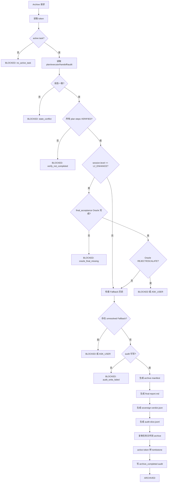

下面是 **10.md 调整后 / 优化后的完整版本**，对齐前面 1-9 次的最终口径，并按 `README.md` / `AGENTS.md` 统一：

- Archive 是最终退出层，不是新的完成门
- VerifyGate 仍是唯一 step 完成硬门
- Oracle 只做 L2 高阶复核，不替代 VerifyGate
- Fallback 历史必须进入 Archive 检查
- CLI 输出不能作为 Archive 证据
- 归档路径统一到 `.omc/archive/{date}/{task_name}/...`
- token 不直接删除，保留 tombstone
- final-report 是验收报告，不是执行证据
- 最终裁决统一为 Sovereign Verdict

---

# CarrorOS 第三轮迭代：第 10/10 次（优化版）

## 迭代主题：Archive / Final Sovereign Verdict 最终归档与主权裁决

本轮只处理一个问题：

```text
当任务完成、风险复核完成、降级历史可审计、CLI 观测无冲突后，
CarrorOS 如何进行最终归档、生成验收报告、封存 audit trail，并给出最终 Sovereign Verdict？
```

第二轮与第三轮前 9 次已冻结：

```text
最终治理形态：
  Plan → Execute → Verify → Archive

前置安全门：
  PreActionGate

后置完成门：
  VerifyGate

状态四件套：
  token.json
  plan.md
  executor.md
  session-handoff.md

高阶复核：
  Oracle / Meta-Oracle

降级熔断：
  Fallback Protocol

观测接口：
  CLI Integration
```

第三轮完整治理链：

```text
IntakeGate
→ PlanBuilder
→ PreActionGate
→ Executor Ledger
→ VerifyGate
→ Context Engine
→ Oracle / Meta-Oracle
→ Fallback Protocol
→ CLI Integration
→ Archive / Final Sovereign Verdict
```

Archive 不是完成门。  
Archive 是退出门、封存门、最终裁决门。

---

## 1. 本轮裁决书

**裁决等级：核准。**

Archive Engine 的唯一职责：

```text
在 VerifyGate、Oracle、Fallback、Context、CLI 状态均满足归档条件后，
封存任务文件、生成 final-report、写入最终 audit，并将 active token 转为 tombstone。
```

Archive 只回答：

```text
1. 所有 planned step 是否已由 VerifyGate VERIFIED？
2. L2_ENHANCE 是否已完成 final_acceptance Oracle？
3. 是否存在未解决 Fallback BLOCKED / ASK_USER？
4. 是否存在 token / plan / executor / audit 状态冲突？
5. 是否可以生成 final-report.md？
6. 是否可以写入 Sovereign Verdict？
7. active token 是否可以转为 tombstone？
```

Archive 不回答：

```text
✗ 某 step 是否完成
✗ 某 evidence 是否有效
✗ 是否可以跳过 VerifyGate
✗ 是否可以假装 Oracle ACCEPT
✗ 是否可以忽略 Fallback BLOCKED
✗ 是否可以修改 scope
✗ 是否可以重写 executor evidence
```

允许输出：

```text
ARCHIVED
BLOCKED
ASK_USER
REJECTED
```

禁止输出：

```text
✗ DONE
✗ PROBABLY_ARCHIVED
✗ TRUSTED
✗ SKIP_VERIFY
✗ ACCEPT_WITHOUT_ORACLE
✗ SILENT_ARCHIVE
```

最终裁决：

```text
Archive 只能封存已完成事实。
Archive 不得制造完成事实。
```

---

## 2. 与 README / AGENTS 对齐

### 2.1 路径对齐

任务活动路径：

```text
.omc/tasks/{date}/{task_name}/
  research.md
  plan.md
  executor.md
  sub_tasks/
  state/
    session-handoff.md
    oracle-review-pack.json
    error-dna.json
```

token 活动路径：

```text
.omc/tokens/{date}/{task_name}.json
```

audit 路径：

```text
.omc/audit/{date}.jsonl
```

归档路径：

```text
.omc/archive/{date}/{task_name}/
  final-report.md
  sovereign-verdict.json
  manifest.json
  token-tombstone.json
  plan.md
  executor.md
  session-handoff.md
  oracle-verdicts.md
  error-dna.json
  audit-slice.jsonl
```

兼容说明：

```text
旧式路径 .omc/archive/{task_id}/final-report.md 可读取。
新规范必须写入 .omc/archive/{date}/{task_name}/final-report.md。
```

---

### 2.2 与 AGENTS 铁律对齐

Archive 必须遵守：

```text
1. 不编造：
   final-report 只能来自 plan / executor / audit / oracle / fallback。
   不得凭记忆写“已完成”。

2. 证据门禁：
   没有 VerifyGate VERIFIED，不允许 Archive。

3. 范围冻结：
   Archive 不得扩展 scope。
   changed_files 必须来自实际记录。

4. 隐私防线：
   audit-slice / final-report 不得包含密钥、未脱敏日志、完整 prompt。

5. 不假完成：
   Archive 不得把 WARN / fallback / CLI OK 当完成。

6. 不自改治理：
   Archive 不得修改 AGENTS.md / README.md / kernel.md / prompts。
```

---

## 3. Archive 总流程



---

## 4. Archive 前置条件

### 4.1 通用前置条件

```text
1. token 存在且 task.status 不为 blocked。
2. plan.md 存在。
3. executor.md 存在。
4. session-handoff.md 存在。
5. audit 当前日期文件可写。
6. token.current_step 与 plan 状态一致。
7. token.stats.done == plan.md [x] 数量。
8. token.stats.total == plan.md step 总数。
9. 所有 planned steps 均有 VerifyGate VERIFIED 记录。
10. 无未解决 failure。
```

任何一项失败：

```text
BLOCKED
```

---

### 4.2 L1_BASE 前置条件

```text
1. 所有 step 均 VerifyGate VERIFIED。
2. executor.md 证据链完整。
3. Fallback 历史无 unresolved BLOCKED / ASK_USER。
4. audit 可写。
```

L1_BASE 不要求：

```text
Oracle final_acceptance
Context watermark
L3 Multi-Judge
Meta-Oracle
```

---

### 4.3 L2_ENHANCE 前置条件

```text
1. 所有 L1_BASE 前置条件。
2. final_acceptance Oracle 已运行。
3. Oracle 最终裁决为 ACCEPT 或 WARN。
4. WARN 必须记录 residual_risk。
5. REJECT / ESCALATE 不允许 Archive。
6. Context handoff 不存在未解决 compact/resume 冲突。
7. Fallback 不存在 high-risk DOWNGRADE_TO_BASE。
```

裁决：

```text
L2 的 Archive 必须同时满足 VerifyGate 完成链与 Oracle 风险链。
```

---

## 5. Archive 阻塞条件

以下情况必须 BLOCKED：

```text
1. VerifyGate 未完成。
2. plan.md 存在未勾选 step。
3. executor.md 缺失 evidence。
4. token / plan / executor 状态冲突。
5. audit 写入失败。
6. Oracle final_acceptance 缺失（L2）。
7. Oracle REJECT 或 ESCALATE 未处理。
8. Fallback BLOCKED 未处理。
9. Fallback ASK_USER 未处理。
10. high-risk DOWNGRADE_TO_BASE。
11. scope 越界未授权。
12. production approval 缺失。
13. final-report 无法生成。
14. token tombstone 无法写入。
15. archive manifest 无法写入。
```

禁止：

```text
✗ 先 Archive，后补 evidence
✗ 先 Archive，后补 Oracle
✗ 忽略 Fallback 历史
✗ 删除 active token 且不留 tombstone
```

---

## 6. Sovereign Verdict

Sovereign Verdict 是最终主权裁决。

路径：

```text
.omc/archive/{date}/{task_name}/sovereign-verdict.json
```

允许 verdict：

```text
ARCHIVED
BLOCKED
ASK_USER
REJECTED
```

字段：

```json
{
  "verdict": "ARCHIVED",
  "timestamp": "2026-07-06T22:00:00Z",
  "task_id": "task_0001",
  "task_name": "auth-token-refactor",
  "level": "L2_ENHANCE",
  "basis": {
    "verify_gate": "all_steps_verified",
    "oracle": "WARN",
    "fallback": "no_unresolved_fallback",
    "audit": "sealed",
    "scope": "unchanged"
  },
  "residual_risk": [
    "role mismatch regression not fully covered"
  ],
  "archive_path": ".omc/archive/2026-07-06/auth-token-refactor"
}
```

硬规则：

```text
1. Sovereign Verdict 不替代 VerifyGate。
2. Sovereign Verdict 只总结完成事实。
3. ARCHIVED 必须有 basis。
4. WARN residual_risk 必须保留。
5. REJECTED 必须有 required_action。
```

---

## 7. final-report.md

路径：

```text
.omc/archive/{date}/{task_name}/final-report.md
```

用途：

```text
最终验收报告。
```

注意：

```text
final-report 是归档报告。
不是执行证据。
不是 VerifyGate evidence。
不是 Oracle verdict。
```

标准模板：

```markdown
# CarrorOS Final Report

## Task
- id: task_0001
- name: auth-token-refactor
- level: L2_ENHANCE
- status: archived
- archived_at: 2026-07-06T22:00:00Z

## Goal
重构 auth token 鉴权链路

## Scope
- src/auth.ts
- middleware/auth.ts
- tests/auth.test.ts

## Completion
- total_steps: 8
- verified_steps: 8
- verify_gate: passed
- oracle_final: WARN

## Evidence Summary
- P1.S1: command npm test -- auth.test.ts exit=0
- P1.S2: file_assertion src/auth.ts expired token rejects login
- P2.S1: command npm test -- auth.test.ts exit=0

## Changed Files
- src/auth.ts
- middleware/auth.ts
- tests/auth.test.ts

## Fallback History
- none

## Residual Risk
- role mismatch regression not fully covered

## Archive Basis
- VerifyGate: all planned steps VERIFIED
- Oracle: final_acceptance WARN
- Fallback: no unresolved event
- Audit: sealed
- Scope: unchanged

## Sovereign Verdict
ARCHIVED
```

禁止写入：

```text
✗ chain-of-thought
✗ 未脱敏日志
✗ 密钥
✗ 完整 prompt
✗ “模型认为应该没问题”
```

---

## 8. manifest.json

路径：

```text
.omc/archive/{date}/{task_name}/manifest.json
```

用途：

```text
记录本次归档包含哪些文件、来源路径、摘要和封存时间。
```

模板：

```json
{
  "task_id": "task_0001",
  "task_name": "auth-token-refactor",
  "archived_at": "2026-07-06T22:00:00Z",
  "level": "L2_ENHANCE",
  "files": [
    {
      "kind": "plan",
      "source": ".omc/tasks/2026-07-06/auth-token-refactor/plan.md",
      "archive": ".omc/archive/2026-07-06/auth-token-refactor/plan.md",
      "sha256": "..."
    },
    {
      "kind": "executor",
      "source": ".omc/tasks/2026-07-06/auth-token-refactor/executor.md",
      "archive": ".omc/archive/2026-07-06/auth-token-refactor/executor.md",
      "sha256": "..."
    },
    {
      "kind": "final_report",
      "source": "generated",
      "archive": ".omc/archive/2026-07-06/auth-token-refactor/final-report.md",
      "sha256": "..."
    }
  ],
  "audit_slice": ".omc/archive/2026-07-06/auth-token-refactor/audit-slice.jsonl"
}
```

硬规则：

```text
manifest 写入失败 → BLOCKED
manifest 不允许省略 plan / executor / final-report / verdict
```

---

## 9. token tombstone

active token 不直接删除。  
Archive 后转为 tombstone。

active token 路径：

```text
.omc/tokens/{date}/{task_name}.json
```

tombstone 路径：

```text
.omc/archive/{date}/{task_name}/token-tombstone.json
```

模板：

```json
{
  "task_id": "task_0001",
  "task_name": "auth-token-refactor",
  "status": "archived",
  "level": "L2_ENHANCE",
  "archived_at": "2026-07-06T22:00:00Z",
  "archive_path": ".omc/archive/2026-07-06/auth-token-refactor",
  "final_verdict": "ARCHIVED",
  "stats": {
    "total": 8,
    "done": 8
  },
  "active_token_path": ".omc/tokens/2026-07-06/auth-token-refactor.json",
  "deleted_active_token": false
}
```

裁决：

```text
默认不删除 active token。
若实现清理，也必须先生成 tombstone，再删除 active token。
```

---

## 10. audit-slice.jsonl

路径：

```text
.omc/archive/{date}/{task_name}/audit-slice.jsonl
```

用途：

```text
抽取与当前 task_id 相关的 audit 事件，形成归档审计切片。
```

包含事件：

```text
1. intake_decision
2. plan_created
3. preaction_decision
4. executor_evidence_added
5. verify_decision
6. context_compact
7. oracle_decision
8. fallback_event
9. cli_event
10. archive_completed
```

禁止：

```text
✗ 抽取其他 task 的 audit
✗ 写入未脱敏日志
✗ 省略 fallback_event
✗ 省略 verify_decision
```

硬规则：

```text
audit-slice 生成失败 → BLOCKED
```

---

## 11. Archive Engine 核心代码

```python
#!/usr/bin/env python3
"""
CarrorOS Archive Engine
Purpose:
  Seal completed task artifacts and write final sovereign verdict.

Constraints:
  - Python 3.10+ standard library only
  - Does not decide step completion
  - Does not alter executor evidence
  - Does not replace VerifyGate or Oracle
"""

from __future__ import annotations

import argparse
import hashlib
import json
import re
import shutil
import sys
from dataclasses import dataclass, asdict
from datetime import datetime, timezone
from pathlib import Path
from typing import Any


ARCHIVE_VERDICTS = {"ARCHIVED", "BLOCKED", "ASK_USER", "REJECTED"}


@dataclass
class ArchiveResult:
    verdict: str
    reason: str
    task_id: str
    task_name: str
    level: str
    archive_path: str | None
    required_action: str | None = None


def now_iso() -> str:
    return datetime.now(timezone.utc).replace(microsecond=0).isoformat()


def today() -> str:
    return datetime.now(timezone.utc).strftime("%Y-%m-%d")


def read_text(path: Path) -> str:
    if not path.exists():
        return ""
    return path.read_text(encoding="utf-8")


def read_json(path: Path, default: dict[str, Any] | None = None) -> dict[str, Any]:
    if not path.exists():
        return default or {}
    with path.open("r", encoding="utf-8") as f:
        return json.load(f)


def write_text(path: Path, text: str) -> None:
    path.parent.mkdir(parents=True, exist_ok=True)
    path.write_text(text, encoding="utf-8")


def write_json_atomic(path: Path, data: dict[str, Any]) -> None:
    path.parent.mkdir(parents=True, exist_ok=True)
    tmp = path.with_suffix(path.suffix + ".tmp")
    with tmp.open("w", encoding="utf-8") as f:
        json.dump(data, f, ensure_ascii=False, indent=2, sort_keys=True)
        f.write("\n")
    tmp.replace(path)


def append_jsonl(path: Path, event: dict[str, Any]) -> None:
    path.parent.mkdir(parents=True, exist_ok=True)
    with path.open("a", encoding="utf-8") as f:
        f.write(json.dumps(event, ensure_ascii=False, sort_keys=True) + "\n")


def sha256_file(path: Path) -> str:
    digest = hashlib.sha256()
    with path.open("rb") as f:
        for chunk in iter(lambda: f.read(1024 * 1024), b""):
            digest.update(chunk)
    return digest.hexdigest()


def safe_slug(value: str) -> str:
    value = value.strip().lower()
    value = re.sub(r"[^a-z0-9._-]+", "-", value)
    value = re.sub(r"-{2,}", "-", value)
    return value.strip("-") or "task"


def task_id(token: dict[str, Any], fallback: str) -> str:
    return token.get("task", {}).get("id") or fallback


def task_name(token: dict[str, Any], fallback: str) -> str:
    return safe_slug(token.get("task", {}).get("name") or fallback)


def task_level(token: dict[str, Any]) -> str:
    return token.get("session", {}).get("level", "L1_BASE")


def task_status(token: dict[str, Any]) -> str:
    return token.get("task", {}).get("status", "active")


def stats(token: dict[str, Any]) -> tuple[int, int]:
    data = token.get("stats", {}) or {}
    return int(data.get("done", 0) or 0), int(data.get("total", 0) or 0)


def checked_steps(plan_text: str) -> int:
    return len(re.findall(r"^\s*[-*]\s+\[[xX]\]\s+", plan_text, flags=re.M))


def total_steps(plan_text: str) -> int:
    return len(re.findall(r"^\s*[-*]\s+\[[ xX]\]\s+", plan_text, flags=re.M))


def has_unchecked_steps(plan_text: str) -> bool:
    return bool(re.search(r"^\s*[-*]\s+\[\s\]\s+", plan_text, flags=re.M))


def audit_events_for_task(task_id_value: str) -> list[dict[str, Any]]:
    events: list[dict[str, Any]] = []
    audit_root = Path(".omc/audit")
    if not audit_root.exists():
        return events

    for audit_file in sorted(audit_root.glob("*.jsonl")):
        with audit_file.open("r", encoding="utf-8") as f:
            for line in f:
                line = line.strip()
                if not line:
                    continue
                try:
                    event = json.loads(line)
                except json.JSONDecodeError:
                    continue
                if event.get("task_id") == task_id_value:
                    events.append(event)
    return events


def latest_oracle_decision(events: list[dict[str, Any]]) -> str | None:
    decisions = [
        event.get("decision")
        for event in events
        if event.get("event_type") == "oracle_decision"
        and event.get("trigger") in {"final_acceptance", "final"}
    ]
    return decisions[-1] if decisions else None


def unresolved_fallback(events: list[dict[str, Any]]) -> tuple[bool, str | None]:
    for event in events:
        if event.get("event_type") != "fallback_event":
            continue
        decision = event.get("decision")
        if decision in {"BLOCKED", "ASK_USER"}:
            return True, str(event.get("reason", "fallback_unresolved"))
        if decision == "DOWNGRADE_TO_BASE" and event.get("risk") == "high":
            return True, "high_risk_downgrade_to_base"
    return False, None


def all_steps_verified(events: list[dict[str, Any]], expected_total: int) -> bool:
    verified = [
        event for event in events
        if event.get("event_type") == "verify_decision"
        and event.get("decision") == "VERIFIED"
    ]
    return len(verified) >= expected_total


def evidence_summary(events: list[dict[str, Any]]) -> list[str]:
    lines: list[str] = []
    for event in events:
        if event.get("event_type") != "verify_decision":
            continue
        if event.get("decision") != "VERIFIED":
            continue
        step = event.get("step") or event.get("current_step") or "unknown_step"
        source = event.get("evidence", {}).get("source") if isinstance(event.get("evidence"), dict) else None
        if source:
            lines.append(f"- {step}: {str(source)[:120]}")
        else:
            lines.append(f"- {step}: VERIFIED")
    return lines


def residual_risk(events: list[dict[str, Any]]) -> list[str]:
    risks: list[str] = []
    for event in events:
        if event.get("event_type") == "oracle_decision":
            value = event.get("residual_risk")
            if isinstance(value, list):
                risks.extend(str(item) for item in value)
            elif isinstance(value, str) and value:
                risks.append(value)
        if event.get("event_type") == "fallback_event" and event.get("decision") == "DOWNGRADE_TO_BASE":
            risks.append(f"fallback: {event.get('reason')}")
    return risks


def validate_archive_preconditions(
    token: dict[str, Any],
    plan_text: str,
    executor_text: str,
    events: list[dict[str, Any]],
) -> tuple[bool, str, str | None]:
    status = task_status(token)
    if status == "blocked":
        return False, "task_blocked", "resolve blocked task before archive"
    if status == "waiting_user":
        return False, "waiting_user", "resolve user decision before archive"

    if not plan_text:
        return False, "plan_missing", "restore plan.md"
    if not executor_text:
        return False, "executor_missing", "restore executor.md"

    done, total = stats(token)
    plan_done = checked_steps(plan_text)
    plan_total = total_steps(plan_text)

    if total == 0 or plan_total == 0:
        return False, "no_steps", "create plan steps before archive"
    if done != plan_done or total != plan_total:
        return False, "state_conflict", "repair token stats or plan state"
    if has_unchecked_steps(plan_text):
        return False, "verify_not_completed", "complete VerifyGate for all steps"
    if not all_steps_verified(events, plan_total):
        return False, "verify_not_completed", "missing verify_decision VERIFIED events"

    fallback_bad, fallback_reason = unresolved_fallback(events)
    if fallback_bad:
        return False, "fallback_unresolved", fallback_reason

    level = task_level(token)
    if level == "L2_ENHANCE":
        oracle = latest_oracle_decision(events)
        if oracle is None:
            return False, "oracle_final_missing", "run final_acceptance Oracle"
        if oracle in {"REJECT", "ESCALATE"}:
            return False, "oracle_not_accepted", "resolve Oracle REJECT/ESCALATE"
        if oracle not in {"ACCEPT", "WARN"}:
            return False, "oracle_invalid", "repair Oracle final decision"

    return True, "ok", None


def copy_if_exists(source: Path, dest: Path) -> bool:
    if not source.exists():
        return False
    dest.parent.mkdir(parents=True, exist_ok=True)
    shutil.copy2(source, dest)
    return True


def generate_final_report(
    token: dict[str, Any],
    plan_text: str,
    events: list[dict[str, Any]],
    archive_path: Path,
) -> str:
    tid = task_id(token, archive_path.name)
    name = task_name(token, archive_path.name)
    level = task_level(token)
    done, total = stats(token)
    oracle = latest_oracle_decision(events) or "N/A"
    risks = residual_risk(events)
    evidence = evidence_summary(events)

    goal = token.get("task", {}).get("goal", "")
    scope = token.get("task", {}).get("scope", []) or []
    changed_files = token.get("task", {}).get("changed_files", []) or []

    def bullet(items: list[Any], fallback: str = "- none") -> str:
        if not items:
            return fallback
        return "\n".join(f"- {str(item)}" for item in items)

    return f"""# CarrorOS Final Report

## Task
- id: {tid}
- name: {name}
- level: {level}
- status: archived
- archived_at: {now_iso()}

## Goal
{goal or "N/A"}

## Scope
{bullet(scope)}

## Completion
- total_steps: {total}
- verified_steps: {done}
- verify_gate: passed
- oracle_final: {oracle}

## Evidence Summary
{chr(10).join(evidence) if evidence else "- VERIFIED events recorded in audit"}

## Changed Files
{bullet(changed_files)}

## Fallback History
{fallback_history(events)}

## Residual Risk
{bullet(risks)}

## Archive Basis
- VerifyGate: all planned steps VERIFIED
- Oracle: {oracle}
- Fallback: no unresolved event
- Audit: sealed
- Scope: unchanged

## Sovereign Verdict
ARCHIVED
"""


def fallback_history(events: list[dict[str, Any]]) -> str:
    rows: list[str] = []
    for event in events:
        if event.get("event_type") != "fallback_event":
            continue
        rows.append(f"- {event.get('failure_type')}: {event.get('decision')} ({event.get('reason')})")
    return "\n".join(rows) if rows else "- none"


def write_audit_slice(path: Path, events: list[dict[str, Any]]) -> None:
    path.parent.mkdir(parents=True, exist_ok=True)
    with path.open("w", encoding="utf-8") as f:
        for event in events:
            f.write(json.dumps(event, ensure_ascii=False, sort_keys=True) + "\n")


def archive_task(token_path: Path, task_path: Path) -> ArchiveResult:
    token = read_json(token_path, {})
    tid = task_id(token, token_path.stem)
    name = task_name(token, task_path.name)
    level = task_level(token)

    plan_path = task_path / "plan.md"
    executor_path = task_path / "executor.md"
    handoff_path = task_path / "state" / "session-handoff.md"
    oracle_verdicts_path = task_path / "oracle-verdicts.md"
    error_dna_path = task_path / "state" / "error-dna.json"

    plan_text = read_text(plan_path)
    executor_text = read_text(executor_path)
    events = audit_events_for_task(tid)

    ok, reason, action = validate_archive_preconditions(token, plan_text, executor_text, events)
    if not ok:
        return ArchiveResult("BLOCKED", reason, tid, name, level, None, action)

    archive_path = Path(".omc/archive") / today() / name
    archive_path.mkdir(parents=True, exist_ok=True)

    copied: list[dict[str, Any]] = []

    file_map = [
        ("plan", plan_path, archive_path / "plan.md"),
        ("executor", executor_path, archive_path / "executor.md"),
        ("session_handoff", handoff_path, archive_path / "session-handoff.md"),
        ("oracle_verdicts", oracle_verdicts_path, archive_path / "oracle-verdicts.md"),
        ("error_dna", error_dna_path, archive_path / "error-dna.json"),
    ]

    for kind, source, dest in file_map:
        if copy_if_exists(source, dest):
            copied.append({
                "kind": kind,
                "source": str(source),
                "archive": str(dest),
                "sha256": sha256_file(dest),
            })

    report_path = archive_path / "final-report.md"
    write_text(report_path, generate_final_report(token, plan_text, events, archive_path))
    copied.append({
        "kind": "final_report",
        "source": "generated",
        "archive": str(report_path),
        "sha256": sha256_file(report_path),
    })

    audit_slice_path = archive_path / "audit-slice.jsonl"
    write_audit_slice(audit_slice_path, events)
    copied.append({
        "kind": "audit_slice",
        "source": ".omc/audit/*.jsonl",
        "archive": str(audit_slice_path),
        "sha256": sha256_file(audit_slice_path),
    })

    risks = residual_risk(events)
    oracle = latest_oracle_decision(events) or "N/A"

    verdict = {
        "verdict": "ARCHIVED",
        "timestamp": now_iso(),
        "task_id": tid,
        "task_name": name,
        "level": level,
        "basis": {
            "verify_gate": "all_steps_verified",
            "oracle": oracle,
            "fallback": "no_unresolved_fallback",
            "audit": "sealed",
            "scope": "unchanged",
        },
        "residual_risk": risks,
        "archive_path": str(archive_path),
    }
    verdict_path = archive_path / "sovereign-verdict.json"
    write_json_atomic(verdict_path, verdict)
    copied.append({
        "kind": "sovereign_verdict",
        "source": "generated",
        "archive": str(verdict_path),
        "sha256": sha256_file(verdict_path),
    })

    tombstone = {
        "task_id": tid,
        "task_name": name,
        "status": "archived",
        "level": level,
        "archived_at": now_iso(),
        "archive_path": str(archive_path),
        "final_verdict": "ARCHIVED",
        "stats": token.get("stats", {}),
        "active_token_path": str(token_path),
        "deleted_active_token": False,
    }
    tombstone_path = archive_path / "token-tombstone.json"
    write_json_atomic(tombstone_path, tombstone)
    copied.append({
        "kind": "token_tombstone",
        "source": str(token_path),
        "archive": str(tombstone_path),
        "sha256": sha256_file(tombstone_path),
    })

    manifest = {
        "task_id": tid,
        "task_name": name,
        "archived_at": now_iso(),
        "level": level,
        "files": copied,
        "audit_slice": str(audit_slice_path),
    }
    manifest_path = archive_path / "manifest.json"
    write_json_atomic(manifest_path, manifest)

    append_jsonl(
        Path(".omc/audit") / f"{today()}.jsonl",
        {
            "event_type": "archive_completed",
            "timestamp": now_iso(),
            "task_id": tid,
            "level": level,
            "phase": "archive",
            "actor": "archive_engine",
            "decision": "ARCHIVED",
            "archive_path": str(archive_path),
            "paths": [str(manifest_path), str(report_path), str(verdict_path), str(tombstone_path)],
        },
    )

    return ArchiveResult("ARCHIVED", "archive_completed", tid, name, level, str(archive_path))


def main() -> int:
    parser = argparse.ArgumentParser()
    parser.add_argument("--token", required=True, help="Path to .omc/tokens/{date}/{task_name}.json")
    parser.add_argument("--task", required=True, help="Path to .omc/tasks/{date}/{task_name}")
    args = parser.parse_args()

    result = archive_task(Path(args.token), Path(args.task))
    print(json.dumps(asdict(result), ensure_ascii=False, indent=2))
    return 0 if result.verdict == "ARCHIVED" else 1


if __name__ == "__main__":
    raise SystemExit(main())
```

---

## 12. CLI 集成

调用：

```bash
python3 .claude/scripts/archive_engine.py \
  --token .omc/tokens/2026-07-06/auth-token-refactor.json \
  --task .omc/tasks/2026-07-06/auth-token-refactor
```

成功输出：

```json
{
  "verdict": "ARCHIVED",
  "reason": "archive_completed",
  "task_id": "task_0001",
  "task_name": "auth-token-refactor",
  "level": "L2_ENHANCE",
  "archive_path": ".omc/archive/2026-07-06/auth-token-refactor",
  "required_action": null
}
```

失败输出：

```json
{
  "verdict": "BLOCKED",
  "reason": "oracle_final_missing",
  "task_id": "task_0001",
  "task_name": "auth-token-refactor",
  "level": "L2_ENHANCE",
  "archive_path": null,
  "required_action": "run final_acceptance Oracle"
}
```

输出规范：

```text
1. CLI 可显示 ARCHIVED / BLOCKED / ASK_USER / REJECTED。
2. CLI 不得显示 DONE。
3. CLI 不得把 ARCHIVED 当 step evidence。
4. Archive 失败必须返回非 0。
```

---

## 13. BASE / ENHANCE 归档差异

### L1_BASE 归档文件集

```text
required:
  final-report.md
  sovereign-verdict.json
  manifest.json
  token-tombstone.json
  plan.md
  executor.md
  session-handoff.md
  audit-slice.jsonl

optional:
  research.md
  sub_tasks/
```

不要求：

```text
oracle-verdicts.md
oracle-review-pack.json
error-dna.json
```

---

### L2_ENHANCE 归档文件集

```text
required:
  final-report.md
  sovereign-verdict.json
  manifest.json
  token-tombstone.json
  plan.md
  executor.md
  session-handoff.md
  oracle-verdicts.md
  audit-slice.jsonl

conditional:
  error-dna.json          # 若 Oracle WARN/REJECT/Fallback 风险存在
  oracle-review-pack.json # 若 final_acceptance 复核包保留
  sub_tasks/
  research.md
```

硬规则：

```text
L2_ENHANCE 缺 final_acceptance Oracle → BLOCKED
L2_ENHANCE Oracle WARN 缺 residual_risk → BLOCKED
```

---

## 14. 最终删除 / 废弃清单

第三轮后必须删除或废弃以下旧机制：

```text
1. acceptance.md 独立完成门
2. executor.md narrative completion
3. plan.md 手工标 [x] 通道
4. 多套 verify 标准
5. Oracle 直接完成裁决
6. 未审计 fallback
7. compact 后凭记忆续接
8. statusline 作为 evidence
9. Hook 内直接修改治理文件
10. 用户“继续”作为 user_confirmation
11. .omc/state/token.json 作为主状态源
12. .omc/docs/plan.md 作为主计划源
13. .omc/docs/executor.md 作为主执行源
14. .omc/archive/{task_id}/ 作为新归档主路径
```

保留但降级为辅助：

```text
1. session-handoff.md:
   恢复摘要，不是状态源

2. oracle-verdicts.md:
   高阶复核，不是完成证据

3. final-report.md:
   归档报告，不是执行证据

4. statusline:
   展示层，不是治理真相

5. OpenCode SQLite:
   水位观测，不是治理真相
```

---

## 15. Archive 与其他模块的最终边界

### VerifyGate

```text
VerifyGate:
  evidence → step completion

Archive:
  all completed steps → final sealing
```

禁止：

```text
✗ Archive 补 VerifyGate
✗ Archive 标 plan.md [x]
✗ Archive 把 final-report 当 evidence
```

---

### Oracle

```text
Oracle:
  completed evidence chain → phase/final risk review

Archive:
  oracle final verdict → residual risk preservation
```

禁止：

```text
✗ Archive 用 Oracle ACCEPT 替代 VerifyGate
✗ Archive 忽略 Oracle WARN residual_risk
✗ Archive 覆盖 Oracle REJECT
```

---

### Fallback

```text
Fallback:
  failure → governance decision

Archive:
  fallback history → archive eligibility
```

禁止：

```text
✗ Archive 忽略 unresolved ASK_USER
✗ Archive 忽略 unresolved BLOCKED
✗ Archive 接受 high-risk DOWNGRADE_TO_BASE
```

---

### CLI

```text
CLI:
  status display / command routing

Archive:
  disk facts / audit facts → final sealing
```

禁止：

```text
✗ Archive 信任 statusline OK
✗ Archive 使用 CLI 输出替代 audit
✗ Archive 把 ARCHIVED 输出当 evidence
```

---

## 16. 示例

### 16.1 L1_BASE 成功归档

条件：

```text
所有 step VerifyGate VERIFIED
无 unresolved fallback
audit 可写
```

输出：

```json
{
  "verdict": "ARCHIVED",
  "reason": "archive_completed",
  "task_id": "task_0001",
  "level": "L1_BASE",
  "archive_path": ".omc/archive/2026-07-06/docs-cleanup"
}
```

---

### 16.2 L2_ENHANCE Oracle 缺失

条件：

```text
所有 step VERIFIED
但缺 final_acceptance Oracle
```

输出：

```json
{
  "verdict": "BLOCKED",
  "reason": "oracle_final_missing",
  "required_action": "run final_acceptance Oracle"
}
```

---

### 16.3 Fallback ASK_USER 未处理

条件：

```text
audit 中存在：
fallback_event decision=ASK_USER
```

输出：

```json
{
  "verdict": "BLOCKED",
  "reason": "fallback_unresolved",
  "required_action": "oracle_unavailable:medium_risk_requires_user"
}
```

---

### 16.4 Oracle WARN 成功归档

条件：

```text
Oracle final_acceptance = WARN
residual_risk 已记录
无 unresolved fallback
```

输出：

```json
{
  "verdict": "ARCHIVED",
  "reason": "archive_completed",
  "level": "L2_ENHANCE",
  "archive_path": ".omc/archive/2026-07-06/auth-token-refactor"
}
```

final-report 必须包含：

```text
Residual Risk
```

---

## 17. 设计优缺点

### 优点

```text
1. 所有完成路径最终收束到 VerifyGate。
2. 所有高风险归档最终收束到 Oracle final_acceptance。
3. 所有异常历史最终收束到 Fallback 检查。
4. token 不直接删除，恢复和审计友好。
5. final-report 与 executor evidence 明确分离。
6. audit-slice 让归档可复盘。
7. Sovereign Verdict 给出统一最终裁决。
8. BASE / ENHANCE 归档文件集清晰分离。
9. CLI 输出不会污染归档依据。
```

### 缺点

```text
1. Archive 前置检查更严格，可能增加 BLOCKED。
2. audit-slice 依赖 audit 事件质量。
3. token tombstone 增加一个文件。
4. L2 final_acceptance 会增加归档成本。
5. 多日期、多任务归档需要准确 task_name。
```

### 取舍裁决

```text
CarrorOS 选择严格归档。
归档是最终退出，不是补票。
如果完成事实、风险事实、降级事实、审计事实任一缺失，宁可 BLOCKED。
该代价核准。
```

---

## 18. 本轮最终规则

```text
1. Archive 是最终退出门，不是完成门。
2. VerifyGate 是唯一 step 完成硬门。
3. Archive 不得标 plan.md [x]。
4. Archive 不得修改 executor evidence。
5. L1_BASE 归档不要求 Oracle。
6. L2_ENHANCE 归档必须 final_acceptance Oracle。
7. Oracle WARN 可归档，但必须保留 residual_risk。
8. Oracle REJECT / ESCALATE 不可归档。
9. Fallback BLOCKED 未处理不可归档。
10. Fallback ASK_USER 未处理不可归档。
11. high-risk DOWNGRADE_TO_BASE 不可归档。
12. audit 写入失败不可归档。
13. token / plan / executor 冲突不可归档。
14. statusline OK 不可作为归档证据。
15. final-report 不可作为执行证据。
16. active token 默认不删除，归档生成 tombstone。
17. manifest 必须记录归档文件与 sha256。
18. audit-slice 必须包含 verify / oracle / fallback / archive 相关事件。
19. Sovereign Verdict 输出只能是 ARCHIVED / BLOCKED / ASK_USER / REJECTED。
20. 第三轮结束后废弃旧全局路径作为主路径。
```

---

## 19. 第三轮 10/10 最终结论

```text
Archive / Final Sovereign Verdict 定稿。
CarrorOS 第三轮全部 10 次迭代完成。

治理链路闭环：

Intake → Plan → PreAction → Execute → Verify → Context → Oracle → Fallback → CLI → Archive

所有完成路径收束到 VerifyGate。
所有高阶风险收束到 Oracle。
所有失效路径收束到 Fallback。
所有长任务恢复收束到 Context Engine。
所有外部展示收束到 CLI Integration。
所有最终退出收束到 Archive Engine。

最终裁决：核准。
```

---

## 完整性检查清单

```text
✅ 对齐 README 任务路径与 token 路径
✅ 对齐 AGENTS 铁律
✅ 明确 Archive 不是完成门
✅ 明确 VerifyGate 是唯一 step 完成硬门
✅ 明确 L1 / L2 归档差异
✅ 明确 Oracle final_acceptance 前置条件
✅ 明确 Fallback 历史进入 Archive
✅ 明确 CLI 输出不能作为证据
✅ 明确 final-report 不是执行证据
✅ 明确 sovereign-verdict.json
✅ 明确 manifest.json
✅ 明确 token-tombstone.json
✅ 明确 audit-slice.jsonl
✅ 给出完整 archive_engine.py
✅ 给出 CLI 调用示例
✅ 给出成功 / 阻塞示例
✅ 给出最终删除 / 废弃清单
✅ 给出 20 条最终规则
✅ 完成第三轮 10/10 总结
```