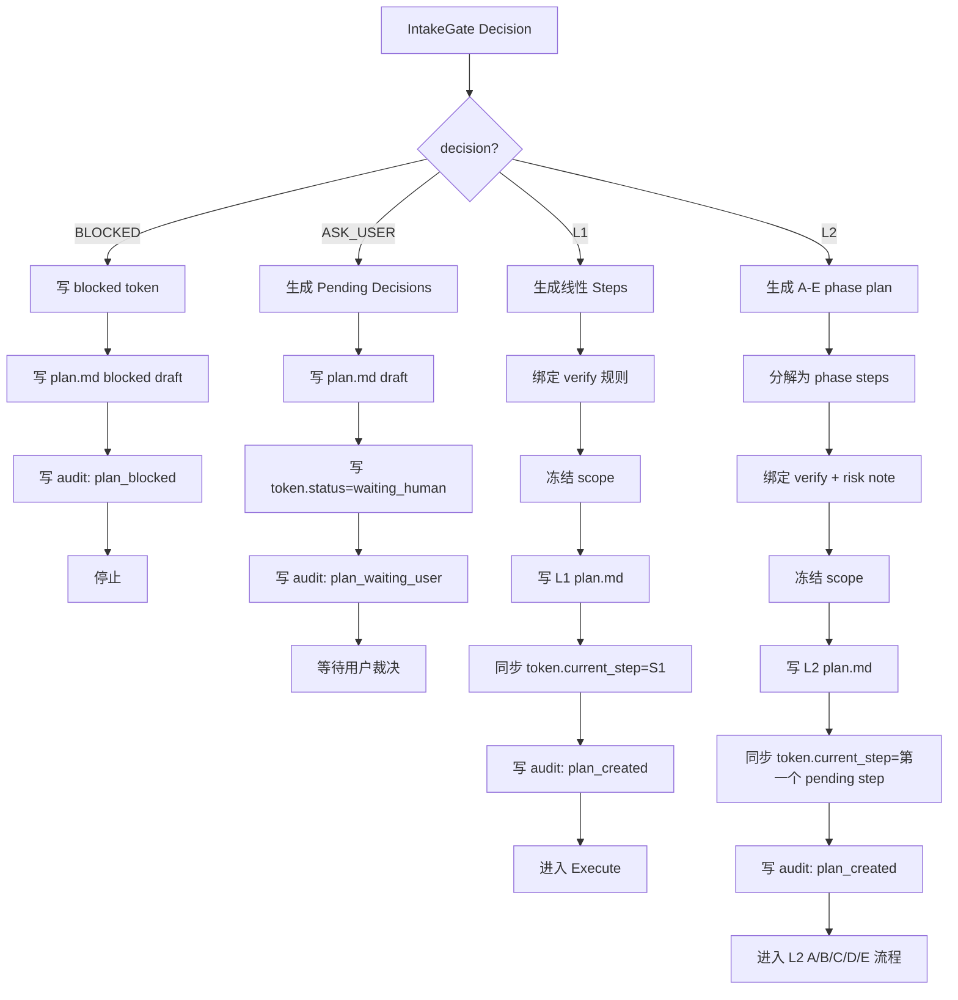
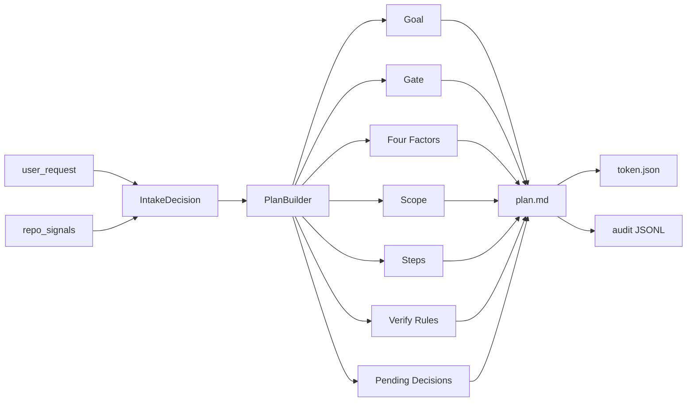
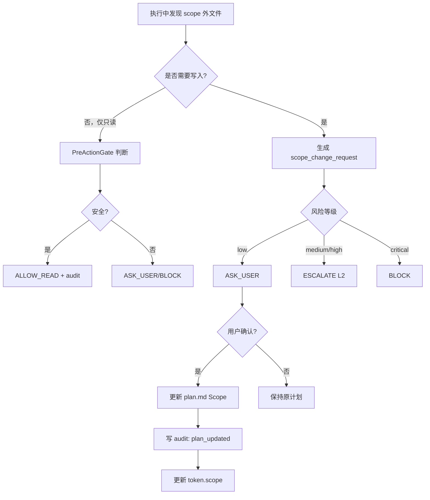

下面是根据你给的知识库内容优化后的 **完整版**。我主要做了这些修正：

- 统一 `L1 / L2`，删除所有 `L1_L1`、`L2/`、`L2_L2` 这类污染写法。
- 对齐知识库：`L1 = A/B/C 三步法`，`L2 = A/B/C/D/E 五步法`。
- 对齐文档结构：`L1` 默认 `.omc/tasks/{date}/{task}/plan.md`，`L2` 默认 `rpe/{feature}/plan.md`。
- 强化 `plan.md` 作为状态机，而不是说明文档。
- 加入知识库里的“四要素”：`Philosophy / Iron Rules / ROI / Current State`，其中 `L2 必填，L1 可省或简写`。
- 修复原代码中的语法错误、字符串错误、函数名错误、JSON 示例错误。
- 将 `ASK_USER / BLOCKED` 明确写入 `token.blocked + pending decisions`，避免只停在上下文里。
- 保留 PlanBuilder 不生成 `research.md / acceptance.md` 的边界，但说明 L2 的 `research.md` 由 L2 A 阶段生成，不由 PlanBuilder 越权生成。

---

# CarrorOS 第三轮迭代：第 2/10 次

## 迭代主题：PlanBuilder 冻结计划生成器

本轮只处理一个问题：

```text
IntakeGate 已经完成任务分级后，如何生成一个可执行、可验证、可恢复、不可随意漂移的 plan.md？
```

第二轮已裁决：

```text
plan.md 是唯一计划与 step 状态机源。
VerifyGate 未通过，不允许 plan.md 标 [x]。
token.json 与 plan.md 不一致时 BLOCKED。
每个 [x] 必须带 [已验证:file:line] 或 [已测试:command] 证据标记。
```

第三轮第 1/10 次已裁决：

```text
IntakeGate 是任务入口。
IntakeGate 输出 L1 / L2 / BLOCKED / ASK_USER。
L1 / L2 按任务风险定义，不按模型档位定义。
```

本轮将 `Plan` 阶段压实为可实现机制：

```text
PlanBuilder
```

PlanBuilder 不是新 Hook。  
PlanBuilder 是 `Plan` 阶段的工程实现。

---

## 1. 本轮裁决书

**裁决等级：核准。**

PlanBuilder 的唯一职责：

```text
把 IntakeGate 的裁决结果转换为冻结计划。
```

PlanBuilder 只输出或更新：

```text
plan.md
token.json 的 plan 相关字段
audit JSONL 中的 plan_created / plan_updated / plan_blocked 事件
```

按等级决定文档根目录：

```text
L1:
  .omc/tasks/{date}/{task}/plan.md
  .omc/tasks/{date}/{task}/executor.md

L2:
  rpe/{feature}/research.md
  rpe/{feature}/plan.md
  rpe/{feature}/executor.md
  rpe/{feature}/acceptance.md
```

注意：

```text
PlanBuilder 只创建 / 更新 plan.md。
L2 的 research.md 属于 A 认知阶段。
L2 的 acceptance.md 属于 E 验收阶段。
PlanBuilder 不越权生成它们的内容。
```

PlanBuilder 不输出：

```text
✗ executor.md 完成证据
✗ VerifyGate 裁决
✗ Oracle 裁决
✗ fallback_event
✗ acceptance.md
✗ research.md 的事实内容
```

本轮最终裁决：

```text
没有 plan.md，不得进入 Execute。
没有 verify 规则的 step，不得进入 Execute。
scope 未冻结，不得进入 Execute。
plan.md 与 token.json 不一致时 BLOCKED。
```

---

## 2. 为什么需要 PlanBuilder

第二轮已经规定了 `plan.md` 的基本边界：

```text
goal
scope
steps
verify 规则
pending decisions
```

但还没有完全回答：

```text
1. step 如何拆？
2. verify 如何绑定？
3. scope 如何冻结？
4. L1 和 L2 的 plan 粒度有什么差异？
5. 用户战略裁决如何写入但不污染执行证据？
6. 后续变更 plan 时如何审计？
7. plan.md 如何成为 compact 后的恢复入口？
8. token.json 如何与 plan.md 强一致？
```

如果这些不固定，会出现：

```text
plan.md 写得像总结，不像执行图
step 无验证规则
scope 越改越大
executor.md 和 plan.md 对不上
VerifyGate 找不到验收依据
compact 后恢复不知道下一步是什么
Driver 读到半更新状态
```

PlanBuilder 就是为了解决这些问题。

裁决：

```text
计划不是灵感板。
计划是执行合约。
plan.md 不是说明文档。
plan.md 是 step 状态机。
```

---

## 3. PlanBuilder 设计目标

PlanBuilder 必须满足 10 个目标：

```text
1. 每个 step 必须原子化。
2. 每个 step 必须有 verify 规则。
3. 每个 step 必须绑定 scope。
4. plan.md 必须可人工阅读。
5. plan.md 必须可机器解析。
6. L1 plan 必须短、线性、可快速恢复。
7. L2 plan 可分 phase，但 phase_depth <= 1。
8. plan 变更必须可审计。
9. token.json 与 plan.md 必须强一致。
10. compact 后只读 token + plan.md 就能知道下一步。
```

知识库对齐：

```text
L1: A 规划 → B 执行 → C 验收
L2: A 认知 → B 方案 → C 审核 → D 执行 → E 验收
```

PlanBuilder 负责：

```text
L1 的 A 规划产物：plan.md
L2 的 B 方案产物：plan.md
```

---

## 4. PlanBuilder 流程图



---

## 5. PlanBuilder 数据流



边界：

```text
IntakeGate 决定等级。
PlanBuilder 决定执行形状。
PreActionGate 决定动作能不能执行。
Executor 记录过程事实。
VerifyGate 决定 step 是否完成。
Archive 归档并清理 token。
```

三者不能互相替代。

---

## 6. plan.md 标准结构

### 6.1 L1 plan.md 结构

L1 使用轻量结构：

```markdown
# Plan

## Gate
- level: L1
- phase: A
- oracle_required: false
- meta_oracle_required: false

## Goal
...

## Constraints
...

## Acceptance
- [ ] AC-1 ...

## Scope
- ...

## Scope Freeze
- status: frozen
- change_policy: requires_user_confirmation

## Steps
- [ ] S1: ...
  - scope: ...
  - verify: ...
```

L1 原则：

```text
短
线性
无 research.md
无 Oracle
无 phase 嵌套
必要澄清并入 plan.md
```

---

### 6.2 L2 plan.md 结构

L2 使用完整状态机结构：

```markdown
# Plan

## Gate
- level: L2
- phase: B
- oracle_required: true
- meta_oracle_required: true

## Four Factors
- Philosophy:
- Iron Rules:
- ROI:
- Current State:

## Goal
...

## Scope
- ...

## Scope Freeze
- status: frozen
- change_policy: requires_user_confirmation_or_l2_review

## User Decisions
- ...

## Pending Decisions
- ...

## Steps
### A Cognition
- [ ] A.1: ...

### B Plan
- [ ] B.1: ...

### C Review
- [ ] C.1: ...

### D Execute
- [ ] D.1: ...

### E Acceptance
- [ ] E.1: ...
```

L2 原则：

```text
A 认知 → research.md
B 方案 → plan.md
C 审核 → oracle-verdicts.md + meta-oracle-verdicts.md
D 执行 → executor.md + plan step 状态
E 验收 → acceptance.md + 用户确认
```

PlanBuilder 生成的是 B 阶段的计划骨架，不伪造 A/C/D/E 的结果。

---

## 7. Step 拆分规则

### 7.1 原子 step 定义

一个 step 必须满足：

```text
1. 能用一句话描述动作。
2. 能绑定明确文件或对象。
3. 能用一个或多个 verify 规则判断。
4. 失败后能单独修复。
5. 完成后能写入 executor.md evidence。
6. 标记 [x] 时必须附带证据标记。
```

禁止 step：

```text
✗ 优化系统
✗ 处理所有问题
✗ 完善代码
✗ 重构架构
✗ 修一下 bug
✗ 更新相关文件
✗ 看情况调整
```

合格 step：

```text
✓ S1: 修改 src/auth.ts 的 token 过期判断
✓ S2: 为过期 token 添加 tests/auth.test.ts 用例
✓ S3: 更新 docs/auth.md 的错误码说明
```

完成后的合法格式：

```markdown
- [x] S1: 修改 src/auth.ts 的 token 过期判断 — [已验证:src/auth.ts:42]
- [x] S2: 为过期 token 添加测试 — [已测试:npm test -- auth.test.ts]
```

没有证据标记的 `[x]` 无效。

---

## 8. L1 Step 拆分

L1 使用线性 step：

```text
S1 → S2 → S3 → Archive
```

限制：

```text
step 数 ≤ 5
每个 step scope ≤ 3 个文件
总 scope ≤ 8 个文件
每个 step 至少 1 条 verify
不允许 phase 嵌套
不允许并行子代理
不允许 research step
不允许 Oracle gate
```

L1 step 模板：

```markdown
- [ ] S1: {动词 + 对象 + 结果}
  - scope: {path}
  - verify: {command/file/assertion/user}
```

L1 适合：

```text
单文件修复
小型测试补充
文档更新
小配置变更
明确报错修复
```

---

## 9. L2 Step 拆分

L2 使用 A-E phase，但禁止无限分层：

```text
phase_depth <= 1
step_id = {A|B|C|D|E}.{n}
```

标准 phase：

```text
A Cognition
B Plan
C Review
D Execute
E Acceptance
```

限制：

```text
phase 数固定为 A-E
每个 phase step 数 ≤ 8
总 step 数建议 ≤ 24
每个 step 必须有 verify
高风险 step 必须有 risk
Oracle 只允许绑定在 C 审核或 E 验收
```

L2 step 模板：

```markdown
### D Execute

- [ ] D.1: 修改 auth middleware 的 token 解析路径
  - scope: src/middleware/auth.ts
  - verify: command:npm test -- auth.middleware.test.ts
  - risk: auth_behavior_change
```

L2 适合：

```text
跨模块重构
鉴权 / 支付 / 数据迁移
生产 / 发布 / 基础设施
多服务协同
需要调研支撑的架构变更
长期无人执行
用户要求高可靠审计
```

---

## 10. Verify 规则绑定

### 10.1 每个 step 必须有 verify

允许的 verify 类型：

```text
command:
  verify: command:npm test -- auth.test.ts

file:
  verify: file:src/auth.ts contains "expiresAt"

assertion:
  verify: assertion:expired token rejects login

user:
  verify: user:用户确认 UI 文案符合预期
```

推荐顺序：

```text
command > file + assertion > user
```

裁决：

```text
能用命令验证的，不得只用用户确认。
能用 file:line 验证的，不得只写自然语言。
用户确认只适合产品意图、UI 感知、文案偏好。
```

---

### 10.2 验证强度

```text
V3 command:
  可重复执行，最强

V2 file + assertion:
  可定位，可人工复核

V1 user confirmation:
  适合 UI / 文案 / 产品意图

V0 none:
  禁止进入 Execute
```

PlanBuilder 必须拒绝 V0 step。

---

### 10.3 verify 绑定示例

代码任务：

```markdown
- [ ] S1: 修复 token 过期判断
  - scope: src/auth.ts
  - verify: command:npm test -- auth.test.ts
  - verify: assertion:expired token rejects login
```

文档任务：

```markdown
- [ ] S1: 更新安装说明
  - scope: README.md
  - verify: file:README.md contains "npm install"
```

配置任务：

```markdown
- [ ] S1: 修改开发环境端口配置
  - scope: config/dev.json
  - verify: command:npm run config:check
```

高风险任务：

```markdown
- [ ] D.2: 验证支付回调幂等性
  - scope: src/payment/webhook.ts, tests/payment.webhook.test.ts
  - verify: command:npm test -- payment.webhook.test.ts
  - verify: assertion:duplicate webhook returns idempotent success
  - risk: payment_double_charge
```

---

## 11. Scope 冻结机制

### 11.1 scope 来源

scope 只能来自：

```text
1. 用户明确指定
2. IntakeGate 从请求中提取
3. PlanBuilder 从已验证 repo_signals 推导
4. 用户确认后的扩展
```

禁止：

```text
✗ 执行中随手扩大 scope
✗ 因为“可能相关”直接加入文件
✗ Oracle 自动扩 scope
✗ VerifyGate 自动扩 scope
✗ 为了通过测试临时扩大 scope
```

---

### 11.2 Scope Freeze

plan.md 必须包含：

```markdown
## Scope Freeze
- status: frozen
- change_policy: requires_user_confirmation
```

L2 可使用：

```markdown
## Scope Freeze
- status: frozen
- change_policy: requires_user_confirmation_or_l2_review
```

执行中遇到 scope 外文件：

```text
只读检查:
  PreActionGate 可 ALLOW_READ / ASK_USER / BLOCK

写入修改:
  必须 ASK_USER / ESCALATE

敏感路径:
  BLOCK 或要求 L2 审核

生产 / 发布 / 不可逆:
  必须结构化用户确认
```

---

### 11.3 scope 变更流程



scope_change_request 格式：

```json
{
  "event_type": "scope_change_request",
  "current_step": "S2",
  "requested_paths": ["src/token.ts"],
  "reason": "test import points to shared token parser",
  "risk": "medium",
  "decision": "ASK_USER"
}
```

---

## 12. 用户战略裁决写入 plan.md

用户裁决是计划约束，不是完成证据。

允许写入：

```markdown
## User Decisions
- 2026-07-05T16:00:00Z: 用户选择只修复服务端，不调整前端。
- 2026-07-05T16:03:00Z: 用户要求保持现有 API response shape。
```

禁止写入：

```text
✗ 用户说“应该可以了”作为 VERIFIED
✗ 用户模糊授权作为危险操作许可
✗ 把用户偏好写入 executor.md evidence
✗ 把用户战略选择等同于 VerifyGate 通过
```

裁决：

```text
User Decisions 约束 plan。
User Confirmation 可作为 VerifyGate 的 V1 证据。
两者必须分开。
```

---

## 13. Pending Decisions

知识库要求：

```text
所有阻塞都文档化。
不能让无人模式停在上下文里。
必须写入 token.blocked + executor.md + pending-decisions。
```

PlanBuilder 遇到 `ASK_USER` 时，必须在 plan.md 写：

```markdown
## Pending Decisions
- clarify_scope: 需要用户确认修改范围。
- clarify_goal: 需要用户确认目标。
```

并同步 token：

```json
{
  "task": {
    "status": "waiting_human",
    "blocked": "pending_user_decision"
  }
}
```

`BLOCKED` 时写：

```markdown
## Blocked
reason: high_risk_without_l2
next_action: wait_for_user_or_enable_l2
```

并同步 token：

```json
{
  "task": {
    "status": "blocked",
    "blocked": "high_risk_without_l2"
  }
}
```

---

## 14. PlanBuilder 与 token.json 同步

PlanBuilder 创建 plan 后，必须同步 token：

```json
{
  "task": {
    "status": "planning",
    "phase": "A",
    "current_step": "S1",
    "scope": ["README.md"],
    "blocked": null,
    "failed_verifications": 0,
    "risk_level": "low",
    "task_type": "doc"
  },
  "stats": {
    "done": 0,
    "total": 1
  }
}
```

同步规则：

```text
token.task.current_step = plan.md 第一个 pending step
token.stats.done = plan.md [x] 数量
token.stats.total = plan.md step 总数
token.task.scope = plan.md Scope
token.doc_root = 当前任务文档目录
```

强一致性规则：

```text
每个 step 边界，原子更新顺序：
1. 写 executor.md（过程）
2. 更新 plan.md（[x] 标记 + 证据）
3. 更新 token.json（phase + stats + heartbeat）
```

PlanBuilder 阶段的原子更新顺序：

```text
1. 写 plan.md
2. 更新 token.json
3. 写 audit JSONL
```

如果无法同步：

```text
BLOCKED
```

禁止：

```text
✗ plan.md 更新了但 token 不更新
✗ token 指向不存在的 step
✗ total 与 step 数不一致
✗ plan.md [x] 数量与 token.stats.done 不一致
```

---

## 15. Plan 修改策略

### 15.1 允许修改 plan 的场景

```text
1. 用户改变目标
2. scope 变更已获批准
3. VerifyGate BLOCKED 后需要修复 step
4. L2 发现原计划不可执行
5. 外部依赖缺失导致需要替代路径
6. pending decision 被用户裁决
```

---

### 15.2 禁止修改 plan 的场景

```text
1. 为了掩盖失败
2. 为了把未验证 step 标成完成
3. 为了绕过 PreActionGate
4. 为了降低风险等级
5. 为了删除失败证据
6. 为了让 token 和 plan 表面一致而篡改历史
```

---

### 15.3 plan 更新必须写审计

```json
{
  "event_type": "plan_updated",
  "timestamp": "2026-07-05T16:10:00Z",
  "task_id": "task_0001",
  "level": "L1",
  "phase": "A",
  "current_step": "S2",
  "actor": "model",
  "action": "update_plan",
  "paths": [
    ".omc/tasks/2026-07-05/task_0001/plan.md",
    ".omc/state/token.json"
  ],
  "decision": "ALLOW",
  "reason": "user_approved_scope_change",
  "evidence": {
    "type": "user_decision",
    "summary": "User approved adding src/token.ts to S2 scope"
  },
  "risk": "medium"
}
```

---

## 16. PlanBuilder 核心代码

以下代码只依赖 Python 3.10+ 标准库，兼容 Mac / Windows / WSL2。

```python
#!/usr/bin/env python3
"""
CarrorOS PlanBuilder

Purpose:
  Convert an IntakeGate decision into a frozen, verifiable plan.md.

Constraints:
  - Python 3.10+ standard library only
  - No task execution
  - No secret reading
  - Every executable step must have scope and verify rules
  - L1/L2 are task governance levels, not model tiers
"""

from __future__ import annotations

import json
import re
import sys
from dataclasses import asdict, dataclass
from datetime import datetime, timezone
from pathlib import Path
from typing import Any


@dataclass
class Step:
    step_id: str
    title: str
    scope: list[str]
    verify: list[str]
    risk: str | None = None
    oracle: str | None = None


@dataclass
class Plan:
    task_id: str
    level: str
    risk_level: str
    task_type: str
    goal: str
    scope: list[str]
    steps: list[Step]
    pending_decisions: list[str]
    blocked_reason: str | None
    doc_root: str


def now_iso() -> str:
    return datetime.now(timezone.utc).replace(microsecond=0).isoformat()


def today() -> str:
    return datetime.now(timezone.utc).strftime("%Y-%m-%d")


def read_json(path: Path) -> dict[str, Any]:
    with path.open("r", encoding="utf-8") as f:
        return json.load(f)


def write_json(path: Path, data: dict[str, Any]) -> None:
    path.parent.mkdir(parents=True, exist_ok=True)
    tmp = path.with_suffix(path.suffix + ".tmp")
    with tmp.open("w", encoding="utf-8") as f:
        json.dump(data, f, ensure_ascii=False, indent=2, sort_keys=True)
        f.write("\n")
    tmp.replace(path)


def write_text(path: Path, content: str) -> None:
    path.parent.mkdir(parents=True, exist_ok=True)
    tmp = path.with_suffix(path.suffix + ".tmp")
    with tmp.open("w", encoding="utf-8") as f:
        f.write(content)
    tmp.replace(path)


def sanitize_goal(text: str) -> str:
    value = re.sub(r"\s+", " ", text).strip()
    return value[:240] if value else "Unspecified task"


def safe_slug(value: str) -> str:
    slug = re.sub(r"[^a-zA-Z0-9._-]+", "-", value.strip().lower())
    slug = slug.strip("-._")
    return slug[:64] or "task"


def resolve_doc_root(level: str, task_id: str, feature: str | None = None) -> str:
    if level == "L2":
        name = safe_slug(feature or task_id)
        return f"rpe/{name}"
    return f".omc/tasks/{today()}/{safe_slug(task_id)}"


def infer_default_verify(task_type: str, scope: list[str], title: str) -> list[str]:
    if task_type == "doc":
        target = scope[0] if scope else "<doc-file>"
        return [f"file:{target} contains expected update"]

    if task_type == "config":
        if any(path.endswith(".json") for path in scope):
            return ["command:python -m json.tool <config-file>"]
        if any(path.endswith((".yaml", ".yml", ".toml")) for path in scope):
            return ["command:<project config validation command>"]
        return ["file:<config-file> contains expected value"]

    if task_type in ("code", "security"):
        return [
            "command:<project test command>",
            f"assertion:{title}",
        ]

    if task_type == "data":
        return [
            "command:<migration dry-run or schema check>",
            f"assertion:{title}",
        ]

    if task_type == "infra":
        return [
            "command:<infra validate command>",
            f"assertion:{title}",
        ]

    return [f"assertion:{title}"]


def validate_step(step: Step) -> list[str]:
    errors: list[str] = []

    if not step.step_id:
        errors.append("missing_step_id")
    if not step.title:
        errors.append(f"{step.step_id}:missing_title")
    if not step.scope:
        errors.append(f"{step.step_id}:missing_scope")
    if not step.verify:
        errors.append(f"{step.step_id}:missing_verify")

    invalid_verify = {"none", "n/a", "todo", ""}
    if any(rule.strip().lower() in invalid_verify for rule in step.verify):
        errors.append(f"{step.step_id}:invalid_verify")

    vague_words = [
        "优化系统",
        "完善代码",
        "处理问题",
        "修一下",
        "相关文件",
        "所有东西",
        "看情况",
    ]
    if any(word in step.title for word in vague_words):
        errors.append(f"{step.step_id}:vague_title")

    return errors


def build_l1_steps(task_type: str, scope: list[str]) -> list[Step]:
    if not scope:
        scope = ["<pending-user-confirmation>"]

    title_map = {
        "doc": "更新文档内容并保持现有结构",
        "config": "修改配置项并保持格式有效",
        "code": "实现目标代码修改",
        "security": "实现安全相关修改",
        "data": "准备数据变更并验证可回滚性",
        "infra": "修改基础设施配置并验证语法",
        "unknown": "完成用户确认范围内的修改",
    }

    title = title_map.get(task_type, "完成用户确认范围内的修改")
    return [
        Step(
            step_id="S1",
            title=title,
            scope=scope,
            verify=infer_default_verify(task_type, scope, title),
        )
    ]


def build_l2_steps(task_type: str, scope: list[str], risk_level: str) -> list[Step]:
    if not scope:
        scope = ["<discovery-required>"]

    return [
        Step(
            step_id="A.1",
            title="确认目标、边界、约束与验收标准",
            scope=scope,
            verify=["file:research.md contains goal, boundaries, constraints, acceptance criteria"],
            risk="scope_drift",
        ),
        Step(
            step_id="B.1",
            title="冻结方案、scope 与 step 状态机",
            scope=scope,
            verify=["file:plan.md contains Gate, Four Factors, Scope, Steps"],
            risk="plan_drift",
        ),
        Step(
            step_id="C.1",
            title="完成方案审核",
            scope=scope,
            verify=["file:oracle-verdicts.md contains ACCEPT or ADVISORY"],
            risk="review_required",
            oracle="plan_review",
        ),
        Step(
            step_id="D.1",
            title="实施核心变更",
            scope=scope,
            verify=infer_default_verify(task_type, scope, "实施核心变更"),
            risk=risk_level,
        ),
        Step(
            step_id="E.1",
            title="完成验收与残余风险记录",
            scope=scope,
            verify=["file:acceptance.md contains verification evidence and residual risks"],
            risk=risk_level,
            oracle="final_acceptance" if risk_level in ("high", "critical") else None,
        ),
    ]


def build_plan(
    intake: dict[str, Any],
    user_request: str,
    task_id: str,
    feature: str | None = None,
) -> Plan:
    decision = intake.get("decision")
    if decision not in {"L1", "L2", "ASK_USER", "BLOCKED"}:
        raise ValueError(f"unsupported intake decision: {decision}")

    risk_level = intake.get("risk_level", "medium")
    task_type = intake.get("task_type", "unknown")
    scope = intake.get("scope") or []
    goal = sanitize_goal(user_request)

    if decision == "L1":
        level = "L1"
        steps = build_l1_steps(task_type, scope)
        pending = []
        blocked_reason = None
    elif decision == "L2":
        level = "L2"
        steps = build_l2_steps(task_type, scope, risk_level)
        pending = []
        blocked_reason = None
    elif decision == "ASK_USER":
        level = intake.get("level", "L1")
        steps = []
        pending = intake.get("required_confirmations", []) or ["clarify_goal_or_scope"]
        blocked_reason = "pending_user_decision"
    else:
        level = intake.get("level", "L2")
        steps = []
        pending = []
        reasons = intake.get("reasons", [])
        blocked_reason = reasons[-1] if reasons else "blocked_by_intake"

    doc_root = resolve_doc_root(level, task_id, feature)

    plan = Plan(
        task_id=task_id,
        level=level,
        risk_level=risk_level,
        task_type=task_type,
        goal=goal,
        scope=scope,
        steps=steps,
        pending_decisions=pending,
        blocked_reason=blocked_reason,
        doc_root=doc_root,
    )

    errors: list[str] = []
    for step in plan.steps:
        errors.extend(validate_step(step))

    if errors:
        raise ValueError("invalid plan: " + ", ".join(errors))

    return plan


def render_gate(plan: Plan) -> list[str]:
    oracle_required = "true" if plan.level == "L2" else "false"
    phase = "B" if plan.level == "L2" else "A"
    return [
        "## Gate",
        f"- level: {plan.level}",
        f"- phase: {phase}",
        f"- oracle_required: {oracle_required}",
        f"- meta_oracle_required: {oracle_required}",
        "",
    ]


def render_four_factors(plan: Plan) -> list[str]:
    if plan.level == "L1":
        return [
            "## Four Factors",
            "- Philosophy: 验证优先 + 最小改动",
            "- Iron Rules: 范围冻结 + 不假完成",
            "- ROI: low-to-medium; simple bounded task",
            "- Current State: optional for L1",
            "",
        ]

    return [
        "## Four Factors",
        "- Philosophy: 验证优先 + 零信任 + 守护优先",
        "- Iron Rules: 范围冻结；证据门禁；危险操作审批",
        "- ROI: required for L2 before execution",
        "- Current State: must be supported by research.md evidence",
        "",
    ]


def render_plan_md(plan: Plan) -> str:
    lines: list[str] = ["# Plan", ""]

    lines.extend(render_gate(plan))

    lines.append("## Goal")
    lines.append(plan.goal)
    lines.append("")

    lines.extend(render_four_factors(plan))

    lines.append("## Classification")
    lines.append(f"- task_id: {plan.task_id}")
    lines.append(f"- risk: {plan.risk_level}")
    lines.append(f"- task_type: {plan.task_type}")
    lines.append(f"- doc_root: {plan.doc_root}")
    lines.append("")

    lines.append("## Scope")
    if plan.scope:
        for path in plan.scope:
            lines.append(f"- {path}")
    else:
        lines.append("- <pending-user-confirmation>")
    lines.append("")

    lines.append("## Scope Freeze")
    if plan.level == "L2":
        lines.append("- status: frozen")
        lines.append("- change_policy: requires_user_confirmation_or_l2_review")
    else:
        lines.append("- status: frozen")
        lines.append("- change_policy: requires_user_confirmation")
    lines.append("")

    lines.append("## User Decisions")
    lines.append("- <none>")
    lines.append("")

    if plan.pending_decisions:
        lines.append("## Pending Decisions")
        for item in plan.pending_decisions:
            lines.append(f"- {item}")
        lines.append("")

    if plan.blocked_reason:
        lines.append("## Blocked")
        lines.append(f"- reason: {plan.blocked_reason}")
        lines.append("- next_action: wait_for_user_or_update_intake")
        lines.append("")

    lines.append("## Steps")
    if not plan.steps:
        lines.append("- <blocked-or-waiting-user>")
    else:
        current_phase = None
        for step in plan.steps:
            if plan.level == "L2":
                phase = step.step_id.split(".", 1)[0]
                phase_title = {
                    "A": "A Cognition",
                    "B": "B Plan",
                    "C": "C Review",
                    "D": "D Execute",
                    "E": "E Acceptance",
                }.get(phase, phase)
                if phase != current_phase:
                    lines.append("")
                    lines.append(f"### {phase_title}")
                    current_phase = phase

            lines.append(f"- [ ] {step.step_id}: {step.title}")
            lines.append(f"  - scope: {', '.join(step.scope)}")
            for rule in step.verify:
                lines.append(f"  - verify: {rule}")
            if step.risk:
                lines.append(f"  - risk: {step.risk}")
            if step.oracle:
                lines.append(f"  - oracle: {step.oracle}")

    lines.append("")
    return "\n".join(lines)


def update_token(token_path: Path, plan: Plan) -> None:
    token = read_json(token_path) if token_path.exists() else {}

    token.setdefault("session", {})
    token.setdefault("task", {})
    token.setdefault("stats", {})
    token.setdefault("context", {})

    if plan.blocked_reason == "pending_user_decision":
        status = "waiting_human"
    elif plan.blocked_reason:
        status = "blocked"
    else:
        status = "planning"

    token["session"]["level"] = plan.level
    token["task"]["id"] = plan.task_id
    token["task"]["status"] = status
    token["task"]["phase"] = "B" if plan.level == "L2" else "A"
    token["task"]["current_step"] = plan.steps[0].step_id if plan.steps else None
    token["task"]["scope"] = plan.scope
    token["task"]["blocked"] = plan.blocked_reason
    token["task"]["failed_verifications"] = token["task"].get("failed_verifications", 0)
    token["task"]["risk_level"] = plan.risk_level
    token["task"]["task_type"] = plan.task_type
    token["task"]["doc_root"] = plan.doc_root

    token["stats"]["done"] = 0
    token["stats"]["total"] = len(plan.steps)
    token["stats"]["turns"] = token["stats"].get("turns", 0)
    token["stats"]["tool_calls"] = token["stats"].get("tool_calls", 0)

    token["context"].setdefault("token_used", None)
    token["context"].setdefault("token_limit", None)
    token["context"].setdefault("watermark_source", "unknown")

    write_json(token_path, token)


def write_audit(plan: Plan, audit_dir: Path, intake_decision: str) -> Path:
    audit_dir.mkdir(parents=True, exist_ok=True)
    path = audit_dir / f"{datetime.now(timezone.utc).strftime('%Y%m%d')}.jsonl"

    if intake_decision == "BLOCKED":
        event_type = "plan_blocked"
    elif intake_decision == "ASK_USER":
        event_type = "plan_waiting_user"
    else:
        event_type = "plan_created"

    event = {
        "event_type": event_type,
        "timestamp": now_iso(),
        "task_id": plan.task_id,
        "level": plan.level,
        "phase": "B" if plan.level == "L2" else "A",
        "current_step": plan.steps[0].step_id if plan.steps else None,
        "actor": "model",
        "action": "create_plan",
        "paths": [
            f"{plan.doc_root}/plan.md",
            ".omc/state/token.json",
        ],
        "decision": intake_decision,
        "reason": "intake_decision_converted_to_plan",
        "evidence": {
            "type": "plan_schema",
            "summary": f"{len(plan.steps)} steps generated with verify rules",
        },
        "risk": plan.risk_level,
        "blocked": plan.blocked_reason,
    }

    with path.open("a", encoding="utf-8") as f:
        f.write(json.dumps(event, ensure_ascii=False, sort_keys=True) + "\n")

    return path


def main() -> int:
    if len(sys.argv) < 3:
        print(
            "usage: plan_builder.py intake_decision.json '<user request>' [task_id] [feature]",
            file=sys.stderr,
        )
        return 2

    intake_path = Path(sys.argv[1])
    user_request = sys.argv[2]
    task_id = sys.argv[3] if len(sys.argv) >= 4 else "task_0001"
    feature = sys.argv[4] if len(sys.argv) >= 5 else None

    intake = read_json(intake_path)
    decision = intake.get("decision")

    if decision not in {"L1", "L2", "ASK_USER", "BLOCKED"}:
        print(f"invalid intake decision: {decision}", file=sys.stderr)
        return 1

    plan = build_plan(intake, user_request, task_id, feature)
    plan_md = render_plan_md(plan)

    write_text(Path(plan.doc_root) / "plan.md", plan_md)
    update_token(Path(".omc/state/token.json"), plan)
    write_audit(plan, Path(".omc/audit"), decision)

    print(plan_md)
    return 0


if __name__ == "__main__":
    raise SystemExit(main())
```

---

## 17. 示例：L1 plan.md

输入 IntakeDecision：

```json
{
  "decision": "L1",
  "task_type": "doc",
  "risk_level": "low",
  "scope": ["README.md"],
  "required_confirmations": [],
  "reasons": ["l1_limits_satisfied"],
  "next_action": "create_plan",
  "evidence": []
}
```

输出：

```markdown
# Plan

## Gate
- level: L1
- phase: A
- oracle_required: false
- meta_oracle_required: false

## Goal
更新 README.md 的安装说明

## Four Factors
- Philosophy: 验证优先 + 最小改动
- Iron Rules: 范围冻结 + 不假完成
- ROI: low-to-medium; simple bounded task
- Current State: optional for L1

## Classification
- task_id: task_0001
- risk: low
- task_type: doc
- doc_root: .omc/tasks/2026-07-05/task_0001

## Scope
- README.md

## Scope Freeze
- status: frozen
- change_policy: requires_user_confirmation

## User Decisions
- <none>

## Steps
- [ ] S1: 更新文档内容并保持现有结构
  - scope: README.md
  - verify: file:README.md contains expected update
```

---

## 18. 示例：L2 plan.md

输入 IntakeDecision：

```json
{
  "decision": "L2",
  "task_type": "security",
  "risk_level": "high",
  "scope": ["src/auth.ts", "middleware/auth.ts", "tests/auth.test.ts"],
  "required_confirmations": [],
  "reasons": ["high_risk_keyword", "l2_trigger_matched"],
  "next_action": "create_plan",
  "evidence": []
}
```

输出：

```markdown
# Plan

## Gate
- level: L2
- phase: B
- oracle_required: true
- meta_oracle_required: true

## Goal
重构 auth token 鉴权链路

## Four Factors
- Philosophy: 验证优先 + 零信任 + 守护优先
- Iron Rules: 范围冻结；证据门禁；危险操作审批
- ROI: required for L2 before execution
- Current State: must be supported by research.md evidence

## Classification
- task_id: task_0002
- risk: high
- task_type: security
- doc_root: rpe/auth-token-refactor

## Scope
- src/auth.ts
- middleware/auth.ts
- tests/auth.test.ts

## Scope Freeze
- status: frozen
- change_policy: requires_user_confirmation_or_l2_review

## User Decisions
- <none>

## Steps

### A Cognition
- [ ] A.1: 确认目标、边界、约束与验收标准
  - scope: src/auth.ts, middleware/auth.ts, tests/auth.test.ts
  - verify: file:research.md contains goal, boundaries, constraints, acceptance criteria
  - risk: scope_drift

### B Plan
- [ ] B.1: 冻结方案、scope 与 step 状态机
  - scope: src/auth.ts, middleware/auth.ts, tests/auth.test.ts
  - verify: file:plan.md contains Gate, Four Factors, Scope, Steps
  - risk: plan_drift

### C Review
- [ ] C.1: 完成方案审核
  - scope: src/auth.ts, middleware/auth.ts, tests/auth.test.ts
  - verify: file:oracle-verdicts.md contains ACCEPT or ADVISORY
  - risk: review_required
  - oracle: plan_review

### D Execute
- [ ] D.1: 实施核心变更
  - scope: src/auth.ts, middleware/auth.ts, tests/auth.test.ts
  - verify: command:<project test command>
  - verify: assertion:实施核心变更
  - risk: high

### E Acceptance
- [ ] E.1: 完成验收与残余风险记录
  - scope: src/auth.ts, middleware/auth.ts, tests/auth.test.ts
  - verify: file:acceptance.md contains verification evidence and residual risks
  - risk: high
  - oracle: final_acceptance
```

---

## 19. PlanBuilder 与后续机制边界

```text
PlanBuilder → 生成执行合约
PreActionGate → 判断动作能不能做
Executor → 执行并记录事实
VerifyGate → 判断 step 是否完成
Archive → 归档和清理
```

PlanBuilder 禁止承担：

```text
✗ 安全放行
✗ 完成裁决
✗ 失败修复
✗ Oracle 投票
✗ compact 恢复
✗ executor.md 证据写入
```

compact 恢复顺序仍固定：

```text
1. 读 active token
2. 读 session-handoff.md
3. 读 last-user-prompts
4. 读 plan.md
5. 读 executor.md 尾部
```

PlanBuilder 的职责是保证：

```text
读到 token + plan.md 后，系统能知道当前 step、scope、verify、blocked 状态。
```

---

## 20. 本轮最终规则

```text
1. PlanBuilder 是 Plan 阶段的工程实现，不是新 Hook。
2. 没有 plan.md，不得进入 Execute。
3. 没有 verify 的 step，不得进入 Execute。
4. step 必须原子化。
5. step 完成后 [x] 必须附带证据标记。
6. scope 必须冻结。
7. scope 变更必须 ASK_USER 或升级 L2。
8. L1 只能生成线性 steps。
9. L2 使用 A-E phase，phase_depth <= 1。
10. L2 的 Four Factors 必填；L1 可简写。
11. 用户战略裁决写入 User Decisions，不作为完成证据。
12. ASK_USER / BLOCKED 必须写入 plan.md + token.blocked + audit。
13. PlanBuilder 必须同步 token.json。
14. PlanBuilder 必须写 plan_created / plan_updated / plan_blocked audit。
15. plan.md 与 token.json 不一致时 BLOCKED。
```

---

## 21. 下一轮迭代范围

第 3/10 次只处理：

```text
PreActionGate：
- 动作级安全门如何判定
- 命令 / 文件 / scope / 敏感路径如何检查
- ALLOW / ASK_USER / BLOCK / ESCALATE 的具体流程
- 用户授权如何记录
- 与 IntakeGate / PlanBuilder 的边界
- 输出 pre_action_gate.py 核心代码
```

不处理：

```text
- VerifyGate 细节
- Executor 证据格式细节
- Compact 细节
- Oracle 细节
- Fallback 细节
```

---

## 22. 第 2/10 次结论

```text
PlanBuilder 定稿。
plan.md 从说明文档升级为 step 状态机和执行合约。
每个 step 绑定 scope 与 verify。
L1 使用短线性计划。
L2 使用 A-E phase 计划。
token.json 与 plan.md 建立强一致契约。
下一轮进入 PreActionGate，把“能不能执行动作”压成硬门。
```

最终一句：

```text
plan.md 不是写给模型看的备忘录。
plan.md 是 Driver、Hook、VerifyGate 和人类共同执行的合约。
```