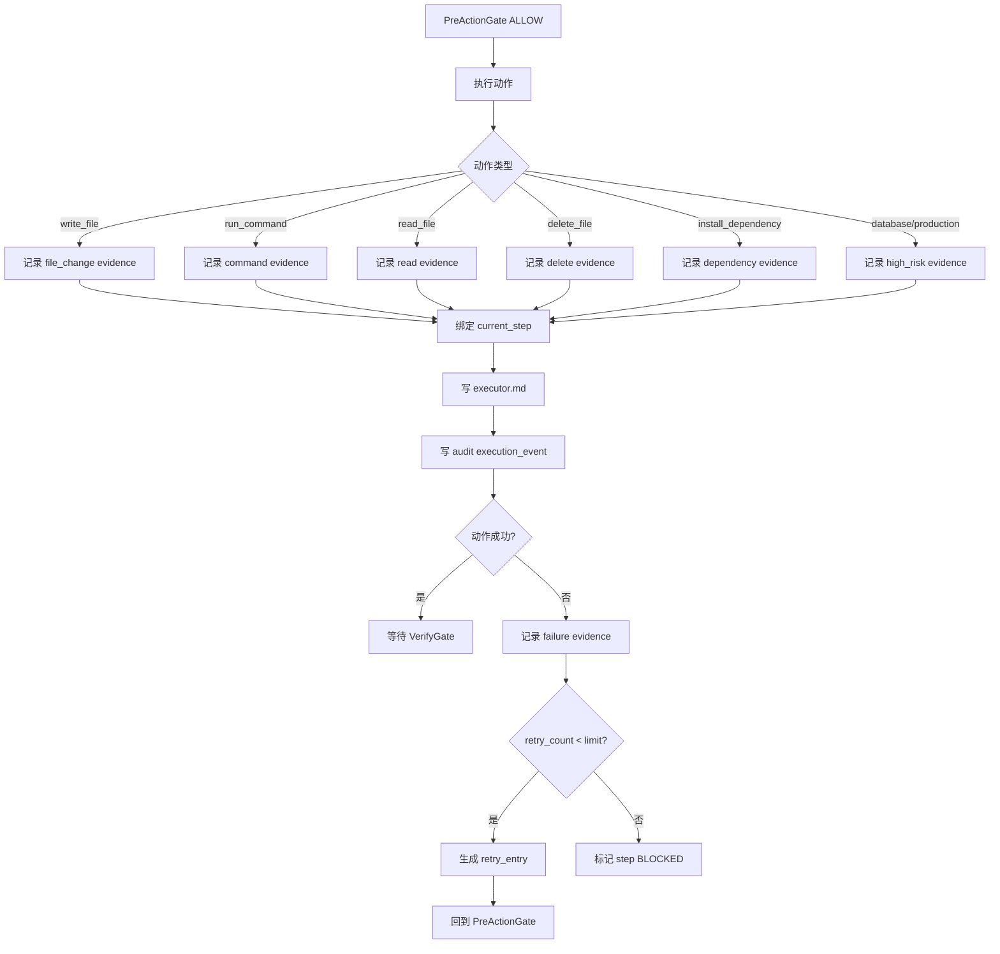
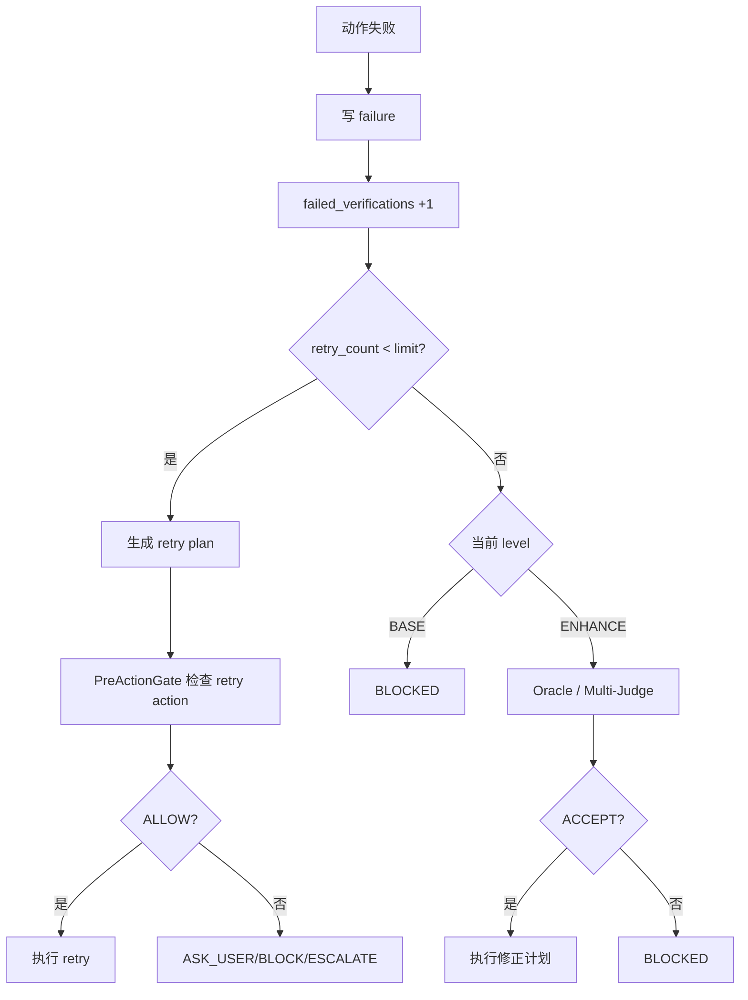

# CarrorOS 第三轮迭代：第 4/10 次

## 迭代主题：Executor Evidence Ledger 执行证据账本

本轮只处理一个问题：

```text
动作已经通过 PreActionGate 并被执行后，如何把“执行事实”记录成 VerifyGate 可裁决的证据？
```

第二轮已冻结：

```text
executor.md 是唯一证据源。
VerifyGate 未通过，不允许 plan.md 标 [x]。
软完成语不得作为完成证据。
```

第三轮第 1/10 次已定稿：

```text
IntakeGate：
  判断任务级别。
```

第三轮第 2/10 次已定稿：

```text
PlanBuilder：
  生成冻结 plan.md，每个 step 绑定 scope 与 verify。
```

第三轮第 3/10 次已定稿：

```text
PreActionGate：
  在动作执行前裁决 ALLOW / ASK_USER / BLOCK / ESCALATE。
```

本轮将 Execute 阶段的事实记录压成最终机制：

```text
Executor Evidence Ledger
```

Executor Ledger 不是新 Hook。  
它是 `Execute` 阶段的证据账本实现。

---

## 1. 本轮裁决书

**裁决等级：核准。**

Executor Evidence Ledger 的唯一职责：

```text
记录执行事实，不裁决完成。
```

它只回答：

```text
1. 做了什么？
2. 对哪些文件做了？
3. 执行了什么命令？
4. 命令 exit code 是多少？
5. 输出摘要是什么？
6. 失败原因是什么？
7. 是否发生重试？
8. 哪些证据可交给 VerifyGate？
```

它不回答：

```text
✗ step 是否完成
✗ plan 是否可以标 [x]
✗ 风险是否可接受
✗ Oracle 是否通过
✗ 是否可以扩大 scope
```

最终裁决：

```text
executor.md 记录事实。
VerifyGate 裁决完成。
两者不得合并。
```

---

## 2. 为什么需要 Executor Evidence Ledger

### 2.1 第二轮留下的证据缺口

第二轮已经明确：

```text
没验证 = 没完成
证据不足 = 阻塞
软完成语 = 降级
```

但如果执行阶段没有标准化记录，VerifyGate 会面对混乱输入：

```text
- “已经改好了”
- “测试通过了”
- “看起来正常”
- “应该没问题”
- “我修复了 auth”
```

这些不是证据。

VerifyGate 需要的是可裁决事实：

```text
command:npm test -- auth.test.ts
exit_code:0
output_tail:12 passed

file:src/auth.ts
assertion:contains expiresAt check
line:42
```

Executor Ledger 就是把执行结果压成这种格式。

---

### 2.2 为什么不让 VerifyGate 自己找证据

禁止设计：

```text
执行阶段随便写，VerifyGate 自己翻文件、猜过程、重跑命令。
```

原因：

```text
1. VerifyGate 会变成第二个执行器。
2. 证据来源不可追责。
3. compact 后上下文丢失，无法恢复执行细节。
4. 命令输出可能已消失。
5. 失败重试链无法审计。
```

正确设计：

```text
Execute 阶段产生证据。
VerifyGate 只校验证据与 plan.verify 是否匹配。
```

裁决：

```text
证据必须在执行发生时记录。
不得事后补造。
```

---

## 3. Executor Ledger 总流程图



---

## 4. 证据类型模型

Executor Ledger 只允许 7 类证据。

```text
1. command
2. file_change
3. file_assertion
4. user_confirmation
5. dependency_change
6. failure
7. retry
```

禁止证据类型：

```text
✗ thought
✗ confidence
✗ looks_good
✗ probably_fixed
✗ model_judgement
✗ oracle_guess
```

---

## 5. 证据强度等级

证据分 4 级：

```text
E3 command:
  命令、exit code、输出摘要。最强。

E2 file_assertion:
  文件、行号、断言、片段 hash。强。

E1 user_confirmation:
  用户确认的原子验收项。中。

E0 narrative:
  纯描述。不能用于 VERIFIED。
```

裁决：

```text
VerifyGate 只能使用 E3 / E2 / E1。
E0 只能作为执行备注，不得作为完成证据。
```

---

## 6. executor.md 标准结构

executor.md 必须保持追加式记录。

```markdown
# Executor

## Current Step
step: S1
status: running

## Evidence

### EV-20260705-0001
- step: S1
- type: command
- source: npm test -- auth.test.ts
- exit_code: 0
- output_tail: 12 passed in 1.4s
- evidence_level: E3
- timestamp: 2026-07-05T18:00:00Z

### EV-20260705-0002
- step: S1
- type: file_assertion
- file: src/auth.ts
- line: 42
- assertion: expired token rejects login
- snippet_hash: sha256:9a0f...
- evidence_level: E2
- timestamp: 2026-07-05T18:01:00Z

## Failures

### FAIL-20260705-0001
- step: S1
- action: command:npm test -- auth.test.ts
- exit_code: 1
- reason: missing fixture
- retryable: true
- timestamp: 2026-07-05T17:58:00Z

## Retries

### RETRY-20260705-0001
- step: S1
- from_failure: FAIL-20260705-0001
- action: add missing fixture
- result: succeeded
- timestamp: 2026-07-05T17:59:00Z
```

规则：

```text
1. executor.md 只能追加，不删除历史失败。
2. 成功证据不能覆盖失败证据。
3. failure 必须保留。
4. retry 必须引用 failure_id。
5. 每条 evidence 必须绑定 step。
```

---

## 7. 命令证据记录规则

### 7.1 command evidence 必填字段

```json
{
  "evidence_id": "EV-20260705-0001",
  "step": "S1",
  "type": "command",
  "source": "npm test -- auth.test.ts",
  "exit_code": 0,
  "output_head": "optional first lines",
  "output_tail": "12 passed in 1.4s",
  "duration_ms": 1430,
  "evidence_level": "E3",
  "timestamp": "2026-07-05T18:00:00Z"
}
```

必须记录：

```text
1. command 原文
2. exit_code
3. output_tail
4. duration_ms
5. step
6. timestamp
```

禁止记录：

```text
✗ 完整超长输出
✗ 密钥
✗ token 原文
✗ 私钥
✗ 未脱敏环境变量
```

---

### 7.2 输出截断策略

默认：

```text
output_head_chars = 1000
output_tail_chars = 2000
max_output_chars = 3000
```

Enhance context 水位 40%-70%：

```text
output_head_chars = 500
output_tail_chars = 1000
max_output_chars = 1500
```

Enhance context 水位 70%+：

```text
output_head_chars = 0
output_tail_chars = 800
max_output_chars = 800
```

理由：

```text
命令输出要足够证明结果，但不能吞掉上下文。
```

裁决：

```text
保留末尾优先。
测试结果、错误栈、summary 通常在 tail。
```

---

### 7.3 命令失败记录

失败命令不写成成功 evidence。  
必须写 failure：

```json
{
  "failure_id": "FAIL-20260705-0001",
  "step": "S1",
  "action": "command:npm test -- auth.test.ts",
  "exit_code": 1,
  "output_tail": "Expected 200, received 401",
  "reason": "test_failed",
  "retryable": true,
  "timestamp": "2026-07-05T17:58:00Z"
}
```

规则：

```text
exit_code != 0:
  写 failure
  不得写 E3 success evidence

exit_code == 0:
  写 command evidence
```

---

## 8. 文件证据记录规则

### 8.1 file_change evidence

用于记录实际修改过哪些文件。

```json
{
  "evidence_id": "EV-20260705-0002",
  "step": "S1",
  "type": "file_change",
  "file": "README.md",
  "change_summary": "updated install command",
  "before_hash": "sha256:...",
  "after_hash": "sha256:...",
  "evidence_level": "E2",
  "timestamp": "2026-07-05T18:02:00Z"
}
```

注意：

```text
file_change 证明文件变了。
file_change 不一定证明 step 完成。
```

VerifyGate 仍需匹配 plan.verify。

---

### 8.2 file_assertion evidence

用于记录可定位断言。

```json
{
  "evidence_id": "EV-20260705-0003",
  "step": "S1",
  "type": "file_assertion",
  "file": "src/auth.ts",
  "line": 42,
  "assertion": "expired token rejects login",
  "snippet_hash": "sha256:...",
  "evidence_level": "E2",
  "timestamp": "2026-07-05T18:03:00Z"
}
```

规则：

```text
1. 必须有 file。
2. 最好有 line。
3. 必须有 assertion。
4. snippet 只存 hash 或短摘要。
5. 敏感文件不得记录原文片段。
```

---

## 9. 用户确认记录规则

用户确认可作为 E1，但必须是原子验收项。

合格：

```json
{
  "evidence_id": "EV-20260705-0004",
  "step": "S2",
  "type": "user_confirmation",
  "confirmation": "用户确认登录按钮文案为“继续登录”",
  "scope": "ui_text",
  "evidence_level": "E1",
  "timestamp": "2026-07-05T18:05:00Z"
}
```

不合格：

```text
✗ 用户说“可以”
✗ 用户说“继续”
✗ 用户说“你看着办”
✗ 用户说“应该没问题”
```

裁决：

```text
模糊用户语句只能写 User Decisions。
不得写 user_confirmation evidence。
```

---

## 10. 失败与重试机制

### 10.1 失败分类

失败类型固定为：

```text
test_failed
lint_failed
build_failed
file_not_found
scope_violation
permission_denied
dependency_missing
command_not_found
pre_action_blocked
unknown_failure
```

禁止：

```text
✗ failed
✗ error
✗ bad
✗ something_wrong
```

---

### 10.2 重试上限

继承第二轮裁决：

```text
同一 step 连续修复失败 >= 3:
  BLOCKED 或 ESCALATE
```

BASE：

```text
retry_limit_per_step = 2
第 3 次失败：BLOCKED
```

ENHANCE：

```text
retry_limit_per_step = 3
第 3 次失败：触发 Oracle / Multi-Judge 条件复核
```

理由：

```text
无限重试会制造熵增。
失败次数是复杂度真实信号。
```

---

### 10.3 重试流程图



---

## 11. audit execution_event

Executor Ledger 每次写证据时，必须同步 audit。

```json
{
  "event_type": "execution_event",
  "timestamp": "2026-07-05T18:10:00Z",
  "task_id": "task_0001",
  "level": "L1_BASE",
  "phase": "execute",
  "current_step": "S1",
  "actor": "model",
  "action": "record_evidence",
  "paths": [".omc/docs/executor.md"],
  "decision": "RECORDED",
  "reason": "command_exit_0",
  "evidence": {
    "type": "command",
    "source": "npm test -- auth.test.ts",
    "exit_code": 0,
    "summary": "12 passed in 1.4s"
  },
  "risk": "low"
}
```

敏感信息规则：

```text
1. audit 不记录完整输出。
2. audit 不记录敏感路径原文。
3. audit 不记录密钥。
4. audit 只记录 evidence summary。
```

---

## 12. Executor Ledger 与 VerifyGate 的接口

VerifyGate 只读取标准 evidence。

接口字段：

```text
step
type
source/file/assertion/confirmation
exit_code
evidence_level
timestamp
```

VerifyGate 匹配规则：

```text
plan.verify: command:npm test -- auth.test.ts
  匹配 executor evidence:
    type=command
    source=npm test -- auth.test.ts
    exit_code=0

plan.verify: file:README.md contains "npm install"
  匹配 executor evidence:
    type=file_assertion
    file=README.md
    assertion=contains "npm install"

plan.verify: user:确认 UI 文案
  匹配 executor evidence:
    type=user_confirmation
    confirmation contains atomic acceptance item
```

裁决：

```text
executor.md 有记录，不等于完成。
executor.md 有匹配证据，VerifyGate 才可裁决 VERIFIED。
```

---

## 13. Executor Ledger 核心代码

以下代码只依赖 Python 3.10+ 标准库，兼容 Mac / Windows / WSL2。

```python
#!/usr/bin/env python3
"""
CarrorOS Executor Evidence Ledger
Purpose:
  Append execution facts to executor.md and audit JSONL.

Constraints:
  - Python 3.10+ standard library only
  - Records facts, does not decide completion
  - Redacts sensitive output
  - Append-only ledger
"""

from __future__ import annotations

import hashlib
import json
import re
import sys
from dataclasses import dataclass, asdict
from datetime import datetime, timezone
from pathlib import Path
from typing import Any


DEFAULT_LIMITS = {
    "normal": {
        "output_head_chars": 1000,
        "output_tail_chars": 2000,
        "max_output_chars": 3000,
    },
    "mid_context": {
        "output_head_chars": 500,
        "output_tail_chars": 1000,
        "max_output_chars": 1500,
    },
    "high_context": {
        "output_head_chars": 0,
        "output_tail_chars": 800,
        "max_output_chars": 800,
    },
}

SECRET_PATTERNS = [
    r"(?i)(api[_-]?key|token|secret|password)\s*[:=]\s*['\"]?[^'\"\s]+",
    r"-----BEGIN [A-Z ]*PRIVATE KEY-----.*?-----END [A-Z ]*PRIVATE KEY-----",
    r"(?i)authorization:\s*bearer\s+[a-z0-9._\-]+",
]


@dataclass
class Evidence:
    evidence_id: str
    step: str
    type: str
    evidence_level: str
    timestamp: str
    source: str | None = None
    exit_code: int | None = None
    output_head: str | None = None
    output_tail: str | None = None
    duration_ms: int | None = None
    file: str | None = None
    line: int | None = None
    assertion: str | None = None
    snippet_hash: str | None = None
    change_summary: str | None = None
    before_hash: str | None = None
    after_hash: str | None = None
    confirmation: str | None = None
    scope: str | None = None


@dataclass
class Failure:
    failure_id: str
    step: str
    action: str
    exit_code: int | None
    reason: str
    retryable: bool
    timestamp: str
    output_tail: str | None = None


def now_iso() -> str:
    return datetime.now(timezone.utc).replace(microsecond=0).isoformat()


def event_id(prefix: str) -> str:
    stamp = datetime.now(timezone.utc).strftime("%Y%m%d%H%M%S")
    return f"{prefix}-{stamp}"


def read_json(path: Path, default: dict[str, Any] | None = None) -> dict[str, Any]:
    if not path.exists():
        return default or {}
    with path.open("r", encoding="utf-8") as f:
        return json.load(f)


def write_json(path: Path, data: dict[str, Any]) -> None:
    path.parent.mkdir(parents=True, exist_ok=True)
    tmp = path.with_suffix(path.suffix + ".tmp")
    with tmp.open("w", encoding="utf-8") as f:
        json.dump(data, f, ensure_ascii=False, indent=2, sort_keys=True)
        f.write("\n")
    tmp.replace(path)


def append_text(path: Path, text: str) -> None:
    path.parent.mkdir(parents=True, exist_ok=True)
    with path.open("a", encoding="utf-8") as f:
        f.write(text)


def sha256_text(value: str) -> str:
    return "sha256:" + hashlib.sha256(value.encode("utf-8")).hexdigest()


def redact_secrets(text: str) -> str:
    redacted = text
    for pattern in SECRET_PATTERNS:
        redacted = re.sub(pattern, "[REDACTED]", redacted, flags=re.DOTALL)
    return redacted


def truncate_output(output: str, mode: str = "normal") -> tuple[str | None, str | None]:
    limits = DEFAULT_LIMITS.get(mode, DEFAULT_LIMITS["normal"])
    clean = redact_secrets(output)

    max_chars = limits["max_output_chars"]
    if len(clean) > max_chars:
        clean = clean[: limits["output_head_chars"]] + "\n...[truncated]...\n" + clean[-limits["output_tail_chars"] :]

    head_chars = limits["output_head_chars"]
    tail_chars = limits["output_tail_chars"]

    output_head = clean[:head_chars] if head_chars > 0 else None
    output_tail = clean[-tail_chars:] if tail_chars > 0 else None
    return output_head, output_tail


def infer_evidence_level(evidence_type: str) -> str:
    if evidence_type == "command":
        return "E3"
    if evidence_type in ("file_change", "file_assertion", "dependency_change"):
        return "E2"
    if evidence_type == "user_confirmation":
        return "E1"
    return "E0"


def validate_evidence(evidence: Evidence) -> list[str]:
    errors: list[str] = []

    if not evidence.step:
        errors.append("missing_step")
    if evidence.type not in (
        "command",
        "file_change",
        "file_assertion",
        "user_confirmation",
        "dependency_change",
    ):
        errors.append("invalid_evidence_type")

    if evidence.type == "command":
        if evidence.source is None:
            errors.append("command_missing_source")
        if evidence.exit_code is None:
            errors.append("command_missing_exit_code")

    if evidence.type == "file_assertion":
        if not evidence.file:
            errors.append("file_assertion_missing_file")
        if not evidence.assertion:
            errors.append("file_assertion_missing_assertion")

    if evidence.type == "file_change":
        if not evidence.file:
            errors.append("file_change_missing_file")
        if not evidence.change_summary:
            errors.append("file_change_missing_summary")

    if evidence.type == "user_confirmation":
        if not evidence.confirmation:
            errors.append("user_confirmation_missing_text")
        vague = ["可以", "继续", "都行", "你看着办", "应该没问题"]
        if evidence.confirmation and evidence.confirmation.strip() in vague:
            errors.append("user_confirmation_not_atomic")

    return errors


def render_evidence_md(evidence: Evidence) -> str:
    lines = [
        f"\n### {evidence.evidence_id}",
        f"- step: {evidence.step}",
        f"- type: {evidence.type}",
        f"- evidence_level: {evidence.evidence_level}",
        f"- timestamp: {evidence.timestamp}",
    ]

    for key, value in asdict(evidence).items():
        if key in ("evidence_id", "step", "type", "evidence_level", "timestamp"):
            continue
        if value is not None:
            safe_value = str(value).replace("\n", "\\n")
            lines.append(f"- {key}: {safe_value}")

    return "\n".join(lines) + "\n"


def render_failure_md(failure: Failure) -> str:
    lines = [
        f"\n### {failure.failure_id}",
        f"- step: {failure.step}",
        f"- action: {failure.action}",
        f"- exit_code: {failure.exit_code}",
        f"- reason: {failure.reason}",
        f"- retryable: {str(failure.retryable).lower()}",
        f"- timestamp: {failure.timestamp}",
    ]
    if failure.output_tail:
        lines.append(f"- output_tail: {failure.output_tail.replace(chr(10), '\\n')}")
    return "\n".join(lines) + "\n"


def ensure_executor_sections(path: Path) -> None:
    if path.exists():
        return
    append_text(
        path,
        "# Executor\n\n"
        "## Current Step\n"
        "step: <unset>\n"
        "status: running\n\n"
        "## Evidence\n\n"
        "## Failures\n\n"
        "## Retries\n",
    )


def append_evidence(executor_path: Path, evidence: Evidence) -> None:
    errors = validate_evidence(evidence)
    if errors:
        raise ValueError("invalid evidence: " + ", ".join(errors))

    ensure_executor_sections(executor_path)
    append_text(executor_path, render_evidence_md(evidence))


def append_failure(executor_path: Path, failure: Failure) -> None:
    ensure_executor_sections(executor_path)
    append_text(executor_path, "\n## Failure Entry\n")
    append_text(executor_path, render_failure_md(failure))


def update_token_failure(token_path: Path, reason: str) -> None:
    token = read_json(token_path, {})
    token.setdefault("task", {})
    token["task"]["failed_verifications"] = int(token["task"].get("failed_verifications", 0)) + 1
    token["task"]["last_failure"] = reason
    write_json(token_path, token)


def write_audit(
    token: dict[str, Any],
    event_type: str,
    action: str,
    reason: str,
    evidence_summary: dict[str, Any],
    risk: str = "low",
) -> None:
    audit_dir = Path(".omc/audit")
    audit_dir.mkdir(parents=True, exist_ok=True)
    path = audit_dir / f"{datetime.now(timezone.utc).strftime('%Y%m%d')}.jsonl"

    event = {
        "event_type": event_type,
        "timestamp": now_iso(),
        "task_id": token.get("task", {}).get("id", "unknown_task"),
        "level": token.get("session", {}).get("level", "unknown_level"),
        "phase": "execute",
        "current_step": token.get("task", {}).get("current_step"),
        "actor": "model",
        "action": action,
        "paths": [".omc/docs/executor.md"],
        "decision": "RECORDED",
        "reason": reason,
        "evidence": evidence_summary,
        "risk": risk,
    }

    with path.open("a", encoding="utf-8") as f:
        f.write(json.dumps(event, ensure_ascii=False, sort_keys=True) + "\n")


def record_command(payload: dict[str, Any], mode: str) -> int:
    token = read_json(Path(".omc/state/token.json"), {})
    output = payload.get("output", "")
    head, tail = truncate_output(output, mode)

    step = payload["step"]
    command = payload["command"]
    exit_code = int(payload["exit_code"])

    if exit_code != 0:
        failure = Failure(
            failure_id=event_id("FAIL"),
            step=step,
            action=f"command:{command}",
            exit_code=exit_code,
            reason=payload.get("reason", "test_failed"),
            retryable=bool(payload.get("retryable", True)),
            timestamp=now_iso(),
            output_tail=tail,
        )
        append_failure(Path(".omc/docs/executor.md"), failure)
        update_token_failure(Path(".omc/state/token.json"), failure.reason)
        write_audit(
            token,
            "execution_event",
            "record_failure",
            failure.reason,
            {
                "type": "failure",
                "source": command,
                "exit_code": exit_code,
                "summary": tail,
            },
            risk="medium",
        )
        return 1

    evidence = Evidence(
        evidence_id=event_id("EV"),
        step=step,
        type="command",
        evidence_level="E3",
        timestamp=now_iso(),
        source=command,
        exit_code=exit_code,
        output_head=head,
        output_tail=tail,
        duration_ms=payload.get("duration_ms"),
    )
    append_evidence(Path(".omc/docs/executor.md"), evidence)
    write_audit(
        token,
        "execution_event",
        "record_evidence",
        "command_exit_0",
        {
            "type": "command",
            "source": command,
            "exit_code": exit_code,
            "summary": tail,
        },
    )
    return 0


def record_file_assertion(payload: dict[str, Any]) -> int:
    token = read_json(Path(".omc/state/token.json"), {})
    snippet = payload.get("snippet", "")

    evidence = Evidence(
        evidence_id=event_id("EV"),
        step=payload["step"],
        type="file_assertion",
        evidence_level="E2",
        timestamp=now_iso(),
        file=payload["file"],
        line=payload.get("line"),
        assertion=payload["assertion"],
        snippet_hash=sha256_text(snippet) if snippet else payload.get("snippet_hash"),
    )
    append_evidence(Path(".omc/docs/executor.md"), evidence)
    write_audit(
        token,
        "execution_event",
        "record_evidence",
        "file_assertion_recorded",
        {
            "type": "file_assertion",
            "file": payload["file"],
            "assertion": payload["assertion"],
        },
    )
    return 0


def record_file_change(payload: dict[str, Any]) -> int:
    token = read_json(Path(".omc/state/token.json"), {})
    evidence = Evidence(
        evidence_id=event_id("EV"),
        step=payload["step"],
        type="file_change",
        evidence_level="E2",
        timestamp=now_iso(),
        file=payload["file"],
        change_summary=payload["change_summary"],
        before_hash=payload.get("before_hash"),
        after_hash=payload.get("after_hash"),
    )
    append_evidence(Path(".omc/docs/executor.md"), evidence)
    write_audit(
        token,
        "execution_event",
        "record_evidence",
        "file_change_recorded",
        {
            "type": "file_change",
            "file": payload["file"],
            "summary": payload["change_summary"],
        },
    )
    return 0


def record_user_confirmation(payload: dict[str, Any]) -> int:
    token = read_json(Path(".omc/state/token.json"), {})
    evidence = Evidence(
        evidence_id=event_id("EV"),
        step=payload["step"],
        type="user_confirmation",
        evidence_level="E1",
        timestamp=now_iso(),
        confirmation=payload["confirmation"],
        scope=payload.get("scope"),
    )
    append_evidence(Path(".omc/docs/executor.md"), evidence)
    write_audit(
        token,
        "execution_event",
        "record_evidence",
        "user_confirmation_recorded",
        {
            "type": "user_confirmation",
            "summary": payload["confirmation"],
        },
    )
    return 0


def main() -> int:
    if len(sys.argv) < 3:
        print(
            "usage: executor_ledger.py <command|file_assertion|file_change|user_confirmation> payload.json [mode]",
            file=sys.stderr,
        )
        return 2

    kind = sys.argv[1]
    payload_path = Path(sys.argv[2])
    mode = sys.argv[3] if len(sys.argv) >= 4 else "normal"

    payload = read_json(payload_path)

    if kind == "command":
        return record_command(payload, mode)
    if kind == "file_assertion":
        return record_file_assertion(payload)
    if kind == "file_change":
        return record_file_change(payload)
    if kind == "user_confirmation":
        return record_user_confirmation(payload)

    print(f"unsupported evidence kind: {kind}", file=sys.stderr)
    return 2


if __name__ == "__main__":
    raise SystemExit(main())
```

---

## 14. 示例：记录成功命令

输入 payload：

```json
{
  "step": "S1",
  "command": "npm test -- auth.test.ts",
  "exit_code": 0,
  "output": "PASS auth.test.ts\n12 passed in 1.4s",
  "duration_ms": 1430
}
```

命令：

```bash
./executor_ledger.py command command_payload.json
```

写入 executor.md：

```markdown
### EV-20260705180000
- step: S1
- type: command
- evidence_level: E3
- timestamp: 2026-07-05T18:00:00Z
- source: npm test -- auth.test.ts
- exit_code: 0
- output_head: PASS auth.test.ts\n12 passed in 1.4s
- output_tail: PASS auth.test.ts\n12 passed in 1.4s
- duration_ms: 1430
```

裁决：

```text
这是 E3 证据。
VerifyGate 可用于匹配 command verify。
```

---

## 15. 示例：记录失败命令

输入 payload：

```json
{
  "step": "S1",
  "command": "npm test -- auth.test.ts",
  "exit_code": 1,
  "output": "FAIL auth.test.ts\nExpected 200, received 401",
  "reason": "test_failed",
  "retryable": true
}
```

输出：

```markdown
## Failure Entry

### FAIL-20260705175800
- step: S1
- action: command:npm test -- auth.test.ts
- exit_code: 1
- reason: test_failed
- retryable: true
- timestamp: 2026-07-05T17:58:00Z
- output_tail: FAIL auth.test.ts\nExpected 200, received 401
```

裁决：

```text
这是 failure，不是完成证据。
不得用于 plan.md 标 [x]。
```

---

## 16. 示例：记录文件断言

输入 payload：

```json
{
  "step": "S1",
  "file": "src/auth.ts",
  "line": 42,
  "assertion": "expired token rejects login",
  "snippet": "if (token.expiresAt < now) return reject();"
}
```

写入：

```markdown
### EV-20260705180300
- step: S1
- type: file_assertion
- evidence_level: E2
- timestamp: 2026-07-05T18:03:00Z
- file: src/auth.ts
- line: 42
- assertion: expired token rejects login
- snippet_hash: sha256:...
```

裁决：

```text
这是 E2 证据。
VerifyGate 可用于 file/assertion verify。
```

---

## 17. 设计优缺点

### 17.1 优点

```text
1. 执行事实与完成裁决彻底分离。
2. VerifyGate 获得稳定输入。
3. compact 后仍可恢复执行历史。
4. 失败和重试不会被覆盖。
5. 命令输出有统一截断规则。
6. 敏感内容有脱敏边界。
7. BASE 可低成本记录证据。
8. ENHANCE 可在高风险任务中形成完整审计链。
```

---

### 17.2 缺点

```text
1. executor.md 会持续增长。
2. 每次执行后都要记录，增加流程成本。
3. 证据 schema 需要严格维护。
4. 对小任务显得偏重。
5. 如果模型忘记记录证据，VerifyGate 会 BLOCKED。
6. 输出截断可能丢失部分诊断信息。
```

---

### 17.3 取舍裁决

```text
CarrorOS 接受 executor.md 增长。
证据缺失比文档增长更危险。
执行账本是 VerifyGate 的地基，必须保留。
```

---

## 18. 场景适配

### 18.1 文档修改

```text
Plan:
  verify: file:README.md contains "npm install"

Executor Ledger:
  file_change README.md
  file_assertion README.md contains "npm install"

VerifyGate:
  匹配 file_assertion 后 VERIFIED
```

---

### 18.2 单元测试修复

```text
Plan:
  verify: command:npm test -- auth.test.ts

Executor Ledger:
  command npm test -- auth.test.ts exit=1 -> failure
  retry 修复 fixture
  command npm test -- auth.test.ts exit=0 -> E3 evidence

VerifyGate:
  使用 exit=0 的 E3 evidence 裁决 VERIFIED
```

---

### 18.3 UI 文案确认

```text
Plan:
  verify: user:用户确认按钮文案

Executor Ledger:
  user_confirmation:
    用户确认登录按钮文案为“继续登录”

VerifyGate:
  可接受 E1，但不得接受“可以了”
```

---

### 18.4 高风险鉴权重构

```text
Plan:
  P3.S1 verify: command:npm test -- auth.test.ts
  oracle: phase_end

Executor Ledger:
  command evidence
  file_assertion evidence
  failure/retry chain

VerifyGate:
  先裁决 step evidence

Oracle:
  只在 VerifyGate 后做复核，不替代证据
```

---

## 19. 与上下文管理的关系

Executor Ledger 必须适配 Compact 策略。

第二轮稳定规则：

```text
Base compact:
  15/20 轮数驱动

Enhance compact:
  70%/85% 水位驱动
  无可观测 token 来源则降级 Base

State injection:
  Enhance only，每 5 轮，最小状态块
```

本轮补充：

```text
Base:
  每个 step 结束必须同步 executor.md。
  每次 failure 必须立即同步 executor.md。

Enhance:
  40%-70% 水位：工具输出截断从 3000 降到 1500 chars。
  70%+ 水位：工具输出截断到 800 chars，完成当前 step 后停止。
```

原因：

```text
executor.md 是 compact 后恢复事实的主要来源。
上下文越高，越不能依赖聊天窗口记忆。
```

---

## 20. 与后续 VerifyGate 的边界

```text
Executor Ledger:
  记录证据。

VerifyGate:
  校验证据是否满足 plan.verify。
```

禁止：

```text
✗ executor.md 写“完成”后直接标 plan [x]
✗ command exit=1 被解释成完成
✗ file_change 被当成 file_assertion
✗ failure 被删除
✗ retry 成功后删除 retry 前失败
```

裁决：

```text
执行事实可以很多。
完成裁决只能一个。
完成裁决属于 VerifyGate。
```

---

## 21. 本轮最终规则

```text
1. Executor Ledger 是 Execute 阶段的唯一证据账本实现。
2. executor.md 追加式记录，不得删除失败历史。
3. evidence 必须绑定 step。
4. command evidence 必须包含 command、exit_code、output_tail。
5. exit_code != 0 必须写 failure，不得写成功 evidence。
6. file_change 不等于完成证据。
7. file_assertion 必须包含 file 与 assertion。
8. 用户确认必须是原子验收项。
9. 模糊用户语句不得作为 evidence。
10. retry 必须引用 failure。
11. 同一 step 连续失败达到上限必须 BLOCKED 或 ESCALATE。
12. audit 只写摘要，不写密钥、不写完整输出。
13. Executor Ledger 不得裁决 step 完成。
14. VerifyGate 只能读取标准 evidence。
```

---

## 22. 下一轮迭代范围

第 5/10 次只处理：

```text
VerifyGate：
- 如何解析 plan.md verify 规则
- 如何读取 executor.md evidence
- command/file/user 三类验证如何匹配
- 软完成语如何拦截
- VERIFIED / WARN / BLOCKED / REJECTED 如何裁决
- plan.md 如何被安全标 [x]
- 输出 verify_gate.py 核心代码
```

不处理：

```text
- Compact / Resume 细节
- Oracle / Meta-Oracle 细节
- Fallback 细节
- CLI 集成细节
```

**第 4/10 次结论**：

```text
Executor Evidence Ledger 定稿。
CarrorOS 的 Execute 阶段从“执行描述”升级为“证据账本”。
下一轮进入 VerifyGate，把证据账本转化为完成裁决。
```