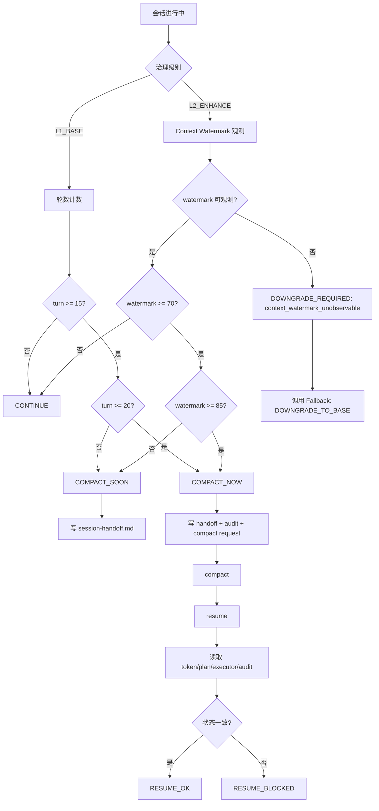

可以。依据现在已经定稿的 7.md Oracle、8.md Fallback、9.md CLI、10.md Archive，以及 README / AGENTS 的路径与铁律口径，**6.md 应该是 Context Engine / Compact / Resume / State Injection 这一轮**。它在链路中位于：

```text
VerifyGate → Context Engine → Oracle
```

下面给你一版可直接补入的 **6.md 调整后 / 优化后的完整版本**。

---

# CarrorOS 第三轮迭代：第 6/10 次（优化版）

## 迭代主题：Context Engine 上下文水位、压缩恢复与状态注入

本轮只处理一个问题：

```text
当任务跨越长上下文、compact、resume、模型切换或会话恢复时，
CarrorOS 如何保证不会凭记忆续接、不会丢失治理状态、不会跳过 VerifyGate？
```

第二轮最终裁决已冻结：

```text
最终治理形态：
  Plan → Execute → Verify → Archive

前置安全门：
  PreActionGate

后置完成门：
  VerifyGate

状态四件套：
  token.json
  plan.md
  executor.md
  session-handoff.md
```

第三轮第 1-5 次已定稿：

```text
IntakeGate
PlanBuilder
PreActionGate
Executor Ledger
VerifyGate
```

本轮将长上下文治理压成最终机制：

```text
Context Engine
```

Context Engine 不是完成门。  
Context Engine 是状态连续性、安全压缩、恢复重建与最小状态注入层。

---

## 1. 本轮裁决书

**裁决等级：核准。**

Context Engine 的唯一职责：

```text
在 compact / resume / long-running session / model switch 期间，
保持 CarrorOS 治理状态连续、可恢复、可审计。
```

Context Engine 只回答：

```text
1. 当前上下文是否接近 compact 阈值？
2. 是否需要写 session-handoff.md？
3. compact 前必须保留哪些最小状态？
4. resume 后如何恢复 token / plan / executor / audit？
5. L2_ENHANCE 是否可以使用 watermark compact？
6. watermark 不可观测时是否必须降级 L1_BASE？
7. 状态注入应该注入什么，禁止注入什么？
```

Context Engine 不回答：

```text
✗ step 是否完成
✗ plan.md 是否可以标 [x]
✗ executor evidence 是否有效
✗ Oracle 是否 ACCEPT
✗ Fallback 是否可忽略
✗ Archive 是否可归档
```

允许输出：

```text
CONTINUE
COMPACT_SOON
COMPACT_NOW
RESUME_OK
RESUME_BLOCKED
DOWNGRADE_REQUIRED
```

禁止输出：

```text
✗ DONE
✗ VERIFIED
✗ ACCEPTED
✗ TRUSTED_MEMORY
✗ SKIP_VERIFY
✗ RESUME_FROM_CHAT_ONLY
```

最终裁决：

```text
Context Engine 只维护状态连续性。
Context Engine 不制造完成事实。
```

---

## 2. 与 README / AGENTS 对齐

### 2.1 路径对齐

README 定义任务系统：

```text
.omc/tasks/{date}/{task_name}/[
  research.md
  plan.md
  executor.md
  sub_tasks/
  state/
]
```

token 系统：

```text
.omc/tokens/{date}/{task_name}.json
```

因此 Context Engine 统一使用：

```text
任务文档：
  .omc/tasks/{date}/{task_name}/plan.md
  .omc/tasks/{date}/{task_name}/executor.md
  .omc/tasks/{date}/{task_name}/state/session-handoff.md

任务状态：
  .omc/tasks/{date}/{task_name}/state/context-state.json

任务令牌：
  .omc/tokens/{date}/{task_name}.json

审计：
  .omc/audit/{date}.jsonl
```

兼容说明：

```text
旧路径 .omc/state/token.json / .omc/docs/*.md 可读。
新规范不得继续写入旧路径作为主路径。
```

---

### 2.2 与 AGENTS 铁律对齐

Context Engine 必须遵守：

```text
1. 不编造：
   resume 后不得凭聊天记忆补状态。
   token / plan / executor / audit 缺失时必须 BLOCKED 或要求重建。

2. 证据门禁：
   handoff 不得作为 VerifyGate evidence。
   compact summary 不得作为 step completion evidence。

3. 范围冻结：
   resume 不得扩大 scope。
   compact 不得丢失 scope freeze。

4. 隐私防线：
   handoff 不得写密钥、完整 prompt、未脱敏日志。

5. 不假完成：
   compact / resume 不得标记 plan.md [x]。

6. 不自改治理：
   Context Engine 不得自动修改 AGENTS.md / README.md / kernel.md。
```

---

## 3. Context Engine 总流程



---

## 4. L1 / L2 compact 策略

### 4.1 L1_BASE

L1 使用轮数驱动 compact：

```text
soft threshold: 15 turns
hard threshold: 20 turns
```

语义：

```text
turn < 15:
  CONTINUE

15 <= turn < 20:
  COMPACT_SOON
  必须刷新 session-handoff.md

turn >= 20:
  COMPACT_NOW
  必须写 handoff + audit
```

L1 不依赖：

```text
Context Watermark
OpenCode SQLite
Oracle
State Injection
```

---

### 4.2 L2_ENHANCE

L2 使用 context watermark 驱动 compact：

```text
soft threshold: 70%
hard threshold: 85%
```

语义：

```text
watermark < 70:
  CONTINUE

70 <= watermark < 85:
  COMPACT_SOON
  必须刷新 session-handoff.md

watermark >= 85:
  COMPACT_NOW
  必须写 handoff + audit
```

L2 依赖：

```text
Context Watermark
State Injection
Oracle 状态保留
error-dna 状态保留
```

如果 watermark 不可观测：

```text
DOWNGRADE_REQUIRED
failure_type = context_watermark_unobservable
调用 Fallback Protocol
```

裁决：

```text
无 watermark 不等于不能继续。
无 watermark 意味着不能继续 L2_ENHANCE。
```

---

## 5. session-handoff.md 标准结构

路径：

```text
.omc/tasks/{date}/{task_name}/state/session-handoff.md
```

用途：

```text
compact / resume 前后的最小恢复摘要。
```

标准模板：

```markdown
# Session Handoff

## Task
- id: task_0001
- name: auth-token-refactor
- level: L2_ENHANCE
- status: active
- current_step: P2.S3

## Goal
重构 auth token 鉴权链路

## Scope Freeze
- src/auth.ts
- middleware/auth.ts
- tests/auth.test.ts

## Progress
- total_steps: 8
- verified_steps: 5
- pending_step: P2.S3

## Last Verified Evidence
- P2.S2: npm test -- auth.test.ts exit=0

## Current Work
- step: P2.S3
- intent: 补充 permission fallback 测试
- files_in_scope:
  - tests/auth.test.ts

## Risks
- auth_change
- permission_change

## Context
- compact_strategy: watermark
- context_watermark: 72
- compact_status: COMPACT_SOON

## Oracle
- last_verdict: WARN
- residual_risk:
  - role mismatch regression not fully covered

## Fallback
- unresolved: false
- last_event: none

## Resume Instructions
- read token first
- read plan second
- read executor tail third
- do not mark any step complete without VerifyGate
```

禁止写入：

```text
✗ chain-of-thought
✗ 完整 prompt
✗ 未脱敏命令日志
✗ API key
✗ cookie
✗ private key
✗ “我记得已经完成”
```

裁决：

```text
session-handoff 是恢复摘要。
不是状态真相源。
```

---

## 6. Resume 恢复顺序

Resume 必须按固定顺序读取：

```text
1. token
2. session-handoff.md
3. plan.md
4. executor.md tail
5. audit tail
6. oracle-verdicts.md（L2 only）
7. error-dna.json（L2 only）
8. fallback_event tail
```

禁止：

```text
✗ 先读聊天历史再恢复状态
✗ 只看 handoff 就继续
✗ 只看 plan.md [x] 就认为已验证
✗ 忽略 audit
✗ 忽略 fallback_event
```

Resume 成功条件：

```text
1. token 存在。
2. plan.md 存在。
3. executor.md 存在。
4. token.current_step 与 plan 第一个 pending step 一致。
5. token.stats.done 与 plan.md [x] 数量一致。
6. token.stats.total 与 plan step 总数一致。
7. executor.md 至少覆盖最近 verified step 的 evidence。
8. audit tail 不存在 unresolved BLOCKED / ASK_USER。
9. L2 若有 Oracle WARN，residual_risk 已保留。
```

失败处理：

```text
RESUME_BLOCKED
failure_type = resume_state_unrecoverable
交给 Fallback Protocol
```

---

## 7. State Injection

State Injection 只属于 L2_ENHANCE。

触发频率：

```text
每 5 轮最多一次
compact 前必须一次
resume 后必须一次
```

注入内容必须最小化：

```text
1. task_id
2. level
3. current_step
4. status
5. pending step
6. verified count
7. compact status
8. unresolved fallback
9. latest Oracle verdict
10. residual_risk
```

推荐格式：

```text
[CarrorOS State]
task_id=task_0001
level=L2_ENHANCE
status=active
current_step=P2.S3
verified=5/8
compact=COMPACT_SOON watermark=72
fallback=none
oracle_last=WARN residual_risk=1
rule=do_not_mark_step_done_without_VerifyGate
```

禁止注入：

```text
✗ 完整 executor.md
✗ 完整 audit
✗ 完整 prompt
✗ 隐私原文
✗ 密钥
✗ 大段代码
✗ 模型思维链
```

裁决：

```text
State Injection 是最小状态提醒。
不是证据，也不是完成裁决。
```

---

## 8. context-state.json

路径：

```text
.omc/tasks/{date}/{task_name}/state/context-state.json
```

用途：

```text
记录 compact / resume / state injection 的可审计状态。
```

模板：

```json
{
  "task_id": "task_0001",
  "task_name": "auth-token-refactor",
  "level": "L2_ENHANCE",
  "compact_strategy": "watermark",
  "turn": 14,
  "context_watermark": 72,
  "compact_status": "COMPACT_SOON",
  "last_handoff_at": "2026-07-06T20:00:00Z",
  "last_state_injection_at": "2026-07-06T20:05:00Z",
  "resume": {
    "last_resume_at": "2026-07-06T20:10:00Z",
    "last_resume_status": "RESUME_OK"
  }
}
```

硬规则：

```text
context-state.json 不得替代 token。
context-state.json 不得作为 VerifyGate evidence。
```

---

## 9. audit 事件

Context Engine 必须写 audit：

### compact_event

```json
{
  "event_type": "context_compact",
  "timestamp": "2026-07-06T20:00:00Z",
  "task_id": "task_0001",
  "level": "L2_ENHANCE",
  "phase": "context",
  "actor": "context_engine",
  "decision": "COMPACT_SOON",
  "compact_strategy": "watermark",
  "context_watermark": 72,
  "turn": 14,
  "current_step": "P2.S3",
  "paths": [
    ".omc/tasks/2026-07-06/auth-token-refactor/state/session-handoff.md",
    ".omc/tasks/2026-07-06/auth-token-refactor/state/context-state.json"
  ]
}
```

### resume_event

```json
{
  "event_type": "context_resume",
  "timestamp": "2026-07-06T20:10:00Z",
  "task_id": "task_0001",
  "level": "L2_ENHANCE",
  "phase": "context",
  "actor": "context_engine",
  "decision": "RESUME_OK",
  "current_step": "P2.S3",
  "source_order": [
    "token",
    "session-handoff",
    "plan",
    "executor-tail",
    "audit-tail",
    "oracle-verdicts",
    "error-dna",
    "fallback-tail"
  ]
}
```

审计失败：

```text
failure_type = audit_write_failed
交给 Fallback Protocol
```

---

## 10. 与 VerifyGate 的边界

```text
VerifyGate:
  evidence → step completion

Context Engine:
  state continuity → compact/resume safety
```

禁止：

```text
✗ handoff 作为 evidence
✗ context-state.json 作为 evidence
✗ State Injection 作为 evidence
✗ compact summary 作为 evidence
✗ resume 后自动标 [x]
```

裁决：

```text
Context Engine 只保证“能安全继续”。
VerifyGate 才能判断“已经完成”。
```

---

## 11. 与 Oracle 的关系

Context Engine 必须为 L2 保留 Oracle 状态：

```text
1. latest Oracle verdict
2. residual_risk
3. required_action
4. error-dna patterns
5. oracle-review-pack 路径
6. final_acceptance 是否已完成
```

handoff 必须摘要：

```text
- 最近 Oracle verdict
- residual_risk 数量或摘要
- required_action
- error-dna patterns
```

禁止：

```text
✗ 把 Oracle ACCEPT 当 VerifyGate evidence
✗ 把 Oracle WARN 当完成
✗ compact 时丢失 residual_risk
✗ resume 后忘记 Oracle REJECT
```

---

## 12. 与 Fallback 的关系

Context Engine 在以下情况调用 Fallback：

```text
1. context_watermark_unobservable
2. resume_state_unrecoverable
3. audit_write_failed
4. state_conflict
5. token_missing
6. plan_missing
7. executor_missing
```

对应决策：

```text
context_watermark_unobservable:
  DOWNGRADE_TO_BASE

resume_state_unrecoverable:
  BLOCKED

audit_write_failed:
  BLOCKED

state_conflict:
  BLOCKED
```

裁决：

```text
Context Engine 不自行降级。
Context Engine 识别失效，Fallback 负责裁决。
```

---

## 13. Context Engine 核心代码

```python
#!/usr/bin/env python3
"""
CarrorOS Context Engine
Purpose:
  Manage compact / resume / state injection without creating completion facts.

Constraints:
  - Python 3.10+ standard library only
  - Does not mark plan steps done
  - Does not alter executor evidence
  - Does not replace VerifyGate / Oracle / Fallback
"""

from __future__ import annotations

import argparse
import json
import re
import sys
from dataclasses import dataclass, asdict
from datetime import datetime, timezone
from pathlib import Path
from typing import Any


@dataclass
class ContextDecision:
    decision: str
    reason: str
    task_id: str
    task_name: str
    level: str
    current_step: str | None
    compact_strategy: str
    requires_fallback: bool = False
    failure_type: str | None = None


def now_iso() -> str:
    return datetime.now(timezone.utc).replace(microsecond=0).isoformat()


def today() -> str:
    return datetime.now(timezone.utc).strftime("%Y-%m-%d")


def read_json(path: Path, default: dict[str, Any] | None = None) -> dict[str, Any]:
    if not path.exists():
        return default or {}
    with path.open("r", encoding="utf-8") as f:
        return json.load(f)


def write_json_atomic(path: Path, data: dict[str, Any]) -> None:
    path.parent.mkdir(parents=True, exist_ok=True)
    tmp = path.with_suffix(path.suffix + ".tmp")
    with tmp.open("w", encoding="utf-8") as f:
        json.dump(data, f, ensure_ascii=False, indent=2, sort_keys=True)
        f.write("\n")
    tmp.replace(path)


def read_text(path: Path) -> str:
    if not path.exists():
        return ""
    return path.read_text(encoding="utf-8")


def write_text(path: Path, text: str) -> None:
    path.parent.mkdir(parents=True, exist_ok=True)
    path.write_text(text, encoding="utf-8")


def append_jsonl(path: Path, event: dict[str, Any]) -> None:
    path.parent.mkdir(parents=True, exist_ok=True)
    with path.open("a", encoding="utf-8") as f:
        f.write(json.dumps(event, ensure_ascii=False, sort_keys=True) + "\n")


def token_task(token: dict[str, Any]) -> dict[str, Any]:
    return token.get("task", {}) or {}


def token_session(token: dict[str, Any]) -> dict[str, Any]:
    return token.get("session", {}) or {}


def task_id(token: dict[str, Any], fallback: str = "unknown_task") -> str:
    return token_task(token).get("id") or fallback


def task_name(token: dict[str, Any], fallback: str = "task") -> str:
    return token_task(token).get("name") or fallback


def level(token: dict[str, Any]) -> str:
    return token_session(token).get("level", "L1_BASE")


def current_step(token: dict[str, Any]) -> str | None:
    return token_task(token).get("current_step")


def count_plan_steps(plan_text: str) -> tuple[int, int, str | None]:
    total = len(re.findall(r"^\s*[-*]\s+\[[ xX]\]\s+", plan_text, flags=re.M))
    done = len(re.findall(r"^\s*[-*]\s+\[[xX]\]\s+", plan_text, flags=re.M))
    pending_match = re.search(r"^\s*[-*]\s+\[\s\]\s+(.+)$", plan_text, flags=re.M)
    pending = pending_match.group(1).strip() if pending_match else None
    return done, total, pending


def compact_decision(token: dict[str, Any]) -> tuple[str, str, str, bool, str | None]:
    session = token_session(token)
    lvl = level(token)

    if lvl == "L2_ENHANCE":
        watermark = session.get("context_watermark")
        if not isinstance(watermark, (int, float)):
            return (
                "DOWNGRADE_REQUIRED",
                "context_watermark_unobservable",
                "watermark",
                True,
                "context_watermark_unobservable",
            )
        if watermark >= 85:
            return ("COMPACT_NOW", "watermark_ge_85", "watermark", False, None)
        if watermark >= 70:
            return ("COMPACT_SOON", "watermark_ge_70", "watermark", False, None)
        return ("CONTINUE", "watermark_lt_70", "watermark", False, None)

    turn = int(session.get("turn", 0) or 0)
    if turn >= 20:
        return ("COMPACT_NOW", "turn_ge_20", "rounds", False, None)
    if turn >= 15:
        return ("COMPACT_SOON", "turn_ge_15", "rounds", False, None)
    return ("CONTINUE", "turn_lt_15", "rounds", False, None)


def build_handoff(token: dict[str, Any], plan_text: str, decision: str, reason: str) -> str:
    task = token_task(token)
    session = token_session(token)
    done, total, pending = count_plan_steps(plan_text)

    scope = task.get("scope", []) or []
    risks = task.get("risk_hints", []) or []
    changed_files = task.get("changed_files", []) or []

    def bullet(items: list[Any], fallback: str = "- none") -> str:
        if not items:
            return fallback
        return "\n".join(f"- {str(item)}" for item in items)

    return f"""# Session Handoff

## Task
- id: {task_id(token)}
- name: {task_name(token)}
- level: {level(token)}
- status: {task.get("status", "active")}
- current_step: {current_step(token)}

## Goal
{task.get("goal", "N/A")}

## Scope Freeze
{bullet(scope)}

## Progress
- total_steps: {total}
- verified_steps: {done}
- pending_step: {pending or "none"}

## Current Work
- step: {current_step(token)}
- files_in_scope:
{bullet(changed_files)}

## Risks
{bullet(risks)}

## Context
- compact_strategy: {session.get("compact_strategy", "rounds")}
- context_watermark: {session.get("context_watermark", "unknown")}
- turn: {session.get("turn", 0)}
- compact_status: {decision}
- compact_reason: {reason}

## Oracle
- last_verdict: {session.get("oracle_last_verdict", "none")}
- residual_risk: {len(session.get("residual_risk", []) or [])}

## Fallback
- unresolved: {bool(task.get("blocked") or task.get("status") == "waiting_user")}
- last_event: {task.get("blocked") or "none"}

## Resume Instructions
- read token first
- read plan second
- read executor tail third
- do not mark any step complete without VerifyGate
"""
```

```python
def write_context_state(path: Path, token: dict[str, Any], decision: str, strategy: str) -> None:
    session = token_session(token)
    state = {
        "task_id": task_id(token),
        "task_name": task_name(token),
        "level": level(token),
        "compact_strategy": strategy,
        "turn": session.get("turn", 0),
        "context_watermark": session.get("context_watermark"),
        "compact_status": decision,
        "last_handoff_at": now_iso(),
        "last_state_injection_at": session.get("last_state_injection_at"),
        "resume": session.get("resume", {}),
    }
    write_json_atomic(path, state)


def audit_event(token: dict[str, Any], decision: str, reason: str, strategy: str, paths: list[str]) -> dict[str, Any]:
    session = token_session(token)
    return {
        "event_type": "context_compact",
        "timestamp": now_iso(),
        "task_id": task_id(token),
        "level": level(token),
        "phase": "context",
        "actor": "context_engine",
        "decision": decision,
        "reason": reason,
        "compact_strategy": strategy,
        "context_watermark": session.get("context_watermark"),
        "turn": session.get("turn", 0),
        "current_step": current_step(token),
        "paths": paths,
    }


def latest_audit_events(task_id_value: str, limit: int = 50) -> list[dict[str, Any]]:
    audit_root = Path(".omc/audit")
    events: list[dict[str, Any]] = []
    if not audit_root.exists():
        return events

    for path in sorted(audit_root.glob("*.jsonl")):
        with path.open("r", encoding="utf-8") as f:
            for line in f:
                try:
                    event = json.loads(line)
                except json.JSONDecodeError:
                    continue
                if event.get("task_id") == task_id_value:
                    events.append(event)
    return events[-limit:]


def unresolved_failure(events: list[dict[str, Any]]) -> str | None:
    for event in reversed(events):
        if event.get("event_type") == "fallback_event" and event.get("decision") in {"BLOCKED", "ASK_USER"}:
            return str(event.get("reason", "fallback_unresolved"))
    return None


def resume_check(token_path: Path, task_path: Path) -> ContextDecision:
    token = read_json(token_path, {})
    if not token:
        return ContextDecision(
            "RESUME_BLOCKED",
            "token_missing",
            token_path.stem,
            task_path.name,
            "L1_BASE",
            None,
            "unknown",
            True,
            "resume_state_unrecoverable",
        )

    plan_text = read_text(task_path / "plan.md")
    executor_text = read_text(task_path / "executor.md")

    if not plan_text:
        reason = "plan_missing"
    elif not executor_text:
        reason = "executor_missing"
    else:
        done, total, pending = count_plan_steps(plan_text)
        stats = token.get("stats", {}) or {}
        if stats.get("done") != done or stats.get("total") != total:
            reason = "state_conflict"
        elif pending and current_step(token) and current_step(token) not in pending:
            reason = "state_conflict"
        else:
            events = latest_audit_events(task_id(token))
            failure = unresolved_failure(events)
            if failure:
                reason = failure
            else:
                reason = "ok"

    if reason != "ok":
        return ContextDecision(
            "RESUME_BLOCKED",
            reason,
            task_id(token, token_path.stem),
            task_name(token, task_path.name),
            level(token),
            current_step(token),
            token_session(token).get("compact_strategy", "unknown"),
            True,
            "resume_state_unrecoverable" if reason != "state_conflict" else "state_conflict",
        )

    append_jsonl(
        Path(".omc/audit") / f"{today()}.jsonl",
        {
            "event_type": "context_resume",
            "timestamp": now_iso(),
            "task_id": task_id(token),
            "level": level(token),
            "phase": "context",
            "actor": "context_engine",
            "decision": "RESUME_OK",
            "current_step": current_step(token),
            "source_order": [
                "token",
                "session-handoff",
                "plan",
                "executor-tail",
                "audit-tail",
                "oracle-verdicts",
                "error-dna",
                "fallback-tail",
            ],
        },
    )

    return ContextDecision(
        "RESUME_OK",
        "state_consistent",
        task_id(token, token_path.stem),
        task_name(token, task_path.name),
        level(token),
        current_step(token),
        token_session(token).get("compact_strategy", "unknown"),
    )


def compact_check(token_path: Path, task_path: Path) -> ContextDecision:
    token = read_json(token_path, {})
    if not token:
        return ContextDecision(
            "RESUME_BLOCKED",
            "token_missing",
            token_path.stem,
            task_path.name,
            "L1_BASE",
            None,
            "unknown",
            True,
            "resume_state_unrecoverable",
        )

    plan_text = read_text(task_path / "plan.md")
    decision, reason, strategy, needs_fallback, failure_type = compact_decision(token)

    handoff_path = task_path / "state" / "session-handoff.md"
    context_state_path = task_path / "state" / "context-state.json"
    audit_path = Path(".omc/audit") / f"{today()}.jsonl"

    if decision in {"COMPACT_SOON", "COMPACT_NOW"}:
        write_text(handoff_path, build_handoff(token, plan_text, decision, reason))
        write_context_state(context_state_path, token, decision, strategy)
        append_jsonl(
            audit_path,
            audit_event(
                token,
                decision,
                reason,
                strategy,
                [str(handoff_path), str(context_state_path)],
            ),
        )

    return ContextDecision(
        decision,
        reason,
        task_id(token, token_path.stem),
        task_name(token, task_path.name),
        level(token),
        current_step(token),
        strategy,
        needs_fallback,
        failure_type,
    )


def state_injection(token_path: Path) -> str:
    token = read_json(token_path, {})
    task = token_task(token)
    session = token_session(token)
    stats = token.get("stats", {}) or {}

    fallback = "none"
    if task.get("status") == "waiting_user":
        fallback = "waiting_user"
    elif task.get("status") == "blocked":
        fallback = str(task.get("blocked", "blocked"))

    watermark = session.get("context_watermark", "unknown")
    return (
        "[CarrorOS State]\n"
        f"task_id={task_id(token, token_path.stem)}\n"
        f"level={level(token)}\n"
        f"status={task.get('status', 'active')}\n"
        f"current_step={current_step(token)}\n"
        f"verified={stats.get('done', 0)}/{stats.get('total', 0)}\n"
        f"compact={session.get('compact_status', 'unknown')} watermark={watermark}\n"
        f"fallback={fallback}\n"
        f"oracle_last={session.get('oracle_last_verdict', 'none')}\n"
        "rule=do_not_mark_step_done_without_VerifyGate\n"
    )


def main() -> int:
    parser = argparse.ArgumentParser()
    parser.add_argument("command", choices=["compact-check", "resume-check", "state-injection"])
    parser.add_argument("--token", required=True)
    parser.add_argument("--task", required=False)
    args = parser.parse_args()

    token_path = Path(args.token)
    task_path = Path(args.task) if args.task else Path(".")

    try:
        if args.command == "compact-check":
            result = compact_check(token_path, task_path)
            print(json.dumps(asdict(result), ensure_ascii=False, indent=2))
            return 1 if result.requires_fallback else 0

        if args.command == "resume-check":
            result = resume_check(token_path, task_path)
            print(json.dumps(asdict(result), ensure_ascii=False, indent=2))
            return 0 if result.decision == "RESUME_OK" else 1

        if args.command == "state-injection":
            print(state_injection(token_path))
            return 0

    except OSError as exc:
        result = ContextDecision(
            "RESUME_BLOCKED",
            "audit_or_state_write_failed",
            token_path.stem,
            task_path.name,
            "L1_BASE",
            None,
            "unknown",
            True,
            "audit_write_failed",
        )
        print(json.dumps(asdict(result), ensure_ascii=False, indent=2))
        return 1

    return 2


if __name__ == "__main__":
    raise SystemExit(main())
```

---

## 14. CLI 集成

### compact 检查

```bash
python3 .claude/scripts/context_engine.py compact-check \
  --token .omc/tokens/2026-07-06/auth-token-refactor.json \
  --task .omc/tasks/2026-07-06/auth-token-refactor
```

示例输出：

```json
{
  "decision": "COMPACT_SOON",
  "reason": "watermark_ge_70",
  "task_id": "task_0001",
  "task_name": "auth-token-refactor",
  "level": "L2_ENHANCE",
  "current_step": "P2.S3",
  "compact_strategy": "watermark",
  "requires_fallback": false,
  "failure_type": null
}
```

### resume 检查

```bash
python3 .claude/scripts/context_engine.py resume-check \
  --token .omc/tokens/2026-07-06/auth-token-refactor.json \
  --task .omc/tasks/2026-07-06/auth-token-refactor
```

### state injection

```bash
python3 .claude/scripts/context_engine.py state-injection \
  --token .omc/tokens/2026-07-06/auth-token-refactor.json
```

---

## 15. 示例：L1 轮数 compact

输入 token：

```json
{
  "session": {
    "level": "L1_BASE",
    "turn": 16,
    "compact_strategy": "rounds"
  }
}
```

输出：

```json
{
  "decision": "COMPACT_SOON",
  "reason": "turn_ge_15",
  "compact_strategy": "rounds",
  "requires_fallback": false
}
```

结果：

```text
刷新 session-handoff.md。
写 context_compact audit。
继续执行，但提醒即将 compact。
```

---

## 16. 示例：L2 watermark 不可观测

输入 token：

```json
{
  "session": {
    "level": "L2_ENHANCE",
    "compact_strategy": "watermark"
  }
}
```

输出：

```json
{
  "decision": "DOWNGRADE_REQUIRED",
  "reason": "context_watermark_unobservable",
  "requires_fallback": true,
  "failure_type": "context_watermark_unobservable"
}
```

结果：

```text
调用 Fallback。
按第 8/10 次规则降级到 L1_BASE。
compact 策略改为 15/20 轮数驱动。
```

---

## 17. 示例：Resume 状态冲突

条件：

```text
token.stats.done = 5
plan.md [x] 数量 = 4
```

输出：

```json
{
  "decision": "RESUME_BLOCKED",
  "reason": "state_conflict",
  "requires_fallback": true,
  "failure_type": "state_conflict"
}
```

裁决：

```text
不得凭记忆修复。
交给 Fallback BLOCKED。
```

---

## 18. 示例：State Injection

输出：

```text
[CarrorOS State]
task_id=task_0001
level=L2_ENHANCE
status=active
current_step=P2.S3
verified=5/8
compact=COMPACT_SOON watermark=72
fallback=none
oracle_last=WARN
rule=do_not_mark_step_done_without_VerifyGate
```

裁决：

```text
该状态块只能提醒模型当前治理状态。
不能作为 evidence。
```

---

## 19. 设计优缺点

### 优点

```text
1. 防止 compact 后凭记忆续接。
2. Base / Enhance 的 compact 策略明确分离。
3. L2 watermark 不可观测时有明确降级路径。
4. session-handoff 标准化，resume 可复盘。
5. State Injection 最小化，降低上下文污染。
6. Oracle residual_risk 不会在 compact 中丢失。
7. Fallback / audit / archive 能消费 context 事件。
8. 与 README 任务路径和 token 路径对齐。
```

### 缺点

```text
1. 需要持续维护 handoff 与 token 一致性。
2. L2 watermark 依赖外部观测能力。
3. 每次 compact 写入额外文件与 audit。
4. State Injection 若过频会污染上下文。
5. Resume 检查严格，可能增加 BLOCKED。
```

### 取舍裁决

```text
CarrorOS 选择可恢复、可审计的上下文治理。
长期任务中，凭记忆续接的风险高于额外状态写入成本。
该代价核准。
```

---

## 20. 与 Archive 的关系

Archive 前必须检查 Context 历史：

```text
1. 是否存在 RESUME_BLOCKED 未处理。
2. 是否存在 context_watermark_unobservable 未降级。
3. 是否存在 compact 后 handoff 缺失。
4. 是否存在 L2 residual_risk 丢失。
5. 是否存在 token / handoff / plan 状态冲突。
```

处理：

```text
RESUME_BLOCKED:
  不允许 Archive

context_watermark_unobservable:
  若已通过 Fallback 降级 BASE，可继续按 BASE Archive
  若高风险 L2 未完成 Oracle，不可 Archive

handoff 缺失:
  中高风险任务 BLOCKED
```

裁决：

```text
Context 历史是 Archive 的输入。
Archive 不得忽略 context_resume / context_compact。
```

---

## 21. 本轮最终规则

```text
1. Context Engine 是上下文连续性层，不是完成门。
2. Context Engine 不得标 plan.md [x]。
3. Context Engine 不得修改 executor evidence。
4. L1_BASE 使用 15/20 轮数 compact。
5. L2_ENHANCE 使用 70%/85% watermark compact。
6. L2 watermark 不可观测必须调用 Fallback。
7. session-handoff.md 是恢复摘要，不是状态真相源。
8. Resume 必须按 token → handoff → plan → executor tail → audit tail 顺序。
9. Resume 状态冲突必须 RESUME_BLOCKED。
10. State Injection 只属于 L2_ENHANCE。
11. State Injection 每 5 轮最多一次。
12. State Injection 不得包含完整 prompt / chain-of-thought / 密钥。
13. compact 前必须刷新 session-handoff.md。
14. COMPACT_NOW 必须写 audit。
15. context-state.json 不得替代 token。
16. handoff / compact summary 不得作为 VerifyGate evidence。
17. Oracle residual_risk 必须在 handoff 中保留。
18. unresolved fallback 必须阻塞 resume。
19. audit 写入失败必须交给 Fallback。
20. Archive 必须检查 Context 历史。
```

---

## 22. 下一轮迭代范围

第 7/10 次只处理：

```text
Oracle / Meta-Oracle：
- L2_ENHANCE 高阶复核
- Model-pass-curve
- Multi-Judge
- Meta-Oracle 聚合裁决
- Oracle verdict 写入
- error-dna 学习飞轮
```

不处理：

```text
- Fallback Protocol
- CLI Integration
- Archive
- 新 compact 规则
- 新 VerifyGate 规则
```

**第 6/10 次结论：**

```text
Context Engine 定稿。
CarrorOS 获得长上下文、compact、resume、state injection 的统一治理机制。
所有恢复路径从磁盘状态重建，不从聊天记忆重建。
下一轮进入 Oracle / Meta-Oracle。
```

---

## 完整性检查清单

```text
✅ 对齐 README 任务路径与 token 路径
✅ 对齐 AGENTS 铁律
✅ 明确 Context Engine 不是完成门
✅ 明确 L1 15/20 compact
✅ 明确 L2 70%/85% watermark compact
✅ 明确 watermark 不可观测调用 Fallback
✅ 明确 session-handoff.md 标准结构
✅ 明确 Resume 恢复顺序
✅ 明确 State Injection 最小化规则
✅ 明确 context-state.json
✅ 明确 context_compact / context_resume audit
✅ 明确与 VerifyGate 边界
✅ 明确与 Oracle 边界
✅ 明确与 Fallback 边界
✅ 给出完整 context_engine.py
✅ 给出 CLI 调用示例
✅ 给出 L1 / L2 / Resume / Injection 示例
✅ 明确与 Archive 的关系
✅ 给出 20 条最终规则
✅ 给出第 7/10 次范围
```