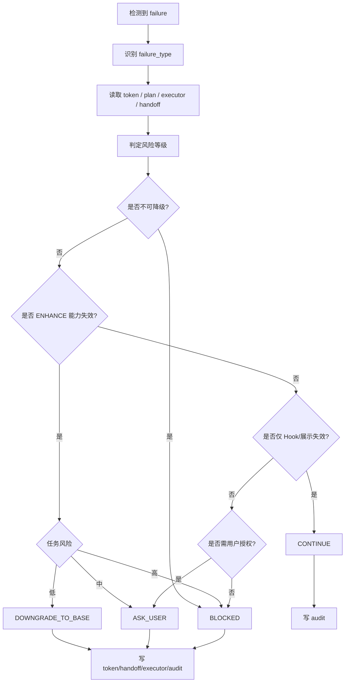

对，刚才那版确实不完整，主要问题是：**核心代码被截断，且原 8.md 里的第 15-25 节没有完整保留**。下面给你一版**完整的、调整后和优化后的 8.md**，结构覆盖到第 25 节，保留原文关键规则，并统一到前面第 1-7 次已经定稿的 CarrorOS 口径。

---

# CarrorOS 第三轮迭代：第 8/10 次（优化版）

## 迭代主题：Fallback Protocol 降级熔断机制

本轮只处理一个问题：

```text
当 ENHANCE 能力、Oracle、Context 水位观测、CLI Hook、脚本执行或用户授权任一失效时，
CarrorOS 如何自动降级、熔断或阻塞，而不是假装继续？
```

第二轮最终裁决已冻结：

```text
最终治理形态：
  Plan → Execute → Verify → Archive

前置安全门：
  PreActionGate

后置完成门：
  VerifyGate

状态四件套：
  token.json
  plan.md
  executor.md
  session-handoff.md
```

第四次稳定规则已冻结：

```text
Base compact：
  15/20 轮数驱动

Enhance compact：
  70%/85% 水位驱动
  无可观测 token 来源则降级 Base

State injection：
  Enhance only，每 5 轮，最小状态块

Resume：
  token → handoff → prompts → plan → executor tail → audit tail → Enhance docs
```

第三轮第 1-7 次已定稿：

```text
IntakeGate → PlanBuilder → PreActionGate → Executor Ledger → VerifyGate → Context Engine → Oracle / Meta-Oracle
```

本轮将不可用场景压成最终机制：

```text
Fallback Protocol
```

Fallback 不是失败遮羞布。  
Fallback 是 CarrorOS 的熔断裁决层。

---

## 1. 本轮裁决书

**裁决等级：核准。**

Fallback Protocol 的唯一职责：

```text
当系统能力、外部依赖、上下文观测、审计写入或用户授权失效时，
给出可审计的 CONTINUE / DOWNGRADE_TO_BASE / ASK_USER / BLOCKED 裁决。
```

Fallback 只回答：

```text
1. 当前能力是否仍足以继续？
2. 是否需要从 ENHANCE 降级到 BASE？
3. 是否必须请求用户裁决？
4. 是否必须阻塞任务？
5. 是否需要写入 audit / handoff / executor fallback note？
```

Fallback 不回答：

```text
✗ step 是否完成
✗ plan.md 是否可以标 [x]
✗ VerifyGate 是否可以跳过
✗ Oracle 是否可以假装通过
✗ scope 是否可以扩大
✗ evidence 是否可以伪造
```

允许输出：

```text
CONTINUE
DOWNGRADE_TO_BASE
ASK_USER
BLOCKED
```

禁止输出：

```text
✗ IGNORE_ERROR
✗ SILENT_DOWNGRADE
✗ FAKE_CONTINUE
✗ SKIP_VERIFY
✗ ASSUME_ORACLE_ACCEPT
✗ TRUST_ME
```

最终裁决：

```text
Fallback 只能改变治理路径。
Fallback 不得改变完成事实。
```

---

## 2. 与 CarrorOS 铁律对齐

### 铁律 1：不编造

```text
不得假装 Oracle 可用。
不得假装 Context watermark 可观测。
不得假装 audit 写入成功。
不得把降级说成通过。
```

### 铁律 2：证据门禁

```text
Fallback 不能替代 VerifyGate。
VerifyGate 未 VERIFIED 时，Fallback 不得推进 step。
```

### 铁律 3：范围冻结

```text
Fallback 不修改 scope。
Fallback 不新增 task 范围。
Fallback 不允许越权继续。
```

### 铁律 4：隐私防线

```text
Fallback audit 不写密钥、不写未脱敏日志、不写用户隐私原文。
```

### 铁律 5：不假完成

```text
DOWNGRADE_TO_BASE 不是完成。
ASK_USER 不是完成。
BLOCKED 不是完成。
只有 VerifyGate VERIFIED 才能标记 plan.md [x]。
```

---

## 3. Fallback 总流程



---

## 4. failure_type 分类

Fallback failure_type 固定为：

```text
enhance_model_unavailable
oracle_unavailable
meta_oracle_unavailable
context_watermark_unobservable
cli_hook_failed
python_script_failed
audit_write_failed
state_conflict
verify_not_completed
scope_violation
authorization_missing
production_approval_missing
dependency_risk_unreviewed
resume_state_unrecoverable
unknown_failure
```

禁止模糊分类：

```text
✗ error
✗ failed
✗ bad_state
✗ weird
✗ maybe_ok
```

裁决：

```text
failure_type 必须稳定、可审计、可恢复。
```

---

## 5. 输出裁决语义

### 5.1 CONTINUE

适用：

```text
1. CLI Hook 失效但核心执行链仍完整
2. statusline 展示失败
3. 非关键观测层失败
```

结果：

```text
1. 继续当前治理级别
2. 写 audit fallback_event
3. 不修改 plan.md
4. 不影响 VerifyGate
```

---

### 5.2 DOWNGRADE_TO_BASE

适用：

```text
1. ENHANCE 模型不可用
2. Oracle 不可用且任务低风险
3. Context watermark 不可观测
4. Meta-Oracle 不可用但非高风险 final_acceptance
```

结果：

```text
1. token.session.level = L1_BASE
2. compact 策略切换为 15/20 轮数驱动
3. 禁用 Oracle / Meta-Oracle
4. 写 handoff fallback 块
5. 写 executor fallback note
6. 写 audit fallback_event
```

裁决：

```text
降级后仍必须使用 VerifyGate。
```

---

### 5.3 ASK_USER

适用：

```text
1. Oracle 不可用且任务中风险
2. 用户授权缺失
3. 降级后风险边界不清
4. ENHANCE final_acceptance 出现非阻塞但需确认风险
```

结果：

```text
1. token.task.status = waiting_user
2. token.task.blocked = null
3. 写 required_user_decision
4. 等待用户结构化裁决
```

用户裁决必须是原子确认，不接受：

```text
✗ 继续
✗ 都行
✗ 可以吧
✗ 你看着办
```

---

### 5.4 BLOCKED

适用：

```text
1. VerifyGate 未 VERIFIED
2. audit 写入失败
3. token / plan 状态冲突
4. scope 越界
5. 高风险任务缺 Oracle
6. 生产审批缺失
7. resume 状态不可恢复
```

结果：

```text
1. token.task.status = blocked
2. token.task.blocked 写入 reason
3. 停止自动推进
4. 写 audit fallback_event
5. 要求回到 PlanBuilder / Execute / VerifyGate / 用户授权
```

---

## 6. 风险分级

### 低风险

```text
- 文档修改
- 注释修改
- 非生产配置修正
- 单文件 UI 文案调整
- 无依赖、无权限、无数据变更
```

允许：

```text
ENHANCE → BASE
Oracle 不可用时降级
Hook 失败后继续
```

---

### 中风险

```text
- 普通业务逻辑
- 多文件非安全改动
- 测试修复
- UI 行为调整
- 非生产配置联动
```

允许：

```text
Oracle 不可用时 ASK_USER
Context watermark 不可观测时降级 BASE
VerifyGate 仍必须通过
```

---

### 高风险

```text
- auth / payment / permission
- production 操作
- data migration
- 依赖供应链变更
- 跨模块核心逻辑
- 不可逆操作
```

禁止：

```text
✗ Oracle 不可用时自动降级
✗ 缺生产审批继续
✗ VerifyGate 未完成继续
✗ audit 写失败继续
```

默认：

```text
BLOCKED
```

---

## 7. 决策矩阵

| failure_type | 低风险 | 中风险 | 高风险 |
|---|---:|---:|---:|
| enhance_model_unavailable | DOWNGRADE_TO_BASE | ASK_USER | BLOCKED |
| oracle_unavailable | DOWNGRADE_TO_BASE | ASK_USER | BLOCKED |
| meta_oracle_unavailable | DOWNGRADE_TO_BASE | ASK_USER | BLOCKED |
| context_watermark_unobservable | DOWNGRADE_TO_BASE | DOWNGRADE_TO_BASE | DOWNGRADE_TO_BASE |
| cli_hook_failed | CONTINUE | CONTINUE | CONTINUE |
| python_script_failed | BLOCKED | BLOCKED | BLOCKED |
| audit_write_failed | BLOCKED | BLOCKED | BLOCKED |
| state_conflict | BLOCKED | BLOCKED | BLOCKED |
| verify_not_completed | BLOCKED | BLOCKED | BLOCKED |
| scope_violation | BLOCKED | BLOCKED | BLOCKED |
| authorization_missing | ASK_USER | ASK_USER | BLOCKED |
| production_approval_missing | BLOCKED | BLOCKED | BLOCKED |
| dependency_risk_unreviewed | ASK_USER | ASK_USER | BLOCKED |
| resume_state_unrecoverable | BLOCKED | BLOCKED | BLOCKED |
| unknown_failure | BLOCKED | BLOCKED | BLOCKED |

---

## 8. Fallback audit 字段

每次 Fallback 必须写 audit：

```json
{
  "event_type": "fallback_event",
  "timestamp": "2026-07-06T21:00:00Z",
  "task_id": "task_0001",
  "level_before": "L2_ENHANCE",
  "level_after": "L1_BASE",
  "phase": "fallback",
  "current_step": "P2.S3",
  "actor": "fallback_engine",
  "failure_type": "context_watermark_unobservable",
  "decision": "DOWNGRADE_TO_BASE",
  "reason": "context_watermark_unobservable:base_fallback",
  "paths": [
    ".omc/tokens/2026-07-06/task_0001.json",
    ".omc/tasks/2026-07-06/task_0001/state/session-handoff.md",
    ".omc/tasks/2026-07-06/task_0001/executor.md"
  ],
  "risk": "low",
  "requires_user": false
}
```

硬规则：

```text
1. event_type 固定为 fallback_event
2. failure_type 必须来自固定枚举
3. decision 必须来自固定枚举
4. paths 必须指向真实治理文件
5. 审计字段缺失视为 audit_write_failed
```

---

## 9. session-handoff 降级补丁

降级时必须在 handoff 追加：

```markdown
## Fallback

- timestamp: 2026-07-06T21:00:00Z
- failure_type: context_watermark_unobservable
- decision: DOWNGRADE_TO_BASE
- level_before: L2_ENHANCE
- level_after: L1_BASE
- reason: context_watermark_unobservable:base_fallback
- resume_mode: L1_BASE
```

用途：

```text
compact / resume 后明确知道任务已经降级。
```

禁止：

```text
✗ 只改 token，不写 handoff
✗ 只口头说明，不写 audit
✗ 静默切换模型
```

---

## 10. executor.md fallback note

Fallback 非 CONTINUE 时追加：

```markdown
## Fallback

- timestamp: 2026-07-06T21:00:00Z
- failure_type: oracle_unavailable
- decision: ASK_USER
- reason: oracle_unavailable:medium_risk_requires_user
- current_step: P2.S3
```

裁决：

```text
fallback note 是治理事实。
不是 step completion evidence。
VerifyGate 不得把 fallback note 当 evidence。
```

---

## 11. token 更新规则

### DOWNGRADE_TO_BASE

```json
{
  "session": {
    "level": "L1_BASE",
    "compact_strategy": "rounds",
    "compact_threshold": [15, 20],
    "fallback": {
      "timestamp": "2026-07-06T21:00:00Z",
      "from_level": "L2_ENHANCE",
      "reason": "context_watermark_unobservable"
    }
  }
}
```

### ASK_USER

```json
{
  "task": {
    "status": "waiting_user",
    "blocked": null,
    "fallback": {
      "reason": "oracle_unavailable:medium_risk_requires_user",
      "requires_decision": true
    }
  }
}
```

### BLOCKED

```json
{
  "task": {
    "status": "blocked",
    "blocked": "verify_not_completed:non_downgradeable",
    "fallback": {
      "timestamp": "2026-07-06T21:00:00Z",
      "reason": "verify_not_completed",
      "recovery_required": true
    }
  }
}
```

---

## 12. 与 VerifyGate 的边界

```text
VerifyGate:
  evidence → step completion

Fallback:
  failure → governance decision
```

禁止：

```text
✗ Fallback 标记 plan.md [x]
✗ Fallback 覆盖 VerifyGate BLOCKED
✗ Fallback 用 DOWNGRADE_TO_BASE 推进未 VERIFIED step
✗ Fallback 删除 failure
✗ Fallback 修改 executor evidence
```

如果 VerifyGate 未完成：

```text
Fallback 只能 BLOCKED。
```

---

## 13. 与 Oracle / Meta-Oracle 的边界

Oracle 不可用时：

```text
低风险：
  DOWNGRADE_TO_BASE

中风险：
  ASK_USER

高风险：
  BLOCKED
```

Meta-Oracle 不可用时：

```text
1. 若 L3 有安全类 REJECT → BLOCKED
2. 若 final_acceptance 高风险 → BLOCKED
3. 若仅 WARN 聚合缺失 → ASK_USER
4. 若低风险 phase_end → DOWNGRADE_TO_BASE
```

禁止：

```text
✗ 假装 Oracle ACCEPT
✗ 用用户“继续”替代 Oracle verdict
✗ 用 BASE 归档高风险 ENHANCE 任务
```

---

## 14. Context Watermark 不可观测

触发条件：

```text
1. Claude Code 不提供 token 来源信息
2. OpenCode SQLite 查询失败
3. hook 关闭或无法读取 context usage
4. 70%/85% 水位无法计算
```

处理：

```text
DOWNGRADE_TO_BASE
```

结果：

```text
1. compact 策略改为 15/20 轮数驱动
2. 禁用 Enhance watermark 策略
3. 写 handoff fallback
4. 写 audit fallback_event
```

裁决：

```text
无 watermark 不等于不能继续。
无 watermark 意味着不能继续 ENHANCE。
```

---

## 15. VerifyGate 非 VERIFIED 处理

```text
VerifyGate BLOCKED:
  Fallback 不得降级绕过。
  必须保持 BLOCKED。

VerifyGate WARN:
  可 ASK_USER 或要求补 evidence。
  不可标 [x]。

VerifyGate REJECTED:
  回到 PlanBuilder 或 Executor Ledger。
  不可降级继续。
```

裁决：

```text
VerifyGate 是完成硬门。
Fallback 没有覆盖权。
```

---

## 16. Resume 状态不可恢复处理

不可恢复定义：

```text
1. token 缺失但 handoff 声称 active task
2. plan.md 缺失
3. executor.md 缺失且已有 checked step
4. token.current_step 不存在
5. token.done 与 plan [x] 数冲突
6. scope freeze 冲突
```

处理：

```text
BLOCKED: resume_state_unrecoverable
```

允许修复路径：

```text
1. 用户明确恢复 token
2. 回到 PlanBuilder 重建 plan
3. 回到 VerifyGate 重算完成状态
4. 归档并重新开始任务
```

---

## 17. Fallback 核心代码

```python
#!/usr/bin/env python3
"""
CarrorOS Fallback Engine
Purpose:
  Convert capability failures into auditable governance decisions.

Constraints:
  - Python 3.10+ standard library only
  - Does not mark plan steps done
  - Does not alter executor evidence
  - Does not replace VerifyGate or Oracle
"""

from __future__ import annotations

import json
import sys
from dataclasses import dataclass, asdict
from datetime import datetime, timezone
from pathlib import Path
from typing import Any


VALID_FAILURE_TYPES = {
    "enhance_model_unavailable",
    "oracle_unavailable",
    "meta_oracle_unavailable",
    "context_watermark_unobservable",
    "cli_hook_failed",
    "python_script_failed",
    "audit_write_failed",
    "state_conflict",
    "verify_not_completed",
    "scope_violation",
    "authorization_missing",
    "production_approval_missing",
    "dependency_risk_unreviewed",
    "resume_state_unrecoverable",
    "unknown_failure",
}

VALID_DECISIONS = {
    "CONTINUE",
    "DOWNGRADE_TO_BASE",
    "ASK_USER",
    "BLOCKED",
}

HIGH_RISK_HINTS = {
    "auth_change",
    "payment_change",
    "permission_change",
    "production",
    "migration",
    "dependency_change",
    "cross_module",
    "irreversible",
}


@dataclass
class FallbackDecision:
    decision: str
    failure_type: str
    reason: str
    level_before: str
    level_after: str
    risk: str
    requires_user: bool


def now_iso() -> str:
    return datetime.now(timezone.utc).replace(microsecond=0).isoformat()


def today() -> str:
    return datetime.now(timezone.utc).strftime("%Y-%m-%d")


def read_json(path: Path, default: dict[str, Any] | None = None) -> dict[str, Any]:
    if not path.exists():
        return default or {}
    with path.open("r", encoding="utf-8") as f:
        return json.load(f)


def write_json_atomic(path: Path, data: dict[str, Any]) -> None:
    path.parent.mkdir(parents=True, exist_ok=True)
    tmp = path.with_suffix(path.suffix + ".tmp")
    with tmp.open("w", encoding="utf-8") as f:
        json.dump(data, f, ensure_ascii=False, indent=2, sort_keys=True)
        f.write("\n")
    tmp.replace(path)


def append_text(path: Path, text: str) -> None:
    path.parent.mkdir(parents=True, exist_ok=True)
    with path.open("a", encoding="utf-8") as f:
        f.write(text)


def task_id_from_token(token: dict[str, Any]) -> str:
    return token.get("task", {}).get("id", "unknown_task")


def current_step_from_token(token: dict[str, Any]) -> str | None:
    return token.get("task", {}).get("current_step")


def level_from_token(token: dict[str, Any]) -> str:
    return token.get("session", {}).get("level", "L1_BASE")


def risk_from_token(token: dict[str, Any], explicit_risk: str | None = None) -> str:
    if explicit_risk in {"low", "medium", "high"}:
        return explicit_risk

    hints = set(token.get("task", {}).get("risk_hints", []) or [])
    if hints & HIGH_RISK_HINTS:
        return "high"

    diff = token.get("task", {}).get("diff_summary", {}) or {}
    files_changed = int(diff.get("files_changed", 0) or 0)
    insertions = int(diff.get("insertions", 0) or 0)
    deletions = int(diff.get("deletions", 0) or 0)

    if files_changed >= 5 or insertions + deletions >= 500:
        return "medium"

    return "low"


def decide(failure_type: str, token: dict[str, Any], explicit_risk: str | None = None) -> FallbackDecision:
    if failure_type not in VALID_FAILURE_TYPES:
        failure_type = "unknown_failure"

    level = level_from_token(token)
    risk = risk_from_token(token, explicit_risk)

    non_downgradeable = {
        "audit_write_failed",
        "state_conflict",
        "verify_not_completed",
        "scope_violation",
        "production_approval_missing",
        "resume_state_unrecoverable",
        "python_script_failed",
        "unknown_failure",
    }

    if failure_type in non_downgradeable:
        return FallbackDecision(
            "BLOCKED",
            failure_type,
            f"{failure_type}:non_downgradeable",
            level,
            level,
            "high" if failure_type != "verify_not_completed" else risk,
            failure_type != "verify_not_completed",
        )

    if failure_type == "cli_hook_failed":
        return FallbackDecision(
            "CONTINUE",
            failure_type,
            "cli_hook_failed:status_display_only",
            level,
            level,
            risk,
            False,
        )

    if failure_type == "context_watermark_unobservable":
        return FallbackDecision(
            "DOWNGRADE_TO_BASE",
            failure_type,
            "context_watermark_unobservable:base_fallback",
            level,
            "L1_BASE",
            "low",
            False,
        )

    if failure_type in {
        "enhance_model_unavailable",
        "oracle_unavailable",
        "meta_oracle_unavailable",
    }:
        if risk == "high":
            return FallbackDecision(
                "BLOCKED",
                failure_type,
                f"{failure_type}:high_risk_requires_enhance",
                level,
                level,
                risk,
                True,
            )
        if risk == "medium":
            return FallbackDecision(
                "ASK_USER",
                failure_type,
                f"{failure_type}:medium_risk_requires_user",
                level,
                level,
                risk,
                True,
            )
        return FallbackDecision(
            "DOWNGRADE_TO_BASE",
            failure_type,
            f"{failure_type}:low_risk_base_fallback",
            level,
            "L1_BASE",
            risk,
            False,
        )

    if failure_type in {"authorization_missing", "dependency_risk_unreviewed"}:
        if risk == "high":
            return FallbackDecision(
                "BLOCKED",
                failure_type,
                f"{failure_type}:high_risk_blocked",
                level,
                level,
                risk,
                True,
            )
        return FallbackDecision(
            "ASK_USER",
            failure_type,
            f"{failure_type}:requires_user_decision",
            level,
            level,
            risk,
            True,
        )

    return FallbackDecision(
        "BLOCKED",
        "unknown_failure",
        "unknown_failure:blocked",
        level,
        level,
        "high",
        True,
    )


def update_token(token_path: Path, token: dict[str, Any], decision: FallbackDecision) -> None:
    token.setdefault("task", {})
    token.setdefault("session", {})

    if decision.decision == "DOWNGRADE_TO_BASE":
        token["session"]["level"] = "L1_BASE"
        token["session"]["compact_strategy"] = "rounds"
        token["session"]["compact_threshold"] = [15, 20]
        token["session"]["fallback"] = {
            "timestamp": now_iso(),
            "from_level": decision.level_before,
            "reason": decision.failure_type,
        }

    elif decision.decision == "ASK_USER":
        token["task"]["status"] = "waiting_user"
        token["task"]["blocked"] = None
        token["task"]["fallback"] = {
            "reason": decision.reason,
            "requires_decision": True,
        }

    elif decision.decision == "BLOCKED":
        token["task"]["status"] = "blocked"
        token["task"]["blocked"] = decision.reason
        token["task"]["fallback"] = {
            "timestamp": now_iso(),
            "reason": decision.failure_type,
            "recovery_required": True,
        }

    write_json_atomic(token_path, token)


def append_handoff(path: Path, decision: FallbackDecision) -> None:
    if decision.decision == "CONTINUE":
        return

    text = (
        "\n## Fallback\n\n"
        f"- timestamp: {now_iso()}\n"
        f"- failure_type: {decision.failure_type}\n"
        f"- decision: {decision.decision}\n"
        f"- level_before: {decision.level_before}\n"
        f"- level_after: {decision.level_after}\n"
        f"- reason: {decision.reason}\n"
        f"- resume_mode: {decision.level_after}\n"
    )
    append_text(path, text)


def append_executor_note(path: Path, token: dict[str, Any], decision: FallbackDecision) -> None:
    if decision.decision == "CONTINUE":
        return

    text = (
        "\n## Fallback\n\n"
        f"- timestamp: {now_iso()}\n"
        f"- failure_type: {decision.failure_type}\n"
        f"- decision: {decision.decision}\n"
        f"- reason: {decision.reason}\n"
        f"- current_step: {current_step_from_token(token)}\n"
    )
    append_text(path, text)


def write_audit(token: dict[str, Any], decision: FallbackDecision, paths: list[str]) -> None:
    audit_dir = Path(".omc/audit")
    audit_dir.mkdir(parents=True, exist_ok=True)
    audit_path = audit_dir / f"{today()}.jsonl"

    event = {
        "event_type": "fallback_event",
        "timestamp": now_iso(),
        "task_id": task_id_from_token(token),
        "level_before": decision.level_before,
        "level_after": decision.level_after,
        "phase": "fallback",
        "current_step": current_step_from_token(token),
        "actor": "fallback_engine",
        "failure_type": decision.failure_type,
        "decision": decision.decision,
        "reason": decision.reason,
        "paths": paths,
        "risk": decision.risk,
        "requires_user": decision.requires_user,
    }

    required = {
        "event_type",
        "timestamp",
        "task_id",
        "level_before",
        "level_after",
        "phase",
        "current_step",
        "actor",
        "failure_type",
        "decision",
        "reason",
        "paths",
        "risk",
        "requires_user",
    }
    missing = [key for key in required if key not in event]
    if missing:
        raise OSError("audit_field_missing:" + ",".join(missing))

    with audit_path.open("a", encoding="utf-8") as f:
        f.write(json.dumps(event, ensure_ascii=False, sort_keys=True) + "\n")


def task_paths(token: dict[str, Any]) -> tuple[Path, Path, list[str]]:
    task_id = task_id_from_token(token)
    date = today()

    handoff = Path(".omc/tasks") / date / task_id / "state" / "session-handoff.md"
    executor = Path(".omc/tasks") / date / task_id / "executor.md"

    path_strings = [
        str(Path(".omc/tokens") / date / f"{task_id}.json"),
        str(handoff),
        str(executor),
    ]
    return handoff, executor, path_strings


def main() -> int:
    if len(sys.argv) < 2:
        print(json.dumps({"error": "usage: fallback_engine.py <failure_type> [risk] [token_path]"}, indent=2))
        return 2

    failure_type = sys.argv[1]
    explicit_risk = sys.argv[2] if len(sys.argv) >= 3 else None
    token_path = Path(sys.argv[3]) if len(sys.argv) >= 4 else Path(".omc/state/token.json")

    token = read_json(token_path, {})
    decision = decide(failure_type, token, explicit_risk)

    try:
        handoff_path, executor_path, audit_paths = task_paths(token)
        update_token(token_path, token, decision)
        append_handoff(handoff_path, decision)
        append_executor_note(executor_path, token, decision)
        write_audit(token, decision, audit_paths)
    except OSError as exc:
        fallback = FallbackDecision(
            "BLOCKED",
            "audit_write_failed",
            "audit_write_failed:cant_persist_fallback",
            decision.level_before,
            decision.level_before,
            "high",
            True,
        )
        print(json.dumps(asdict(fallback), ensure_ascii=False, indent=2))
        return 1

    print(json.dumps(asdict(decision), ensure_ascii=False, indent=2))
    return 0 if decision.decision in {"CONTINUE", "DOWNGRADE_TO_BASE"} else 1


if __name__ == "__main__":
    raise SystemExit(main())
```

---

## 18. 示例：watermark 不可观测

输入：

```bash
./fallback_engine.py context_watermark_unobservable
```

输出：

```json
{
  "decision": "DOWNGRADE_TO_BASE",
  "failure_type": "context_watermark_unobservable",
  "reason": "context_watermark_unobservable:base_fallback",
  "level_before": "L2_ENHANCE",
  "level_after": "L1_BASE",
  "risk": "low",
  "requires_user": false
}
```

结果：

```text
token.session.level = L1_BASE
compact 改为 15/20 轮数驱动
写 handoff fallback
写 audit fallback_event
```

---

## 19. 示例：Oracle 不可用，中风险

输入：

```bash
./fallback_engine.py oracle_unavailable medium
```

输出：

```json
{
  "decision": "ASK_USER",
  "failure_type": "oracle_unavailable",
  "reason": "oracle_unavailable:medium_risk_requires_user",
  "level_before": "L2_ENHANCE",
  "level_after": "L2_ENHANCE",
  "risk": "medium",
  "requires_user": true
}
```

裁决：

```text
中风险任务不能静默跳过 Oracle。
必须请求用户结构化裁决。
```

---

## 20. 示例：生产审批缺失

输入：

```bash
./fallback_engine.py production_approval_missing high
```

输出：

```json
{
  "decision": "BLOCKED",
  "failure_type": "production_approval_missing",
  "reason": "production_approval_missing:non_downgradeable",
  "level_before": "L2_ENHANCE",
  "level_after": "L2_ENHANCE",
  "risk": "high",
  "requires_user": true
}
```

裁决：

```text
生产审批缺失不可降级。
必须 BLOCKED。
```

---

## 21. 示例：VerifyGate 未完成

输入：

```bash
./fallback_engine.py verify_not_completed medium
```

输出：

```json
{
  "decision": "BLOCKED",
  "failure_type": "verify_not_completed",
  "reason": "verify_not_completed:non_downgradeable",
  "level_before": "L2_ENHANCE",
  "level_after": "L2_ENHANCE",
  "risk": "medium",
  "requires_user": false
}
```

裁决：

```text
VerifyGate 未 VERIFIED 时，Fallback 没有覆盖权。
```

---

## 22. 设计优缺点

### 优点

```text
1. ENHANCE 失效时有明确降级路径。
2. 高风险任务不会被静默降级。
3. VerifyGate 的完成硬门地位不被削弱。
4. Oracle 不可用不会被假装通过。
5. audit / handoff / executor 均有追踪记录。
6. Resume 后能识别曾经发生过降级。
7. CLI Hook 失效不会误伤核心任务。
8. 不可审计场景统一 BLOCKED。
```

### 缺点

```text
1. 高风险任务更容易被 BLOCKED。
2. ASK_USER 增加人工交互成本。
3. 降级逻辑需要稳定维护 failure_type。
4. audit 写入失败会导致全局阻塞。
5. 低风险降级后失去 Oracle 高阶复核。
```

### 取舍裁决

```text
CarrorOS 选择可审计降级，而非静默继续。
Fallback 的目标不是提高通过率，而是防止错误治理路径继续扩大风险。
该代价核准。
```

---

## 23. 与 Archive 的关系

Archive 前必须检查：

```text
1. 是否存在 BLOCKED fallback_event
2. 是否存在 ASK_USER 未处理
3. 是否存在 high-risk DOWNGRADE_TO_BASE
4. 是否存在 audit_write_failed
5. 是否存在 VerifyGate 未完成
```

处理：

```text
BLOCKED:
  不允许 Archive

ASK_USER:
  等待用户结构化裁决

DOWNGRADE_TO_BASE:
  低风险可归档
  中风险需记录 residual risk
  高风险不允许归档
```

裁决：

```text
Fallback 历史是 Archive 的输入。
Archive 不得忽略 fallback_event。
```

---

## 24. 本轮最终规则

```text
1. Fallback 是降级熔断裁决层，不是完成门。
2. Fallback 输出只能是 CONTINUE / DOWNGRADE_TO_BASE / ASK_USER / BLOCKED。
3. failure_type 必须来自固定枚举。
4. VerifyGate 未 VERIFIED 时必须 BLOCKED。
5. audit 写入失败时必须 BLOCKED。
6. token / plan 冲突时必须 BLOCKED。
7. scope 越界时必须 BLOCKED。
8. production approval 缺失时必须 BLOCKED。
9. Oracle 不可用时按风险裁决：低降级、中询问、高阻塞。
10. Context watermark 不可观测时降级 BASE。
11. CLI Hook 失效可 CONTINUE，但必须 audit。
12. DOWNGRADE_TO_BASE 必须写 token / handoff / executor / audit。
13. ASK_USER 必须等待结构化用户裁决。
14. BLOCKED 必须写 token.task.blocked。
15. Fallback 不得修改 plan.md [x]。
16. Fallback 不得修改 executor 既有 evidence。
17. Fallback 不得假装 Oracle ACCEPT。
18. Fallback 历史必须进入 Archive 检查。
```

---

## 25. 下一轮迭代范围

第 9/10 次只处理：

```text
CLI Integration：
- Claude Code Statusline Hook
- OpenCode SQLite 观测
- bash(Mac/WSL2) 兼容脚本
- BASE / ENHANCE 启动命令
- Hook 失败如何调用 Fallback
- CLI 输出哪些状态，禁止输出哪些内容
- 输出 statusline-command.sh 与 opencode 配置模板
```

不处理：

```text
- Archive 最终归档细节
- 新 Oracle 规则
- 新验证规则
- 安装器完整封装
```

**第 8/10 次结论：**

```text
Fallback Protocol 定稿。
CarrorOS 获得不可用、降级、熔断与阻塞的统一裁决机制。
下一轮进入 CLI Integration，把 Claude Code / OpenCode 的观测与状态展示压成可执行接口。
```

---

这版是完整的第 8/10 次，已补齐：

```text
✅ failure_type 固定枚举
✅ CONTINUE / DOWNGRADE_TO_BASE / ASK_USER / BLOCKED 语义
✅ 决策矩阵
✅ audit 字段
✅ handoff 补丁
✅ executor fallback note
✅ token 更新规则
✅ VerifyGate 非 VERIFIED 处理
✅ Resume 不可恢复处理
✅ 完整 fallback_engine.py
✅ 示例 18/19/20/21
✅ 设计优缺点
✅ Archive 关系
✅ 最终规则
✅ 第 9/10 次范围
```