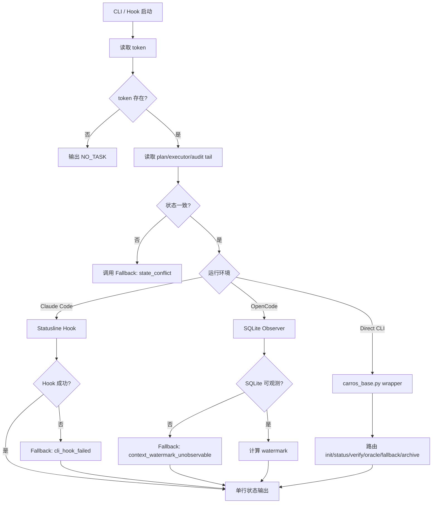

下面是 **9.md 调整后 / 优化后的完整版本**，已按你前面 8.md 的口径统一，并对齐 `README.md` / `AGENTS.md`：

- 文档路径改为 `.omc/tasks/{date}/{task_name}/...`
- token 路径改为 `.omc/tokens/{date}/{task_name}.json`
- CLI 明确为观测层 / 触发层 / 展示层，不是治理真相源
- 强化 8 铁律，尤其是不编造、证据门禁、范围冻结、不假完成、不自改治理
- 补齐 Claude Code Statusline Hook、OpenCode SQLite、Fallback 调用、BASE / ENHANCE 启动、禁止输出、配置模板、最终规则

---

# CarrorOS 第三轮迭代：第 9/10 次（优化版）

## 迭代主题：CLI Integration 观测与执行接口

本轮只处理一个问题：

```text
CarrorOS 如何接入 Claude Code Statusline Hook 与 OpenCode SQLite 观测，
同时保持治理真相只来自 token / plan / executor / audit？
```

第二轮与第三轮前 8 次已冻结：

```text
最终治理形态：
  Plan → Execute → Verify → Archive

前置安全门：
  PreActionGate

后置完成门：
  VerifyGate

状态四件套：
  token.json
  plan.md
  executor.md
  session-handoff.md

降级熔断：
  Fallback Protocol
```

本轮将 CLI 接入压成最终机制：

```text
CLI Integration
```

CLI 不是治理源。  
CLI 是观测层、触发层、展示层。

---

## 1. 本轮裁决书

**裁决等级：核准。**

CLI Integration 的唯一职责：

```text
把 Claude Code / OpenCode 的运行状态接入 CarrorOS，
用于展示状态、触发脚本、读取观测信号、调用 Fallback。
```

CLI 只回答：

```text
1. 当前任务状态是什么？
2. 当前 step 是什么？
3. 当前治理级别是 BASE 还是 ENHANCE？
4. 当前是否 BLOCKED / waiting_user？
5. Claude Code / OpenCode 观测是否可用？
6. 是否需要调用 Fallback？
```

CLI 不回答：

```text
✗ step 是否完成
✗ plan.md 是否可以标 [x]
✗ VerifyGate 是否可以跳过
✗ Oracle 是否可以假装通过
✗ evidence 是否有效
✗ scope 是否可以扩大
✗ audit 是否可以省略
```

允许输出：

```text
OK
WARN
BLOCKED
WAITING_USER
NO_TASK
FALLBACK
```

禁止输出：

```text
✗ DONE
✗ VERIFIED
✗ ACCEPTED
✗ TRUSTED
✗ PROBABLY_OK
✗ LOOKS_FINE
✗ SKIP_VERIFY
```

最终裁决：

```text
CLI 只能展示治理状态。
CLI 不产生治理事实。
```

---

## 2. 与 README / AGENTS 对齐

### 2.1 文档路径对齐

README 已定义任务系统：

```text
.omc/tasks/{date}/{task_name}/[
  research.md
  plan.md
  executor.md
  sub_tasks/
  state/
]
```

token 系统：

```text
.omc/tokens/{date}/{task_name}.json
```

因此第 9/10 次统一使用：

```text
任务文档：
  .omc/tasks/{date}/{task_name}/plan.md
  .omc/tasks/{date}/{task_name}/executor.md
  .omc/tasks/{date}/{task_name}/state/session-handoff.md

任务令牌：
  .omc/tokens/{date}/{task_name}.json

审计：
  .omc/audit/{date}.jsonl

Claude Code 资产：
  .claude/scripts/
  .claude/hooks/
  .claude/settings.json
  .claude/harness.yaml

OpenCode 资产：
  opencode/
```

禁止继续使用旧式全局路径作为主路径：

```text
✗ .omc/state/token.json
✗ .omc/docs/plan.md
✗ .omc/docs/executor.md
```

兼容层可以读取旧路径，但不得作为新规范输出。

---

### 2.2 与 AGENTS 铁律对齐

AGENTS 核心灵魂：

```text
验证 > 零信任 > 守护 > 文档 > 人本 > 增益 > 少
```

CLI Integration 必须遵守：

```text
1. 不编造：
   CLI 状态必须来自 token / plan / executor / audit。
   不得根据聊天上下文猜测状态。

2. 证据门禁：
   CLI 不能把 statusline 输出当 evidence。
   VerifyGate 未跑，不能显示 VERIFIED。

3. 范围冻结：
   CLI wrapper 不得修改 plan.md 声明范围。
   不得自动扩大 scope。

4. 隐私防线：
   Statusline / OpenCode observer 不得输出密钥、.env、.ssh、未脱敏日志。

5. 不假完成：
   CLI 不得显示 DONE / VERIFIED，除非 VerifyGate 已写入完成事实。

6. 不自改治理：
   CLI 不得自动修改 AGENTS.md / kernel.md / index.md。
```

---

## 3. CLI Integration 总流程



---

## 4. CLI 分层职责

### 4.1 Statusline Hook

职责：

```text
1. 读取 token
2. 展示当前 task / step / level / status
3. 展示 BLOCKED / waiting_user / fallback
4. 展示 context watermark 或 compact 策略
5. 失败时调用 Fallback
```

禁止：

```text
✗ 修改 plan.md
✗ 修改 executor.md evidence
✗ 执行 VerifyGate 裁决
✗ 执行 Oracle 裁决
✗ 输出敏感信息
```

---

### 4.2 OpenCode SQLite Observer

职责：

```text
1. 只读查询 OpenCode SQLite
2. 估算 context 使用水位
3. 为 ENHANCE compact 提供观测信号
4. SQLite 不可用时触发 Fallback
```

禁止：

```text
✗ 写 SQLite
✗ 修改 OpenCode 会话
✗ 从 SQLite 提取隐私原文到 statusline
✗ 把 token 估算当完成证据
```

---

### 4.3 CLI Wrapper

职责：

```text
1. 路由 init / status / verify / oracle / fallback / archive
2. 调用 carros_base.py
3. 调用 verify_gate.py / oracle_engine.py / fallback_engine.py
4. 统一输出短状态
```

禁止：

```text
✗ 在 bash 中重写治理逻辑
✗ 绕过 Python gate
✗ 静默吞掉失败
✗ 无 audit 继续
```

裁决：

```text
Wrapper 只路由，不裁决。
```

---

## 5. CLI 命令范围

第 9/10 次定义 CLI 集成命令，但不新增治理规则。

### 5.1 BASE 启动

```bash
python3 .claude/scripts/carros_base.py init --task-id <task_id> --level L1_BASE
```

语义：

```text
1. 创建 token
2. 创建任务目录
3. 初始化 plan / executor / session-handoff
4. 使用 15/20 轮数 compact
5. 不启用 Oracle
6. 不启用 Context Watermark
```

---

### 5.2 ENHANCE 启动

```bash
python3 .claude/scripts/carros_base.py init --task-id <task_id> --level L2_ENHANCE
```

语义：

```text
1. 创建 token
2. 创建任务目录
3. 初始化 plan / executor / session-handoff
4. 启用 70%/85% watermark compact
5. 启用 Oracle / Meta-Oracle
6. 启用 State Injection
7. 若 watermark 不可观测，调用 Fallback
```

---

### 5.3 状态查询

```bash
python3 .claude/scripts/carros_base.py status --task-id <task_id>
```

输出允许：

```text
task_id
level
status
current_step
done/total
blocked reason
fallback state
compact mode
```

输出禁止：

```text
✗ chain-of-thought
✗ secret
✗ .env value
✗ full log
✗ long executor output
```

---

### 5.4 验证

```bash
python3 .claude/scripts/carros_base.py verify --task-id <task_id> --step <step_id>
```

语义：

```text
1. 调用 VerifyGate
2. 读取 executor evidence
3. 写 audit verify_decision
4. VerifyGate VERIFIED 后才允许 plan step 完成
```

CLI 禁止自己判断完成。

---

### 5.5 Oracle

```bash
python3 .claude/scripts/carros_base.py oracle --task-id <task_id> --trigger phase_end
```

语义：

```text
1. 仅 L2_ENHANCE 可运行
2. 必须在 VerifyGate VERIFIED 后运行
3. 失败时调用 Fallback
4. Oracle 不可用时不得假装 ACCEPT
```

---

### 5.6 Fallback

```bash
python3 .claude/scripts/fallback_engine.py <failure_type> [risk] [token_path]
```

语义：

```text
1. 将能力失效归一成 CONTINUE / DOWNGRADE_TO_BASE / ASK_USER / BLOCKED
2. 写 token / handoff / executor note / audit
3. 审计失败则 BLOCKED
```

---

## 6. Claude Code Statusline Hook

路径：

```text
.claude/hooks/statusline-command.sh
```

要求：

```text
1. bash 兼容 macOS / WSL2
2. 单行输出
3. 不超过 160 字符
4. 不输出敏感信息
5. 出错时不抛长日志
6. Hook 失败调用 Fallback
```

输出格式：

```text
CarrorOS {level} {status} {task_id} {current_step} {done}/{total} {compact}
```

示例：

```text
CarrorOS L2_ENHANCE OK task_0001 P2.S3 7/10 wm=62%
CarrorOS L1_BASE BLOCKED task_0001 P2.S3 7/10 reason=verify_not_completed
CarrorOS L1_BASE NO_TASK
CarrorOS L2_ENHANCE WAITING_USER task_0001 P2.S3 reason=oracle_unavailable
```

禁止输出：

```text
✗ full prompt
✗ full executor evidence
✗ command output
✗ stack trace
✗ secret
✗ token raw json
```

---

## 7. statusline-command.sh 模板

```bash
#!/usr/bin/env bash
set -u

ROOT="${CARROROS_ROOT:-$(pwd)}"
PYTHON="${PYTHON:-python3}"
SCRIPT="$ROOT/.claude/scripts/statusline.py"
FALLBACK="$ROOT/.claude/scripts/fallback_engine.py"

if [ ! -f "$SCRIPT" ]; then
  echo "CarrorOS L1_BASE FALLBACK no_statusline_script"
  exit 0
fi

if ! command -v "$PYTHON" >/dev/null 2>&1; then
  echo "CarrorOS L1_BASE FALLBACK python_missing"
  exit 0
fi

OUTPUT="$("$PYTHON" "$SCRIPT" 2>/dev/null)"
STATUS=$?

if [ "$STATUS" -ne 0 ] || [ -z "$OUTPUT" ]; then
  if [ -f "$FALLBACK" ]; then
    "$PYTHON" "$FALLBACK" cli_hook_failed low >/dev/null 2>&1 || true
  fi
  echo "CarrorOS L1_BASE FALLBACK cli_hook_failed"
  exit 0
fi

printf '%s\n' "$OUTPUT" | head -n 1 | cut -c 1-160
exit 0
```

裁决：

```text
Statusline Hook 永不输出长错误。
Hook 失败不阻塞核心任务，只触发 Fallback: cli_hook_failed。
```

---

## 8. statusline.py 模板

```python
#!/usr/bin/env python3
"""
CarrorOS statusline renderer.

Purpose:
  Render one-line task status for Claude Code.

Constraints:
  - Python 3.10+ standard library only
  - Read-only except fallback is handled by fallback_engine
  - Does not decide completion
  - Does not expose sensitive content
"""

from __future__ import annotations

import json
import os
from pathlib import Path
from typing import Any


def read_json(path: Path) -> dict[str, Any]:
    if not path.exists():
        return {}
    with path.open("r", encoding="utf-8") as f:
        return json.load(f)


def latest_token(root: Path) -> Path | None:
    token_root = root / ".omc" / "tokens"
    if not token_root.exists():
        return None

    candidates = sorted(
        [p for p in token_root.glob("*/*.json") if p.is_file()],
        key=lambda p: p.stat().st_mtime,
        reverse=True,
    )
    return candidates[0] if candidates else None


def compact_label(token: dict[str, Any]) -> str:
    session = token.get("session", {})
    strategy = session.get("compact_strategy")

    if strategy == "watermark":
        watermark = session.get("context_watermark")
        if isinstance(watermark, (int, float)):
            return f"wm={int(watermark)}%"
        return "wm=unknown"

    if strategy == "rounds":
        turn = session.get("turn", "?")
        threshold = session.get("compact_threshold", [15, 20])
        if isinstance(threshold, list) and len(threshold) == 2:
            return f"turn={turn}/{threshold[1]}"
        return f"turn={turn}"

    return "compact=unknown"


def safe_text(value: Any, default: str = "-") -> str:
    if value is None:
        return default
    text = str(value)
    text = text.replace("\n", " ").replace("\r", " ")
    return text[:48]


def render(root: Path) -> str:
    token_path = latest_token(root)
    if not token_path:
        return "CarrorOS L1_BASE NO_TASK"

    token = read_json(token_path)
    task = token.get("task", {})
    session = token.get("session", {})
    stats = token.get("stats", {})

    level = safe_text(session.get("level", "L1_BASE"))
    status = safe_text(task.get("status", "active"))
    task_id = safe_text(task.get("id", token_path.stem))
    current_step = safe_text(task.get("current_step", "-"))

    done = stats.get("done", 0)
    total = stats.get("total", 0)
    compact = compact_label(token)

    if status == "blocked":
        reason = safe_text(task.get("blocked", "blocked"))
        return f"CarrorOS {level} BLOCKED {task_id} {current_step} {done}/{total} reason={reason}"

    if status == "waiting_user":
        fallback = task.get("fallback", {}) or {}
        reason = safe_text(fallback.get("reason", "requires_user"))
        return f"CarrorOS {level} WAITING_USER {task_id} {current_step} reason={reason}"

    return f"CarrorOS {level} OK {task_id} {current_step} {done}/{total} {compact}"


def main() -> int:
    root = Path(os.environ.get("CARROROS_ROOT", ".")).resolve()
    print(render(root))
    return 0


if __name__ == "__main__":
    raise SystemExit(main())
```

---

## 9. Claude Code settings.json Hook 注册

路径：

```text
.claude/settings.json
```

模板：

```json
{
  "statusLine": {
    "type": "command",
    "command": ".claude/hooks/statusline-command.sh"
  },
  "hooks": {
    "PreToolUse": [
      {
        "matcher": "*",
        "hooks": [
          {
            "type": "command",
            "command": ".claude/hooks/pretooluse.sh"
          }
        ]
      }
    ],
    "PostToolUse": [
      {
        "matcher": "*",
        "hooks": [
          {
            "type": "command",
            "command": ".claude/hooks/posttooluse.sh"
          }
        ]
      }
    ]
  }
}
```

裁决：

```text
settings.json 只注册 Hook。
治理规则仍在 AGENTS.md / kernel.md / scripts 中。
```

---

## 10. harness.yaml 开关表

路径：

```text
.claude/harness.yaml
```

模板：

```yaml
statusline:
  enabled: true
  command: ".claude/hooks/statusline-command.sh"
  max_chars: 160

hooks:
  pretooluse: true
  posttooluse: true
  notification: false
  stop: false
  subagent_stop: false
  precompact: true

fallback:
  on_hook_failure: "cli_hook_failed"
  on_watermark_unavailable: "context_watermark_unobservable"
  engine: ".claude/scripts/fallback_engine.py"

privacy:
  redact_env: true
  redact_ssh: true
  redact_secrets: true
  max_output_chars: 160
```

硬规则：

```text
harness.yaml 是开关表。
不能在 harness.yaml 中写治理裁决。
```

---

## 11. OpenCode SQLite 观测

OpenCode 接入只允许只读观测：

```text
1. 读取 SQLite 路径
2. 查询当前会话上下文近似长度
3. 估算 token watermark
4. 写入 token.session.context_watermark
5. 不读取密钥文件
6. 不把原始聊天内容写入 audit
```

SQLite 路径来源：

```text
OPENCODE_SQLITE_PATH
```

如果不可用：

```text
Fallback failure_type:
  context_watermark_unobservable
```

裁决：

```text
OpenCode SQLite 是观测源，不是治理源。
```

---

## 12. opencode 配置模板

路径：

```text
opencode/carroros.json
```

模板：

```json
{
  "carroros": {
    "level": "L2_ENHANCE",
    "token_root": ".omc/tokens",
    "task_root": ".omc/tasks",
    "audit_root": ".omc/audit",
    "observer": {
      "type": "sqlite",
      "path_env": "OPENCODE_SQLITE_PATH",
      "mode": "readonly",
      "watermark_strategy": "approx_chars_div_4",
      "fallback_on_unavailable": "context_watermark_unobservable"
    },
    "compact": {
      "base": {
        "soft_turn": 15,
        "hard_turn": 20
      },
      "enhance": {
        "soft_watermark": 70,
        "hard_watermark": 85,
        "fallback": "base"
      }
    },
    "verify": {
      "gate": ".claude/scripts/verify_gate.py",
      "required_before_done": true
    },
    "oracle": {
      "engine": ".claude/scripts/oracle_engine.py",
      "enhance_only": true,
      "fallback_on_unavailable": "oracle_unavailable"
    },
    "fallback": {
      "engine": ".claude/scripts/fallback_engine.py",
      "audit_required": true
    }
  }
}
```

---

## 13. OpenCode observer.py 模板

```python
#!/usr/bin/env python3
"""
CarrorOS OpenCode SQLite observer.

Purpose:
  Estimate context watermark from OpenCode SQLite in read-only mode.

Constraints:
  - Python 3.10+ standard library only
  - Read-only SQLite connection
  - Does not expose prompt content
  - Does not produce completion evidence
"""

from __future__ import annotations

import json
import os
import sqlite3
import sys
from pathlib import Path
from typing import Any


def read_json(path: Path) -> dict[str, Any]:
    if not path.exists():
        return {}
    with path.open("r", encoding="utf-8") as f:
        return json.load(f)


def write_json_atomic(path: Path, data: dict[str, Any]) -> None:
    path.parent.mkdir(parents=True, exist_ok=True)
    tmp = path.with_suffix(path.suffix + ".tmp")
    with tmp.open("w", encoding="utf-8") as f:
        json.dump(data, f, ensure_ascii=False, indent=2, sort_keys=True)
        f.write("\n")
    tmp.replace(path)


def latest_token(root: Path) -> Path | None:
    token_root = root / ".omc" / "tokens"
    if not token_root.exists():
        return None

    candidates = sorted(
        [p for p in token_root.glob("*/*.json") if p.is_file()],
        key=lambda p: p.stat().st_mtime,
        reverse=True,
    )
    return candidates[0] if candidates else None


def estimate_chars(db_path: str) -> int:
    uri = f"file:{db_path}?mode=ro"
    conn = sqlite3.connect(uri, uri=True)
    try:
        cursor = conn.cursor()

        candidates = [
            "SELECT content FROM messages ORDER BY rowid DESC LIMIT 200",
            "SELECT text FROM messages ORDER BY rowid DESC LIMIT 200",
            "SELECT value FROM messages ORDER BY rowid DESC LIMIT 200",
        ]

        for query in candidates:
            try:
                total = 0
                for (value,) in cursor.execute(query):
                    if isinstance(value, str):
                        total += len(value)
                return total
            except sqlite3.Error:
                continue

        raise sqlite3.Error("no_supported_message_table")
    finally:
        conn.close()


def update_watermark(token_path: Path, watermark: int) -> None:
    token = read_json(token_path)
    token.setdefault("session", {})
    token["session"]["compact_strategy"] = "watermark"
    token["session"]["context_watermark"] = max(0, min(100, watermark))
    write_json_atomic(token_path, token)


def main() -> int:
    root = Path(os.environ.get("CARROROS_ROOT", ".")).resolve()
    db_path = os.environ.get("OPENCODE_SQLITE_PATH")

    if not db_path:
        print(json.dumps({"ok": False, "failure_type": "context_watermark_unobservable"}))
        return 1

    token_path = latest_token(root)
    if not token_path:
        print(json.dumps({"ok": False, "failure_type": "no_task"}))
        return 1

    max_tokens = int(os.environ.get("CARROROS_CONTEXT_MAX_TOKENS", "200000"))

    try:
        chars = estimate_chars(db_path)
        approx_tokens = chars // 4
        watermark = int((approx_tokens / max_tokens) * 100)
        update_watermark(token_path, watermark)
    except (OSError, sqlite3.Error, ValueError) as exc:
        print(json.dumps({"ok": False, "failure_type": "context_watermark_unobservable"}))
        return 1

    print(json.dumps({"ok": True, "token_path": str(token_path), "watermark": watermark}))
    return 0


if __name__ == "__main__":
    raise SystemExit(main())
```

---

## 14. Hook 失败与 Fallback

Hook 失败分类：

```text
statusline-command.sh 不存在:
  cli_hook_failed

statusline.py 异常:
  cli_hook_failed

OpenCode SQLite 不可读:
  context_watermark_unobservable

fallback_engine.py 不存在:
  cli_hook_failed + audit later by manual status

Python 不存在:
  cli_hook_failed
```

处理规则：

```text
1. statusline Hook 失败不阻塞核心任务。
2. 只要 fallback_engine.py 可用，就写 fallback_event。
3. OpenCode watermark 不可观测时，ENHANCE 降级 BASE。
4. verify / oracle / audit 脚本失败不属于普通 Hook 失败，应按 Fallback 第 8/10 次规则处理。
```

---

## 15. CLI 输出规范

### 15.1 Statusline 单行输出

允许：

```text
CarrorOS L2_ENHANCE OK task_0001 P2.S3 7/10 wm=62%
CarrorOS L1_BASE OK task_0001 P2.S3 7/10 turn=12/20
CarrorOS L1_BASE BLOCKED task_0001 P2.S3 7/10 reason=audit_write_failed
CarrorOS L2_ENHANCE WAITING_USER task_0001 P2.S3 reason=oracle_unavailable
CarrorOS L1_BASE NO_TASK
```

禁止：

```text
✗ 多行输出
✗ JSON 原文
✗ executor 原文
✗ audit 原文
✗ stack trace
✗ secret
```

---

### 15.2 CLI 命令输出

允许：

```text
OK init task_0001 L1_BASE
OK verify P2.S3 VERIFIED
WARN oracle residual_risk=coverage_gap
BLOCKED fallback reason=audit_write_failed
WAITING_USER reason=oracle_unavailable
```

禁止：

```text
✗ 大段日志
✗ 模型长推理
✗ 未脱敏命令输出
✗ token raw json 全量输出
```

裁决：

```text
CLI 输出服务人类扫描。
详细事实写磁盘。
```

---

## 16. 安全与隐私规则

Statusline / Hook / Observer 禁止读取：

```text
.env
.env.*
.ssh/
.aws/
.gcp/
.azure/
id_rsa
id_ed25519
private key
```

禁止输出：

```text
1. API key
2. token secret
3. password
4. cookie
5. auth header
6. 未脱敏日志
7. 完整 prompt
8. 完整聊天记录
```

若发现敏感路径请求：

```text
Fallback:
  scope_violation 或 authorization_missing
```

裁决：

```text
观测层不得扩大隐私暴露面。
```

---

## 17. CLI 与 VerifyGate / Oracle / Fallback 边界

### VerifyGate

```text
VerifyGate:
  evidence → step completion

CLI:
  run verify command and display result
```

禁止：

```text
✗ CLI 自己标 VERIFIED
✗ CLI 根据 exit=0 直接标 plan.md [x]
✗ CLI 把 statusline OK 当完成
```

---

### Oracle

```text
Oracle:
  completed evidence chain → phase/final risk review

CLI:
  run oracle command and display verdict
```

禁止：

```text
✗ CLI 用 Oracle ACCEPT 替代 VerifyGate
✗ CLI 用 WARN 推进未 VERIFIED step
✗ CLI 假装 Oracle 可用
```

---

### Fallback

```text
Fallback:
  failure → governance decision

CLI:
  detect failure and call fallback_engine.py
```

禁止：

```text
✗ CLI 自己实现降级矩阵
✗ CLI 静默降级
✗ CLI 吞掉 BLOCKED
```

---

## 18. CLI 集成文件清单

本轮产物：

```text
.claude/hooks/statusline-command.sh
.claude/scripts/statusline.py
.claude/settings.json
.claude/harness.yaml
opencode/carroros.json
opencode/observer.py
```

依赖前序产物：

```text
.claude/scripts/carros_base.py
.claude/scripts/verify_gate.py
.claude/scripts/oracle_engine.py
.claude/scripts/fallback_engine.py
```

治理真相文件：

```text
.omc/tokens/{date}/{task_name}.json
.omc/tasks/{date}/{task_name}/plan.md
.omc/tasks/{date}/{task_name}/executor.md
.omc/tasks/{date}/{task_name}/state/session-handoff.md
.omc/audit/{date}.jsonl
```

---

## 19. 与 Archive 的关系

Archive 前必须检查 CLI / Hook / Observer 状态：

```text
1. 是否存在 unresolved cli_hook_failed
2. 是否存在 context_watermark_unobservable 后未记录降级
3. 是否存在 OpenCode observer 写入失败
4. 是否存在 statusline 与 token 状态不一致
5. 是否存在 CLI 输出声称完成但 VerifyGate 未完成
```

处理：

```text
cli_hook_failed:
  不阻塞 Archive，但必须 audit 可查。

context_watermark_unobservable:
  若已降级 BASE，可继续按 BASE Archive。
  若高风险 ENHANCE 未完成 Oracle，不可 Archive。

status/token 不一致:
  BLOCKED，回到 Fallback state_conflict。

CLI 假完成:
  BLOCKED，回到 VerifyGate。
```

裁决：

```text
Archive 只信治理文件。
CLI 输出永远不是 Archive 证据。
```

---

## 20. 示例：Claude Code statusline 正常

token 摘要：

```json
{
  "task": {
    "id": "task_0001",
    "status": "active",
    "current_step": "P2.S3"
  },
  "session": {
    "level": "L2_ENHANCE",
    "compact_strategy": "watermark",
    "context_watermark": 62
  },
  "stats": {
    "done": 7,
    "total": 10
  }
}
```

输出：

```text
CarrorOS L2_ENHANCE OK task_0001 P2.S3 7/10 wm=62%
```

裁决：

```text
这只是状态展示。
不代表 step 完成。
```

---

## 21. 示例：OpenCode SQLite 不可用

输入状态：

```text
OPENCODE_SQLITE_PATH 未设置
```

observer 输出：

```json
{
  "ok": false,
  "failure_type": "context_watermark_unobservable"
}
```

Fallback 裁决：

```text
DOWNGRADE_TO_BASE
```

结果：

```text
token.session.level = L1_BASE
compact_strategy = rounds
compact_threshold = [15, 20]
```

---

## 22. 示例：Hook 失败

场景：

```text
statusline.py 抛异常
```

statusline-command.sh 输出：

```text
CarrorOS L1_BASE FALLBACK cli_hook_failed
```

Fallback：

```text
failure_type = cli_hook_failed
decision = CONTINUE
```

裁决：

```text
Hook 展示失败不阻塞核心治理。
但必须留下 fallback_event。
```

---

## 23. 示例：CLI 假完成拦截

错误输出：

```text
CarrorOS L2_ENHANCE DONE task_0001 P2.S3
```

裁决：

```text
非法。
CLI 不得输出 DONE。
完成只能来自 VerifyGate VERIFIED + plan.md 状态。
```

处理：

```text
Fallback:
  state_conflict 或 verify_not_completed

结果：
  BLOCKED
```

---

## 24. 设计优缺点

### 优点

```text
1. Claude Code 获得低噪声 Statusline 状态。
2. OpenCode 获得 SQLite 只读观测入口。
3. CLI 不污染治理事实。
4. Hook 失败有 Fallback，不会静默失效。
5. ENHANCE watermark 不可观测时可自动降级 BASE。
6. 输出短、稳定、适合人类扫描。
7. 路径对齐 README 的任务系统与 token 系统。
8. 强化 AGENTS 的证据门禁和不假完成。
```

### 缺点

```text
1. Statusline 只能展示摘要，不能承载完整解释。
2. OpenCode SQLite schema 可能变化，需要 observer 保守兼容。
3. Hook 失败 audit 依赖 fallback_engine.py 可用。
4. 多任务场景下 latest_token 可能需要更明确的 active task 选择策略。
5. ENHANCE 对 watermark 观测仍依赖外部环境。
```

### 取舍裁决

```text
CarrorOS 接受 CLI 只做薄观测层。
治理事实必须落盘，不能寄托在 Hook 输出、SQLite 估算或 CLI 文案上。
该代价核准。
```

---

## 25. 本轮最终规则

```text
1. CLI Integration 是观测与路由层，不是治理真相源。
2. Claude Code 通过 Statusline Hook 接入。
3. OpenCode 通过 SQLite 只读观测接入。
4. Statusline 必须单行、短文本、无敏感信息。
5. Hook 失败必须调用 Fallback。
6. SQLite 不可用必须触发 context_watermark_unobservable。
7. Wrapper 只路由，不实现治理逻辑。
8. CLI 不得标 plan.md [x]。
9. CLI 不得伪造 executor evidence。
10. CLI 不得用 Oracle ACCEPT 替代 VerifyGate。
11. CLI 不得输出 DONE / VERIFIED / ACCEPTED 作为自有裁决。
12. BASE 只跑静态 VerifyGate 与 15/20 compact。
13. ENHANCE 可跑 Oracle / Multi-Judge / State Injection / Watermark compact。
14. bash 脚本必须兼容 macOS bash 与 WSL2 bash。
15. Python 只用 3.10+ 标准库。
16. audit 失败必须 BLOCKED。
17. Statusline 输出不得超过 160 字符。
18. OpenCode observer 必须 readonly。
19. CLI 输出不得包含密钥、未脱敏日志、完整 prompt。
20. Archive 只信治理文件，不信 CLI 输出。
```

---

## 26. 下一轮迭代范围

第 10/10 次只处理：

```text
Archive / Final Sovereign Verdict：
- Archive 触发条件
- 最终验收报告
- 删除 token 还是保留 tombstone
- audit trail 最终封存
- BASE / ENHANCE 双轨最终文件集
- 最终删除清单
- Sovereign Verdict
```

不处理：

```text
- 新 Hook
- 新 Oracle 规则
- 新验证规则
- 新 compact 规则
- 新 CLI 命令
```

**第 9/10 次结论：**

```text
CLI Integration 定稿。
CarrorOS 获得 Claude Code / OpenCode 双 CLI 观测入口。
CLI 只展示和路由，不产生治理事实。
下一轮进入 Archive / Final Sovereign Verdict，完成第三轮最终封存。
```

---

## 完整性检查清单

```text
✅ 对齐 README 文档系统
✅ 对齐 AGENTS 核心灵魂
✅ 对齐 8 铁律
✅ 明确 CLI 不是治理源
✅ 明确 Claude Code Statusline Hook
✅ 明确 OpenCode SQLite readonly observer
✅ 明确 BASE / ENHANCE 启动命令
✅ 明确 Hook 失败调用 Fallback
✅ 明确 watermark 不可观测降级 BASE
✅ 明确 statusline 单行输出规范
✅ 给出 statusline-command.sh
✅ 给出 statusline.py
✅ 给出 settings.json
✅ 给出 harness.yaml
✅ 给出 opencode/carroros.json
✅ 给出 opencode/observer.py
✅ 明确 CLI 与 VerifyGate / Oracle / Fallback 边界
✅ 明确 Archive 只信治理文件
✅ 给出最终规则
✅ 给出第 10/10 次范围
```