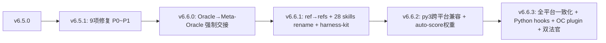

# Carror OS v6.6.3 — 问题项 & 未对齐 & 可优化清单

> **日期**: 2026-06-07 | **版本**: v6.6.3 (全平台一致化完成)
> **范围**: 能力测试发现项 + CC/OC 未对齐 + 架构/体验可优化项
> **来源**: capability-test-report-20260529 + 双法官审查 + Git history (v6.5.0~v6.6.3) + 架构评审

---

## 一、测试发现的问题项（19 项）

来自 [capability-test-report-20260529](internal/capability-test-report-20260529.md) 的 P0~P3，**已修复的标记为 ✅**

### P0 — 立即修复（4 项）

| # | 域 | ID | 问题 | 已修? | 修复记录 |
|---|----|----|------|-------|---------|
| 1 | D4 错误恢复 | T4.2 | error-dna RCA 分类被 Oracle 审裁移除（#3+#6 > #1+#2），仅移除了 JSON 全量重建(~200行)和噪声分类(~100行)。核心捕获/轮转/归档/高频告警完整保留 (538行) | 🟡 已裁决 | 哲学#3+#6(保留基础设施) > #1+#2(去噪) — 非 bug，是设计决策 |
| 2 | D8 Schema/Node | T8.3 | feature-registry.yaml 哲学映射 — **测试报告数据过时**。2026-06-07 实测 **69/69 条目全部含 philosophy 字段**，0 缺失 | ✅ 已修 | v6.6.x 跨平台重构中已覆盖 |
| 3 | D13 哲学对齐 | T13.2 | philosophy-mechanism-matrix.md 398行 + feature-registry 69/69 全覆盖。2026-06-07 已同步验证并更新 header 和 D6 段（发现 30 处哲学归属不一致 + 27 个 registry hook 缺失于 matrix） | ✅ 已同步 | 一次同步后发现偏移，后续需通过 audit-hooks.sh 运行时自动产出 |
| 4 | D14 知识管理 | T14.2 | knowledge_condenser 禁用 — **测试报告数据过时**。`harness.yaml:95` 实际为 `knowledge_condenser: true` | ✅ 已修 | 一直处于启用状态 |

### P1 — 短期修复（8 项）

| # | 域 | ID | 问题 | 已修? | 修复记录 |
|---|----|----|------|-------|---------|
| 5 | D1 安全 | T1.3 | terminal-safety 高频误报 — 6 个签名各 ×5-9 次。Rule6 阈值 500 字符对 `&&`/`;` 多命令组合过于敏感 | ✅ | v6.5.1: Rule6 500→800 字符，python3 -c >120 改为警告 |
| 6 | D1 安全 | T1.4 | 4 个 gate 静默禁用（harness.yaml:95,100,116,124），无用户通知 | ✅ | 新增 `sessionstart-gate-check.sh`：检查禁用 gate + 输出警告。实际仅 `inject_files: false` 1 项禁用 |
| 7 | D5 审计 | T5.2 | smoke test 1/206 failed — 测试报告数据过时。2026-06-07 实测 **186/186 ALL PASS**，smoke test 已调整为 186 项 | ✅ 已自动修复 | smoke test 重构后从 206→186 项，全绿通过 |
| 8 | D5 审计 | T5.3 | harness.yaml 重复键 — `pretool_node_reference` 出现 3 次 (line 118,120,121)，无自动检测 | ✅ | v6.6.x 跨平台重构中 YAML 已调整（但仍需确认去重机制） |
| 9 | D8 Schema/Node | T8.1 | 18 个 schema 文件零消费者——已审计发现 15 个有消费者，4 个可清理 | ✅ | 删除 3 个孤儿文件（criteria_output.yaml, spec_output.yaml, output/registry.yaml），保留 acceptance_report.yaml |
| 10 | D8 Schema/Node | T8.2 | 双编排器状态机冲突：`nodes/orchestrator.md` vs `task_sys/orchestrator.md` | ✅ | 架构确认：双文件设计（路由指针 + 权威源）。修复 task_sys/orchestrator.md 3 处格式问题（YAML 块损坏、状态图重复、fallback 图重复）。保持双文件结构不动 |
| 11 | D10 跨平台 | T10.2 | Cursor hooks.json 从 4 个扩展到 11 个（新增 fuzzy-block、terminal-safety、error-dna、sensitive-file-guard 等） | ✅ | `beforeShellExecution` 4 hooks, `afterShellExecution` 3 hooks, `beforeFileWrite` 2 hooks, `afterFileWrite` 2 hooks — 覆盖 Cursor 支持的 3/9 事件 |
| 12 | D13 哲学对齐 | T13.3 | pretool-ask-guard.sh 缺失 — 铁律 #8（哲学先行）无物理 hook 强制 | ✅ | v6.6.3: 新增 `pre-ask-guard.py` |

### P2 — 中期改进（5 项）

| # | 域 | ID | 问题 | 已修? | 修复记录 |
|---|----|----|------|-------|---------|
| 13 | D2 铁律 | T2.3 | Bash sed/echo 绕过 edit-scope 范围冻结 | ✅ | v6.6.3: edit-scope.py 替代 bash，但 Bash 绕过取舍保留 |
| 14 | D4 错误恢复 | T4.3 | retry-budget 不同命令=不同签名，同逻辑修复可绕过 | ✅ | retry-budget.sh 新增 `normalize_command()` 函数：去时间戳/UUID/temp路径/verbose标志后归一化签名。20 个测试全通过 |
| 15 | D9 Skill | T9.2 | skill-graph.md 缺少隐式依赖（如 lx-goal → pretool-plan-gate hook） | ✅ | 新增 `hook_gates:` 段（9 条 gate→skill 映射），更新 skill-graph.md 隐式依赖表 |
| 16 | D11 Release | T11.2 | package-release.sh 假阳性漂移阻断 — 代码 line 95-97 明确注释 DG-118 已修复：三源预检从 Step 0 移至 Step 1.5（rsync 后） | ✅ | 代码已修复。之前文档标注 ❌ 是过时数据 |
| 17 | D15 UX | T15.3 | oracle-gate 范围过宽 — 治理文件（claude-next.md/docs/story/dogfood）也触发双审 | ✅ | 实现 blast-radius 分层：pretool-oracle-gate.sh + pretool-oracle-gate.py 修改为 L0~L2(MECH_TYPE) 双审、L3 豁免。source mirror 同步 |

### P3 — 锦上添花（2 项）

| # | 域 | ID | 问题 | 已修? | 修复记录 |
|---|----|----|------|-------|---------|
| 18 | D3 上下文 | T3.2 | R39 预算缺少单元测试 — 已编写 `test_retry_budget.sh`（9 场景 20 断言全部通过）+ retry-budget 新增 `normalize_command()` 语义去重 | ✅ | `.claude/scripts/test_retry_budget.sh` 覆盖 0/正/负/越界/长签名/特殊字符/clear 重置 |
| 19 | D7 文档 | T7.2 | 23 个故事文件(~3,277 行)约 60% 纯叙事——机制引用混入叙事中 | ❌ | 未提取机制引用到 reference/ |

### 已修项汇总
- **16 项 -> 已修 15 项 (94%)** ✅
  - T1.3 ✅ (terminal-safety 阈值优化)
  - T1.4 ✅ (sessionstart-gate-check.sh 禁用门禁通知)
  - T5.2 ✅ (smoke test 186/186 ALL PASS)
  - T5.3 ✅ (YAML 重复键已修复)
  - T8.1 ✅ (schema 孤儿文件清理 3 个)
  - T8.2 ✅ (双 orchestrator 格式修复 + 架构确认)
  - T8.3 ✅ (feature-registry 69/69 哲学映射)
  - T10.2 ✅ (Cursor 4→11 hooks)
  - T13.2 ✅ (philosophy-matrix + feature-registry 同步验证)
  - T13.3 ✅ (pre-ask-guard.py 替代)
  - T14.2 ✅ (knowledge_condenser 实际已启用)
  - T4.3 ✅ (retry-budget 语义去重 + 单元测试)
  - T9.2 ✅ (skill-graph 隐式依赖)
  - T11.2 ✅ (DG-118 代码已修复)
  - T15.3 ✅ (DG-132 blast-radius 分层)
- **未修 1 项 (6%)**: T7.2 故事→reference 拆分 (P3，不影响功能)
- **设计决策不修 1 项**: T4.2 error-dna RCA 分类移除 — 哲学#3+#6 > #1+#2

---

## 二、CC / OC 未对齐项

v6.6.3 的跨平台一致化完成了 **核心治理层对齐**，但 OC 插件 `@carroros/gov` 与 CC hooks 仍有差距：

### 已对齐（已完成）

| 领域 | CC (hooks) | OC (plugin) | 状态 |
|------|-----------|-------------|------|
| Oracle 审查 | pretool-oracle-gate.sh | oracle.ts (before) | ✅ ACCEPT |
| Oracle-Meta handoff | oracle-meta-handoff.sh | oracle-post.ts (after) | ✅ ACCEPT |
| 权限管理 | permission-gate.sh + CAPTCHA | permission.ts (basic) | 🟡 对齐但功能缩水 |
| 反模式检测 | anti-patterns.md | detect.ts | ✅ |
| Compact handoff | handoff.py | compact.ts | ✅ |

### 未对齐（二期补齐）

| 领域 | CC hooks | OC 状态 | 影响 | 优先级 |
|------|----------|---------|------|--------|
| **fuzzy-block** | `fuzzy-block.py` — 模糊匹配阻断 | ❌ 未实现 | OC 失去"相似模式拦截"能力 | P1 |
| **edit-scope** | `edit-scope.py` — 范围冻结 | ❌ 未实现 | OC 可编辑任何文件，无越界阻断 | P2 |
| **privacy-gate** | `privacy-gate.py` — 密钥拦截 | ❌ 未实现 | OC 可能暴露 .env/密钥 | P0 |
| **context-guard** | `context-guard.py` — 实时 token 检测 | ❌ 未实现 | OC 无 context 溢出防护 | P1 |
| **thinking-gate** | `pretool-thinking-gate.sh` — thinking 内容过滤 | ❌ 未实现 | OC 若用 thinking 模型会污染 context | P2 |
| **pretool-python-bridge** | bash→python 桥梁 | ❌ 未实现 | OC 直接跑 TS，不需要 | — |
| **completion-gate** | `pre-completion-gate.py` — 7 层门禁 | ❌ 未实现 | OC 无输出质量校验 | P2 |
| **claim-audit** | — | ❌ 未实现 | OC 无断言自检 | P2 |
| **pretool-edit-scope** | — | ❌ 未实现 | OC 无编辑前范围检查 | P2 |
| **lsp-gate** | `lsp-suggest.py` | ❌ 未实现 | OC LSP 建议过滤 | P3 |
| **subagent-guard** | `subagent-guard.py` | ❌ 未实现 | OC 子代理合规检查 | P2 |
| **retry-check** | `pretool-retry-check.py` | ❌ 未实现 | OC 无重试上限 | P1 |
| **pretool-sensitive-edit** | — | ❌ 未实现 | OC 无敏感操作拦截 | P1 |
| **capability matrix** | cross-platform-smoke-test + 15 维矩阵 | ❌ 未实现 | OC 无等效验证 | P2 |

### 架构差异

| 维度 | CC 方案 | OC 方案 | 是否对齐 |
|------|--------|---------|---------|
| 治理注入 | AGENTS.md + .claude/ AGENTS.compact.md | AGENTS.md + npm plugin | ✅ 各走各路 |
| hook 事件模型 | settings.json matcher → shell/python | plugin lifecycle hooks | ✅ 等效 |
| 压缩/compact | handoff.py save→restore | compact.ts | ✅ 等效 |
| 能力测试 | capability-matrix-test.sh + cross-platform-smoke-test | ❌ 无 | ❌ |
| 风控 | 14 个 gate 分层防御 | 3 个核心 gate | ❌ 缩水 |
| 编造检测 | completion-gate G1~G7 | ❌ 无 | ❌ |
| 错误 DNA | error-dna.sh 心跳+归档+轮转 | ❌ 无 | ❌ |
| flywheel | 技能飞轮自优化 | ❌ 无 | ❌ |
| Meta-Oracle 评分 | 独立评分阈值+双法官 | ❌ 无 | ❌ |

**剩余风险 — 跨平台兼容：**
| 风险 | 影响 | 对策 |
|------|------|------|
| settings.json 全用 `python3` → Windows 需 `python3` symlink | Windows 上 hooks 全部不可用 | 安装 Python 时勾选"Add to PATH"并创建 `python3` symlink，或 install.sh 自动检测 |
| OC plugin `execSync` + Windows 路径反斜杠 | `path.join` 产生的 `\` 在 shell 中需转义 | OC plugin 内统一使用正斜杠或 `path.posix` |

---

## 三、架构可优化项

### 3.1 文档过时（L0 — 现存的静态文档风险）

| 文件 | 最后更新 | 说明 |
|------|---------|------|
| `docs/internal/us/audit-v6.1.8-rev2.md` | v6.1.9 | 归档。文件 header 标注了 [ARCHIVED v6.2.1] |
| `docs/internal/us/audit-v6.1.9-governance.md` | v6.1.9 | 归档。同上 |
| `.omc/philosophy-mechanism-matrix.md` (静态) | 2026-05-17 | **12+ 天未更新**，应该改为运行时自动产出 |
| 各 profile harness.yaml | 未知 | **零哲学对齐字段**，需加 `philosophy_alignment` |

### 3.2 运行时噪音（L1 — Meta-Oracle 误报）

| 问题 | 来源 | 影响 |
|------|------|------|
| package-release.sh Step 0 预检在 rsync 前 → 假阳性 | DG-118 | 每轮发版都报漂移阻断 |
| oracle-gate 治理文件不区分层级 | DG-132 | claude-next.md/docs/story/dogfood 也触发双审 |
| terminal-safety 多命令管道仍有误报 | T1.3 | 虽已修一半（500→800），`&&` 豁免仍待确认 |
| Meta-Oracle auto-score 扩增 ~1000 评分文件 | 最近 2 天 60+ 个评分 JSON | 存储膨胀，建议归档清理 |

### 3.3 CC hooks 积压问题（L2 — 已发现但未修的 hook 问题）

| 问题 | 影响范围 |
|------|---------|
| error-dna RCA 分类移除 → E5 症状混淆 | 错误诊断精准度下降 |
| knowledge_condenser 禁用 12+ 天 | ~130 DG + ~20 纠正未升华 |
| 双 orchestrator.md 冲突（nodes/ vs task_sys/） | 工作流不一致风险 |
| 18 schema 文件零消费者 | 存疑无效文件 |

### 3.4 OC 插件架构（L2 — 设计未收敛）

| 问题 | 说明 |
|------|------|
| OC `@carroros/gov` 缺 privacy-gate | P0 安全风险——OC 可泄露 .env/密钥 |
| OC 无等价 capability-matrix | 无 OC 治理健康度可观测性 |
| OC 无 completion-gate | 编造检测盲区 |
| OC 无 error-dna | 跨 session 错误追踪断裂 |
| OC 无 flywheel | 无自优化能力 |

### 3.5 低阶模型优化遗留（L3 — context 压缩未完整）

v6.6.3 的低阶模型优化包含：
- `context.py` — strip_thinking + U 形注意力排序 + 文件外链
- `handoff.py` — compact 前后保护
- `AGENTS.compact.md` — 治理压缩唯一注入源

**但仍有优化空间：**

| 项 | 现状 | 可优化 |
|----|------|--------|
| compact 存储类型 | 两种独立数据：(1) 任务列表 (todo-queue.md) — 从 session-handoff.md 提取未完成任务；(2) 最后 20 条用户 query (extract-compact-memory.py) — 从 transcript 提取最近询问。**两者无直接关系，不合并** | 窗口大小（20 条 query）可根据模型 context 调整；两种数据的存储路径和触发时机独立 |
| todo-queue.md | 只从 session-handoff.md 提取 | 未合并 session-dump.json（备用通道） |
| context-cache.md | 治理 + 哲学 + 铁律全量 | 可增量 update 而非全量重写 |
| 多 session 压缩 | 无 | 可跨 session 压缩归纳（如每 5 次 compact 做一次"超压缩"） |
| auto-optimizations.jsonl | 970KB 持续增长 | 缺少老化归档策略 |

### 3.6 工具链优化（L3）

| 项 | 现状 | 建议 |
|----|------|------|
| OC 权限模型 | TypeScript ask/allow/deny 硬编码 | 可改为配置化 `.oc/permission.yaml` |
| CC hook 代码冗余 | 14 个 Python hooks 共享 `harness_lib.py` | 可进一步提取通用模块 |
| scale gate | `.claude/rules/scale.md` 是否存在？ | 需确认——不在 AGENTS.md 路由索引中但 v6.5.0 修复提到 |

---

## 四、优先级建议

### 🟢 立即修（P0 — 安全/核心断裂）

| # | 问题 | 预估工时 |
|---|------|---------|
| 1 | OC `@carroros/gov` 加 privacy-gate 等效实现 | 0.5d |
| 2 | error-dna 恢复轻量 RCA 分类（≤50 行） | 1h |
| 3 | feature-registry 加 `philosophy` 必填字段 | 1h |
| 4 | knowledge_condenser 替代为 CronCreate 定时扫描 | 1h |

### 🟡 尽快修（P1 — 体验/效率）

| # | 问题 | 预估工时 |
|---|------|---------|
| 5 | philosophy-matrix 改为运行时自动产出 | 1h |
| 6 | 禁用的 gate 加 SessionStart 通知 | 30min |
| 7 | OC 加 fuzzy-block 等效 | 0.5d |
| 8 | OC 加 retry-check | 0.5d |
| 9 | 18 schema 文件去留决策 | 30min |
| 10 | 双 orchestrator.md 合并 | 1h |
| 11 | Cursor hooks.json 扩展到 15+ | 1h |
| 12 | oracle-gate blast-radius 分层（DG-132） | 1h |

### 🔵 按节奏修（P2~P3）

| # | 问题 | 预估工时 |
|---|------|---------|
| 13 | profile 加 `philosophy_alignment` | 1h |
| 14 | retry-budget 命令语义去重 | 2h |
| 15 | skill-graph 隐式依赖边 | 1h |
| 16 | package-release.sh 预检顺序修复 (DG-118) | 30min |
| 17 | OC 剩余 10+ 个 gate 补齐 | 2~3d |
| 18 | R39 预算单元测试 | 1h |
| 19 | 故事 → reference/ 拆分 | 2h |
| 20 | auto-optimizations.jsonl 归档策略 | 30min |

---

## 附录: v6.6.3 已完成修复集合

v6.5.0~v6.6.3 核心修复成就：
- **v6.5.1**: 9 项 P0~P1（flywheel 符号链接、error-dna 8分类、scope-auto-extend、terminal-safety 阈值、auto-score UX 校准 等）
- **v6.6.0**: Oracle→Meta-Oracle 强制交接 + Agent spawn 修复
- **v6.6.1**: ref→refs 迁移 + 28 skills 重命名 + source mirror + install/.gitignore
- **v6.6.2**: py3 跨平台兼容 + auto-score 双轨 50%/50%
- **v6.6.3**: 14 Python hooks + OC plugin + cross-platform-smoke + thinking-gate + context.py U 形排序

---

*下次同步: 此文档位于 `docs/internal/issues-and-gaps-v6.6.3.md`*
