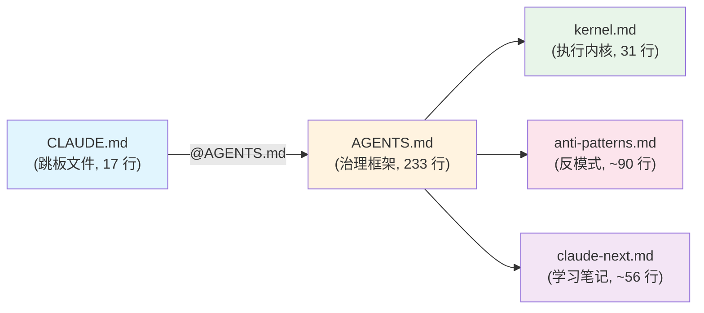
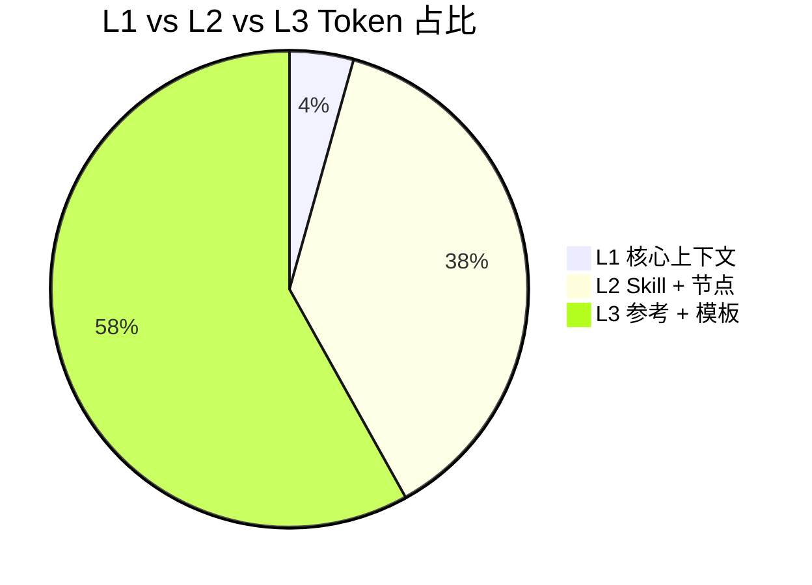

# 01 — 渐进式披露（Progressive Disclosure）

> **L1~L3 分层加载策略：用 4.4% 的上下文承载 100% 的治理能力**

---

## Function

渐进式披露（Progressive Disclosure）是 Carror OS 解决 **AI 上下文窗口有限性与治理规则无限性**这对根本矛盾的策略。

当 AI 启动一个 Carror OS 项目时，它面临一个选择：

- 把所有规则、技能文档、反模式清单、节点文件全部塞进上下文 → 上下文立刻爆炸，留下极小的执行空间
- 只加载最必要的核心规则，其余规则按需加载 → 上下文充裕，指令遵从度更高

Carror OS 选择后者，将知识分入三个加载层级（L1/L2/L3），每个层级有明确的加载时机和生命周期。

[已验证: `.claude/scripts/loading_benchmark.py` 第 37-45 行] L1 核心文件定义：

```python
L1_PATHS = [
    REPO_ROOT / "CLAUDE.md",
    REPO_ROOT / "AGENTS.md",
    CLAUDE_DIR / "kernel.md",
    CLAUDE_DIR / "anti-patterns.md",
    CLAUDE_DIR / "claude-next.md",
]
```

### L1 — 会话启动时强制加载（~7,500 tokens）

这是 AI 每次启动会话时自动注入的 5 个文件，构成**执行内核**。它们通过 `@` 前缀链式引用：

```
@AGENTS.md → CLAUDE.md → kernel.md + anti-patterns.md + claude-next.md
```

| 文件 | 路径 | 内容 | 行数（约） |
|------|------|------|-----------|
| **AGENTS.md** | `AGENTS.md` | 6 条铁律、证据门禁、Git 门禁、初始化协议 | 233 |
| **CLAUDE.md** | `CLAUDE.md` | 跳板文件，`@AGENTS.md` 入口 + Claude Code 专属配置 | 17 |
| **kernel.md** | `.claude/kernel.md` | 架构铁律、命名规则、错误处理（宪法冻结声明） | 31 |
| **anti-patterns.md** | `.claude/anti-patterns.md` | 6 类 AI 反模式检测与纠偏指南（A-F） | ~90 |
| **claude-next.md** | `.claude/claude-next.md` | AI 学习笔记，项目特有经验与纠正记录 | ~56 |

[已验证: `AGENTS.md` 第 28-35 行] 核心执行上下文声明：

> 以下文件在每次会话启动时通过 `@` 前缀显性引入，确保 AI 执行上下文完整
> 未触发 skill 时不加载 L2/L3 文件，保持首次加载 ≤120 行

### L2 — Skill 触发后按需加载

当 AI 进入特定阶段或触发某个 skill（如 `lx-code-review`、`lx-todo`）时，L2 文件被加载：

- 所有 `SKILL.md` 文件（`.claude/skills/*/SKILL.md`）
- 节点系统文件（`.claude/nodes/` 目录）
- 按需加载的 `task_sys/` 文件（orchestrator.md, context_guard.md, loading_matrix.md 等）

[已验证: `.claude/scripts/loading_benchmark.py` 第 110-153 行] L2 发现逻辑：

```python
def discover_skill_skills():
    """Discover all SKILL.md files under .claude/skills/."""
    return sorted(SKILLS_DIR.glob("*/SKILL.md"))

def discover_node_files():
    """Discover all .md files under .claude/nodes/."""
    # 排除 README.md
    return [...]
```

### L3 — 精确操作时微加载

当 AI 执行某个具体操作时（如代码审查的具体规则、安全扫描的具体模式），L3 文件才被加载：

- Skill 参考文档（`.claude/skills/*/references/` 目录）
- 任务模板文件（`.claude/task_sys/templates/` 目录）

### 对比数据

| 指标 | L1（渐进式） | L1+L2+L3（全量） | 节省比例 |
|------|-------------|-----------------|---------|
| 文件数 | 5 | 143 | 96.5% |
| 行数 | ~427 | ~9,200 | 95.4% |
| Token 数 | ~7,500 | ~173,000 | **95.6%** |

Token 节省 95.6% 意味着：以 200K 上下文窗口为例，L1 仅消耗约 7.5K，留下 **192.5K** 供对话历史和实际编码使用。全量加载则只剩约 27K。

---

## Philosophy

### 为什么分层，而不是全量？

渐进式披露的设计基于三个观察：

**1. 上下文窗口是硬约束**

AI 模型的上下文窗口虽然不断增长（100K → 200K → 1M），但质量并非线性。当上下文达到一定阈值时会出现 **Lost in the Middle** 效应——模型对中间部分的注意力急剧下降。全量注入所有规则后，规则数量本身成为噪音。

[已验证: `docs/concepts/context-control.md` 第 9-17 行]：

> 当会话增长到一定规模，模型关注较早上下文的能力急剧下降。在 AI 辅助开发中，这意味着：
> - 超过 30 轮的代码重构生成支离破碎的代码库
> - AI 自信地说"任务已完成"，同时悄悄删除了关键函数
> - 每一条新指令都让幻觉更严重

**2. 大多数规则在大多数时间不被需要**

一个典型的开发会话中：
- 90% 的时间在编码和调试——需要 kernel.md（架构规则）
- 5% 的时间在提交——需要 Git 门禁规则
- 3% 的时间在审查——需要 skill 文档
- 2% 的时间在回顾反模式——需要 anti-patterns.md

如果所有规则在所有时间都加载，AI 会被不相关的指令淹没。规则之间的优先级冲突也会降低遵从度。

**3. 引用式知识比注入式知识更可靠**

全量注入把知识变成"指令"——AI 必须同时遵循所有指令。分层加载把知识变成"参考"——AI 在需要时读取，理解更准确、遵从度更高。

### 与 RPE 特性的关系

RPE（Research-Plan-Execute）特性开发周期利用分层加载在不同阶段注入不同知识：

- **Research 阶段**：L1 + 研究相关 L2 节点
- **Plan 阶段**：L1 + plan-gate 规则
- **Execute 阶段**：L1 + 相关 skill 的 L3 参考文档

---

## Benefits

### 1. 更高的指令遵从度

L1 只有 5 个文件，AI 可以精确记住并遵从其中的每一条规则。全量加载下的大量规则相互竞争注意力，导致部分规则被"遗忘"。

### 2. 更长的有效会话

192.5K 可用上下文 vs 27K 可用上下文的区别意味着：
- 更长的连续编码会话而不需要压缩
- 更复杂的操作序列可以一次性完成
- 更少的手动上下文重置

### 3. 更低的 Token 消耗

按每次会话 200K 输入 token 计算，每次启动节省约 165K token。一个活跃开发者每天 20 个会话，每月节省约 **99M input tokens**。

### 4. 技能解耦

新的 skill 只需添加自己的 `SKILL.md` 和 `references/` 目录，不需要修改核心上下文。20+ 个内置 skill 各自独立，互不干扰。

[已验证: `.claude/feature-registry.yaml` 第 171-287 行] 技能注册表列出 23 个独立的技能，每个技能的文件仅在触发时加载。

---

## Implementation

### 1. @ 链式引用

CLAUDE.md 通过 `@AGENTS.md` 引入主治理文件，AGENTS.md 在"核心执行上下文"部分声明 L1 文件。

```
CLAUDE.md → @AGENTS.md ↓
            ├── kernel.md (架构铁律)
            ├── anti-patterns.md (反模式指南)
            └── claude-next.md (学习笔记)
```

[已验证: `CLAUDE.md` 第 1 行]：

```
@AGENTS.md
```

### 2. 分层目录结构

```
.claude/
├── kernel.md              # L1: 核心执行内核
├── anti-patterns.md       # L1: 反模式检测
├── claude-next.md         # L1: 学习笔记
├── nodes/                 # L2: 节点系统
│   └── gate_checker.md
├── skills/                # L2: 技能定义
│   ├── lx-code-review/
│   │   └── SKILL.md
│   └── lx-todo/
│       └── SKILL.md
├── skills/*/references/   # L3: 技能参考文档
└── task_sys/templates/    # L3: 任务模板
```

[已验证: `.claude/scripts/loading_benchmark.py` 第 338-342 行] 层级定义：

```python
# Layer Definitions:
| **L1** | CLAUDE.md, AGENTS.md, kernel.md, anti-patterns.md, claude-next.md | Always loaded at session start |
| **L2** | All SKILL.md files, node system files, on-demand task_sys/ files | Loaded on-demand when entering a specific phase or triggering a skill |
| **L3** | Skill reference docs, task template files | Precision-loaded when performing a specific operation |
```

### 3. Enhanced 模式

当激活 Enhanced 模式时，task-spec 技能通过 `loading_matrix.md` 映射表控制节点加载。激活方式：

[已验证: `AGENTS.md` 第 217-220 行] 或 `.claude/profiles/enhanced/append-to-claude.md`：

```bash
cat .claude/profiles/enhanced/append-to-claude.md >> CLAUDE.md
```

### 4. loading_benchmark.py 测量工具

[已验证: `.claude/scripts/loading_benchmark.py` 第 1-534 行] 这是一个 Python 测量脚本：

- **方法**：使用 `tiktoken cl100k_base` 编码（Claude 兼容分词器），回退为 `chars/4` 估算
- **测量范围**：扫描 `.claude/` 下的所有治理/技能文件
- **输出**：终端 stdout + `.claude/state/benchmark-report.md`（持久化报告）
- **特性**：幂等执行，可重复运行
- **验证能力**：自动验证 `loading_matrix.md` 中声称的"394 行 → ~120 行，减少 70%"

```bash
# 运行加载基准测试
python3 .claude/scripts/loading_benchmark.py
```

### 5. inject-project-knowledge hook

[已验证: `.claude/feature-registry.yaml` 第 74-79 行] 该 hook 在会话启动时自动注入 L1 核心文件：

```yaml
- name: inject-project-knowledge
  type: injector
  category: knowledge
  description: 会话启动时注入 kernel.md / claude-next.md / anti-patterns.md
  enabled_by_default: true
  evidence_level: L3
```

---

## Core Code

### loading_benchmark.py — 核心测量逻辑

```python
# L1: Session startup files (always loaded)
L1_PATHS = [
    REPO_ROOT / "CLAUDE.md",
    REPO_ROOT / "AGENTS.md",
    CLAUDE_DIR / "kernel.md",
    CLAUDE_DIR / "anti-patterns.md",
    CLAUDE_DIR / "claude-next.md",
]

def count_tokens(text: str):
    """Count tokens using tiktoken cl100k_base."""
    if _get_tokenizer():
        import tiktoken
        enc = tiktoken.get_encoding("cl100k_base")
        return len(enc.encode(text)), "tiktoken cl100k_base"
    return max(1, len(text) // 4), "chars/4 estimate"

def scan_all_layers():
    """Scan filesystem and classify files into layers."""
    l1 = [(path, rel) for path in L1_PATHS if path.exists()]
    l2 = [skill_skills + node_files + on_demand_task_sys]
    l3 = [skill_references + task_templates]
    return l1, l2, l3
```

[已验证: `.claude/scripts/loading_benchmark.py` 第 37-45 行、第 72-83 行、第 156-200 行]

### Authoritative Hierarchy

[已验证: `AGENTS.md` 第 37-43 行] 权威等级决定分层加载时的优先级：

```
用户即时指令 > 项目宪法(CLAUDE.md) > PRD > Skill规则 > 设计文档 > 代码现状
```

---

## Logic Flow

L1→L2→L3 加载流程：

1. **会话启动**：自动加载 L1（5 文件，~427 行）
2. **任务接收**：解析意图，匹配技能或节点
3. **技能触发**：按需加载对应的 L2（SKILL.md + 节点文件）
4. **精确操作**：在执行具体操作时微加载 L3 参考文档
5. **完成后卸裁**：L3 引用完成即释放，L2 在技能结束后保持挂起状态

Enhanced 模式在此基础上有更复杂的节点路由，但核心的 L1→L2→L3 路径不变。

---

## Visual Diagram

### L1→L2→L3 加载流程图

```mermaid
flowchart TD
    Start([会话启动]) --> L1["加载 L1 核心上下文<br/>(5 文件 / ~427 行 / ~7.5K tokens)"]
    L1 --> Task[接收用户任务]

    Task --> Q{需要 Skill?}
    Q -- 否 --> Direct[直接执行<br/>(仅 L1, 保持轻量)]
    Q -- 是, 例如 lx-todo --> L2_Skill["加载 L2<br/>SKILL.md + 节点系统<br/>(按需)"]
    Q -- 是, Enhanced 模式 --> L2_Enhanced["加载 L2<br/>task_sys 文件<br/>(orchestrator.md 等)"]

    L2_Skill --> L2_Ready{需要 Reference?}
    L2_Enhanced --> L2_Ready
    L2_Ready -- 否 --> Execute["执行任务\n(L1 + L2)"]
    L2_Ready -- 是 --> L3["微加载 L3<br/>references/ + templates/<br/>(精确操作时)"]
    L3 --> Execute

    Execute --> Done([任务完成, 释放 L3/L2])
    Direct --> Done
```

### 上下文对比柱状图

```mermaid
xychart-beta
    title "L1 渐进式 vs 全量加载上下文消耗对比"
    x-axis ["文件数", "行数", "Token 数 (千)"]
    y-axis "数量" 0 --> 10000
    bar [5, 427, 7.5]
    bar [143, 9200, 173]
```



### L1 链式引用关系图



### Token 使用占比



---

## 前置引用与反向链接

### 前置引用（阅读本文前建议了解）

- [AGENTS.md — 6 条铁律与核心执行上下文](../AGENTS.md) — L1 文件的核心来源
- [kernel.md — 代码执行内核](../.claude/kernel.md) — L1 文件之一，架构铁律的源头
- [claude-next.md — AI 学习笔记](../.claude/claude-next.md) — L1 文件之一，体现自我改进循环

### 反向链接（本文为以下文档提供基础）

- **讲座 05: Context Control（上下文守卫）** — 渐进式披露减少上下文消耗，上下文守卫防止上下文超限。两者构成上下文管理的"开源节流"：披露策略减少输入，守卫策略管理输出
- [Context Control — 概念文档](../docs/concepts/context-control.md) — 上下文两层防御机制的详细说明
- [loading_benchmark.py — 加载基准测试](../.claude/scripts/loading_benchmark.py) — 自动化测量工具，验证分层策略的实际效果
- [Gates — Gate 系统](../docs/concepts/gates.md) — completion-gate 依赖 L1 的证据规则体系来验证完成声明
- [feature-registry.yaml — 功能注册表](../.claude/feature-registry.yaml) — 注册了 inject-project-knowledge hook，实现 L1 自动注入
- [Enhanced 激活指南](../.claude/profiles/enhanced/append-to-claude.md) — Enhanced 模式下 task_sys 节点的分层加载

### 相关讲座

- **讲座 05: Context Control** — 上下文守卫机制（80% 硬阻断 + 50% 主动交接），与渐进式披露形成上下文管理的完整方案
- **讲座 02: Gates** — 证据门禁与 Git 门禁是 L1 核心内容的一部分，completion-gate 直接引用 evidence 层级体系

---

*讲座系列：Carror OS — AI Native Developer Operating System*
*下一篇：02 — Gates（Gate 防御系统：4+ 安全门禁）*
