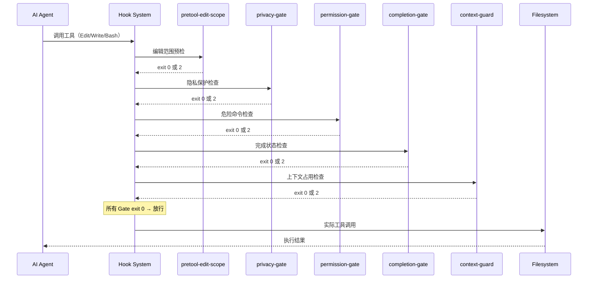
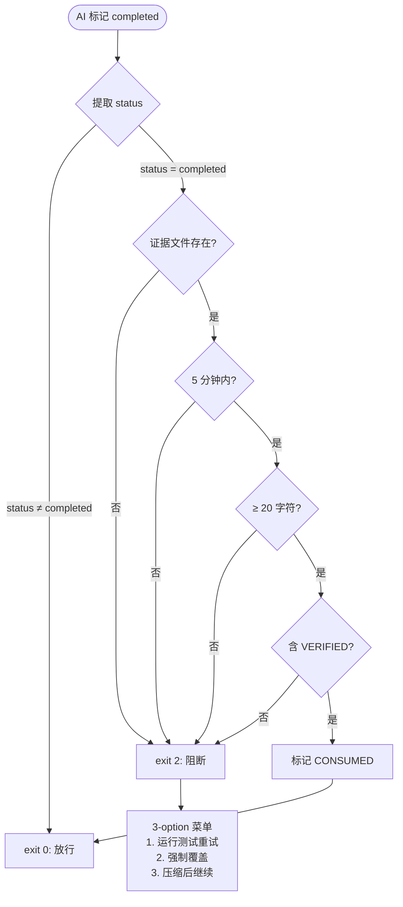
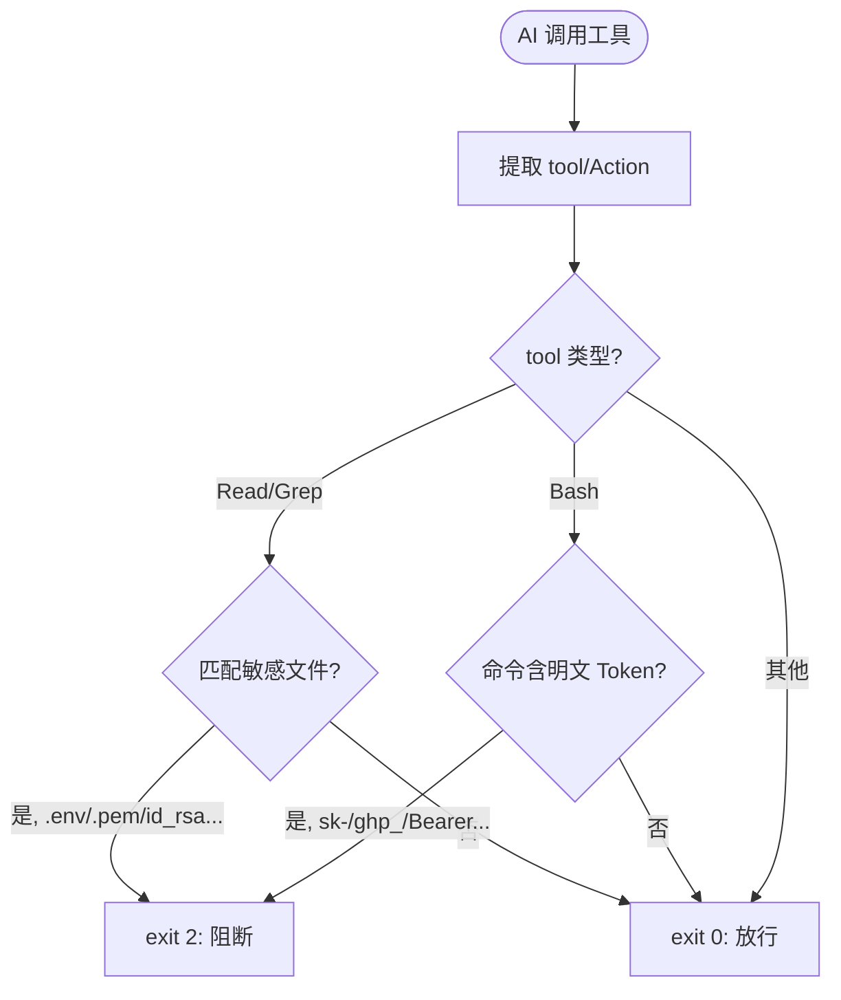
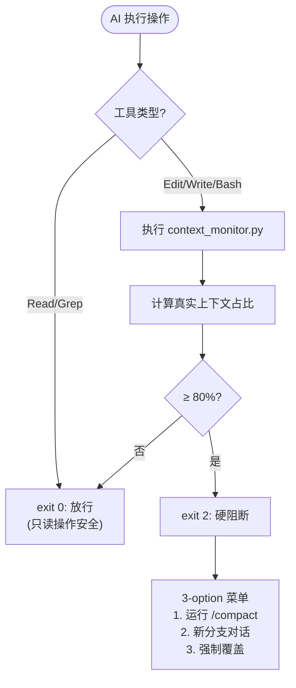
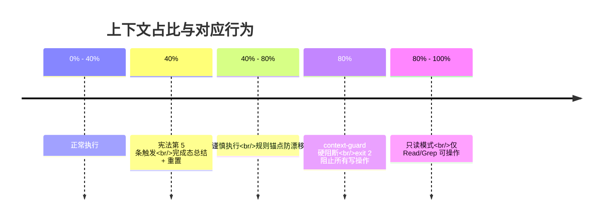

# 02 — Gates（Gate 防御系统）

> **4+ 安全门禁：物理阻断 AI 在文件系统边界的危险行为**

---

## Function

Carror OS 的 Gate 系统是一组位于 **AI 与文件系统之间**的物理拦截器。每个 Gate 是一个 shell 脚本，通过 Hook 层在 AI 调用工具之前拦截原始输入，决定 **放行（pass）、阻断（block）还是升级（escalate）**。

[已验证: `docs/concepts/gates.md` 第 9-17 行]：

> A Gate is not a suggestion. It is a **physical blocker** in the hook layer that intercepts an AI action before it reaches the filesystem.
>
> The AI cannot talk its way around a Gate. The Gate does not listen to prompts -- it reads raw tool inputs.

这与传统的"提示约束"（prompt constraints）有本质区别：

| 维度 | 提示约束（Prompt Constraints） | Gate 物理拦截 |
|------|-------------------------------|--------------|
| 实现层 | 系统提示词 | Shell Hook |
| 绕过方式 | AI 可忽略或遗忘 | AI 无法绕过 |
| 判断依据 | AI 对自己行为的解读 | 原始工具输入 |
| 可靠性 | 自验证偏差 | 无偏差 |
| 退出码 | 无 | exit 0=放行, exit 2=阻断, exit 1=错误 |

### 当前已注册的 Gate 类型

[已验证: `.claude/feature-registry.yaml` 第 7-169 行] 功能注册表中共注册了 9 类 Gate：

| Gate 名称 | 类型 | 类别 | 描述 | 默认启用 |
|-----------|------|------|------|---------|
| permission-gate | gate | security | 危险命令拦截 | 是 |
| privacy-gate | gate | security | 敏感文件/DLP 保护 | 是 |
| subagent-guard | gate | security | 子代理类型安全门禁 | 是 |
| preTool-edit-scope | guard | quality | 编辑范围预检 | 是 |
| edit-guard | guard | quality | 编辑内容质量门禁 | 是 |
| build-validator | gate | quality | 编译验证门禁 | 是 |
| plan-gate | gate | delivery | 非琐碎任务强制 planning | 否 |
| completion-gate | gate | delivery | 假完成拦截 | 是 |
| context-guard | gate | runtime | 上下文守卫 | 是 |

本文详述其中的 5 个核心 Gate。

---

## Philosophy

### 为什么需要物理 Gate？

AI 的安全机制通常依赖"自我约束"——告诉 AI 规则，让它自己遵守。这种方法有三个根本缺陷：

**1. AI 会遗忘规则**

在长对话中，早期注入的约束性规则会被后续的对话历史推挤到注意力之外。模型不是故意违反规则，而是真的"忘记了"。

**2. 自验证偏差**

AI 在判断自己是否遵守规则时存在系统性偏差。它认为自己正在提供"证据"时，实际上可能只给出了断言。这是 completion-gate 要解决的核心问题。

**3. 规则冲突时无优先级仲裁**

当多条指令同时存在时（例如"尽快完成"vs"提供证据"），AI 倾向于优先执行"行动导向"的指令而非"约束导向"的指令。

Gate 系统通过**物理拦截**解决这些问题：
- Gate 不依赖 AI 的记忆——它读取的是工具调用的原始 JSON
- Gate 不依赖 AI 的判断——它匹配的是硬编码的正则和文件模式
- Gate 无法被 AI 绕过——exit 2 是比 prompt 更高的优先级

### 与 6 条铁律的关系

[已验证: `AGENTS.md` 第 47-54 行] 6 条铁律中的第 3、4、6 条直接映射到 Gate：

| 铁律 | 一句话 | 对应 Gate |
|------|--------|----------|
| 3. 证据门禁 | 无证据禁止说"已完成/已验证" | completion-gate |
| 4. Git 门禁 | 编译通过 → 功能通过 → 报告 → 用户批准 → 提交 | permission-gate |
| 6. 隐私防线 | 绝对禁止读取 .env/私钥 | privacy-gate |

---

## Benefits

### 1. 防止"假完成"

AI 在长对话中最危险的行为之一就是声称"已完成"但实际上遗漏了关键步骤。completion-gate 在物理层面阻断这种行为：没有证据文件，标记完成的操作就会被拦截。

### 2. 防止危险操作

`rm -rf`、`git push --force`、`DROP TABLE` 这些操作在 AI 手中特别危险，因为 AI 不理解"不可逆"的含义。permission-gate 确保每次危险操作都需要明确的人类授权。

### 3. 防止隐私泄露

AI 模型不应接触环境变量、私钥、API token。privacy-gate 在文件读取层进行拦截，读取 `.env` 等敏感文件的尝试会被直接阻断，token 明文出现在命令中也会被检测。

### 4. 防止上下文崩溃

当上下文占用超过 80% 时，AI 进入幻觉高发区。context-guard 作为物理保险丝，在此时强制阻断写/执行操作。

### 5. 防止范围越界

pretool-edit-scope 确保 AI 在每个 Step 只修改计划内的文件，防止"顺手"修改无关文件导致的连锁问题。

---

## Implementation

### 1. completion-gate — 假完成拦截

[已验证: `.claude/hooks/completion-gate.sh` 第 1-97 行]

**触发时机**：PreToolUse:TaskUpdate（当 AI 尝试将任务状态字段改为 `completed` 时）

**工作流程**：

1. 提取 `tool_input.status` 字段
2. 如果状态不是 `completed` → exit 0（放行）
3. 如果是 `completed` → 检查证据文件 `/tmp/.completion-evidence-YYYYMMDD`
4. 证据文件必须在最近 5 分钟内写入，且包含：
   - 至少 20 字符的实际描述
   - 关键字 `VERIFIED`
5. 通过 → 标记证据文件为 "CONSUMED" 后放行
6. 不通过 → 输出 3-option 菜单并 exit 2（硬阻断）

**关键代码**（第 35-68 行）：

```bash
EVIDENCE_FILE="/tmp/.completion-evidence-$(date +%Y%m%d)"
if [ -f "$EVIDENCE_FILE" ]; then
    FRESH=$(python3 -c "import os, time; \
        age = time.time() - os.path.getmtime('$EVIDENCE_FILE'); \
        print('yes' if age < 300 else 'no')")
    if [ "$FRESH" = "yes" ]; then
        CONTENT=$(cat "$EVIDENCE_FILE" 2>/dev/null)
        CONTENT_LEN=${#CONTENT}
        if [ "$CONTENT_LEN" -lt 20 ]; then
            echo "⛔ COMPLETION BLOCKED: 证据内容过短" >&2
            exit 2
        fi
        if ! echo "$CONTENT" | grep -q "VERIFIED"; then
            echo "⛔ COMPLETION BLOCKED: 证据中无 VERIFIED 关键字" >&2
            exit 2
        fi
        echo "CONSUMED at $(date -u +"%Y-%m-%dT%H:%M:%SZ")" >> "$EVIDENCE_FILE"
        exit 0
    fi
fi
```

**阻断菜单**（第 84-96 行）：

```
⛔ COMPLETION BLOCKED: 你正在标记任务为 completed，但未提供验证证据。

请选择：
  1. 运行测试重试
  2. 强制覆盖（需说明理由）
  3. 压缩上下文后继续

输入数字 (1-3):
```

**与 AGENTS.md 证据体系的关系**：completion-gate 引用了 `feature-registry.yaml` 中的 `evidence_level` 字段（第 78-82 行），动态读取每个 Gate 的预期证据级别。

### 2. permission-gate — 危险命令拦截

[已验证: `.claude/hooks/permission-gate.sh` 第 1-126 行]

**触发时机**：PreToolUse:Bash（当 AI 执行 shell 命令时）

**拦截模式**：

| 模式 | 正则表达式 | 严重等级 |
|------|-----------|---------|
| `git commit` | `git\s+(commit\|add\s+--?all)` | 🟡 高危 |
| `git push` | `git\s+push\b` | 🟡 高危 |
| `git push --force` | `git\s+push\s+--?force` | 🔴 致命 |
| 破坏性操作 | `\brm\s+-rf\b\|drop\s+(table\|database)\b\|truncate\|delete from` | 🔴 致命 |
| `sudo` | `^\s*sudo\b` | 🟡 高危 |

**关键代码**（第 34-38 行）：

```bash
GIT_COMMIT_RE=$(hc_get "permission_gate.git_commit_regex" \
    'git\s+(commit|add\s+--?all|\badd\b.*-A)')
GIT_PUSH_FORCE_RE=$(hc_get "permission_gate.git_push_force_regex" \
    'git\s+push\s+(\S+\s+)?(\S+\s+)?--?force|git\s+push\s+--?force')
DESTRUCTIVE_RE=$(hc_get "permission_gate.destructive_regex" \
    '\brm\s+-rf\b|\bdrop\s+(table|database|collection|schema)\b|\btruncate(\s+table)?\s+\S|\bdelete\s+from\b')
```

**授权机制**：AI 必须通过权限申请格式（`echo '理由说明' > .omc/state/permission-approved`）预先获得用户授权。授权标记 5 分钟内有效。

**阻断菜单**（第 115-125 行）：

```
⛔ BLOCKED (🔴 致命): git push --force — 请先说明理由。

请选择：
  1. 写入标记文件继续（echo '理由说明' > .omc/state/permission-approved）
  2. 取消操作

输入数字 (1-2):
```

**与 Git 门禁的关系**：permission-gate 对 `git commit` 和 `git push` 进行拦截，确保 AGENTS.md 中第 4 条铁律（Git 门禁：编译通过 → 功能通过 → 报告 → 用户批准 → 提交）在物理层面得到执行。

### 3. privacy-gate — 敏感文件 / DLP 保护

[已验证: `.claude/hooks/privacy-gate.sh` 第 1-53 行]

**触发时机**：PreToolUse:Read / Grep / Bash

**拦截规则**：

1. **文件读取拦截**：匹配 `.env`、`.pem`、`.key`、`id_rsa`、`credentials.json`、`secret.yml`、`auth.json`
2. **命令 Token 拦截**：匹配 `sk-` 开头的 Anthropic API Key、`ghp_` 开头的 GitHub Token、`xoxb-` 开头的 Slack Token、`Bearer` 授权头

**关键代码**（第 36-41 行）：

```bash
if echo "$CHECK_PATH" | grep -iE \
    '\.env|\.pem|\.key|id_rsa|credentials\.json|secret\.ya?ml|auth\.json' > /dev/null; then
    echo "🚫 [Privacy Gate 触发] 禁止直接读取包含配置、凭据或密钥的敏感文件。"
    echo "请通过本地环境变量注入，或安装增强版 (lx-skills) 启用 lx-varlock 脱敏代理。"
    exit 2
fi
```

**Token 拦截**（第 45-48 行）：

```bash
if echo "$CMD" | grep -E \
    'sk-[a-zA-Z0-9]{20,}|ghp_[a-zA-Z0-9]{36}|xoxb-[0-9]{10,}-[0-9]{10,}|Bearer\s+[A-Za-z0-9\-\._\~+/]+=*' > /dev/null; then
    echo "🚫 [Privacy Gate 触发] 检测到在命令中包含了明文 API Key 或 Token！"
    exit 2
fi
```

**与隐私防线的关系**：privacy-gate 是铁律第 6 条"隐私防线"的物理实现，配合 `lx-varlock` 技能提供完整的脱敏方案。

### 4. context-guard — 上下文守卫（物理保险丝）

[已验证: `.claude/hooks/context-guard.sh` 第 1-63 行]

**触发时机**：PreToolUse:Edit / Write / Bash

**工作原理**：

1. 仅拦截**变更操作**（Edit、Write、Bash），Read 和 Grep 始终放行
2. 执行 `context_monitor.py` 计算当前会话的真实上下文占比
3. 如果占比 ≥ 80%（DANGER_THRESHOLD），输出阻断菜单并 exit 2

**关键代码**（第 27-58 行）：

```bash
if [ "$TOOL" != "edit" ] && [ "$TOOL" != "write" ] && [ "$TOOL" != "bash" ]; then
    exit 0
fi

RESULT=$(python3 "$PYTHON_SCRIPT" 2>/dev/null)
IS_DANGER=$(echo "$RESULT" | python3 -c "import sys,json; \
    d=json.load(sys.stdin); print(str(d.get('is_danger',False)).lower())")
PCT=$(echo "$RESULT" | python3 -c "import sys,json; \
    d=json.load(sys.stdin); print(d.get('percentage',0))")

if [ "$IS_DANGER" = "true" ]; then
    echo "🚫 [Context Guard 硬阻断] 当前会话上下文占比已达 ${PCT}%！"
    echo "为了防止灾难性的幻觉、指令遗忘或代码损毁，已强制拦截。"
    exit 2
fi
```

**阻断菜单**（第 46-58 行）：

```
🚫 [Context Guard 硬阻断] 当前会话上下文占比已达 ${PCT}%！

请选择：
  1. 运行 /compact 压缩会话
  2. 开启新分支对话
  3. 强制覆盖（风险自负）

输入数字 (1-3):
```

**与项目宪法的关系**：

[已验证: `AGENTS.md` 第 25 行] 宪法第 5 条：

> 上下文守卫：上下文 >40% 且当前 step 完成态，即触发总结并重置

context-guard 在 80% 时物理强断，而项目宪法的 40% 阈值是主动总结（soft trigger），两者形成双阈值防御。

### 5. pretool-edit-scope — 编辑范围预检

[已验证: `.claude/hooks/pretool-edit-scope.sh` 第 1-128 行]

**触发时机**：PreToolUse:Edit

**核心功能**：

1. **核心文件警告**：编辑 `package.json`、`go.mod`、`main.go` 等核心文件时输出 stderr 提醒
2. **范围冻结检查**：读取 `.omc/state/current-scope.txt`，检查当前编辑是否在允许范围内
3. **耦合提醒**：读取 `.omc/state/coupling-map.json`，提醒同文件的"历史常变伴侣"

**范围冻结关键代码**（第 107-110 行）：

```bash
while IFS= read -r pattern || [ -n "$pattern" ]; do
    [ -z "$pattern" ] && continue
    [[ "$REL_PATH" == $pattern ]] && { coupling_remind ...; exit 0; }
done < "$SCOPE_FILE"
```

**阻断菜单**（第 116-127 行）：

```
⛔ 范围冻结: ${REL_PATH} 不在当前 Step 允许范围内。
允许的范围: ${SCOPE_CONTENT}

请选择：
  1. 强制编辑
  2. 取消操作
  3. 切换到新分支

输入数字 (1-3):
```

### 组合使用

Gate 在 Hook 链中的执行顺序：

```
用户请求 → pretool-edit-scope → privacy-gate → permission-gate →
completion-gate → context-guard → [实际工具调用]
                              ↓
                      exit 2 阻断
```

层级关系：
- **Security 层**：privacy-gate、permission-gate → 保护资源安全
- **Quality 层**：completion-gate、pretool-edit-scope → 保护交付质量
- **Runtime 层**：context-guard → 保护运行时稳定性

---

## Core Code

### 统一的 Gate 执行模式

每个 Gate 脚本都遵循相同的模式：

```bash
#!/usr/bin/env bash
# harness-kit:managed v1.0.0
# <gate-name>.sh — PreToolUse:<HookType> Hook

source "$(dirname "$0")/harness_config.sh"
hc_enabled "<gate_name>" || exit 0
INPUT=$(cat)

# 1. 解析原始工具输入（JSON）
# 2. 匹配危险/阻断模式
# 3. 命中 → 输出菜单 + exit 2（硬阻断）
# 4. 未命中 → exit 0（放行）
```

### 关键退出码

| 退出码 | 含义 |
|--------|------|
| 0 | 放行（允许操作） |
| 2 | 阻断（阻止操作） |
| 1 | 错误（Hook 自身故障） |

---

## Logic Flow

### completion-gate 决策流程

```
AI 标记任务为 completed
        ↓
提取 tool_input.status
        ↓
status == "completed"?
   ├── 否 → exit 0（放行）
   └── 是 → 检查证据文件
              ↓
             证据文件存在且 5 分钟内？
              ├── 否 → exit 2（阻断 + 菜单）
              └── 是 → 检查内容 ≥ 20 字符？
                          ├── 否 → exit 2（阻断）
                          └── 是 → 检查包含 "VERIFIED"？
                                      ├── 否 → exit 2（阻断）
                                      └── 是 → 标记 CONSUMED → exit 0（放行）
```

### permission-gate 决策流程

```
AI 执行 shell 命令
        ↓
提取 tool_input.command
        ↓
匹配危险模式？
   ├── 否 → exit 0（放行）
   └── 是 → 检查权限标记文件
              ↓
             标记文件存在且 5 分钟内？
              ├── 是 → 删除标记 → exit 0（放行）
              └── 否 → exit 2（阻断 + 菜单）
```

### privacy-gate 决策流程

```
AI 读取文件或执行命令
        ↓
提取 tool + file_path + pattern + command
        ↓
tool == Read/Grep → 检查 file_path 匹配敏感模式？
   ├── 是 → exit 2（阻断）
   └── 否 → 放行
        ↓
tool == Bash → 检查 command 包含明文 Token？
   ├── 是 → exit 2（阻断）
   └── 否 → exit 0（放行）
```

### context-guard 决策流程

```
AI 执行 Edit/Write/Bash
        ↓
tool ∈ {edit, write, bash}?
   ├── 否 → exit 0（放行，Read/Grep 始终可读）
   └── 是 → 执行 context_monitor.py
              ↓
             上下文占比 ≥ 80%？
              ├── 否 → exit 0（放行）
              └── 是 → exit 2（硬阻断 + 菜单）
```

### pretool-edit-scope 决策流程

```
AI 编辑文件
        ↓
提取 file_path
        ↓
核心文件警告（仅 stderr，不阻断）
        ↓
scope 文件存在？
   ├── 否 → 输出耦合提醒 → exit 0（放行）
   └── 是 → 检查 file_path 匹配 scope 模式
              ├── 匹配 → 输出耦合提醒 → exit 0（放行）
              └── 不匹配 → exit 2（阻断 + 菜单）
```

---

## Visual Diagram

### 5 Gate 组合使用序列图



### completion-gate 流程图



### permission-gate 流程图

```mermaid
flowchart TD
    Start([AI 执行命令]) --> Extract(提取 command)
    Extract --> Match{匹配危险模式?}

    Match -- 否 --> Pass["exit 0: 放行"]
    Match -- 是, git commit --> Level["🟡 高危"]
    Match -- 是, git push --> Level
    Match -- 是, git push --force --> Fatal["🔴 致命"]
    Match -- 是, destroy --> Fatal
    Match -- 是, sudo --> Level

    Level --> CheckPerm{权限标记文件?}
    Fatal --> CheckPerm
    CheckPerm -- 存在 + 5 分钟内 --> Auth["删除标记"] --> Pass
    CheckPerm -- 否 --> Block["exit 2: 阻断"]

    Block --> Menu["2-option 菜单<br/>1. 写入标记继续<br/>2. 取消操作"]
```

### privacy-gate 流程图



### context-guard 流程图



### 双阈值上下文管理



---

## 前置引用与反向链接

### 前置引用（阅读本文前建议了解）

- [AGENTS.md — 6 条铁律与防御性规则](../AGENTS.md) — Gate 系统的理论基础，特别是第 3、4、6 条铁律
- [Lecture 01 — 渐进式披露](./01-progressive-disclosure.md) — L1 核心上下文中包含 evidence 层级体系和铁律
- [Gates 概念文档](../docs/concepts/gates.md) — Gate 设计哲学与 4 大 Gate 概述

### 反向链接（本文为以下文档提供基础）

- [Context Control — 上下文守卫](../docs/concepts/context-control.md) — context-guard 的 80% 硬阻断在此文档中有详细设计说明
- [feature-registry.yaml — 功能注册表](../.claude/feature-registry.yaml) — 注册了 9 个 Gate，每个 Gate 的 `evidence_level` 被 completion-gate 动态读取
- [AGENTS.md — 会话初始化](../AGENTS.md) — 启动时的 Repo Gate 检查（git rev-parse）独立于 Hook Gate 系统
- [Enhanced 模式](../.claude/profiles/enhanced/append-to-claude.md) — plan-gate 在 Enhanced 模式下激活，增加 Research Gate → Plan Gate 两阶段强制门禁
- [gate_checker.md — Gate 检查器节点](../.claude/nodes/gate_checker.md) — 作为 L2 节点，在技能运行期间提供 Gate 状态检查

### 相关讲座

- **讲座 01: Progressive Disclosure** — L1 核心上下文中包含证据体系，completion-gate 的核心逻辑依赖于证据层级定义
- **讲座 05: Context Control** — context-guard 的 80% 硬阻断与 40% 主动总结构成双阈值上下文管理

### Hook 源文件索引

| Gate | Hook 文件 | 行数 |
|------|-----------|------|
| completion-gate | `.claude/hooks/completion-gate.sh` | 97 |
| permission-gate | `.claude/hooks/permission-gate.sh` | 126 |
| privacy-gate | `.claude/hooks/privacy-gate.sh` | 53 |
| context-guard | `.claude/hooks/context-guard.sh` | 63 |
| pretool-edit-scope | `.claude/hooks/pretool-edit-scope.sh` | 128 |
| plan-gate | `.claude/hooks/plan-gate.sh` | 116 |

---

*讲座系列：Carror OS — AI Native Developer Operating System*
*上一篇：01 — 渐进式披露（Progressive Disclosure）*
*下一篇：03 — 上下文控制（Context Control）*
