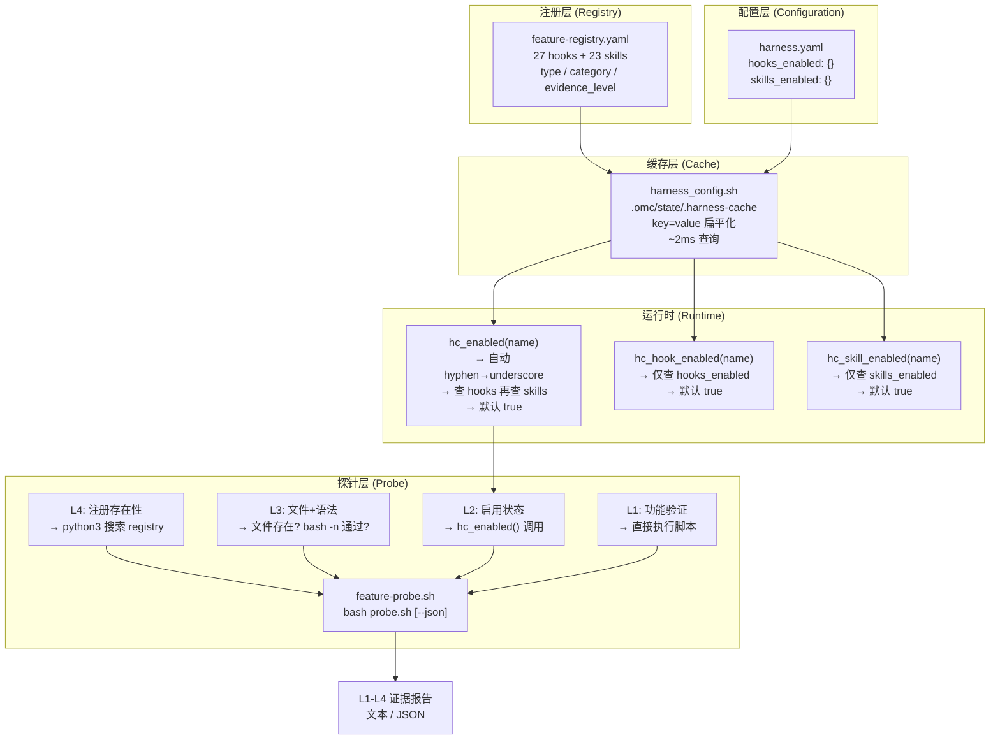

# 03 功能注册表与探针系统

> **前置阅读**：[01-渐进式披露](01-progressive-disclosure.md) | [02-Gate 防御系统](02-gates.md)
> **反向链接**：[04-错误 DNA 与跨会话记忆系统](04-error-dna.md) | [Feature Registry YAML](../.claude/feature-registry.yaml) | [Harness YAML](../.claude/harness.yaml)

---

## Function

功能注册表（Feature Registry）是 Carror OS 的单一事实来源，集中管理所有 hooks（27 个）和 skills（23 个）的元数据、开关状态和证据级别。探针系统（Probe）在此基础上提供 L1-L4 自动化健康检测，回答以下问题：

- 某个功能是否已在注册表中登记？
- 它的 hook 脚本或 skill 文件是否存在且语法正确？
- 当前 harness.yaml 中该功能是启用还是禁用？
- 该功能能否实际执行？

两者共同构成 Carror OS 的 **功能治理基础设施**。

---

## Philosophy

传统 AI 辅助开发工具的问题在于功能治理是隐式的 — hooks 散落在 `.claude/hooks/` 目录中，技能的可用性靠 AI 的记忆，没有一个统一目录说明"我这个项目到底有多少个活跃功能"。

Carror OS 通过 **显式注册 + 可探针化** 解决：

1. **单一数据源**（feature-registry.yaml）：所有功能的定义、分类、默认状态一目了然。
2. **配置驱动**（harness.yaml）：不修改脚本逻辑，仅改配置即可开关功能。
3. **自动化验证**（feature-probe.sh）：不依赖人工记忆，脚本自动检测每个功能的健康度。
4. **渐进式证据**（L1-L4）：从注册存在性到功能可执行，逐层验证，每层解决特定问题。

---

## Benefits

| 收益 | 说明 |
|------|------|
| **一目了然** | 50 个功能的元数据集中在单个 YAML 文件，无需翻遍整个 `.claude/` 目录 |
| **一键开关** | 通过 harness.yaml 的 `hooks_enabled` / `skills_enabled` 控制，不改脚本 |
| **自动化检查** | CI 中可运行 `feature-probe.sh` 验证每个功能的状态 |
| **配置缓存** | harness_config.sh 将 YAML 解析为扁平 key-value 缓存，首次解析后查询仅需 ~2ms |
| **故障隔离** | 探针报告的 NOT_FOUND / SYNTAX_ERROR 可在提交前发现 |

---

## Implementation

### 注册表文件结构

`feature-registry.yaml` 是注册表的物理载体，包含 `hooks` 和 `skills` 两个顶层数组。每个功能条目含以下 metadata：

```yaml
- name: completion-gate
  type: gate           # gate / guard / monitor / injector / audit / fixer
  category: delivery   # security / quality / observability / audit / knowledge / delivery / runtime
  description: 假完成拦截，要求 VERIFIED 证据
  enabled_by_default: true  # 安装后默认是否启用
  evidence_level: L3        # 注册表层面的证据等级
```

27 个 hooks 覆盖 6 种类型、8 个分类；24 个 skills 覆盖 8 种类型、8 个分类。

### 开关函数体系

`harness_config.sh` 提供三个层级的功能开关查询函数，均基于 YAML 解析缓存：

| 函数 | 查询范围 | 默认值 | 关键行为 |
|------|---------|--------|---------|
| `hc_enabled(name)` | 先查 `hooks_enabled.{name}`，再查 `skills_enabled.{name}` | `true` | hook 名自动转换 hyphen 为 underscore |
| `hc_hook_enabled(name)` | 仅查 `hooks_enabled.{name}` | `true` | 自动 hyphen→underscore |
| `hc_skill_enabled(name)` | 仅查 `skills_enabled.{name}` | `true` | 原生名称，无转换 |

实现机制：
1. Python3 解析 harness.yaml 为扁平化 key=value 缓存文件 `.omc/state/.harness-cache`
2. 通过 `grep` + `cut` 查询，首次 ~50ms，后续 ~2ms
3. YAML 修改时间大于缓存修改时间时自动重建
4. 无 YAML 文件时 fail-open（所有功能返回默认值 true）

### 探针系统

`feature-probe.sh` 接收功能名称，自动进行四层证据检测：

```bash
# 文本输出
bash .claude/hooks/feature-probe.sh completion-gate

# JSON 输出
bash .claude/hooks/feature-probe.sh lx-status --json
```

探针检查流程：

| 等级 | 检测内容 | 检测方法 | 示例输出 |
|------|---------|---------|---------|
| **L4** | 注册存在性 | Python3 在 feature-registry.yaml 中搜索名称 | `PASS` / `NOT_REGISTERED` |
| **L3** | 文件存在 + 语法 | 检查 hook 脚本或 SKILL.md 是否存在，bash 脚本运行 `bash -n` | `PASS (/path/to/hook.sh)` / `SYNTAX_ERROR` |
| **L2** | 启用状态 | 调用 `hc_enabled()` 查询 harness 配置 | `ENABLED in harness.yaml` / `DISABLED in harness.yaml` |
| **L1** | 功能验证 | 直接执行 hook 脚本（无参数），检查退出码 | `PASS (executable, exit=0)` / `UNEXPECTED_EXIT` |

### 注册新功能的流程

```bash
# 步骤 1: 在 feature-registry.yaml 的 hooks 或 skills 数组中添加条目
# 步骤 2: 创建对应的 hook 脚本 (.claude/hooks/<name>.sh) 或 skill 目录 (.claude/skills/<name>/)
# 步骤 3: 在 harness.yaml 的 hooks_enabled / skills_enabled 中添加开关
# 步骤 4: 运行探针验证
bash .claude/hooks/feature-probe.sh <new-feature-name>
```

---

## Core Code

### hc_enabled() — 核心开关函数

```bash
# 来源: .claude/hooks/harness_config.sh 第 199-223 行
hc_enabled() {
    local feature_name="$1"
    local val

    # 检查 hooks_enabled.{name}（harness.yaml 使用下划线，自动转换 hyphen→underscore）
    local hook_key="${feature_name//-/_}"
    val=$(hc_get "hooks_enabled.${hook_key}" "")
    if [ -n "$val" ]; then
        [ "$val" = "true" ]
        return $?
    fi

    # 检查 skills_enabled.{name}（skills 使用原生名称，无转换）
    val=$(hc_get "skills_enabled.${feature_name}" "")
    if [ -n "$val" ]; then
        [ "$val" = "true" ]
        return $?
    fi

    # 默认启用
    return 0
}
```

### feature-probe.sh — L4 注册存在性检测

```bash
# 来源: .claude/hooks/feature-probe.sh 第 112-137 行
local l4=""
if command -v python3 &>/dev/null && [ -f "$FEATURE_REGISTRY" ]; then
    if python3 -c "
import yaml, sys
with open('$FEATURE_REGISTRY') as f:
    data = yaml.safe_load(f)
name = '$name'
found = False
for hook in data.get('hooks', []):
    if hook.get('name') == name:
        found = True
        break
for skill in data.get('skills', []):
    if skill.get('name') == name:
        found = True
        break
sys.exit(0 if found else 1)
" 2>/dev/null; then
        l4="PASS"
    else
        l4="NOT_REGISTERED (feature not found in registry)"
    fi
fi
```

### 缓存重建 — 首个 YAML 解析器

```python
# 来源: .claude/hooks/harness_config.sh 第 61-148 行（内嵌 Python）
def parse_yaml_simple(path):
    """简单 YAML 解析器：处理 2 层嵌套 + 简单列表（无需 PyYAML）"""
    result = {}
    current_section = ""
    current_list_key = ""
    current_list = []

    with open(path, 'r', encoding='utf-8') as f:
        for raw_line in f:
            # ... 解析缩进、key:value、列表项 ...

    return result
```

---

## Logic Flow

```
┌─────────────────────────────────────────────────────────────────────┐
│                   Feature Registry & Probe Flow                     │
│                                                                     │
│  ┌──────────────────┐    ┌─────────────────────┐    ┌──────────────┐│
│  │ feature-registry  │    │      harness        │    │  .claude/    ││
│  │     .yaml         │    │      .yaml          │    │  hooks/      ││
│  │  27 hooks         │    │  hooks_enabled: {}  │    │  <name>.sh   ││
│  │  23 skills        │    │  skills_enabled: {} │    │  skills/     ││
│  │  metadata定义     │    │  运行期覆盖          │    │  <name>/     ││
│  └────────┬──────────┘    └──────────┬──────────┘    └──────┬───────┘│
│           │                          │                       │       │
│           ▼                          ▼                       ▼       │
│  ┌──────────────────────────────────────────────────────────────┐   │
│  │               feature-probe.sh 探针引擎                       │   │
│  │                                                              │   │
│  │  L4 ──→ 注册表查询 ──→ registry 中存在吗？                    │   │
│  │  L3 ──→ 文件检查 ──→ hook/skill 文件存在？语法正确？           │   │
│  │  L2 ──→ 配置检查 ──→ harness 中启用？                         │   │
│  │  L1 ──→ 功能验证 ──→ 脚本可执行？                             │   │
│  └──────────────────────────┬───────────────────────────────────┘   │
│                             │                                       │
│                             ▼                                       │
│              ┌──────────────────────────┐                          │
│              │  L1-L4 证据报告           │                          │
│              │  文本 / JSON 双格式输出   │                          │
│              └──────────────────────────┘                          │
└─────────────────────────────────────────────────────────────────────┘
```

---

## Visual Diagram



---

## 小结

功能注册表与探针系统是 Carror OS 功能治理的基石：

- **注册表**保证所有功能有据可查，类型/分类/证据等级标准化
- **配置层**允许不修改脚本即可按需开关功能
- **探针系统**自动化 L1-L4 健康检测，在开发过程中持续验证功能完整性
- **缓存机制**确保性能不会因为 YAML 解析瓶颈而退化

> **延伸阅读**：[04-错误 DNA 与跨会话记忆系统](04-error-dna.md) 展示了另一个 hook（error-dna）如何在注册表 + 配置的框架下实现跨会话错误追踪。
