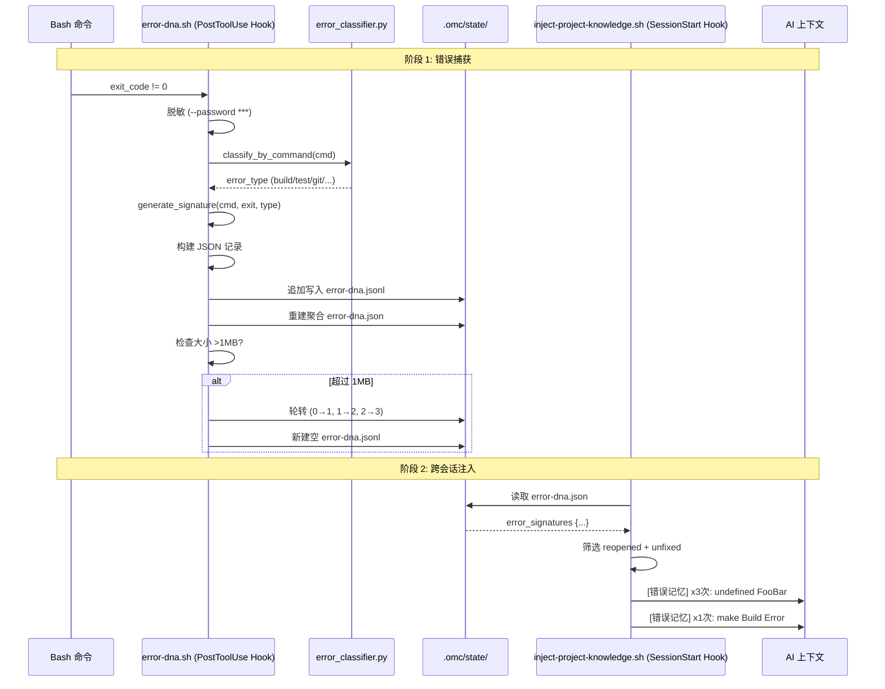

# 04 错误 DNA 与跨会话记忆系统

> **前置阅读**：[03-功能注册表与探针系统](03-feature-registry.md)
> **反向链接**：[03-功能注册表与探针系统](03-feature-registry.md) | [Error DNA Hook](../.claude/hooks/error-dna.sh) | [Error Classifier](../.claude/scripts/error_classifier.py) | [知识注入 Hook](../.claude/hooks/inject-project-knowledge.sh) | [Harness YAML](../.claude/harness.yaml)

---

## Function

错误 DNA（Error DNA）系统是 Carror OS 的跨会话错误记忆基础设施。它自动捕获每次会话中 Bash 命令的非零退出错误，提取结构化签名，分类存储，并在新会话启动时将未解决的错误注入 AI 上下文。

核心能力：

- **实时捕获**：每次 Bash 命令失败（exit_code != 0），自动生成 JSON 签名记录
- **智能分类**：多语言错误模式匹配（Go / TypeScript / Python / Rust / Make / Docker / Git / 网络 / 文件操作）
- **双重持久化**：追加式 JSONL 日志（事件流）+ 合并式 JSON 状态（聚合快照）
- **自动轮转**：JSONL 日志超过 1MB 自动轮转，保留 3 份归档
- **凭据脱敏**：自动屏蔽 `--password` `--token` `--secret` `--key` 后的明文参数
- **跨会话注入**：新会话启动时，inject-project-knowledge.sh 从 error-dna.json 读取未修复错误，注入 AI 上下文

---

## Philosophy

传统 AI 辅助开发中，每次新会话都是一张白纸。错误可能跨会话反复出现 — 上周遇到的 `undefined symbol`，这周换了个新会话又要从头排查。反复劳动的本质原因是 **错误记忆没有跨会话持久化**。

错误 DNA 系统借鉴了生物学的 DNA 概念：

1. **签名（signature）**：每个错误的 MD5 指纹（基于命令 + 退出码 + 错误类型），类似 DNA 序列
2. **变异计数（count）**：同一签名出现的次数，反映错误的顽固程度
3. **修复历史（fix_count）**：标记修复尝试次数，防止陷入修复循环（见铁律：修复上限 3 轮）
4. **状态标记**：`active` → `fixed` → `reopened`，追踪错误生命周期
5. **跨代传递**：跨会话记忆注入，让 AI "继承" 前代会话的经验

---

## Benefits

| 收益 | 说明 |
|------|------|
| **零配置捕获** | 安装后自动运行，无需手动启用或配置 |
| **精确去重** | 基于 MD5 签名合并相同错误，不重复记录 |
| **跨会话记忆** | 新会话自动接收历史未解决错误列表，无需重新解释 |
| **凭据安全** | `--password ***` 脱敏，不记录敏感信息到日志文件 |
| **日志永续** | 1MB 自动轮转 + 3 份归档，日志文件不会无限增长 |
| **共享分类器** | error_classifier.py 同时被 error-dna.sh 和其他 hooks 调用，分类逻辑一致 |
| **修复循环检测** | `reopened` 状态标记反复出现的错误，触发修复升级机制 |

---

## Implementation

### 错误捕获事件流

每次 Bash 工具调用完成后，error-dna hook 执行以下步骤：

```
Bash 完成 (PostToolUse)
        │
        ▼
  exit_code != 0? ──no──→ 跳过
        │
       yes
        │
        ▼
  命令脱敏 (--password → ***)
        │
        ▼
  签名生成 (MD5(cmd|exit_code|type))
        │
        ▼
  错误分类 (Go/TS/Python/Rust/...)
        │
        ▼
  JSONL 追加写入 + JSON 合并状态
        │
        ▼
  大小检查 → >1MB? → 自动轮转
```

### 双重持久化格式

#### JSONL 追加日志（error-dna.jsonl）

每行一个 JSON 对象，适合 `grep` 检索和流式处理：

```json
{"ts": 1746316800, "signature": "a1b2c3d4e5f67890", "cmd": "go build ./...", "exit_code": 1, "error_type": "build", "message": "./main.go:42:2: undefined: FooBar", "output_snippet": "...", "session_id": "sess_abc123"}
```

#### JSON 合并状态（error-dna.json）

基于 JSONL 重新聚合的按签名分组的快照：

```json
{
  "error_signatures": {
    "a1b2c3d4e5f67890": {
      "count": 3,
      "fix_count": 0,
      "status": "active",
      "last_seen": 1746316900,
      "message": "./main.go:42:2: undefined: FooBar"
    },
    "f6e7d8c9b0a12345": {
      "count": 1,
      "fix_count": 1,
      "status": "reopened",
      "last_seen": 1746316000,
      "message": "make: *** [build] Error 2"
    }
  }
}
```

### 跨会话记忆注入

在 `inject-project-knowledge.sh`（第 166-211 行）中，SessionStart 时自动执行：

```python
# 从 error-dna.json 读取所有签名
# 区分 reopened（反复出现）和 unfixed（未解决）
# 按 count 降序取前 3 条注入 AI 上下文

if reopened_errors or unfixed_errors:
    print("[错误记忆]")
    # 输出格式：
    # 反复出现的错误:
    #  - [3次, 修过1次] ./main.go:42:2: undefined: FooBar
    #   上次修复相关文件: main.go, types.go
    # 未解决的错误:
    #  - [1次] make: *** [build] Error 2
```

### 1MB 自动轮转（保留 3 份）

```python
# 来源: error-dna.sh 第 173-187 行
size = os.path.getsize(jsonl_path)
if size > 1048576:  # 1MB
    # 轮转链: .0 → .1 → .2 → .3（丢弃最旧）
    for i in range(3, 0, -1):
        old = f'error-dna.jsonl.{i-1}'
        new = f'error-dna.jsonl.{i}'
        if os.path.exists(old):
            os.rename(old, new)
    os.rename(jsonl_path, 'error-dna.jsonl.0')
    open(jsonl_path, 'w').close()  # 创建新日志文件
```

---

## Core Code

### 错误捕获主逻辑（JSONL 写入 + JSON 合并）

```python
# 来源: .claude/hooks/error-dna.sh 第 37-188 行（内嵌 Python）

# === 结构化错误记录 ===
record = {
    'ts': ts,
    'signature': signature,
    'cmd': cmd_clean,
    'exit_code': exit_code,
    'error_type': error_type,
    'message': message,
    'output_snippet': output_snippet,
    'session_id': session_id
}

# Append to jsonl
with open(jsonl_path, 'a') as f:
    f.write(json.dumps(record, ensure_ascii=False) + '\n')

# Merge into json state (rebuild from jsonl source-of-truth)
aggregated = {}
with open(jsonl_path) as f:
    for line in f:
        rec = json.loads(line)
        sig = rec['signature']
        if sig not in aggregated:
            aggregated[sig] = {
                'count': 0, 'fix_count': 0,
                'status': 'active', 'last_seen': 0, 'message': ''
            }
        aggregated[sig]['count'] += 1
        aggregated[sig]['last_seen'] = max(...)

merged = {'error_signatures': aggregated}
with open(json_path, 'w') as f:
    json.dump(merged, f, indent=2, ensure_ascii=False)
```

### 共享错误分类器（error_classifier.py）

```python
# 来源: .claude/scripts/error_classifier.py 第 19-161 行

def classify_error(cmd: str, exit_code: str | int, output: str) -> list[dict]:
    """多语言错误分类器。返回错误字典列表。"""

    # Go 错误: .go:行:列: 匹配
    if re.search(r'\.go:\d+:\d+:', output):
        # → go_compile / go_undefined / go_unused_import

    # TypeScript 错误: error TS\d+: 匹配
    ts_match = re.search(r'error\s+(TS\d+):\s*(.+)', output)
    # → typescript / missing_module

    # Python 错误: TypeError / ValueError / ImportError / ...
    py_match = re.search(r'((?:Type|Value|Import|...)Error):\s*(.+)', output)
    # → python_error / python_missing_module

    # Rust 错误: error[E\d+]:
    # → rust_compile

    # 通用错误: permission denied / out of memory
    # → permission / oom / unknown
```

### 命令级快速分类（轻量模式）

```python
# 来源: .claude/scripts/error_classifier.py 第 165-185 行

def classify_by_command(cmd: str) -> str:
    """简单命令级错误类型分类（供 error-dna.sh 轻量使用）。"""
    cmd_lower = cmd.lower()
    if 'go build' in cmd_lower or 'go test' in cmd_lower:
        return 'build'
    elif 'git' in cmd_lower:
        return 'git'
    elif 'npm install' in cmd_lower:
        return 'dependency'
    # ... build / test / git / dependency / lint / docker / network / file_ops / runtime
```

### 跨会话记忆注入

```python
# 来源: .claude/hooks/inject-project-knowledge.sh 第 170-211 行（内嵌 Python）

DNA_FILE = "$PROJECT_ROOT/.omc/state/error-dna.json"

python3 - "$DNA_FILE" <<'PYEOF'
with open(sys.argv[1]) as f:
    dna = json.load(f)

signatures = dna.get('error_signatures', {})

reopened_errors = {sig: e for sig, e in signatures.items()
                   if e.get('status') == 'reopened'}
unfixed_errors = {sig: e for sig, e in signatures.items()
                  if e.get('status') != 'fixed'}

if reopened_errors or unfixed_errors:
    print("[错误记忆]")
    # 输出前 3 条 reopened + 前 3 条 unfixed
    # 包括 count / fix_count / message / fix_context
PYEOF
```

---

## Logic Flow

```
┌─────────────────────────────────────────────────────────────────────────┐
│                   Error DNA 完整生命周期                                  │
│                                                                         │
│  捕获阶段                    分类阶段                    存储阶段          │
│  ┌──────────┐              ┌─────────────┐           ┌──────────────┐   │
│  │ Bash 出错│              │ error_dna.sh│           │ error-dna    │   │
│  │ exit!=0  │──────►       │ 内嵌 Python │──────►    │ .jsonl (追加) │   │
│  └──────────┘              │             │           │              │   │
│       │                    │ 脱敏 cmd    │           │ error-dna    │   │
│       ▼                    │ 生成签名    │           │ .json (合并)  │   │
│  ┌──────────┐              │ 分类错误    │           └──────┬───────┘   │
│  │ --pass   │              └─────────────┘                  │           │
│  │ word *** │                                              │           │
│  │ 脱敏处理 │                                              ▼           │
│  └──────────┘                                    ┌──────────────┐      │
│                                                   │ 1MB 轮转检查  │      │
│                                                   │ 保留 3 份归档 │      │
│                                                   └──────────────┘      │
│                                                           │              │
│  注入阶段                                                │              │
│  ┌───────────────────────────┐                          │              │
│  │ SessionStart 触发         │◄──────────────────────────┘              │
│  │ inject-project-knowledge  │                                          │
│  │ .sh                       │                                          │
│  └──────────┬────────────────┘                                          │
│             │                                                           │
│             ▼                                                           │
│  ┌─────────────────────┐          ┌─────────────────────┐               │
│  │ reopened_errors     │          │ unfixed_errors      │               │
│  │ (反复出现, 修过)     │          │ (从未修好过)         │               │
│  └──────────┬──────────┘          └──────────┬──────────┘               │
│             │                                │                          │
│             └──────────────┬─────────────────┘                          │
│                            ▼                                            │
│               ┌─────────────────────────┐                              │
│               │ 注入 AI 上下文           │                              │
│               │ "[错误记忆] x3次: ..."    │                              │
│               │ "上次修复相关文件: ..."    │                              │
│               └─────────────────────────┘                              │
└─────────────────────────────────────────────────────────────────────────┘
```

---

## Visual Diagram



---

## 小结

错误 DNA 系统是 Carror OS"绝不偷懒"铁律的基础设施体现：

- **零配置**：安装后自动运行，不增加心智负担
- **自动化**：错误捕获 → 分类 → 存储 → 注入全自动，无需人工干预
- **记忆持久化**：跨会话错误记忆解决"换了新会话就忘了之前错在哪"的问题
- **安全**：凭据脱敏确保敏感信息不会被记录到日志中
- **防爆炸**：1MB 自动轮转 + 3 份归档，日志不会无限增长

结合功能注册表（第 03 篇）的治理框架，错误 DNA 是 Carror OS 中 hooks 系统的一个典型实现——在注册表中登记、由 harness 配置驱动、以自动化方式持续运行。

> **延伸阅读**：完整的 hooks 列表和开关机制见 [03-功能注册表与探针系统](03-feature-registry.md)。错误分类器还被 [error_classifier.py](../.claude/scripts/error_classifier.py) 的其他调用者使用，包括 build-validator 和 completion-gate 等 hooks。
