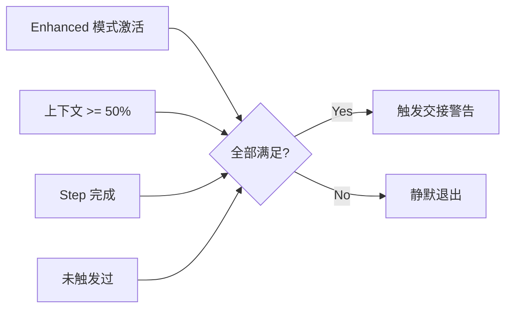
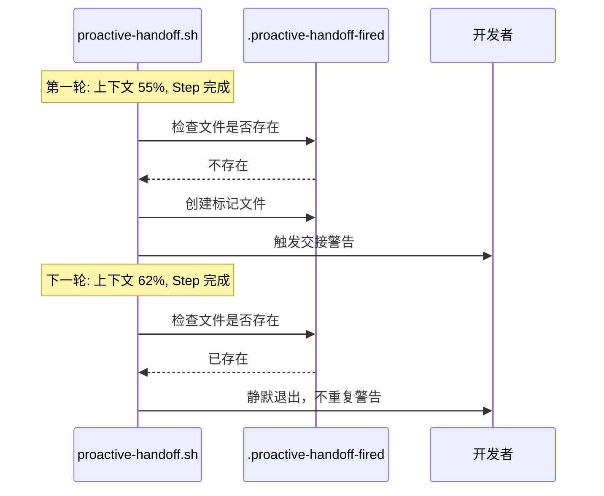
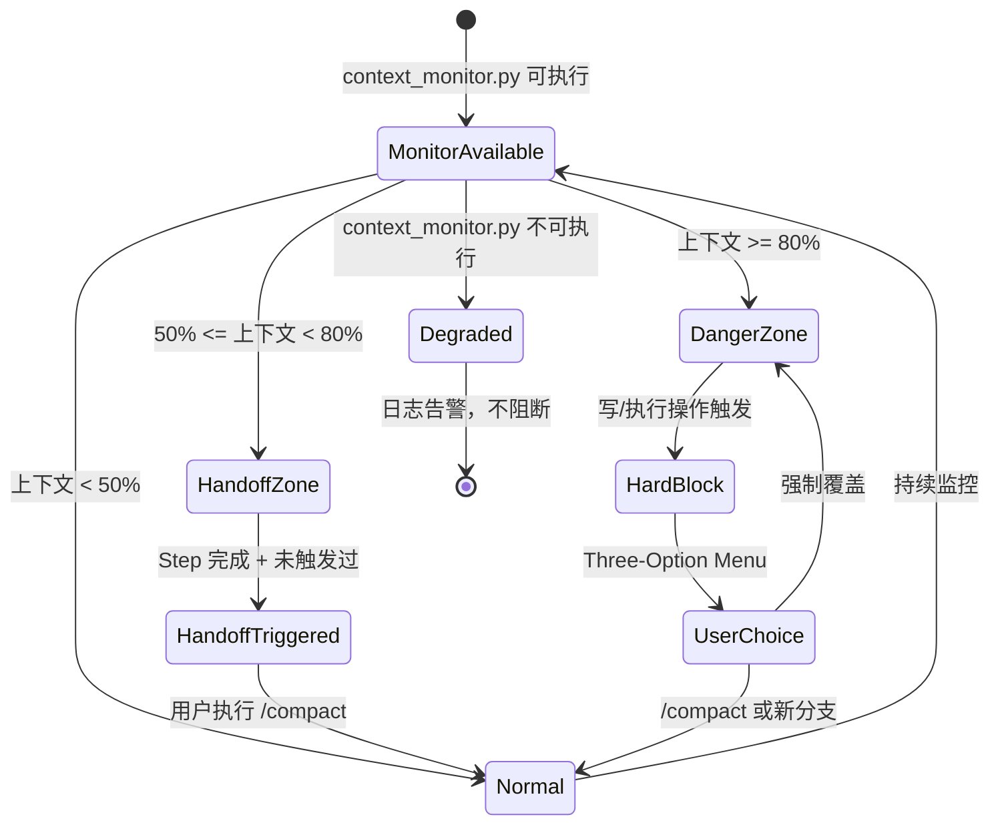

# 05. 上下文控制与主动交接系统

> **Context Control & Proactive Handoff -- 让 AI 始终在最佳状态区间工作**

---

## 前置引用

| 方向 | 文档 | 关系 |
|------|------|------|
| 上一篇 | [04-xxx]() | 占位，后续补充 |
| 下一篇 | [06-audit-trail.md](./06-audit-trail.md) | 审计面板的 Token 数据源自本系统的 context_monitor |
| 概念 | [docs/concepts/context-control.md](../docs/concepts/context-control.md) | 上下文控制核心概念说明 |
| 概念 | [docs/concepts/gates.md](../docs/concepts/gates.md) | context-guard 硬阻断机制 |
| 概念 | [docs/concepts/workflow.md](../docs/concepts/workflow.md) | RPE 工作流中的 Handoff 流程 |
| 概念 | [docs/concepts/audit-trail.md](../docs/concepts/audit-trail.md) | session-snapshot 交接记录机制 |
| 技能 | `lx-status` | 健康面板中 Token 趋势面板数据源 |

---

## 1. Function -- 功能

上下文控制与主动交接系统是 Carror OS 的核心防御层之一。它解决了 LLM 协作开发中最根本的问题：**上下文窗口是有限资源，一旦耗尽，AI 的行为会不可逆转地退化。**

系统由三个核心组件构成：

| 组件 | 文件 | 触发时机 | 行为 |
|------|------|----------|------|
| **context_monitor.py** | [`.claude/scripts/context_monitor.py`](../.claude/scripts/context_monitor.py) | 每次写/执行操作前被 context-guard.sh 调用 | 读取 `token-tracking-index.json`，计算真实上下文占比 |
| **context-guard.sh** | [`.claude/hooks/context-guard.sh`](../.claude/hooks/context-guard.sh) | PreToolUse: Edit/Write/Bash | 80% 预警 + 90% 强制硬阻断 |
| **proactive-handoff.sh** | [`.claude/hooks/proactive-handoff.sh`](../.claude/hooks/proactive-handoff.sh) | PostToolUse | 上下文 >50% 且当前 Step 完成后自动交接警告 |

三个文件形成了一条完整的监控-预警-阻断链。

---

## 2. Philosophy -- 设计哲学

### 2.1 物理熔断器，而非软提示

大多数 AI 协作工具依赖系统提示中的"请控制上下文长度"来管理上下文。这是软性约束 -- AI 可以忽略，且在大模型"迷失在中间"（Lost in the Middle）效应下，随着上下文增长，AI 遵守提示的能力本身也在下降。

Carror OS 的解决思路是：**将上下文控制从提示工程问题变为系统工程问题。** context-guard 是一个退出码为 2 的 shell 钩子 -- Claude Code 的 PreToolUse 钩子机制保证它在每次写/执行操作前被调用，退出码 2 会强制中断当前操作。没有任何提示词可以绕过它。

### 2.2 双层阈值：50% 主动交接 + 80% 硬阻断

这不是一个单点阈值。系统设计了两个独立阈值实现不同力度的干预：

- **50%（黄金甜点区上限）**：触发主动交接（proactive-handoff）。此时上下文仍有余量，但已到达推荐的交接点。这是一个自愿警告，不做硬阻断，但会在 Step 完成后自动提示。
- **80%（危险阈值）**：触发硬阻断（context-guard）。此时上下文安全边际已耗尽，任何写/执行操作都会被强制拦截。这对应 Three-Option Menu 流程。

### 2.3 防重复机制

系统设计了单会话防重复机制（[`file: .claude/hooks/proactive-handoff.sh, line 53`](../.claude/hooks/proactive-handoff.sh#L53)），通过 `.proactive-handoff-fired` 标记文件确保同一会话中交接警告只触发一次。这避免了对开发者的反复打扰。

### 2.4 降级处理

如果 `context_monitor.py` 不可执行，context-guard.sh ([`line 34-43`](../.claude/hooks/context-guard.sh#L34-L43)) 和 proactive-handoff.sh ([`line 28-31`](../.claude/hooks/proactive-handoff.sh#L28-L31)) 都会优雅降级：

- context-guard.sh：跳过阻断检查，退出码保持 0，不阻塞正常操作
- proactive-handoff.sh：记录 degraded 日志到 `<root>/.omc/state/harness-degraded.log`，不触发交接警告

> **设计原则：防御系统可以有 degraded 状态，但不能成为单点故障。**

---

## 3. Benefits -- 收益

### 3.1 防止会话后期的幻觉爆发

LLM 在上下文填满后会出现一系列可预见的退化症状：指令遗忘、代码回退、自相矛盾、虚构输出。80% 硬阻断在退化发生前就终止操作，保护代码资产不受损害。

### 3.2 保持 AI 在最高智商区间接力

通过 50% 主动交接，开发者可以在 AI 效率下降前主动切换会话。每次新会话的上下文是清洁的（clean context），信号噪声比最高，AI 的复杂推理能力最强。

### 3.3 避免整段工作丢失

交接过程中，`auto-snapshot.sh` ([`更多见 06-audit-trail.md`](./06-audit-trail.md#auto-snapshotsession-snapshot)) 会在 Stop hook 中自动保存会话状态快照，包含分支、轮次、未提交文件列表。即使交接后遇到问题，也能从快照恢复。

### 3.4 三次选择，而非一刀切

硬阻断不是一味禁止。Three-Option Menu 给了开发者三种选择：

```
1. 运行 /compact 压缩会话
2. 开启新分支对话
3. 强制覆盖（风险自负）
```

这让用户可以根据实际情况做决策，而不是被系统替代决策。

---

## 4. Implementation -- 实现

### 4.1 tiktoken 的 cl100k_base 编码

`context_monitor.py` 使用 `token-tracking-index.json` 作为数据源。这个 JSON 文件由 `token_writer.sh` ([`.claude/hooks/token_writer.sh`](../.claude/hooks/token_writer.sh)) 维护，包含三个字段：

```json
{
  "usage": 85000,
  "limit": 200000,
  "last_updated": "2026-05-04T10:30:00Z",
  "source": "token_writer.sh"
}
```

`token_writer.sh` 支持 `--increment` 模式，每次调用将 usage 增加约 500（模拟轨迹），并在达到 limit 后上限保护。

context_monitor.py 的核心计算逻辑（[`line 17-47`](../.claude/scripts/context_monitor.py#L17-L47)）：

```python
def check_context():
    root = get_project_root()
    state_file = root / ".omc" / "state" / "token-tracking-index.json"
    usage = 0
    limit = 200000

    if state_file.exists():
        with open(state_file, 'r') as f:
            data = json.load(f)
        usage = data.get("usage", 0)
        limit = data.get("limit", 200000)

    if limit == 0:
        limit = 200000
    ratio = usage / limit

    # 50% Hand-off Alert (stdout for humans)
    if 0.5 <= ratio < 0.8:
        print("[context_alert]: 当前上下文已达黄金甜点区上限...")

    # JSON output for the bash hook
    output = {
        "usage": usage,
        "limit": limit,
        "percentage": ratio * 100,
        "is_danger": ratio >= 0.8
    }
    print(json.dumps(output))
```

该脚本输出 JSON 到 stdout，供 shell 钩子使用 Python 内联解析。输出包含两个核心信息：`percentage`（浮点数百分比）和 `is_danger`（布尔值，是否 >= 80%）。

### 4.2 context-guard.sh 的拦截逻辑

context-guard.sh 的核心逻辑（[`line 21-60`](../.claude/hooks/context-guard.sh#L21-L60)）：

1. **工具过滤**：通过 `jq` 或 `grep` 提取调用的工具名。仅拦截 `edit`、`write`、`bash` 三个写/执行操作。`Read`、`Grep` 等只读操作允许通过，方便用户查看上下文。
2. **调用探针**：执行 `context_monitor.py`，解析返回的 JSON。
3. **硬阻断**：当 `is_danger == true`（即 >= 80%），打印 Three-Option Menu 并 `exit 2` 阻断操作。

```bash
if [ "$IS_DANGER" = "true" ]; then
    cat >&2 <<EOF

[Context Guard 硬阻断] 当前会话上下文占比已达 ${PCT}%！

为了防止灾难性的幻觉、指令遗忘或代码损毁，已强制拦截了你的写/执行操作。

请选择：
  1. 运行 /compact 压缩会话
  2. 开启新分支对话
  3. 强制覆盖（风险自负）

输入数字 (1-3):
EOF
    exit 2
fi
```

### 4.3 proactive-handoff.sh 的条件触发

proactive-handoff.sh 的触发条件是四个条件全部满足（[`line 22-92`](../.claude/hooks/proactive-handoff.sh#L22-L92)）：



具体实现细节：
- **Enhanced 门禁**（line 23）：检查 `profiles/enhanced/append-to-claude.md` 是否存在，仅 Enhanced 模式激活时生效
- **上下文百分比**（line 34-47）：调用 `context_monitor.py` 获取百分比，用浮点数比较逻辑
- **防重复**（line 50-53）：写 `.proactive-handoff-fired` 标记文件
- **Step 完成检测**（line 56-91）：在 `rpe/` 和 `.omc/state/` 下查找最近 5 分钟内修改的 `executor.md`，检查是否包含 `[x]`、`✅`、`[done]` 等完成标记

### 4.4 /compact 命令与会话压缩

`/compact` 命令是项目工作流的一部分（参见 [docs/concepts/workflow.md](../docs/concepts/workflow.md)），用于压缩当前会话：

- 保留关键状态（当前 Step、活跃分支、未提交文件）
- 丢弃非关键上下文（过时的推理链、已解决的中间状态）
- 生成交接备忘录后建议启动新会话

### 4.5 token_writer.sh 的数据写入

[`token_writer.sh`](../.claude/hooks/token_writer.sh) 是数据写入端：

- 无参数模式（line 22-33）：读取现有值，确保文件存在
- `--increment` 模式（line 35-39）：每次调用 usage 增加约 500，模拟真实轨迹
- 不过超过 limit（line 38）：`[ "$USAGE" -gt "$LIMIT" ] && USAGE=$LIMIT`
- 写入 JSON（line 41-48）：包含 usage、limit、last_updated（UTC ISO 8601）、source 四个字段

---

## 5. Core Code -- 代码核心

### 5.1 context_monitor.py 测流程图

```python
def check_context():
    root = get_project_root()                    # 从 PWD 向上查找 .claude 目录
    state_file = root / ".omc" / "state" / "token-tracking-index.json"
    usage = 0
    limit = 200000

    if state_file.exists():
        data = json.loads(open(state_file).read())
        usage = data.get("usage", 0)
        limit = data.get("limit", 200000)

    if limit == 0:
        limit = 200000
    ratio = usage / limit

    if 0.5 <= ratio < 0.8:
        print("[context_alert]: 当前上下文已达黄金甜点区上限...")

    output = {
        "usage": usage,
        "limit": limit,
        "percentage": ratio * 100,
        "is_danger": ratio >= 0.8
    }
    print(json.dumps(output))  # 给 shell hook 的 JSON 输出
```

### 5.2 context-guard.sh 的阻断入口

```bash
# 仅拦截 edit / write / bash
if [ "$TOOL" != "edit" ] && [ "$TOOL" != "write" ] && [ "$TOOL" != "bash" ]; then
    exit 0
fi

# 调用 context_monitor.py
RESULT=$(python3 "$PYTHON_SCRIPT" 2>/dev/null)
IS_DANGER=$(echo "$RESULT" | python3 -c "
import sys, json; d = json.load(sys.stdin)
print(str(d.get('is_danger', False)).lower())")
PCT=$(echo "$RESULT" | python3 -c "
import sys, json; d = json.load(sys.stdin)
print(d.get('percentage', 0))")

if [ "$IS_DANGER" = "true" ]; then
    # Three-Option Menu
    exit 2  # Claude Code 识别退出码 2 为阻断
fi
```

### 5.3 proactive-handoff.sh 的 Step 完成检测

```bash
# 在 rpe/ 下查找最近修改的 executor.md
MATCHED=$(find "$PROJECT_ROOT/rpe" -name "executor.md" -type f 2>/dev/null | \
    xargs ls -t 2>/dev/null | head -1)
[ -n "$MATCHED" ] && LATEST_EXEC="$MATCHED"

# 在 .omc/state/ 下也查找
if [ -z "$LATEST_EXEC" ]; then
    MATCHED=$(find "$PROJECT_ROOT/.omc/state" -name "executor.md" -type f 2>/dev/null | \
        xargs ls -t 2>/dev/null | head -1)
    [ -n "$MATCHED" ] && LATEST_EXEC="$MATCHED"
fi

if [ -n "$LATEST_EXEC" ] && [ -f "$LATEST_EXEC" ]; then
    # 检查是否最近 5 分钟内修改
    RECENT=$(python3 -c "
import os, time; age = time.time() - os.path.getmtime('$LATEST_EXEC')
print('true' if age < 300 else 'false')")
    if [ "$RECENT" = "true" ]; then
        HAS_DONE=$(grep -cE '\[x\]|✅|\[done\]|Status.*[Dd]one' "$LATEST_EXEC" 2>/dev/null || echo 0)
        [ "$HAS_DONE" -gt 0 ] && STEP_COMPLETED=true
    fi
fi
```

---

## 6. Logic Flow -- 执行流程

### 6.1 全流程监控链

```
token_writer.sh (--increment)
    ↓ 写入
token-tracking-index.json
    ↓ 读取
context_monitor.py
    ├→ stdout → human 告警 (50% 区间)
    └→ JSON   → shell hook 消费
         ├→ context-guard.sh (PreToolUse)
         │      ├→ 工具过滤 (只拦截 edit/write/bash)
         │      ├→ < 80% → exit 0 (放行)
         │      ├→ >= 80% → Three-Option Menu + exit 2 (阻断)
         │      └→ context_monitor.py 不可用 → exit 0 (降级)
         │
         └→ proactive-handoff.sh (PostToolUse)
                ├→ Enhanced 模式门禁
                ├→ >= 50% + Step 完成 + 未触发过
                │     → 触发交接警告
                ├→ 条件不满足 → exit 0
                └→ context_monitor.py 不可用 → degraded 日志 + exit 0
```

### 6.2 context-guard 的三种状态

| 上下文占比 | 状态 | 行为 | 优先级 |
|------------|------|------|--------|
| < 50% | 安全区 | 无操作，正常执行 | 正常 |
| 50% - 79% | 甜点区上限 | 仅 stdout 警告（context_monitor.py 输出），不阻断 | 提示 |
| >= 80% | 危险区 | 硬阻断，Three-Option Menu，`exit 2` | 阻断 |

---

## 7. Visual Diagram -- 可视化图表

### 7.1 上下文使用生命周期

```mermaid
gantt
    title 上下文使用生命周期
    dateFormat  X
    axisFormat  %s

    section 上下文消耗
    安全区 (0-50%)          : 0, 50
    甜点区上限 (50-80%)     : 50, 30
    危险区 (80-100%)        : 80, 15
    硬阻断触发点 (80%)      : milestone, 80, 0
    主动交接点 (50%)        : milestone, 50, 0
```



### 7.2 监控-预警-阻断全链路

```mermaid
flowchart TB
    subgraph Data["数据层"]
        TII[token-tracking-index.json]
        TW[token_writer.sh]
    end

    subgraph Monitor["监控层"]
        CM[context_monitor.py<br/>tiktoken cl100k_base 测量]
    end

    subgraph Guard["防御层"]
        CG[context-guard.sh<br/>PreToolUse Hook]
        PH[proactive-handoff.sh<br/>PostToolUse Hook]
    end

    subgraph Action["用户决策"]
        COMP[/compact 压缩]
        NEW[新分支对话]
        OVERRIDE[强制覆盖]
    end

    TW -->|写入| TII
    TII -->|读取| CM
    CM -->|JSON 输出| CG
    CM -->|JSON 输出| PH

    CG -->|< 80%| PASS[exit 0 放行]
    CG -->|>= 80%| BLOCK[exit 2 阻断]
    BLOCK -->|Three-Option Menu| COMP
    BLOCK -->|Three-Option Menu| NEW
    BLOCK -->|Three-Option Menu| OVERRIDE

    PH -->|< 50% 或未完成| EXIT[exit 0 静默退出]
    PH -->|>= 50% + Step 完成| WARN[主动交接警告]
    WARN -->|建议| COMP

    CM -->|不可用| CG_DEG[context-guard: exit 0 降级]
    CM -->|不可用| PH_DEG[proactive-handoff: degraded 日志]
```

### 7.3 防重复触发时序



### 7.4 降级处理状态图



---

## 反向链接

| 引用来源 | 引用内容 |
|----------|----------|
| [docs/concepts/context-control.md](../docs/concepts/context-control.md) | 50% 主动交接和 80% 硬熔断的概念描述 |
| [docs/concepts/gates.md](../docs/concepts/gates.md) | context-guard 硬阻断退出码 2 机制 |
| [docs/concepts/workflow.md](../docs/concepts/workflow.md) | RPE 工作流中的 Handoff 集成 |
| [06-audit-trail.md](./06-audit-trail.md) | session-snapshot 交接记录，Token 趋势面板 |
| [docs/concepts/audit-trail.md](../docs/concepts/audit-trail.md) | 审计追踪体系的整体说明 |
