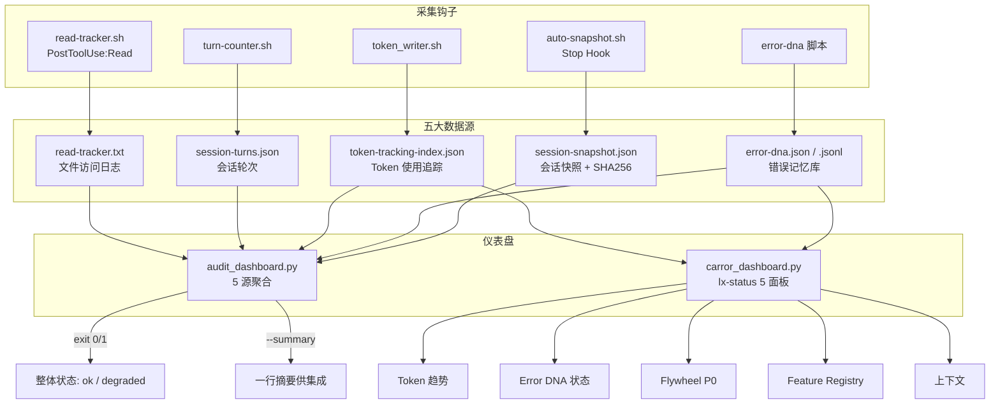
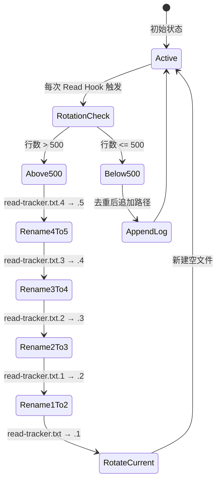
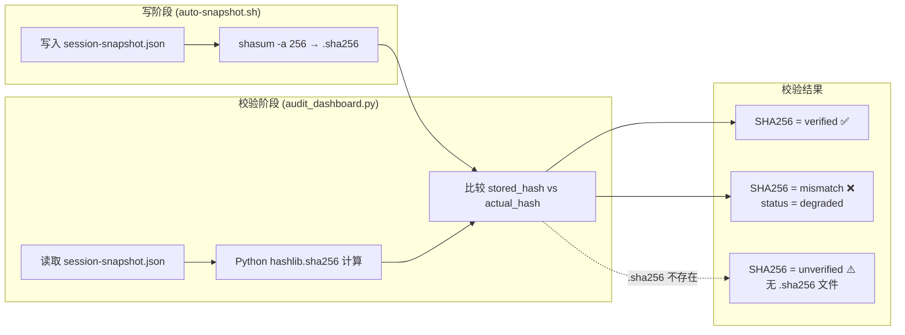
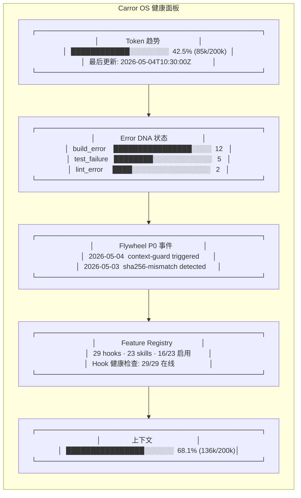
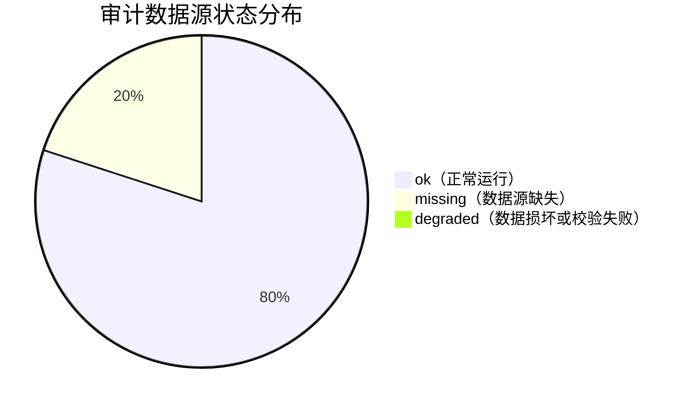

# 06. 审计追踪与可观测性

> **Audit Trail & Observability -- 每一行 AI 行为都可审计、不可篡改、可重放**

---

## 前置引用

| 方向 | 文档 | 关系 |
|------|------|------|
| 上一篇 | [05-context-control.md](./05-context-control.md) | context_monitor.py 是 Token 趋势面板的数据源 |
| 概念 | [docs/concepts/audit-trail.md](../docs/concepts/audit-trail.md) | 审计追踪核心概念 |
| 概念 | [docs/concepts/gates.md](../docs/concepts/gates.md) | privacy-gate 在审计追踪中的记录 |
| 技能 | `lx-status` | carror_dashboard.py 是 lx-status 的主面板 |
| 技能 | `lx-validate-skill` | 引用了 carror_dashboard.py 作为验证工具 |

---

## 1. Function -- 功能

审计追踪与可观测性系统是 Carror OS 的"黑匣子"——它记录 AI 每次会话的所有可观察行为，并通过两个仪表盘提供实时可视化。当 AI 自主操作时，开发者需要知道：

- AI 读了哪些文件？
- AI 修改了哪些文件？
- Token 消耗了多少？还剩多少？
- 曾经遇到过哪些错误？是否自动修复过？
- 会话状态是否被篡改过？

本系统提供五个数据源和两个仪表盘来回答这些问题。

### 1.1 五大数据源

| 编号 | 数据源 | 文件 | 采集钩子 | 记录内容 |
|------|--------|------|----------|----------|
| 1 | read-tracker | `read-tracker.txt` | read-tracker.sh (PostToolUse:Read) | AI 读取的每个文件路径 |
| 2 | session-turns | `session-turns.json` | turn-counter.sh | 会话轮次计数 |
| 3 | token-tracking | `token-tracking-index.json` | token_writer.sh | Token usage/limit 追踪 |
| 4 | error-dna | `error-dna.json` / `error-dna.jsonl` | error-dna 脚本 | 错误记忆库（类型、频率、签名） |
| 5 | session-snapshot | `session-snapshot.json` | auto-snapshot.sh (Stop Hook) | 会话快照 + SHA256 防篡改 |

### 1.2 两个仪表盘

| 仪表盘 | 文件 | 启动命令 | 输出格式 |
|--------|------|----------|----------|
| **Audit Dashboard** | [`.claude/scripts/audit_dashboard.py`](../.claude/scripts/audit_dashboard.py) | `python3 .claude/scripts/audit_dashboard.py` | Markdown / JSON / 一行摘要 |
| **Carror OS 健康面板** | [`.claude/skills/lx-validate-skill/scripts/carror_dashboard.py`](../.claude/skills/lx-validate-skill/scripts/carror_dashboard.py) | `lx-status` 技能 | 5 面板 ASCII 渲染 / JSON / 实时 watch |

---

## 2. Philosophy -- 设计哲学

### 2.1 信任不是感觉，是账本

审计追踪的设计出发点很简单：**信任必须可验证。** AI 说"我读过了那个文件"、"我改过了那三行代码"——这些声明不能靠 AI 的记忆来验证，而是要靠不可篡改的写入日志。

### 2.2 fail-open 但记录 degraded

每个数据采集钩子都遵循 fail-open 原则：如果数据源不可用或解析失败，操作不应被阻断，但必须在 degraded 日志中记录失败原因。

以 read-tracker.sh 为例（[`line 14`](../.claude/hooks/read-tracker.sh#L14)）：

```bash
# 退出码：始终 0（fail-open，记录失败不阻断正常操作）
```

这意味着审计系统永不成为 AI 操作的阻塞点。它是旁路监视器，不是栅栏。

### 2.3 SHA256 防篡改

审计记录是对 AI 行为的唯一客观记录。如果这项记录本身可以被后续会话篡改，那么审计就失去了意义。

解决方案（[`auto-snapshot.sh, line 72-78`](../.claude/hooks/auto-snapshot.sh#L72-L78)）：

```python
# SHA256 防篡改摘要
SHA256_FILE="$STATE_DIR/session-snapshot.json.sha256"
if command -v shasum &>/dev/null; then
    shasum -a 256 "$SNAPSHOT_FILE" | awk '{print $1}' > "$SHA256_FILE"
elif command -v sha256sum &>/dev/null; then
    sha256sum "$SNAPSHOT_FILE" | awk '{print $1}' > "$SHA256_FILE"
fi
```

每次写快照时，同时计算 SHA256 摘要并存储到独立的 `.sha256` 文件中。audit_dashboard.py 在读取快照时会校验摘要（[`line 266-278`](../.claude/scripts/audit_dashboard.py#L266-L278)），发现不匹配时标记为 `degraded` 状态。

### 2.4 500 行轮转，保留 5 份归档

read-tracker 日志可能随时间积累到很大体积。系统设计了自动轮转机制（[`read-tracker.sh, line 48-55`](../.claude/hooks/read-tracker.sh#L48-L55)）：

```bash
if [ "$LINE_COUNT" -gt 500 ] 2>/dev/null; then
    for i in 4 3 2 1; do
        [ -f "${READ_LOG}.${i}" ] && mv "${READ_LOG}.${i}" "${READ_LOG}.$((i+1))"
    done
    [ -f "$READ_LOG" ] && mv "$READ_LOG" "${READ_LOG}.1"
fi
```

超过 500 行时滚动归档，保留最近 5 份历史记录（`.1` 到 `.5`）。

---

## 3. Benefits -- 收益

### 3.1 安全审计的证据链

当怀疑 AI 越权访问了不该读的文件时，read-tracker.txt 提供了完整的访问日志。每一次 Read 操作都会被记录下来，包括文件的真实路径（realpath 规范化，见 read-tracker.sh line 39）。

### 3.2 工作状态的可视化

carror_dashboard.py 的 5 面板设计让开发者一眼看清 AI 会话的健康状况：

| 面板 | 用例 |
|------|------|
| Token 趋势 | 了解当前上下文消耗，判断是否需要 /compact |
| Error DNA | 了解 AI 反复遇到的错误类型，判断是否需要修复 |
| Flywheel P0 | 查看高优事件通知（跨项目） |
| Feature Registry | 检查 hooks/skills 启用状态 |
| 上下文 | 快速查看当前上下文占比 |

### 3.3 会话交接的数据不丢失

auto-snapshot.sh 生成 session-snapshot.json 和 session-handoff.md 两份文件。前者是结构化的 JSON 快照（机器可读），后者是 Markdown 格式的交接备忘录（人可读）。交接备忘录包含：

- 进行中的 Step 及进度
- 关键决策（ADR 标注）
- 未完成项（TODO 列表）
- 踩坑记录
- 未解决的错误（来自 error-dna.json）
- 当前 Todo 队列
- 本次涉及的文件列表

### 3.4 审计仪表盘的三种输出模式

audit_dashboard.py 支持三种输出（[`line 439-456`](../.claude/scripts/audit_dashboard.py#L439-L456)）：

- **Markdown** 默认模式：带边框的终端可读报告
- **--json**：结构化 JSON 输出，供上游工具集成
- **--summary**：一行摘要，供 lx-status 集成

exit code 也遵循状态语义：全部 ok 时返回 0，任何源 degraded/missing 时返回 1。

---

## 4. Implementation -- 实现

### 4.1 read-tracker.sh：文件读取跟踪

[`read-tracker.sh`](../.claude/hooks/read-tracker.sh) 是一个 PostToolUse:Read Hook，每次 AI 调用 Read 工具时触发。

**核心流程**（line 21-63）：

```
Read 工具调用
    ↓
提取 tool_input.file_path
    ↓
realpath 规范化（解析符号链接和相对路径）
    ↓
500 行轮转检查
    ↓
去重写入（已存在则不重复写入）
    ↓
退出码 0（始终成功，记录失败不阻断）
```

具体实现要点：

- **jq 优先解析**（line 22-23）：如果 jq 可用，使用 jq 提取 file_path，更高效
- **Python fallback**（line 24-30）：jq 不可用时使用 Python json 模块解析
- **realpath 规范**（line 39）：`realpath "$FILE_PATH"` 解析符号链接和相对路径，确保同一文件的多次访问记录为同一路径
- **去重**（line 59）：`grep -qxF "$REAL_PATH" "$READ_LOG"`，q（静默）、x（整行匹配）、F（固定字符串，非正则）
- **fail-open**（line 14）：退出码始终 0

### 4.2 auto-snapshot.sh：会话快照 + SHA256

[`auto-snapshot.sh`](../.claude/hooks/auto-snapshot.sh) 在 Stop Hook 中触发，保存会话状态快照。

**快照内容**（line 59-70）：

```json
{
  "timestamp": "2026-05-04T10:30:00Z",
  "turns": 42,
  "branch": "main",
  "modified_files": ["src/main.go", "src/utils.go"],
  "staged_files": []
}
```

**SHA256 防篡改**（line 72-78）：写入快照后立即计算 SHA256 摘要，保存到独立的 `.sha256` 文件。

**文档同步检查**（line 83-105）：检测本次修改的源文件是否同步更新了对应的 executor.md。如果修改了 `.go` 文件但未更新 `executor.md`，输出警告提醒。

### 4.3 audit_dashboard.py：Audit 统一仪表盘

[`audit_dashboard.py`](../.claude/scripts/audit_dashboard.py) 聚合五个数据源，支持三种输出格式。

**数据采集模式**（line 290-297）：

```python
def collect_all():
    return {
        "read_tracker": collect_read_tracker(),
        "session_turns": collect_session_turns(),
        "token_tracking": collect_token_tracking(),
        "error_dna": collect_error_dna(),
        "session_snapshot": collect_session_snapshot(),
    }
```

每个采集函数都返回包含 `status` 字段的字典，取值为 `ok` / `degraded` / `missing`。

**整体状态计算**（line 300-318）：

```python
def compute_overall_status(results):
    ok_count = sum(1 for r in results.values() if r["status"] == STATUS_OK)
    degraded_count = sum(1 for r in results.values() if r["status"] == STATUS_DEGRADED)
    missing_count = sum(1 for r in results.values() if r["status"] == STATUS_MISSING)

    if degraded_count > 0 or missing_count > 0:
        overall = STATUS_DEGRADED
    else:
        overall = STATUS_OK

    return {"overall": overall, "ok": ok_count, "degraded": degraded_count, "missing": missing_count, "total": total}
```

核心逻辑：只要有一个源 degraded 或 missing，整体状态即为 degraded。

**SHA256 校验**（line 236-283）：

```python
def collect_session_snapshot():
    # ...
    if sha_file.exists():
        stored_hash = sha_file.read_text().strip()
        actual_hash = compute_sha256(f)  # 64KB 分块计算
        if stored_hash == actual_hash:
            snapshot["sha256"] = "verified"
        else:
            snapshot["status"] = STATUS_DEGRADED
            snapshot["sha256"] = "mismatch"
```

shasum 和 Python hashlib 使用同样的 SHA256 算法，跨工具兼容。

### 4.4 carror_dashboard.py：Carror OS 健康面板

[`carror_dashboard.py`](../.claude/skills/lx-validate-skill/scripts/carror_dashboard.py) 是 `lx-status` 技能的渲染引擎，提供 5 面板的 ASCII 仪表盘。

**面板布局**（line 395-415）：

```python
def render_dashboard(ts, ed, fw, fr, ctx):
    top()
    title("Carror OS 健康面板")
    sep()
    render_token_trend(ts)    # Panel 1
    sep()
    render_error_dna(ed)     # Panel 2
    sep()
    render_flywheel(fw)      # Panel 3
    sep()
    render_feature_registry(fr)  # Panel 4
    sep()
    render_context(ctx)       # Panel 5
    bottom()
```

**数据源映射**：

| 面板 | 函数 | 数据源 | 降级处理 |
|------|------|--------|----------|
| Token 趋势 | `collect_token_trend` / `render_token_trend` | `token-tracking-index.json` | 显示 "RPE-003 修复后启用数据追踪" |
| Error DNA 状态 | `collect_error_dna` / `render_error_dna` | `error-dna.jsonl` / `error-dna.json` | 显示 "RPE-001 数据未就绪" |
| Flywheel P0 事件 | `collect_flywheel` / `render_flywheel` | `~/.claude/flywheel.log` | 显示 "无 P0 事件记录" |
| Feature Registry | `collect_feature_registry` / `render_feature_registry` | `.claude/feature-registry.yaml` | 显示数据源缺失 |
| 上下文 | `collect_context` / `render_context` | `token-tracking-index.json` | 显示 degraded |

**ASCII 条形图**（line 69-81）：

```python
def bar(value, width=20):
    # value: 0-100 的百分比
    if value <= 0:
        return "░" * width
    filled = min(int(round(value * width / 100)), width)
    empty = width - filled
    if value >= 80:
        c = GREEN
    elif value >= 50:
        c = YELLOW
    else:
        c = RED
    return colored("█" * filled, c) + colored("░" * empty, DIM)
```

条形图长度正比于百分比，颜色随阈值变化（<50% 红色, 50-79% 黄色, >=80% 绿色）。注意这里的颜色语义与上下文控制不同 -- 在健康面板中，Token 消耗越低越好，所以低百分比是绿色，高百分比是红色。

**实时 watch 模式**（line 448-458）：

```python
if args.watch:
    while True:
        sys.stdout.write("\033[2J\033[H")  # 清屏
        ts, ed, fw, fr, ctx = collect_all()
        render_dashboard(ts, ed, fw, fr, ctx)
        time.sleep(5)
```

每 5 秒刷新一次，适合监控场景。

---

## 5. Core Code -- 代码核心

### 5.1 read-tracker.sh 的路径去重和轮转

```bash
# 轮转：超过 500 行时归档，保留最近 5 份
if [ -f "$READ_LOG" ]; then
    LINE_COUNT=$(wc -l < "$READ_LOG" 2>/dev/null || echo 0)
    if [ "$LINE_COUNT" -gt 500 ] 2>/dev/null; then
        for i in 4 3 2 1; do
            [ -f "${READ_LOG}.${i}" ] && mv "${READ_LOG}.${i}" "${READ_LOG}.$((i+1))" 2>/dev/null
        done
        [ -f "$READ_LOG" ] && mv "$READ_LOG" "${READ_LOG}.1" 2>/dev/null
    fi
fi

# 去重写入
if [ -f "$READ_LOG" ] && grep -qxF "$REAL_PATH" "$READ_LOG" 2>/dev/null; then
    exit 0
fi
echo "$REAL_PATH" >> "$READ_LOG" 2>/dev/null
```

### 5.2 auto-snapshot.sh 的 SHA256 防篡改

```bash
# SHA256 防篡改摘要
SHA256_FILE="$STATE_DIR/session-snapshot.json.sha256"
if command -v shasum &>/dev/null; then
    shasum -a 256 "$SNAPSHOT_FILE" | awk '{print $1}' > "$SHA256_FILE"
elif command -v sha256sum &>/dev/null; then
    sha256sum "$SNAPSHOT_FILE" | awk '{print $1}' > "$SHA256_FILE"
fi
```

### 5.3 audit_dashboard.py 的整体状态计算

```python
def compute_overall_status(results):
    ok_count = sum(1 for r in results.values() if r["status"] == STATUS_OK)
    degraded_count = sum(1 for r in results.values() if r["status"] == STATUS_DEGRADED)
    missing_count = sum(1 for r in results.values() if r["status"] == STATUS_MISSING)
    total = len(results)

    if degraded_count > 0 or missing_count > 0:
        overall = STATUS_DEGRADED
    else:
        overall = STATUS_OK

    return {
        "overall": overall,
        "ok": ok_count,
        "degraded": degraded_count,
        "missing": missing_count,
        "total": total,
    }
```

### 5.4 carror_dashboard.py 的 ASCII 条形图

```python
def bar(value, width=20):
    if value <= 0:
        return colored("░" * width, DIM)
    filled = min(int(round(value * width / 100)), width)
    empty = width - filled
    if value >= 80:
        c = GREEN
    elif value >= 50:
        c = YELLOW
    else:
        c = RED
    return colored("█" * filled, c) + colored("░" * empty, DIM)

def bar_by_count(value, max_value, width=20):
    if max_value <= 0:
        return colored("░" * width, DIM)
    pct = value * 100 / max_value
    return bar(pct, width)
```

### 5.5 audit_dashboard.py 的 SHA256 完整性校验

```python
def compute_sha256(filepath):
    sha = hashlib.sha256()
    with open(filepath, "rb") as f:
        for chunk in iter(lambda: f.read(65536), b""):
            sha.update(chunk)
    return sha.hexdigest()

def collect_session_snapshot():
    # ...
    if sha_file.exists():
        stored_hash = sha_file.read_text().strip()
        actual_hash = compute_sha256(f)
        if stored_hash == actual_hash:
            snapshot["sha256"] = "verified"
        else:
            snapshot["status"] = STATUS_DEGRADED
            snapshot["sha256"] = "mismatch"
```

---

## 6. Logic Flow -- 执行流程

### 6.1 五源数据采集与聚合

```
┌─────────────────────────────────────────────────────────┐
│                   审计数据采集与聚合                       │
├─────────────────────────────────────────────────────────┤
│                                                         │
│  read-tracker.sh ─────┐                                  │
│  (PostToolUse:Read)   ├──> read-tracker.txt              │
│                        │                                  │
│  turn-counter.sh ─────┤──> session-turns.json            │
│                        │                                  │
│  token_writer.sh ─────┼──> token-tracking-index.json     │
│                        │       │                          │
│  error-dna 脚本 ──────┼──> error-dna.json / .jsonl       │
│                        │                                  │
│  auto-snapshot.sh ────┘──> session-snapshot.json          │
│                        ───> session-snapshot.json.sha256  │
│                        ───> session-handoff.md            │
└─────────────────────────────────────────────────────────┘
                               │
                               ▼
                   ┌─────────────────────┐
                   │   audit_dashboard   │
                   │      .py            │
                   │                     │
                   │  --markdown (默认)   │
                   │  --json             │
                   │  --summary          │
                   └─────────────────────┘

                   ┌─────────────────────┐
                   │  carror_dashboard   │
                   │      .py            │
                   │                     │
                   │  5 面板 ASCII 渲染   │
                   │  --json             │
                   │  --watch (5s 刷新)   │
                   └─────────────────────┘
```

### 6.2 audit_dashboard.py 的状态决策树

```
每个数据源的 collect 函数
    ↓
文件存在? → No → status = "missing"
    ↓ Yes
解析成功? → No → status = "degraded"
    ↓ Yes
SHA256 校验通过? (仅 session-snapshot) → No → status = "degraded"
    ↓ Yes
status = "ok"

compute_overall_status:
    任何源 degraded 或 missing → overall = "degraded"
    全部 ok → overall = "ok"
```

### 6.3 carror_dashboard.py 的面板 3（Flywheel P0 事件）过滤逻辑

```
flywheel.log 的每一行 (CSV: date, name, severity, project)
    ↓
severity == "P0"? → No → 跳过
    ↓ Yes
name 在 ack_resolved 中? → Yes → 跳过
    ↓ No
name 在 ack_snoozed 中且 snooze 未过期? → Yes → 跳过
    ↓ No
加入 P0 事件列表
    ↓
按日期降序排列，取前 5 条
```

---

## 7. Visual Diagram -- 可视化图表

### 7.1 五源审计数据架构



### 7.2 read-tracker 轮转生命周期



### 7.3 session-snapshot SHA256 校验流程



### 7.4 carror_dashboard.py 5 面板布局



### 7.5 数据源 degraded 状态分布



---

## 反向链接

| 引用来源 | 引用内容 |
|----------|----------|
| [docs/concepts/audit-trail.md](../docs/concepts/audit-trail.md) | 审计追踪核心概念：read-tracker / turn-counter / session-snapshot |
| [docs/concepts/gates.md](../docs/concepts/gates.md) | privacy-gate 事件在审计追踪中的记录 |
| [05-context-control.md](./05-context-control.md) | context_monitor 数据被 audit_dashboard 和 carror_dashboard 消费 |
| [docs/concepts/context-control.md](../docs/concepts/context-control.md) | Token 经济与上下文控制概念 |
| `lx-status` 技能文档 | carror_dashboard.py 的 lx-status 集成入口 |
