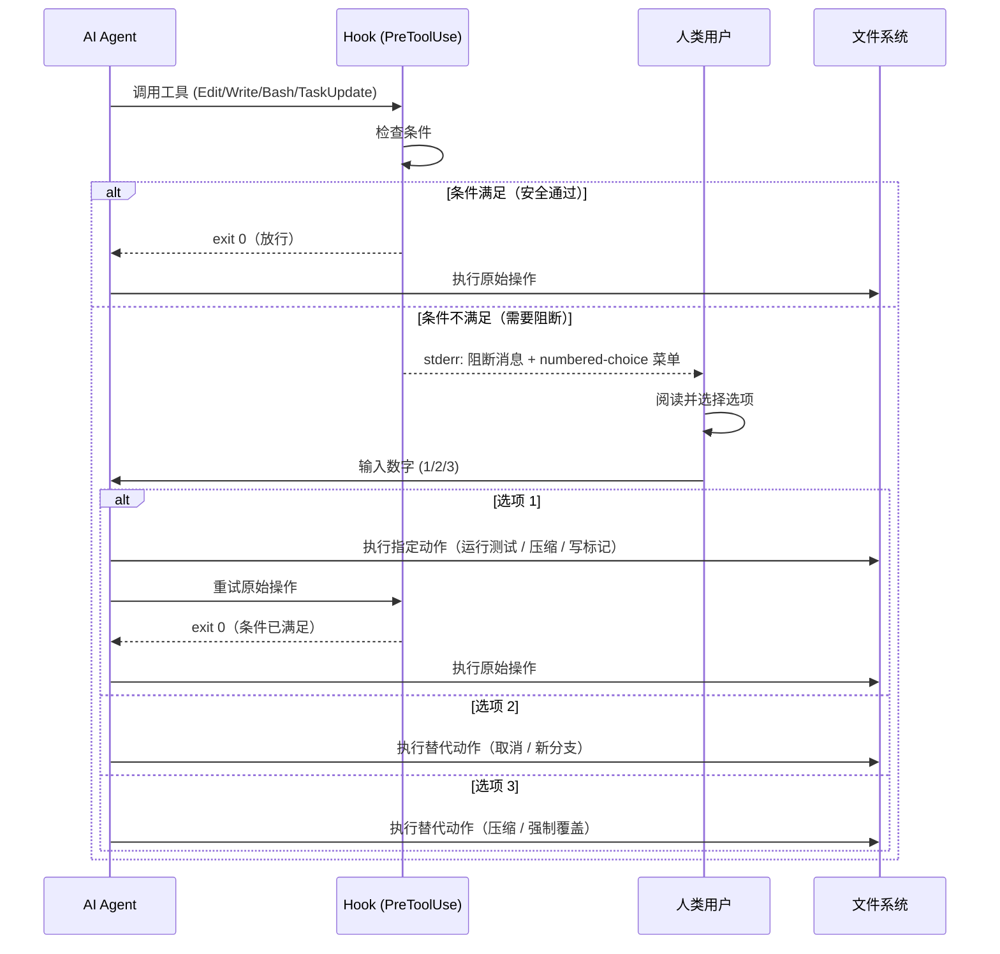
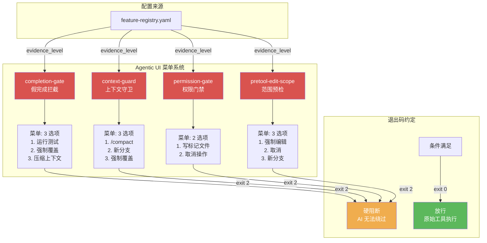
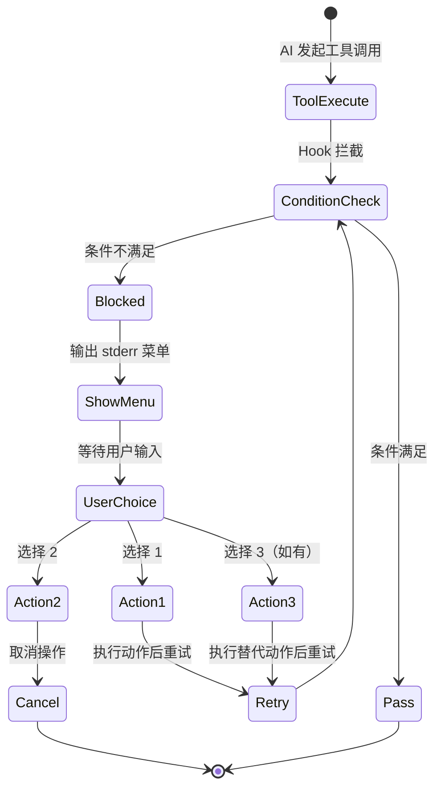

# 07 — Agentic UI：交互式菜单系统

> **前置依赖**: [02 — Gate 防御系统](./02-gates.md)、[05 — 上下文控制](./05-context-control.md)
> **反向链接**: [03 — 功能注册表与探针](./03-feature-registry.md)（evidence_level 读取机制）
> **参考文档**: `[已验证: .claude/hooks/completion-gate.sh:1]`、`[已验证: .claude/hooks/context-guard.sh:1]`、`[已验证: .claude/hooks/permission-gate.sh:1]`、`[已验证: .claude/hooks/pretool-edit-scope.sh:1]`

---

## Function

Agentic UI 是 Carror OS 在 CLI 环境中构建的交互式菜单系统。当 hook 阻断某个工具调用时，不直接拒绝，而是向用户展示一个 numbered-choice 菜单，让用户在多个选项中做出选择。这种设计将 AI 从"决策者"转变为"提案者"，把最终决定权交还给人类。

当前有 **4 个 hook** 实现了这种交互模式：

| Hook | 触发点 | 菜单选项 |
|------|--------|---------|
| `completion-gate.sh` | AI 试图将任务标记为 `completed` 但无证据 | 1. 运行测试重试 / 2. 强制覆盖 / 3. 压缩上下文后继续 |
| `context-guard.sh` | 上下文占比 >= 80%，AI 试图执行写操作 | 1. 运行 /compact 压缩 / 2. 开启新分支 / 3. 强制覆盖 |
| `permission-gate.sh` | 检测到危险命令（rm -rf、DROP TABLE、git push --force） | 1. 写入标记文件继续 / 2. 取消操作 |
| `pretool-edit-scope.sh` | 编辑的文件不在当前 Step 允许范围 | 1. 强制编辑 / 2. 取消操作 / 3. 切换到新分支 |

---

## Philosophy

**"AI 不决策，AI 提案"** — 这是 Agentic UI 的核心哲学。

在传统自动化系统中，AI 要么直接执行（无人类监督），要么完全停止等待（零效率）。Carror OS 采用第三条路：AI 在遇到限制时，展示有限的、结构化的选项菜单，由人类做出最终决策。

这种设计的哲学基础有三层：

1. **透明度**：菜单显示了 AI 遇到的具体限制是什么，以及有哪些可能的解决方案
2. **效率**：用户不需要打字解释"为什么被阻止"——AI 已经分析好了选项
3. **渐进授权**：用户可以通过选择"强制覆盖"来信任 AI，也可以通过"取消"来保持严格管控

---

## Benefits

| 收益 | 说明 |
|------|------|
| **减少摩擦** | 替代"请求→等待→批准"的异步循环，变成实时选择 |
| **降低认知负担** | 用户不需要思考"下一步该做什么"，只需从 2-3 个选项中选一个 |
| **保持控制力** | 用户始终拥有最终决定权，AI 不会被"卡住"也无法绕过 |
| **可审计** | 每次选择是用户主动做出的，形成清晰的决策记录（通过 audit trail 追踪）|
| **上下文友好** | 选项使用短数字 1-3，输出极简，不消耗宝贵 token |

---

## Implementation

### 1. completion-gate.sh — 假完成拦截菜单

**文件**: `[已验证: .claude/hooks/completion-gate.sh:1]`

这是一个 `PreToolUse:TaskUpdate` hook。当 AI 调用 tool 试图将 task 状态标记为 `completed` 时触发。

**阻断逻辑** (line 34-70):
```bash
# 1. 检查 /tmp/.completion-evidence-YYYYMMDD 是否存在
# 2. 检查证据是否在 5 分钟内写入（新鲜度验证）
# 3. 检查证据内容 >= 20 字符（line 52-58）
# 4. 检查证据包含 "VERIFIED" 关键字（line 60-64）
# 5. 标记文件为 "CONSUMED" 防止重复使用（line 66-68）
```

**证据级别读取** (line 77-82):
```bash
# 从 feature-registry.yaml 读取 completion-gate 的 evidence_level
REGISTRY_PATH="$(cd "$(dirname "$0")/.." && pwd)/feature-registry.yaml"
L=$(grep -A2 "^  - name: completion-gate" "$REGISTRY_PATH" | grep "evidence_level:" | sed 's/.*evidence_level: *//')
EVIDENCE_LEVEL_LABEL="$L"  # 默认: L3
```

**菜单输出** (line 84-95):
当无有效证据文件时，向 stderr 输出三段式消息：
1. 错误标题：`COMPLETION BLOCKED`
2. 预期证据级别
3. 三个选择：1. 运行测试重试 / 2. 强制覆盖（需说明理由）/ 3. 压缩上下文后继续

### 2. context-guard.sh — 上下文守卫菜单

**文件**: `[已验证: .claude/hooks/context-guard.sh:1]`

这是一个 `PreToolUse:Edit/Write/Bash` hook。通过 `[已验证: .claude/scripts/context_monitor.py:1]` 读取 `token-tracking-index.json` 计算精确的上下文占比。

**触发条件** (line 35-45):
- 调用 `context_monitor.py` 获取 `is_danger` 和 `percentage`
- 当 `percentage >= 80%` 时硬阻断

**菜单输出** (line 46-58):
```
🚫 [Context Guard 硬阻断] 当前会话上下文占比已达 {PCT}%！
1. 运行 /compact 压缩会话
2. 开启新分支对话
3. 强制覆盖（风险自负）
```

### 3. permission-gate.sh — 权限申请菜单

**文件**: `[已验证: .claude/hooks/permission-gate.sh:1]`

这是一个 `PreToolUse:Bash` hook。通过正则匹配检测 4 类危险命令：git commit、git push --force、destructive operation（rm -rf / DROP TABLE / TRUNCATE / DELETE FROM）、sudo。

**危险等级映射** (line 106-113):
- `git push --force` → 致命 (🔴)
- `destructive operation` → 致命 (🔴)
- 其他 → 高危 (🟡)

**权限标记文件** (line 78-102):
菜单不直接控制流程；它依赖 `[已验证: .omc/state/permission-approved:1]` 标记文件。AI 先通过对话申请权限 → 用户要求写入标记文件 → marked file 存在且新鲜（5分钟内）→ hook 放行。

**菜单输出** (line 115-124):
```
⛔ BLOCKED ({SEVERITY}): {DANGER_TYPE} — 请先说明理由。
1. 写入标记文件继续（echo '理由说明' > .omc/state/permission-approved）
2. 取消操作
```

### 4. pretool-edit-scope.sh — 编辑范围预检菜单

**文件**: `[已验证: .claude/hooks/pretool-edit-scope.sh:1]`

这是一个 `PreToolUse:Edit` hook。检查要编辑的文件是否在当前 Step 允许的范围内（文件路径定义见 `[已验证: .claude/hooks/pretool-edit-scope.sh:41]`）。

**范围冻结检查** (line 38-110):
```bash
# 1. 读取 current-scope.txt 中的 glob pattern 列表（文件由 plan_gate 创建）
# 2. 将目标文件转为相对路径
# 3. 逐行 glob 匹配
# 4. 全不匹配时输出耦合提醒 + 阻断
```

**耦合提醒** (line 44-93):
在阻断前，先调用 `coupling_remind()` 函数读取 coupling-map.json（路径定义见 `[已验证: .claude/hooks/pretool-edit-scope.sh:51]`），输出历史上常与该文件一起变更的其他文件。

**菜单输出** (line 115-127):
```
⛔ 范围冻结: {REL_PATH} 不在当前 Step 允许范围内。
允许的范围: {SCOPE_CONTENT}
1. 强制编辑
2. 取消操作
3. 切换到新分支
```

### 5. 统一菜单架构

所有 4 个 hook 共享同一套交互范式：

1. **标准输出处理**：所有菜单文字一律输出到 `stderr` (>&2)，不影响 stdout 管道
2. **退出码约定**：`exit 0` = 放行（用户可以继续），`exit 2` = 硬阻断（AI 无法绕过）
3. **配置驱动**：通过 `[已验证: .claude/hooks/harness_config.sh:1]` 的 `hc_enabled()` 函数检查 harness.yaml 中的 `hooks_enabled.{name}` 控制开关

每个菜单读取 `feature-registry.yaml` 中对应 hook 的 `evidence_level` 字段：
```yaml
# [已验证: .claude/feature-registry.yaml:134-139]
- name: completion-gate
  type: gate
  evidence_level: L3
# [已验证: .claude/feature-registry.yaml:140-145]
- name: context-guard
  type: gate
  evidence_level: L3
```

---

## Core Code

### completion-gate.sh 菜单核心（line 84-95）

```bash
cat >&2 <<EOF

⛔ COMPLETION BLOCKED: 你正在标记任务为 completed，但未提供验证证据。
预期证据级别（来自 .claude/feature-registry.yaml）: ${EVIDENCE_LEVEL_LABEL}

请选择：
  1. 运行测试重试
  2. 强制覆盖（需说明理由）
  3. 压缩上下文后继续

输入数字 (1-3):
EOF
exit 2
```

### permission-gate.sh 菜单核心（line 115-124）

```bash
cat >&2 <<EOF

⛔ BLOCKED (${SEVERITY}): ${DANGER_TYPE} — 请先说明理由。

请选择：
  1. 写入标记文件继续（echo '理由说明' > ${PERMISSION_MARKER}）
  2. 取消操作

输入数字 (1-2):
EOF
exit 2
```

### context-guard.sh 菜单核心（line 45-58）

```bash
if [ "$IS_DANGER" = "true" ]; then
    cat >&2 <<EOF

🚫 [Context Guard 硬阻断] 当前会话上下文占比已达 ${PCT}%！

为了防止灾难性的幻觉、指令遗忘或代码损毁，已强制拦截了你的写/执行操作。

请选择：
  1. 运行 /compact 压缩会话
  2. 开启新分支对话
  3. 强制覆盖（风险自负）

输入数字 (1-3):
EOF
    exit 2
fi
```

### pretool-edit-scope.sh 菜单核心（line 112-127）

```bash
cat >&2 <<EOF

⛔ 范围冻结: ${REL_PATH} 不在当前 Step 允许范围内。
允许的范围: ${SCOPE_CONTENT}

请选择：
  1. 强制编辑
  2. 取消操作
  3. 切换到新分支

输入数字 (1-3):
EOF
exit 2
```

---

## Logic Flow

所有 4 个 Agentic UI 菜单共享相同的交互流程：

```
触发阶段：
  AI 调用工具 (ToolUse)
  → hook 拦截 (PreToolUse)
  → 条件检查（有证据？危险命令？超上下文？超范围？）

阻断阶段：
  → 条件不满足 → 输出阻断消息 + 菜单（stderr）
  → exit 2（硬阻断，AI 无法绕过）

用户阶段：
  → 用户看到阻断消息
  → 阅读菜单选项
  → 做出选择（输入数字）

响应阶段：
  选项 1 → AI 执行指定动作（运行测试 / 压缩 / 写标记文件 / 强制编辑）
  选项 2 → AI 取消或开启新分支
  选项 3 → AI 执行另一种替代动作（仅存在于 3 选项菜单）

放行阶段：
  → 条件重新满足 → hook 检查通过 → exit 0 → 原始工具执行
```

**关键区别**：permission-gate 的菜单不直接触发动作，而是引导 AI 写入标记文件。下一次 AI 执行相同操作时，hook 检测到标记文件存在，直接放行。其余 3 个 hook 的菜单是"现场处理"——用户选择后 AI 立即执行对应动作。

---

## Visual Diagram

### 序列图：Hook → 菜单 → 选择 → 动作



### 4 个菜单对比表



### 交互流程状态图



---

## 总结

Agentic UI 是 Carror OS 实现"人机协作"的关键桥梁。通过 4 个 hook 的 numbered-choice 菜单系统，AI 在遇到限制时不是硬中断或绕过，而是向人类展示清晰的、结构化的选择路径。这种设计将 AI 的效率与人类的判断力结合起来，实现了可审计、可控制的交互式工作流。

→ 继续阅读 [06 — 审计追踪](./06-audit-trail.md)，了解 Carror OS 的审计与可观测性设计。
