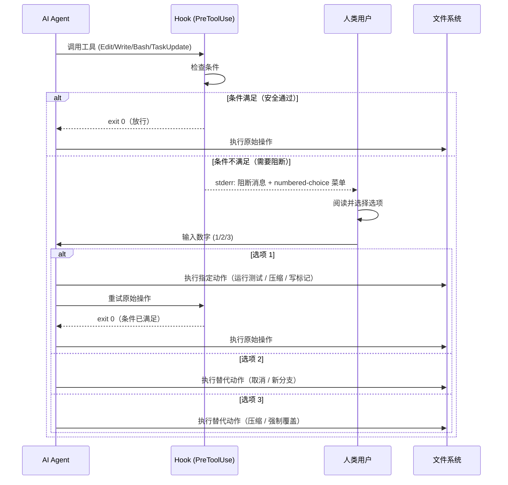
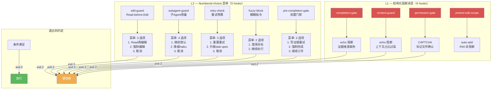
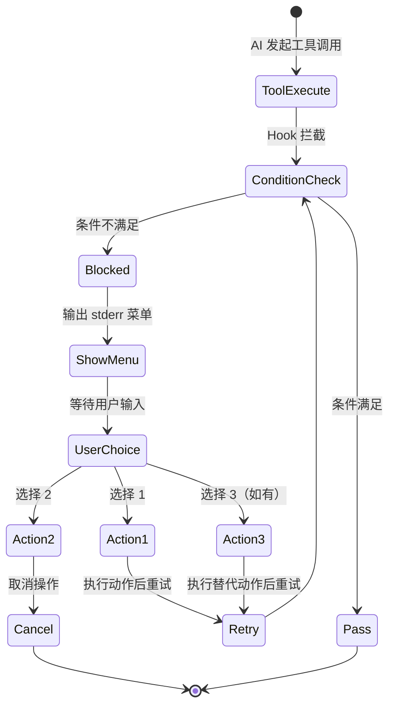

# 07 — Agentic UI：交互式菜单系统

> **前置依赖**: [02 — Gate 防御系统](./02-gates.md)、[05 — 上下文控制](./05-context-control.md)
> **反向链接**: [03 — 功能注册表与探针](./03-feature-registry.md)（evidence_level 读取机制）
> **参考文档**: `[已验证: .claude/hooks/completion-gate.sh:1]`、`[已验证: .claude/hooks/context-guard.sh:1]`、`[已验证: .claude/hooks/permission-gate.sh:1]`、`[已验证: .claude/hooks/pretool-edit-scope.sh:1]`

---

## Function

Agentic UI 是 Carror OS 在 CLI 环境中构建的交互式菜单系统。当 hook 阻断某个工具调用时，不直接拒绝，而是向用户展示清晰的引导信息（早期 4 个 hook 使用结构化阻断消息，近期 5 个 hook 进一步升级为 numbered-choice 编号菜单），让用户在多个选项中做出选择。这种设计将 AI 从"决策者"转变为"提案者"，把最终决定权交还给人类。

当前有 **9 个 hook** 实现了交互式阻断模式，分两个层级：

**L2 — Numbered-choice 菜单**（5 个，2026-05-14 实现）：

| Hook | 触发点 | 菜单选项 |
|------|--------|---------|
| `edit-guard.sh` | 编辑源代码文件但未先 Read | 1. 先 Read 再编辑 / 2. 强制编辑 / 3. 取消操作 |
| `subagent-guard.sh` | 子 agent 未显式声明 max_turns（使用默认值） | 1. 继续（默认上限）/ 2. 降级 haiku / 3. 取消操作 |
| `pretool-retry-check.sh` | 重试次数超过上限（≥3） | 1. 重置计数重试 / 2. 升级 lx-task-spec / 3. 取消操作 |
| `fuzzy-block.sh` | 用户指令模糊不明确 | 1. 向用户澄清 / 2. 按当前理解继续 |
| `pre-completion-gate.sh` | 调用 TaskUpdate(completed) 但无/过期证据 | 1. 写证据重试 / 2. 强制完成 / 3. 继续工作 |

**L1 — 结构化阻断消息**（4 个，早期实现，输出引导文本但无编号选项）：

| Hook | 触发点 | 阻断消息内容 |
|------|--------|---------|
| `completion-gate.sh` | AI 试图标记 completed 但证据不足 | 告知缺失的具体证据维度（内容长度/关键字/软完成语/双源证据/质量评分），引导补充 |
| `context-guard.sh` | 上下文占比 ≥ 80%，AI 执行写操作 | 告知当前上下文占比 + 建议 /compact 压缩或重置 token 追踪 |
| `permission-gate.sh` | 检测到危险命令（rm -rf、DROP TABLE、git push --force） | CAPTCHA 验证码审批 — 告知写入标记文件路径和操作理由要求 |
| `pretool-edit-scope.sh` | 编辑的文件不在当前 Step 允许范围 | R40 已改为自动加入范围 + 非阻断提醒（不再硬阻断） |

---

## Philosophy

**"AI 不决策，AI 提案"** — 这是 Agentic UI 的核心哲学。

在传统自动化系统中，AI 要么直接执行（无人类监督），要么完全停止等待（零效率）。Carror OS 采用第三条路：AI 在遇到限制时，展示有限的、结构化的选项菜单，由人类做出最终决策。

这种设计的哲学基础有三层：

1. **透明度**：菜单显示了 AI 遇到的具体限制是什么，以及有哪些可能的解决方案
2. **效率**：用户不需要打字解释"为什么被阻止"——AI 已经分析好了选项
3. **渐进授权**：用户可以通过选择"强制覆盖"来信任 AI，也可以通过"取消"来保持严格管控

---

## Benefits

| 收益 | 说明 |
|------|------|
| **减少摩擦** | 替代"请求→等待→批准"的异步循环，变成实时选择 |
| **降低认知负担** | 用户不需要思考"下一步该做什么"，只需从 2-3 个选项中选一个 |
| **保持控制力** | 用户始终拥有最终决定权，AI 不会被"卡住"也无法绕过 |
| **可审计** | 每次选择是用户主动做出的，形成清晰的决策记录（通过 audit trail 追踪）|
| **上下文友好** | 选项使用短数字 1-3，输出极简，不消耗宝贵 token |

---

## Implementation

### L2 级 — Numbered-choice 菜单（5 个 hook）

以下 5 个 hook 于 2026-05-14 实现了完整的 numbered-choice 菜单。每个菜单输出到 stderr，以 `exit 2` 硬阻断，格式为：

```
⛔ {阻断原因}
请选择：
  1. {正向路径}
  2. {绕过路径}
  3. {取消路径}（如有）
输入数字 (1-N):
```

#### 1. edit-guard.sh — Read-before-Edit 菜单

**文件**: `[已验证: .claude/hooks/edit-guard.sh:74-87]`

**触发**: PreToolUse:Edit，当 AI 编辑源代码文件但未先 Read 时。

**菜单代码** (line 74-87):
```bash
cat >&2 <<EOF

⛔ [Read-before-Edit] 你正在编辑源代码文件但未先 Read。
文件: $FILE_PATH
宪法依据: 第六条（长对话稳定性）— 修改代码前必须先阅读当前内容

请选择：
  1. 先 Read "$FILE_PATH" 再编辑
  2. 强制编辑（跳过 Read 检查）
  3. 取消操作

输入数字 (1-3):
EOF
exit 2
```

#### 2. subagent-guard.sh — 子 Agent 用量菜单

**文件**: `[已验证: .claude/hooks/subagent-guard.sh:97-120]`

**触发**: PreToolUse:Task，当危险子 agent 类型（executor/designer/scientist）未显式声明 max_turns 而使用默认值时。

**菜单代码** (line 100-118):
```bash
cat >&2 <<EOF

⛔ [Subagent Guard] 子 agent "${AGENT_TYPE}" 未显式声明 max_turns，将使用默认上限 ${DEFAULT_MAX_TURNS} 轮。
建议: executor ≤25, designer ≤20, scientist ≤15

请选择：
  1. 继续（使用默认上限 ${DEFAULT_MAX_TURNS} 轮）
  2. 降级为 haiku（最安全）
  3. 取消操作

输入数字 (1-3):
EOF
exit 2
```

#### 3. pretool-retry-check.sh — 重试预算菜单

**文件**: `[已验证: .claude/hooks/pretool-retry-check.sh:65-77]`

**触发**: PreToolUse:Bash，当重试计数 ≥3 次时。

**菜单代码** (line 65-77):
```bash
cat >&2 <<EOF

⛔ [Retry Budget] 存在超过重试上限的重复失败:
${EXCEEDED}

请选择：
  1. 重置重试计数并重试
  2. 升级到 lx-task-spec（结构化处理）
  3. 取消操作

输入数字 (1-3):
EOF
exit 2
```

#### 4. fuzzy-block.sh — 模糊指令菜单

**文件**: `[已验证: .claude/hooks/fuzzy-block.sh:29-40]`

**触发**: PreToolUse（所有工具），当 turn-counter 标记模糊指令时。

**菜单代码** (line 29-40):
```bash
cat >&2 <<EOF

⛔ 模糊指令阻断: 指令不明确，无法执行具体工具调用。
原因: ${FUZZY_MSG_ESCAPED}

请选择：
  1. 向用户澄清具体目标
  2. 按当前理解继续执行

输入数字 (1-2):
EOF
exit 2
```

#### 5. pre-completion-gate.sh — 前置完成门禁菜单

**文件**: `[已验证: .claude/hooks/pre-completion-gate.sh:41-53,65-75]`

**触发**: PreToolUse:TaskUpdate，当 AI 调用 `TaskUpdate(completed)` 但证据文件缺失（菜单A）或过期（菜单B）时。

**菜单 A — 无证据** (line 41-53):
```bash
cat >&2 <<EOF

⛔ 前置门禁阻断: 调用 TaskUpdate(completed) 但无证据文件。

请选择：
  1. 运行验证并写入证据到 ${EVIDENCE_FILE}
  2. 强制完成（无证据）
  3. 继续工作（不标记完成）

输入数字 (1-3):
EOF
exit 2
```

**菜单 B — 证据过期** (line 65-75):
```bash
cat >&2 <<EOF

⛔ 前置门禁阻断: 证据文件已过期（超过 5 分钟）。

请选择：
  1. 重新运行验证并写入新证据到 ${EVIDENCE_FILE}
  2. 强制完成（跳过新鲜度检查）
  3. 继续工作（不标记完成）

输入数字 (1-3):
EOF
exit 2
```

---

### L1 级 — 结构化阻断消息（4 个 hook，早期实现）

以下 4 个 hook 在早期版本中实现。它们输出结构化阻断消息引导用户行为，但**不含编号选项**（输出格式为 `echo` 行或结构化文本块，非 numbered-choice 菜单）。未来可升级为 L2 级编号菜单。

#### completion-gate.sh — 假完成拦截

**文件**: `[已验证: .claude/hooks/completion-gate.sh:1]`

PostToolUse:TaskUpdate hook。当 AI 标记任务为 `completed` 但证据不足时，输出具体缺失维度：

| 阻断场景 | 输出内容 |
|---------|---------|
| 证据文件缺失/被消费 | `⛔ COMPLETION BLOCKED: 证据已被其他进程消费` |
| 内容过短 | `⛔ COMPLETION BLOCKED: 证据内容过短` |
| 缺少 VERIFIED 关键字 | `⛔ COMPLETION BLOCKED: 证据文件中未找到 'VERIFIED'` |
| 软完成语 | `⛔ COMPLETION BLOCKED: 证据含软完成语` |
| 单一证据源 | `⛔ COMPLETION BLOCKED: 证据仅来自 1/3 个验证类别` |
| 质量评分不足 | `⛔ COMPLETION BLOCKED: 证据质量评分不足` |

每种场景均通过 `auto_soft_block()` 输出非阻断告警（自主模式）或硬阻断（正常模式），阻断时给出具体改进方向。

#### context-guard.sh — 上下文守卫

**文件**: `[已验证: .claude/hooks/context-guard.sh:82-87]`

PreToolUse:Edit/Write hook。当上下文占比 ≥80% 时输出单段阻断消息：

```
🚫 [Context Guard 硬阻断] 当前会话上下文占比已达 {PCT}%！
为了防止灾难性的幻觉、指令遗忘或代码损毁，已强制拦截了写入操作。
诊断工具 (Read/Grep/Bash) 可正常使用。请先诊断上下文状态，
然后运行 '/compact' 压缩会话或手动重置 token 追踪。
```

exit 2 硬阻断，但 Read/Grep/Bash 保留诊断通道（R29）。

#### permission-gate.sh — 权限申请

**文件**: `[已验证: .claude/hooks/permission-gate.sh:1]`

PreToolUse:Bash hook。正则检测危险命令（git cmt/push --force/destructive/sudo），输出 CAPTCHA 验证码消息：

```
⛔ BLOCKED ({SEVERITY}): {DANGER_TYPE} — 请先说明理由。
1. 写入标记文件继续（echo '理由说明' > .omc/state/permission-approved）
2. 取消操作
```

实际为 CAPTCHA 标记文件机制：用户通过对话申请权限 → 写入标记文件 → 文件存在且 5 分钟内 → hook 放行。

#### pretool-edit-scope.sh — 编辑范围预检

**文件**: `[已验证: .claude/hooks/pretool-edit-scope.sh:1]`

PreToolUse:Edit hook。R40 后已改为**自动加入范围 + 非阻断提醒**模式。发现越界文件时自动将其加入 current-scope.txt，输出耦合提醒（从 coupling-map.json 读取），**不再硬阻断**。

---

### 统一架构

所有 9 个 hook 共享核心交互范式：

1. **标准输出处理**：所有交互文字输出到 `stderr` (>&2)，不影响 stdout JSON 管道
2. **退出码约定**：`exit 0` = 放行，`exit 2` = 硬阻断（AI 无法绕过）
3. **配置驱动**：通过 `[已验证: .claude/hooks/harness_config.sh:1]` 的 `hc_enabled()` 函数检查 harness.yaml 中的 `hooks_enabled.{name}` 控制开关
4. **模式降级**: ghost/goal 自主模式下，所有阻断降级为记录不阻断


每个菜单读取 `feature-registry.yaml` 中对应 hook 的 `evidence_level` 字段：
```yaml
# [已验证: .claude/feature-registry.yaml:134-139]
- name: completion-gate
  type: gate
  evidence_level: L3
# [已验证: .claude/feature-registry.yaml:140-145]
- name: context-guard
  type: gate
  evidence_level: L3
```

---

## Core Code

以下展示 5 个 L2 级 numbered-choice 菜单的核心代码（L1 级结构化阻断消息见 Implementation 部分）。

### edit-guard.sh 菜单核心（`[已验证: .claude/hooks/edit-guard.sh:74-87]`）

```bash
cat >&2 <<EOF

⛔ [Read-before-Edit] 你正在编辑源代码文件但未先 Read。
文件: $FILE_PATH
宪法依据: 第六条（长对话稳定性）— 修改代码前必须先阅读当前内容

请选择：
  1. 先 Read "$FILE_PATH" 再编辑
  2. 强制编辑（跳过 Read 检查）
  3. 取消操作

输入数字 (1-3):
EOF
exit 2
```

### subagent-guard.sh 菜单核心（`[已验证: .claude/hooks/subagent-guard.sh:100-118]`）

```bash
cat >&2 <<EOF

⛔ [Subagent Guard] 子 agent "${AGENT_TYPE}" 未显式声明 max_turns，将使用默认上限 ${DEFAULT_MAX_TURNS} 轮。
建议: executor ≤25, designer ≤20, scientist ≤15

请选择：
  1. 继续（使用默认上限 ${DEFAULT_MAX_TURNS} 轮）
  2. 降级为 haiku（最安全）
  3. 取消操作

输入数字 (1-3):
EOF
exit 2
```

### pretool-retry-check.sh 菜单核心（`[已验证: .claude/hooks/pretool-retry-check.sh:65-77]`）

```bash
cat >&2 <<EOF

⛔ [Retry Budget] 存在超过重试上限的重复失败:
${EXCEEDED}

请选择：
  1. 重置重试计数并重试
  2. 升级到 lx-task-spec（结构化处理）
  3. 取消操作

输入数字 (1-3):
EOF
exit 2
```

### fuzzy-block.sh 菜单核心（`[已验证: .claude/hooks/fuzzy-block.sh:29-40]`）

```bash
cat >&2 <<EOF

⛔ 模糊指令阻断: 指令不明确，无法执行具体工具调用。
原因: ${FUZZY_MSG_ESCAPED}

请选择：
  1. 向用户澄清具体目标
  2. 按当前理解继续执行

输入数字 (1-2):
EOF
exit 2
```

### pre-completion-gate.sh 菜单核心（`[已验证: .claude/hooks/pre-completion-gate.sh:41-53]`）

```bash
cat >&2 <<EOF

⛔ 前置门禁阻断: 调用 TaskUpdate(completed) 但无证据文件。

请选择：
  1. 运行验证并写入证据到 ${EVIDENCE_FILE}
  2. 强制完成（无证据）
  3. 继续工作（不标记完成）

输入数字 (1-3):
EOF
exit 2
```

## Logic Flow

所有 9 个 Agentic UI 菜单共享相同的交互流程：

```
触发阶段：
  AI 调用工具 (ToolUse)
  → hook 拦截 (PreToolUse)
  → 条件检查（有证据？危险命令？超上下文？超范围？）

阻断阶段：
  → 条件不满足 → 输出阻断消息 + 菜单（stderr）
  → exit 2（硬阻断，AI 无法绕过）

用户阶段：
  → 用户看到阻断消息
  → 阅读菜单选项
  → 做出选择（输入数字）

响应阶段：
  选项 1 → AI 执行指定动作（运行测试 / 压缩 / 写标记文件 / 强制编辑）
  选项 2 → AI 取消或开启新分支
  选项 3 → AI 执行另一种替代动作（仅存在于 3 选项菜单）

放行阶段：
  → 条件重新满足 → hook 检查通过 → exit 0 → 原始工具执行
```

**关键区别**：L1 级 hook（completion-gate / context-guard / permission-gate）通过 echo 输出结构化阻断消息后直接 exit 2，不提供编号选项。L2 级 hook（edit-guard / subagent-guard / retry-check / fuzzy-block / pre-completion-gate）输出 numbered-choice 菜单。permission-gate 额外使用 CAPTCHA 标记文件机制进行二次确认。

---

## Visual Diagram

### 序列图：Hook → 菜单 → 选择 → 动作



### 9 个菜单对比表



### 交互流程状态图



---

## 总结

Agentic UI 是 Carror OS 实现"人机协作"的关键桥梁。通过 9 个 hook 的两级交互式阻断（L1: 4 个结构化消息 + L2: 5 个 numbered-choice 菜单），AI 在遇到限制时不是硬中断或绕过，而是向人类展示清晰的、结构化的选择路径。这种设计将 AI 的效率与人类的判断力结合起来，实现了可审计、可控制的交互式工作流。

→ 继续阅读 [06 — 审计追踪](./06-audit-trail.md)，了解 Carror OS 的审计与可观测性设计。
