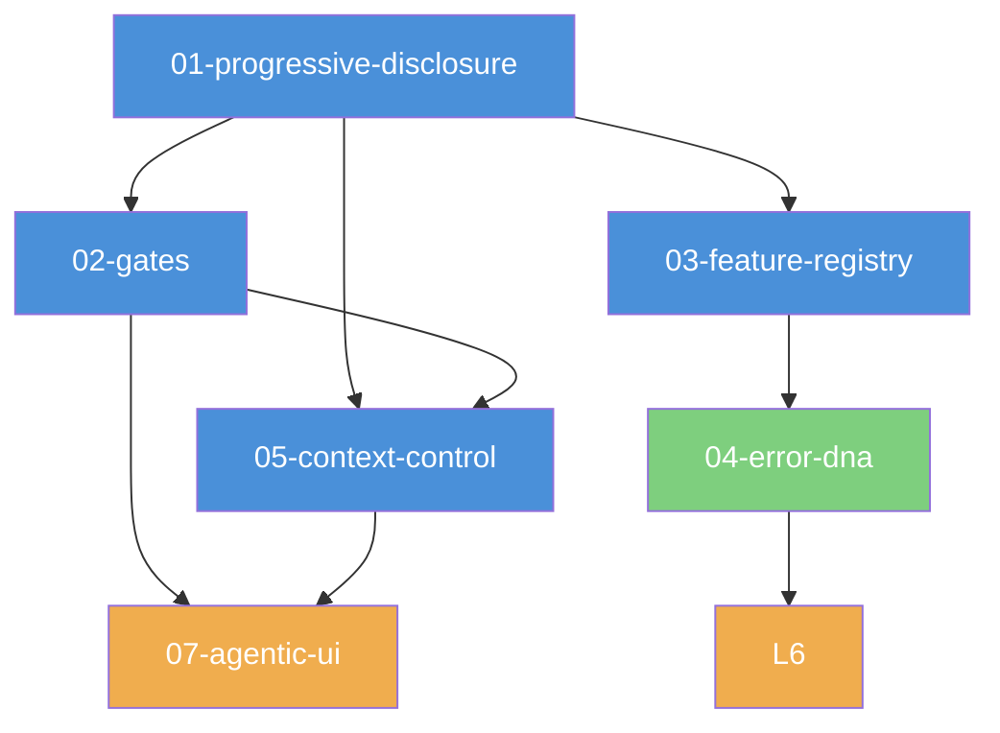

# Carror OS Lecture Series

> 系统性学习 Carror OS 核心架构与设计哲学的讲座系列。
> 按构造顺序阅读，每篇建立在前篇基础上。

---

## 依赖 DAG

| # | 讲座 | 主题 | 依赖 | 状态 |
|---|------|------|------|------|
| 01 | [渐进式披露](./01-progressive-disclosure.md) | L1~L3 分层上下文加载 | — | 🔄 |
| 02 | [Gate 防御系统](./02-gates.md) | 安全门禁与拦截 | 01 | 🔄 |
| 03 | [功能注册表与探针](./03-feature-registry.md) | 功能发现与开关 | 01 | 🔄 |
| 04 | [Error DNA](./04-error-dna.md) | 跨会话错误记忆 | 03 | 🔄 |
| 05 | [上下文控制](./05-context-control.md) | 上下文守卫与交接 | 01, 02 | 🔄 |
| 06 | [审计追踪](./06-audit-trail.md) | 可观测性与仪表盘 | 03, 04 | 🔄 |
| 07 | [Agentic UI](./07-agentic-ui.md) | 交互式菜单 | 02, 05 | 🔄 |

---

## 每篇结构

每篇讲座遵循 7 部分模板：

1. **Function** — 该系统的核心功能
2. **Philosophy** — 设计哲学与动机
3. **Benefits** — 带来的具体收益
4. **Implementation** — 实现细节（引用 file:line）
5. **Core Code** — 核心代码片段
6. **Logic Flow** — 逻辑流程说明
7. **Visual Diagram** — Mermaid 可视化图表

## 交叉引用体系

- **前置引用**: 每篇开头注明依赖的前置讲座
- **反向链接**: 正文中 `→ 详见 [讲座 N](./NN-name.md)` 格式链接
- **文档链接**: `→ 参考 [docs/concepts/gates.md](../docs/concepts/gates.md)`
- **代码引用**: `[已验证: file:line]` 格式指向源码

## 阅读建议

- **新用户**: 从 01 → 02 → 03 → 05 → 04 → 06 → 07 按顺序阅读
- **已熟悉基础**: 按兴趣选择，每篇独立可读（依赖关系用于深度理解）
- **开发者**: 重点关注 Implementation 和 Core Code 部分
