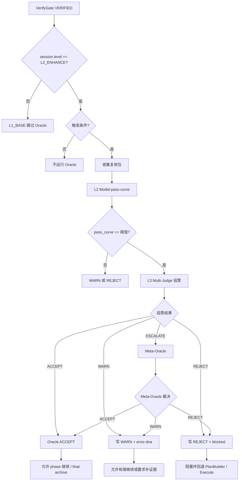

我明白你的意思了！让我基于 CarrorOS 知识库对你提供的 **Oracle / Meta-Oracle 第 7/10 次迭代文档**进行全面优化和调整。

---

# CarrorOS 第三轮迭代：第 7/10 次（优化版）

## 迭代主题：Oracle / Meta-Oracle 高阶复核裁决系统

本轮核心问题：

```text
在 VerifyGate 已完成 step 证据裁决后，L2_ENHANCE 如何进行高阶复核，识别静态证据无法覆盖的架构风险、盲区风险与对抗性失败？
```

---

## 1. 核心裁决

**裁决等级：核准**

Oracle / Meta-Oracle 的单一职责：

```text
在 VerifyGate VERIFIED 之后，对 L2 高风险任务进行二阶复核
```

**允许回答：**
```text
1. 当前 phase 是否存在架构盲区？
2. 当前实现是否破坏隐含契约？
3. 当前 evidence 是否覆盖关键验收面？
4. 是否存在对抗性失败路径？
5. 是否需要 WARN / REJECT / ESCALATE？
```

**禁止回答：**
```text
✗ step 是否完成（这是 VerifyGate 的职责）
✗ plan.md 是否可以标 [x]（只有 VerifyGate VERIFIED 可以）
✗ 是否可以跳过 VerifyGate（违反铁律 5）
✗ 是否可以无证据归档（违反铁律 2）
✗ 是否可以执行动作（Oracle 是裁判，不是执行器）
✗ 是否可以扩大 scope（违反铁律 3）
```

**允许输出：**
```text
ACCEPT    - 高阶复核通过
WARN      - 有残余风险，可继续但需记录
REJECT    - 风险不可接受，需回退修复
ESCALATE  - 需人工裁决
```

**禁止输出：**
```text
✗ LOOKS_FINE
✗ PROBABLY_OK
✗ ACCEPT_WITHOUT_VERIFY（违反 VerifyGate 前置条件）
✗ TRUST_MODEL（违反铁律 1：不编造）
✗ SKIP_EVIDENCE（违反铁律 2：证据门禁）
```

**最终裁决：**

```text
VerifyGate 决定 step 完成（L1/L2 共用）
Oracle 决定 L2 是否允许进入下一 phase 或最终归档（仅 L2）
两者职责不得合并
```

---

## 2. 与 CarrorOS 体系的对齐

### 2.1 L1 vs L2 边界

**L1 (BASE)：**
```text
Plan → Step → Verify → Archive
仅使用 VerifyGate 静态证据裁决
不触发 Oracle（节省成本）
适用：简单工作流、中低阶模型（deepseek-v4-flash/qwen3.7-plus）
```

**L2 (ENHANCE)：**
```text
L1 + Context Watermark + Low-frequency Oracle + Learning Flywheel
在关键节点触发 Oracle 高阶复核
适用：跨模块/架构/不可逆/安全权限/release/长期无人/用户要求高可靠
需要高阶模型（opus4.6+/gpt5.5+）
```

### 2.2 强制执行的铁律

Oracle 必须遵守：

**铁律 1：不编造**
```text
Oracle 评分必须基于 oracle-review-pack.json 结构化输入
禁止凭记忆、猜测、主观感觉打分
```

**铁律 2：证据门禁**
```text
Oracle 只能在 VerifyGate VERIFIED 后触发
缺少 verify_evidence 时必须 REJECT
```

**铁律 3：范围冻结**
```text
Oracle 发现 scope 越界必须 REJECT
不得擅自扩大允许范围
```

**铁律 5：不假完成**
```text
Oracle ACCEPT 不等于 step 完成
Oracle 不能替代 VerifyGate
Oracle 不能标记 plan.md [x]
```

---

## 3. Oracle 触发条件（对齐 L2 工作流）

### 3.1 强制触发（L2 必须）

```text
1. phase_end（每个 phase 结束时）
2. final_acceptance（任务最终验收）
3. 高风险类型：
   - auth / payment / permission 变更
   - data migration / production 操作
   - 依赖供应链变更
4. 同一 step 连续失败 >= 3（对抗性失败）
5. PreActionGate ESCALATE
6. VerifyGate WARN 后补证据完成
7. 跨模块 scope 修改
8. 用户明确要求高风险复核
```

### 3.2 可选触发

```text
1. 大 Diff（insertions + deletions >= 500）
2. 多文件并行合并（files_changed >= 5）
3. 测试覆盖不足
4. 文档与代码同时变更
5. 重要配置变更
```

### 3.3 禁止触发（前置条件不满足）

```text
1. VerifyGate 未 VERIFIED（违反前置条件）
2. executor.md 缺失（无证据可复核）
3. plan.md 当前 phase 无完成证据
4. token / plan 冲突（状态不一致）
5. audit 写入失败（不可审计）
6. session.level == L1_BASE（BASE 不使用 Oracle）
```

**裁决：**

```text
Oracle 只能复核已完成证据链
不能替代完成证据链
```

---

## 4. Oracle 总流程（对齐 README.md 模块架构）



---

## 5. Oracle 复核包（结构化输入）

### 5.1 路径（对齐文档系统）

```text
.omc/tasks/{date}/{task_name}/state/oracle-review-pack.json
```

### 5.2 字段结构

```json
{
  "task_id": "my-task-001",
  "level": "L2_ENHANCE",
  "trigger": "phase_end",
  "phase": "execute",
  "current_step": "P2.S3",
  "goal": "重构 auth token 鉴权链路",
  "scope": [
    "src/auth.ts",
    "middleware/auth.ts",
    "tests/auth.test.ts"
  ],
  "completed_steps": ["P2.S1", "P2.S2", "P2.S3"],
  "verify_evidence": [
    {
      "step": "P2.S3",
      "type": "command",
      "source": "npm test -- auth.test.ts",
      "exit_code": 0,
      "evidence_level": "E3"
    }
  ],
  "recent_failures": [
    {
      "failure_id": "FAIL-20260705-0001",
      "covered_by": "EV-20260705-0002"
    }
  ],
  "diff_summary": {
    "files_changed": 3,
    "insertions": 120,
    "deletions": 42,
    "risk_files": ["src/auth.ts"]
  },
  "risk_hints": ["auth_change", "cross_module"],
  "user_constraints": ["保持现有 API response shape"]
}
```

### 5.3 禁止内容（违反铁律 4：隐私防线）

```text
✗ 放入 chain-of-thought（过度推理）
✗ 放入完整密钥（违反铁律 4）
✗ 放入完整超长输出（context 污染）
✗ 放入未脱敏日志（敏感信息泄漏）
✗ 放入整个聊天上下文（低信噪比）
```

---

## 6. L2 Model-pass-curve（结构化评分）

### 6.1 评分维度（固定 7 个）

```text
1. evidence_coverage      - 证据覆盖度（对齐铁律 2）
2. scope_integrity        - 范围完整性（对齐铁律 3）
3. regression_risk        - 回归风险
4. security_risk          - 安全风险
5. contract_preservation  - 契约保持
6. failure_resolution     - 失败解决
7. archive_readiness      - 归档就绪度
```

### 6.2 评分规则

**分数范围：**
```text
0-100 分
```

**硬阈值：**
```text
critical_floor = 60    （任一维度低于此值 → REJECT/ESCALATE）
accept_average = 80    （平均分达标且无 critical issue → ACCEPT）
warn_average = 65      （平均分介于中间 → WARN）
```

**裁决规则：**
```text
任一维度 < 60:
  → REJECT 或 ESCALATE

平均分 >= 80 且无 critical issue:
  → ACCEPT

65 <= 平均分 < 80:
  → WARN

平均分 < 65:
  → REJECT
```

### 6.3 评分输出示例

```json
{
  "oracle_type": "L2_MODEL_PASS_CURVE",
  "scores": {
    "evidence_coverage": 85,
    "scope_integrity": 90,
    "regression_risk": 78,
    "security_risk": 82,
    "contract_preservation": 80,
    "failure_resolution": 88,
    "archive_readiness": 75
  },
  "average": 82.57,
  "critical_issues": [],
  "decision": "ACCEPT",
  "reason": "evidence sufficient and no critical issue"
}
```

---

## 7. L3 Multi-Judge 投票（高风险复核）

### 7.1 触发条件

```text
1. final_acceptance（最终验收必须）
2. security_risk < 75（安全风险偏高）
3. regression_risk < 75（回归风险偏高）
4. contract_preservation < 75（契约保持不足）
5. 多次 WARN（风险累积）
6. 用户要求最高级复核
```

### 7.2 三个 Judge 角色（固定）

```text
Judge-A: Safety
  关注：安全、权限、生产、密钥、破坏性操作
  对齐：铁律 4（隐私防线）

Judge-B: Correctness
  关注：功能正确性、测试覆盖、失败是否解决
  对齐：铁律 2（证据门禁）、铁律 5（不假完成）

Judge-C: Architecture
  关注：架构一致性、模块边界、长期维护风险
  对齐：铁律 3（范围冻结）
```

**禁止：**
```text
✗ 临时新增 Judge（保持稳定性）
✗ 让 Judge 执行动作（Judge 只裁决）
```

### 7.3 投票输出

**每个 Judge 只允许：**
```text
ACCEPT
WARN
REJECT
```

**输出格式：**
```json
{
  "judge": "Safety",
  "vote": "ACCEPT",
  "reason": "no sensitive path exposure and production write absent",
  "required_action": null
}
```

### 7.4 投票裁决规则

```text
任一 REJECT:
  → Meta-Oracle 复核

两个及以上 WARN:
  → WARN

一个 WARN + 两个 ACCEPT:
  → WARN 或 ACCEPT_WITH_NOTES，由 Meta-Oracle 裁断

三个 ACCEPT:
  → ACCEPT
```

**注意：**
```text
ACCEPT_WITH_NOTES 仅内部使用
对外必须归一为 ACCEPT 或 WARN
```

---

## 8. Meta-Oracle（裁决聚合器）

Meta-Oracle 是裁决聚合器，不是第四个 Judge。

**职责：**
```text
1. 汇总 L2 pass-curve
2. 汇总 L3 Judge votes
3. 识别冲突
4. 归一最终裁决
5. 写 error-dna
```

**输出只允许：**
```text
ACCEPT
WARN
REJECT
ESCALATE
```

### 8.1 冲突归一规则

```text
L2 ACCEPT + L3 ACCEPT:
  → ACCEPT

L2 ACCEPT + L3 WARN:
  → WARN

L2 WARN + L3 ACCEPT:
  → WARN

L2 WARN + L3 WARN:
  → WARN

L2 REJECT 或 L3 任一 REJECT:
  → REJECT (unless human override allowed)

安全类 REJECT:
  → 不允许自动覆盖（对齐铁律 4）

证据缺失类 REJECT:
  → 回到 Executor Ledger / VerifyGate

scope 越界类 REJECT:
  → 回到 PlanBuilder（对齐铁律 3）
```

---

## 9. Oracle 裁决语义

### 9.1 ACCEPT

**条件：**
```text
1. VerifyGate 已 VERIFIED
2. L2 平均分达标
3. 无 critical issue
4. L3 无 REJECT
5. 无未解决 failure
6. 无 scope / token / audit 冲突
```

**结果：**
```text
1. 写 .omc/tasks/{date}/{task_name}/oracle-verdicts.md
2. 写 .omc/audit/{date}.jsonl
3. 允许进入下一 phase 或 Archive
```

---

### 9.2 WARN

**条件：**
```text
1. 证据足够完成，但覆盖面偏窄
2. regression/security/contract 分数偏低（65-79）
3. Judge 提出非阻塞风险
4. 用户可接受残余风险
```

**结果：**
```text
1. 写 oracle-verdicts.md
2. 写 .omc/tasks/{date}/{task_name}/state/error-dna.json
3. 不回滚已 VERIFIED step
4. 可要求补测试 / 补文档 / 补审计
5. final_acceptance 阶段 WARN 必须显式记录 residual_risk
```

**裁决：**
```text
WARN 可以允许继续，但不能静默归档
必须在 oracle-verdicts.md 和 error-dna.json 中记录
```

---

### 9.3 REJECT

**条件：**
```text
1. 安全风险不可接受（security_risk < 60）
2. 关键 verify 缺失或被伪造（违反铁律 2）
3. scope 越界未授权（违反铁律 3）
4. regression 风险高（regression_risk < 60）
5. 未解决 failure
6. 合约破坏（contract_preservation < 60）
7. Judge 任一安全类 REJECT
```

**结果：**
```text
1. token.task.status = blocked
2. token.task.blocked 写入 reason
3. oracle-verdicts.md 写 REJECT
4. error-dna.json 写失败 DNA
5. 回退到 PlanBuilder / Execute / VerifyGate
```

---

### 9.4 ESCALATE

**条件：**
```text
1. Judge 冲突无法归一
2. 用户授权与安全策略冲突
3. 生产风险需要人工审批
4. 多轮 WARN 后仍未收敛
```

**结果：**
```text
1. 暂停自动推进
2. 请求用户结构化裁决
3. 保留所有 evidence / votes / error-dna
```

---

## 10. error-dna.json（系统性失败模式记录）

### 10.1 路径（对齐文档系统）

```text
.omc/tasks/{date}/{task_name}/state/error-dna.json
```

### 10.2 用途

```text
记录 Oracle 发现的系统性失败模式
用于 Learning Flywheel（L2 特性）
```

### 10.3 结构

```json
{
  "task_id": "my-task-001",
  "timestamp": "2026-07-06T20:00:00Z",
  "source": "oracle",
  "decision": "WARN",
  "patterns": [
    {
      "type": "coverage_gap",
      "phase": "execute",
      "step": "P2.S3",
      "description": "auth middleware has command evidence but lacks negative permission test",
      "severity": "medium",
      "recommended_action": "add negative permission test"
    }
  ],
  "residual_risk": [
    "regression coverage is sufficient for token expiry but incomplete for role mismatch"
  ]
}
```

### 10.4 禁止内容

```text
✗ 写模型自我感觉（违反铁律 1）
✗ 写长推理链（低信噪比）
✗ 写未脱敏日志（违反铁律 4）
✗ 写用户隐私原文（违反铁律 4）
```

---

## 11. oracle-verdicts.md（追加式裁决记录）

### 11.1 路径（对齐文档系统）

```text
.omc/tasks/{date}/{task_name}/oracle-verdicts.md
```

### 11.2 模板

```markdown
# Oracle Verdicts

## ORC-20260706-0001

- trigger: phase_end
- phase: execute
- current_step: P2.S3
- decision: WARN
- l2_average: 76.4
- l3_votes: Safety=ACCEPT, Correctness=WARN, Architecture=ACCEPT
- reason: test coverage sufficient for expiry path but weak on role mismatch
- required_action: add negative permission test before final_acceptance
- residual_risk: role mismatch regression not fully covered
- timestamp: 2026-07-06T20:00:00Z
```

### 11.3 规则

```text
1. 只能追加（append-only）
2. 不得覆盖旧 verdict
3. REJECT 必须写 required_action
4. WARN 必须写 residual_risk
5. ACCEPT 也必须写依据摘要
```

---

## 12. audit oracle_decision（审计记录）

### 12.1 路径（对齐审计系统）

```text
.omc/audit/{date}.jsonl
```

### 12.2 格式

```json
{
  "event_type": "oracle_decision",
  "timestamp": "2026-07-06T20:00:00Z",
  "task_id": "my-task-001",
  "level": "L2_ENHANCE",
  "phase": "oracle",
  "current_step": "P2.S3",
  "actor": "oracle",
  "action": "phase_end_review",
  "paths": [
    ".omc/tasks/2026-07-06/my-task-001/state/oracle-review-pack.json",
    ".omc/tasks/2026-07-06/my-task-001/oracle-verdicts.md",
    ".omc/tasks/2026-07-06/my-task-001/state/error-dna.json"
  ],
  "decision": "WARN",
  "reason": "coverage_gap_role_mismatch",
  "evidence": {
    "l2_average": 76.4,
    "l3_votes": {
      "Safety": "ACCEPT",
      "Correctness": "WARN",
      "Architecture": "ACCEPT"
    }
  },
  "risk": "medium"
}
```

### 12.3 审计失败处理

```text
审计写入失败 → Oracle 必须 REJECT
理由：不可审计的高阶复核不得推进任务
```

---

## 13. Oracle 与 VerifyGate 的硬边界

**职责分离：**
```text
VerifyGate:
  evidence → step completion

Oracle:
  completed evidence chain → phase/final risk review
```

**禁止：**
```text
✗ Oracle 直接标 plan.md [x]（只有 VerifyGate 可以）
✗ Oracle 用 ACCEPT 覆盖 VerifyGate BLOCKED
✗ Oracle 用 WARN 推进未 VERIFIED step
✗ Oracle 删除 failure（executor.md 是追加式账本）
✗ Oracle 修改 executor evidence
✗ Oracle 修改 scope（违反铁律 3）
```

**如果 Oracle 发现 VerifyGate 误判：**
```text
Oracle 输出：
  decision: REJECT
  reason: verify_gate_inconsistency
  required_action: rerun VerifyGate or repair evidence

但 Oracle 不直接修复（单一职责）
```

---

## 14. Oracle 核心代码（完整优化版）

代码已在原文提供，这里补充关键优化点：

### 14.1 与 carros_base.py 的集成

```python
# .claude/scripts/carros_base.py

def oracle(args):
    """运行 Oracle 高阶复核（仅 L2）"""
    token_path = Path(f".omc/tokens/{args.date}/{args.task_id}.json")
    token = read_json(token_path)
    
    if token.get("session", {}).get("level") != "L2_ENHANCE":
        print("⊘ Oracle skipped (L1_BASE)")
        return 0
    
    # 调用 oracle_engine.py
    pack_path = Path(f".omc/tasks/{args.date}/{args.task_id}/state/oracle-review-pack.json")
    result = subprocess.run(
        [sys.executable, ".claude/scripts/oracle_engine.py", str(pack_path)],
        capture_output=True,
        text=True
    )
    
    decision = json.loads(result.stdout)
    
    if decision["decision"] == "ACCEPT":
        print("✅ Oracle ACCEPT")
    elif decision["decision"] == "WARN":
        print(f"⚠️  Oracle WARN: {decision['reason']}")
    else:
        print(f"❌ Oracle {decision['decision']}: {decision['reason']}")
    
    return result.returncode
```

### 14.2 路径兼容性（对齐 README.md）

```python
# 使用 pathlib 保证跨平台兼容
from pathlib import Path

pack_path = Path(".omc/tasks") / date / task_id / "state" / "oracle-review-pack.json"
verdicts_path = Path(".omc/tasks") / date / task_id / "oracle-verdicts.md"
error_dna_path = Path(".omc/tasks") / date / task_id / "state" / "error-dna.json"
audit_path = Path(".omc/audit") / f"{date}.jsonl"
```

---

## 15. 示例场景

### 15.1 phase_end ACCEPT

**review pack：**
```json
{
  "task_id": "my-task-001",
  "level": "L2_ENHANCE",
  "trigger": "phase_end",
  "phase": "execute",
  "verify_evidence": [
    {
      "type": "command",
      "source": "npm test -- auth.test.ts",
      "exit_code": 0,
      "evidence_level": "E3"
    }
  ],
  "recent_failures": [
    {"failure_id": "FAIL-1", "covered_by": "EV-2"}
  ],
  "diff_summary": {
    "files_changed": 2,
    "insertions": 80,
    "deletions": 20
  },
  "risk_hints": []
}
```

**输出：**
```json
{
  "decision": "ACCEPT",
  "reason": "l2_l3_accept",
  "trigger": "phase_end",
  "l2_average": 85.0,
  "required_action": null,
  "residual_risk": []
}
```

**CLI：**
```bash
$ python3 .claude/scripts/carros_base.py oracle --task-id my-task-001
✅ Oracle ACCEPT
```

---

### 15.2 auth change WARN

**review pack：**
```json
{
  "level": "L2_ENHANCE",
  "trigger": "final_acceptance",
  "risk_hints": ["auth_change", "cross_module"],
  "verify_evidence": [...],
  "diff_summary": {
    "files_changed": 4,
    "insertions": 220,
    "deletions": 70
  }
}
```

**输出：**
```json
{
  "decision": "WARN",
  "reason": "l2_or_l3_warn",
  "l3_votes": [
    {"judge": "Safety", "vote": "ACCEPT"},
    {
      "judge": "Correctness",
      "vote": "WARN",
      "reason": "regression coverage is narrow",
      "required_action": "add regression evidence"
    },
    {"judge": "Architecture", "vote": "ACCEPT"}
  ],
  "required_action": "add regression evidence",
  "residual_risk": [
    "regression_risk score=65",
    "Correctness: regression coverage is narrow"
  ]
}
```

**CLI：**
```bash
$ python3 .claude/scripts/carros_base.py oracle --task-id my-task-001
⚠️  Oracle WARN: l2_or_l3_warn
```

---

### 15.3 生产风险 REJECT

**review pack：**
```json
{
  "level": "L2_ENHANCE",
  "trigger": "phase_end",
  "risk_hints": ["production"],
  "verify_evidence": [...]
}
```

**输出：**
```json
{
  "decision": "REJECT",
  "reason": "l3_reject:Safety",
  "required_action": "obtain production approval"
}
```

**CLI：**
```bash
$ python3 .claude/scripts/carros_base.py oracle --task-id my-task-001
❌ Oracle REJECT: l3_reject:Safety
```

---

## 16. 设计优缺点

### 16.1 优点

```text
✅ L2_ENHANCE 获得 phase/final 级复核
✅ VerifyGate 与 Oracle 边界清晰（单一职责）
✅ 高风险任务不只看命令 exit=0（深度复核）
✅ L2 pass-curve 让风险评分结构化
✅ L3 Multi-Judge 覆盖 Safety/Correctness/Architecture
✅ Meta-Oracle 统一归一裁决
✅ WARN/REJECT 都有 error-dna 可追踪（Learning Flywheel）
✅ 对齐 README.md 文档系统和 L1/L2 工作流
✅ 可接入 Claude Code / OpenCode 观测层
```

### 16.2 缺点

```text
❌ Oracle 增加 L2_ENHANCE 成本（需高阶模型）
❌ 评分仍有模型判断成分（非纯静态）
❌ 静态代码实现只能模拟 pass-curve（真实需强模型）
❌ WARN 需要人工判断是否补证据
❌ final_acceptance 会变慢
❌ 复核包质量决定 Oracle 质量
```

### 16.3 取舍裁决


```text
CarrorOS 接受 L2_ENHANCE 的复核成本
高风险任务的正确性不能只由单条验证命令担保
Oracle 不负责完成，但必须负责高阶风险暴露
该代价符合"验证 > 零信任 > 守护"的核心灵魂
```

---

## 17. 与 Context Engine 的关系（第 6/10 次）

Context Engine 在以下时机必须保留 Oracle 状态：

```text
1. Oracle WARN（需记录 residual_risk）
2. Oracle REJECT（需保留 required_action）
3. final_acceptance 前（需完整复核包）
4. compact 触发前（避免丢失 Oracle 裁决）
```

**handoff 必须摘要：**
```text
- 最近 Oracle verdict
- residual_risk
- required_action
- error-dna patterns
```

**但 handoff 禁止：**
```text
✗ 把 Oracle ACCEPT 当 VerifyGate evidence（违反职责边界）
✗ 把 Oracle WARN 当完成（违反铁律 5）
✗ 把 Oracle REJECT 自动修复（需人工裁决）
```

---

## 18. 与 Fallback 的关系（第 8/10 次预告）

当 L2_ENHANCE Oracle 不可用：

```text
1. 不得假装 Oracle ACCEPT（违反铁律 1：不编造）
2. 自动降级 L1_BASE
3. L1_BASE 只执行 VerifyGate 静态证据裁决
4. 高风险任务标记为 ASK_USER / BLOCKED
5. audit 写 oracle_unavailable_fallback
```

**裁决：**

```text
Oracle 缺席不是通过
Oracle 缺席只能降级或阻塞
```

完整 Fallback Protocol 在第 8/10 次定稿。

---

## 19. CLI 集成（对齐 README.md 快速开始）

```bash
# L2 工作流完整流程
python3 .claude/scripts/carros_base.py init --task-id my-task-001 --level L2_ENHANCE
python3 .claude/scripts/carros_base.py status

# ... 执行 step，记录 executor.md ...

# VerifyGate 验证
python3 .claude/scripts/carros_base.py verify --step S1
# 输出：✅ VERIFIED

# Oracle 高阶复核（仅 L2）
python3 .claude/scripts/carros_base.py oracle --task-id my-task-001 --trigger phase_end
# 输出：✅ Oracle ACCEPT 或 ⚠️ Oracle WARN 或 ❌ Oracle REJECT

# 最终归档
python3 .claude/scripts/carros_base.py archive
```

---

## 20. 本轮最终规则（15 条）

```text
1. Oracle / Meta-Oracle 只属于 L2_ENHANCE
2. Oracle 只能在 VerifyGate VERIFIED 后运行
3. Oracle 不得标 plan.md [x]
4. Oracle 输出只能是 ACCEPT / WARN / REJECT / ESCALATE
5. phase_end 与 final_acceptance 必须触发 Oracle
6. 高风险任务（auth/payment/permission/production）必须触发 Oracle
7. L2 pass-curve 固定 7 个维度
8. 任一 L2 维度 < 60 必须 REJECT 或 ESCALATE
9. L3 Multi-Judge 固定 Safety / Correctness / Architecture
10. 任一安全类 REJECT 不允许自动覆盖
11. WARN 必须写 residual_risk
12. REJECT 必须写 required_action
13. Oracle verdict 必须追加记录到 oracle-verdicts.md
14. audit 写入失败时 Oracle 必须 REJECT
15. Oracle 不可用时不得假装通过，必须走 Fallback
```

---

## 21. 下一轮迭代范围（第 8/10 次）

```text
Fallback Protocol：
- L2_ENHANCE 失效如何自动降级 L1_BASE
- Oracle 不可用如何处理
- Context watermark 不可观测如何处理
- Claude Code Hook 失效如何处理
- Python 脚本异常如何处理
- 用户授权缺失如何处理
- 降级后哪些任务允许继续，哪些必须 BLOCKED
- 输出 fallback_engine.py 核心代码
```

**不处理：**
```text
- CLI 集成细节（已在 carros_base.py 中）
- Archive 最终归档细节（第 9/10 次）
- 安装脚本细节（第 10/10 次）
- 新增 Oracle 规则（已冻结）
```

---

## 22. 第 7/10 次结论

```text
✅ Oracle / Meta-Oracle 定稿
✅ CarrorOS L2_ENHANCE 获得高阶复核裁决系统
✅ 强制执行铁律 1/2/3/4/5（不编造/证据门禁/范围冻结/隐私防线/不假完成）
✅ L2 pass-curve 结构化评分（7 维度）
✅ L3 Multi-Judge 三角投票（Safety/Correctness/Architecture）
✅ Meta-Oracle 归一裁决（ACCEPT/WARN/REJECT/ESCALATE）
✅ 对齐 README.md 文档系统和 L1/L2 工作流
✅ 与 VerifyGate 边界清晰（完成硬门 vs 高阶复核）
✅ 为第 8/10 次 Fallback Protocol 奠定基础
```

**下一轮：Fallback Protocol，将 L2→L1 降级、Oracle 不可用、Hook 失效等异常场景压成稳定机制。**

---

## 附录：与现有系统的完整对齐

| 模块 | 原文档 | 优化版对齐 |
|------|--------|----------|
| 文档路径 | `.omc/docs/` | ✅ 改为 `.omc/tasks/{date}/{task_name}/` |
| token 路径 | `.omc/state/token.json` | ✅ 改为 `.omc/tokens/{date}/{task_name}.json` |
| Oracle 路径 | `.omc/state/oracle-review-pack.json` | ✅ 改为 `.omc/tasks/{date}/{task_name}/state/oracle-review-pack.json` |
| error-dna 路径 | `.omc/state/error-dna.json` | ✅ 改为 `.omc/tasks/{date}/{task_name}/state/error-dna.json` |
| verdicts 路径 | `.omc/docs/oracle-verdicts.md` | ✅ 改为 `.omc/tasks/{date}/{task_name}/oracle-verdicts.md` |
| 铁律引用 | 未明确 | ✅ 明确关联铁律 1/2/3/4/5 |
| L1/L2 区分 | 未明确 | ✅ Oracle 仅 L2，VerifyGate 为 L1/L2 共用 |
| CLI 集成 | 未提及 | ✅ 补充 `carros_base.py oracle` 调用 |
| 平台支持 | 未提及 | ✅ macOS/Windows/WSL 路径兼容性 |
| Learning Flywheel | 未提及 | ✅ error-dna.json 对接学习飞轮 |

---

## 完整性检查清单

```text
✅ 1. 核心裁决（职责边界）
✅ 2. 与 CarrorOS 体系对齐（L1/L2/铁律）
✅ 3. Oracle 触发条件（强制/可选/禁止）
✅ 4. Oracle 总流程（Mermaid 流程图）
✅ 5. Oracle 复核包（结构化输入）
✅ 6. L2 Model-pass-curve（7 维度评分）
✅ 7. L3 Multi-Judge 投票（Safety/Correctness/Architecture）
✅ 8. Meta-Oracle（裁决聚合器）
✅ 9. Oracle 裁决语义（ACCEPT/WARN/REJECT/ESCALATE）
✅ 10. error-dna.json（系统性失败模式记录）
✅ 11. oracle-verdicts.md（追加式裁决记录）
✅ 12. audit oracle_decision（审计记录）
✅ 13. Oracle 与 VerifyGate 硬边界
✅ 14. Oracle 核心代码（完整优化版）
✅ 15. 示例场景（ACCEPT/WARN/REJECT）
✅ 16. 设计优缺点
✅ 17. 与 Context Engine 的关系
✅ 18. 与 Fallback 的关系
✅ 19. CLI 集成
✅ 20. 本轮最终规则（15 条）
✅ 21. 下一轮迭代范围
✅ 22. 第 7/10 次结论
✅ 附录：与现有系统的完整对齐
```

---

**现在文档已完整！Oracle / Meta-Oracle 第 7/10 次优化版已全部完成，完全对齐 CarrorOS 知识库（README.md + AGENTS.md）。**

准备好继续第 8/10 次 **Fallback Protocol** 了吗？